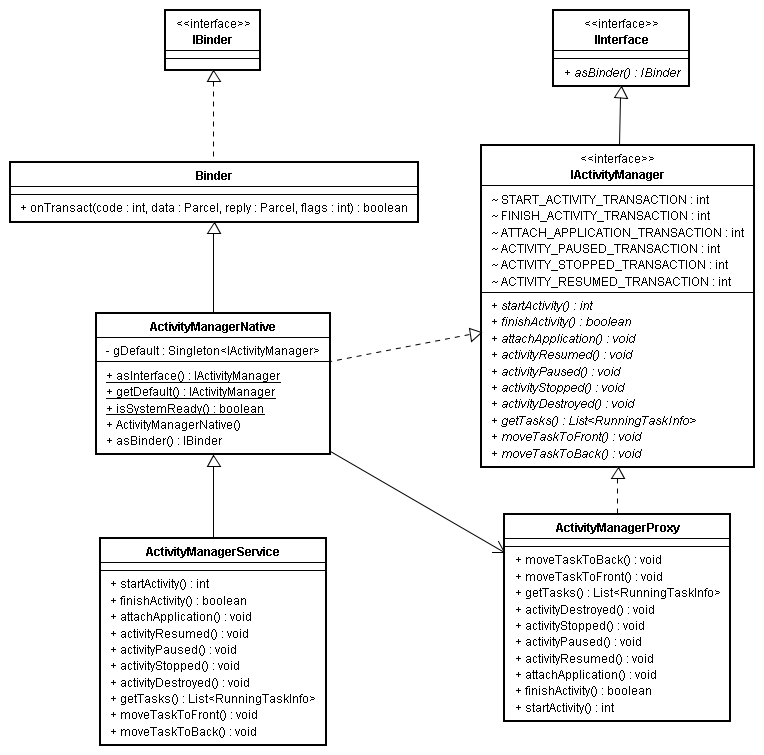
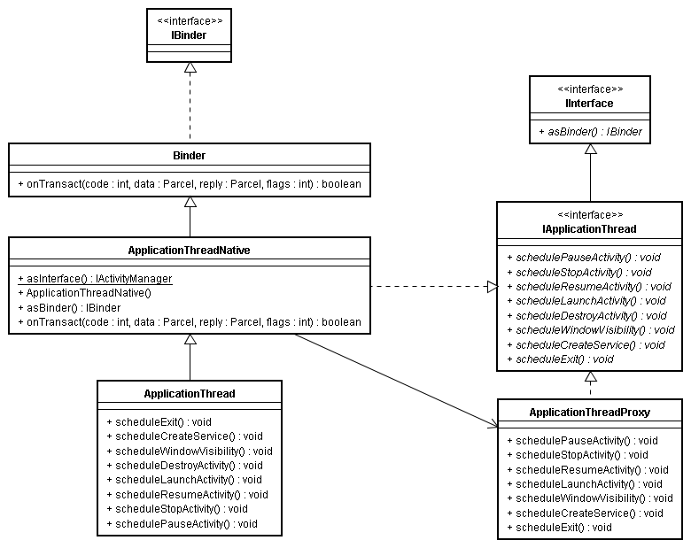
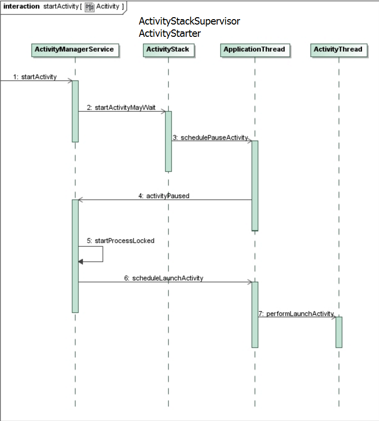
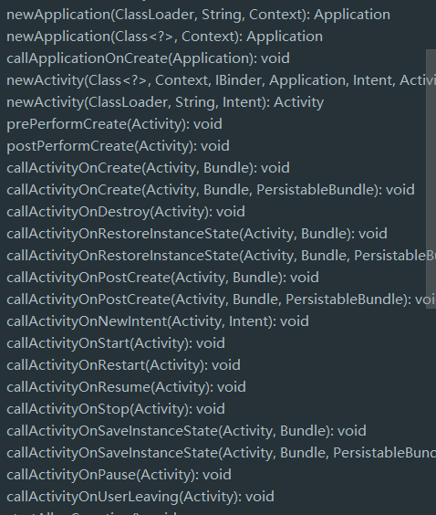
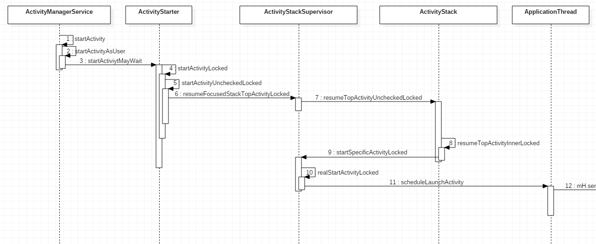
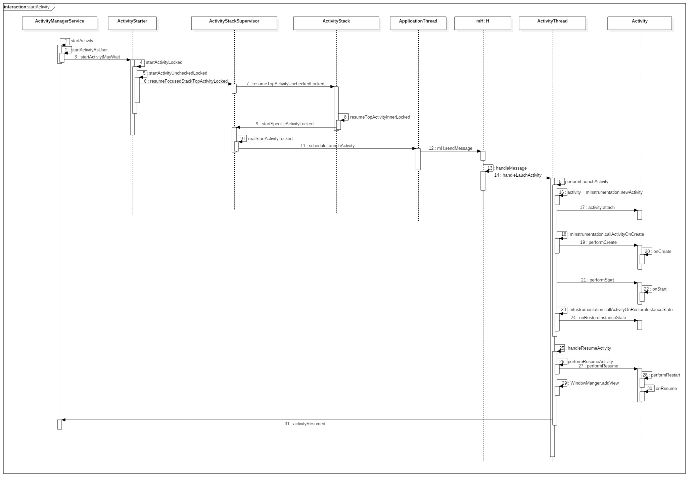

## Activity启动的相关类和概要

Activity启动时涉及到的类有IActivityManager相关类, IApplicationThread相关类, ActivityManagerService相关类。

### IActivityManager相关类

Activity的管理采用binder机制，管理Activity的接口是IActivityManager。ActivityManagerService实现了Activity管理功能,位于system_server进程。从ActivityManagerService提供的接口来看，它负责管理Activity的启动和生命周期。

ActivityManagerProxy对象是ActivityManagerService在普通应用进程的一个代理对象，应用进程通过ActivityManagerProxy对象调用ActivityManagerService提供的功能。应用进程并不会直接创建ActivityManagerProxy对象，而是通过调用ActiviyManagerNative类的工具方法getDefault方法得到ActivityManagerProxy对象。所以在应用进程里通常这样启动Activty:

```java
ActivityManagerNative.getDefault().startActivity()
```



### IApplicationThread相关类

应用进程需要调用ActivityManagerService提供的功能，返过来，ActivityManagerService也需要调用应用进程的回调操作以达到控制和调配应用进程的目的。因此，ActivityManagerService也有一个Binder对象--ApplicationThreadProxy，它是IApplicationThread的代理对象。

ApplicationThread类实现了IApplicationThread接口，实现了管理应用的操作，ApplicationThread对象运行在应用进程里，内部包含了大量启动和停止Activity的接口，此外还包含了启动和停止服务的接口。但因为ApplicationThread运行在Binder线程，这些接口方法大多都通过Handler传给ActivityThread的内部的H来执行。

其实，ApplicationThread是ActivityThread的内部类，H其实是一个Handler，也是ActivityThread的一个内部类，运行在主线程。对于每一个应用程序来说，都有一个ActivityThread来表示一个应用主线程。



总的来说ActivityManagerService，ApplicationThread和ActivityThread之间的关系。ActivityManagerService可以说是Activity的启动入口，相当于主国。ApplicationThread相当于外交官，作为ActivityManagerService与ActivityThread之间的信使，负责将ActivityManagerService下达的指令呈给ActivityThread的H来处理，以及将ActivityThread的调用请求传给ActivityManagerService。ActivityThread则相当于诸侯国，对自己辖区内(应用进程)的Activity有直接的控制权，承担Activity启动的大部分工作，但Activity的户口(ActivityStack)在ActivityManagerService手里。因为ActivityManagerService需要统一调控不同应用进程中的Activity。

### 启动过程概述

1. 无论是通过Launcher来启动Activity还是通过父Activity来启动Activity，都需要通过IPC调用ActivityManagerService的startActivity的方法。
2. ActivityManagerService调用ActivityStarter.startActivityMayWait。经过一系列复杂的调用，收集并记录Activity的启动信息，调整ActivityStack(让栈顶的Activity进入pause状态)，创建并初始化Application对象(如果有必要的话)，创建ActivityThread并调用main方法(如果有必要的话)。
3. 最后在ActivityStackSupervisor的realStartActivityLocked方法调用app.thread.scheduleLaunchActivity方法。也就是说，ActivityManagerService调用ApplicationThread的scheduleLaunchActivity接口方法。
4. ApplicationThread将这个启动信息通过Handler转发给ActivityThread(H)。
5. ActivityThread通过ClassLoader加载相应的Activity类，调用Activity的onCreate方法。



## ActivityManagerService宏观调控

### Step1: Instrumentation#execStartActivity

系统每一次启动Activity，先调用Instrumentation的execStartActivity方法。Instrumentation是负责监控Activity与系统的交互操作的，相当于系统运行日志，因此要启动activity或回调activity的生命周期的方法时，都会先调用Instrumentation相关方法。



```java
    public ActivityResult execStartActivity(
		...
        try {
            int result = ActivityManagerNative.getDefault()
                .startActivity(whoThread, who.getBasePackageName(), intent,
                        intent.resolveTypeIfNeeded(who.getContentResolver()),
                        token, target != null ? target.mWho : null,
                        requestCode, 0, null, options);
            checkStartActivityResult(result, intent);
        } catch (RemoteException e) {
        }
        return null;
    }
```

### Step2: ActivityManagerService#startActivity

经过IPC调用，启动Activity的指令来到了ActivityManagerService，紧接着AMS调用startActivityAsUser着手Activity的启动工作。

### Step3: ActivityStarter#startActiviytMayWait 

AMS有一个[ActivityStack](https://github.com/android/platform_frameworks_base/blob/master/services/core/java/com/android/server/am/ActivityStack.java)，负责Activity的调度工作，比如维护回退栈。但ActivityStack内的Activity是抽象成ActivityRecord来管理的。Activity对象不会存在于AMS当中。

```java
ArrayList<ActivityRecord> mHistory = new ArrayList<ActivityRecord>();
```

由于Activity之间的调度关系受很多因素的影响而变得非常复杂，Google使用了ActivityStack和ActivityStackSupervisor，以及Android 7.0添加的ActivityStarter来管理Activity的调度工作。此三者的调用过程如下图：



由于它们之间调用过程比较复杂，下面只从挑重点来看。

####  [ActivityStarter](https://github.com/android/platform_frameworks_base/blob/master/services/core/java/com/android/server/am/ActivityStarter.java)#startActivityMayWait

```java

    final int startActivityMayWait(IApplicationThread caller, int callingUid,
            String callingPackage, Intent intent, String resolvedType,
            IVoiceInteractionSession voiceSession, IVoiceInteractor voiceInteractor,
            IBinder resultTo, String resultWho, int requestCode, int startFlags,
            ProfilerInfo profilerInfo, IActivityManager.WaitResult outResult, Configuration config,
            Bundle bOptions, boolean ignoreTargetSecurity, int userId,
            IActivityContainer iContainer, TaskRecord inTask) {
       ...
                 // Collect information about the target of the Intent.
        ActivityInfo aInfo = mSupervisor.resolveActivity(intent, rInfo, startFlags, profilerInfo);
      ...
            final ActivityRecord[] outRecord = new ActivityRecord[1];
            int res = startActivityLocked(caller, intent, ephemeralIntent, resolvedType,
                    aInfo, rInfo, voiceSession, voiceInteractor,
                    resultTo, resultWho, requestCode, callingPid,
                    callingUid, callingPackage, realCallingPid, realCallingUid, startFlags,
                    options, ignoreTargetSecurity, componentSpecified, outRecord, container,
                    inTask);
             ...
     }
```

startActivityMayWait这个方法会创建ActivityRecord对象，再调用startActivityLocked。

#### [ActivityStarter](https://github.com/android/platform_frameworks_base/blob/master/services/core/java/com/android/server/am/ActivityStarter.java)#startActivityUncheckedLocked

这个方法会根据Activity启动信息(提取封装到ActivityInfo类中)中的launchMode，flag等属性来调度ActivityStack中的Task和ActivityRecord。因此这个方法是理解Activity启动模式的关键。

#### [ActivityStack](https://github.com/android/platform_frameworks_base/blob/master/services/core/java/com/android/server/am/ActivityStack.java)#resumeTopActivityInnerLocked

这个方法内部会把前台处于Resume状态的Activity变成Pause状态后才会继续启动Activity的逻辑。

将一个Activity变成Pause状态需要经历的调用于后面的启动调用非常相似。

startPausingLocked->ApplicationThread.schedulePauseActivity->mH.sendMessage->ActivityThread.handlePauseActivity->ActivityManagerService.activityPaused->ActivityStack.activityPausedLocked->ActivityStack.completePauseLocked。

在completePauseLocked方法中又一次调用：

```java
mStackSupervisor.resumeFocusedStackTopActivityLocked(topStack, prev, null);
```

又回到了resumeTopActivityInnerLocked方法中，这时会调用ActivityStack.startSpecificActivityLocked方法。

####  [ActivityStack](https://github.com/android/platform_frameworks_base/blob/master/services/core/java/com/android/server/am/ActivityStack.java)#startSpecificActivityLocked

```java
    void startSpecificActivityLocked(ActivityRecord r,
            boolean andResume, boolean checkConfig) {
        // Is this activity's application already running?
        ProcessRecord app = mService.getProcessRecordLocked(r.processName,  
            r.info.applicationInfo.uid);  
        if (app != null && app.thread != null) {
            try {
              ...
                realStartActivityLocked(r, app, andResume, checkConfig);
                return;
            } catch (RemoteException e) {
              ...
            }
        }
        mService.startProcessLocked(r.processName, r.info.applicationInfo, true, 0,
                "activity", r.intent.getComponent(), false, false, true);
    }
```

这里最后会调用AMS的startProcessLocked，这个方法会先判断是否已经存在相应的进程，如果不存在则通过远程调用Zygote进程来孵化出新的应用进程，Zygote进程孵化出新的应用进程后，会执行ActivityThread类的main方法。在该方法里会先准备好Looper和消息队列，然后调用attach方法将应用进程绑定到ActivityManagerService，然后进入loop循环，不断地读取消息队列里的消息，并分发消息。这个过程在Android的消息机制里已经非常熟悉了。其中attach方法在与AMS绑定的过程中会调用attachApplicationLocked方法。attachApplicationLocked方法有两个重要的函数调用thread.bindApplication和mMainStack.realStartActivityLocked。thread.bindApplication将应用进程的ApplicationThread对象绑定到ActivityManagerService，也就是说获得ApplicationThread对象的代理对象。mMainStack.realStartActivityLocked通知应用进程启动Activity。

然后启动Activity的代码逻辑来到了realStartActivityLocked。

#### ActivityStack#realStartActivityLocked

```java
final boolean realStartActivityLocked(ActivityRecord r,
        ProcessRecord app, boolean andResume, boolean checkConfig)
        throws RemoteException {

    //...  
    try {
        //...
        app.thread.scheduleLaunchActivity(new Intent(r.intent), r.appToken,
                System.identityHashCode(r), r.info,
                new Configuration(mService.mConfiguration),
                r.compat, r.icicle, results, newIntents, !andResume,
                mService.isNextTransitionForward(), profileFile, profileFd,
                profileAutoStop);
        
        //...
        
    } catch (RemoteException e) {
        //...
    }
    //...    
    return true;
}
```

app.thread其实就是ApplicationThread在AMS的代理对象，实际上是调用ApplicationThread#scheduleLaunchActivity。接下来Activity的启动工作就交给应用进程来完成了，别忘了这时候的Activity对象还没被创建呢。

### ActivityThread当家做主

ApplicationThread接收到来自AMS的Activity启动命令后，将启动消息通过H(extends Handler)对象发给ActivityThread。

handleLauchActivity方法中包含了ActivityThread中启动Activity的几乎全部逻辑，这个方法内会调用两个重要的方法：performLaunchActivity和handleResumeActivity。

#### ActivityThread#performLaunchActivity

performLaunchActivity方法内完成了如下工作：

1. 通过类加载器加载Activity对象
2. 创建ContextImpl对象并调用activity的attach方法，把上下文变量设置进activity中，创建Window对象和设置WindowManager。
3. 回调onCreate,onStart和onRestoreInstanceState方法。

#### ActivityThread#handleResumeActivity

handleResumeActivity方法内完成了如下工作：

1. 回调Activity的onResume方法
2. 调用WindowManager的addView方法，将前面在attach方法内创建出来的window对象添加到WindowManager当中。


关于setContentView：

通常setContentView会在Activity的onCreate方法中调用。但必须要在onCreate中调用吗？其实setContentView完成了DecorView的创建和绘制，只要在调用WindowManager#addView之前调用setContentView方法也是OK的。因此，最迟到onResume方法中调用setContentView也是可以的。

## 完整的时序图




## 相关源码：

- https://github.com/android/platform_frameworks_base/blob/master/core/java/android/app/ActivityThread.java
- https://github.com/android/platform_frameworks_base/blob/master/services/core/java/com/android/server/am/ActivityManagerService.java
- https://github.com/android/platform_frameworks_base/blob/master/services/core/java/com/android/server/am/ActivityManagerService.java
- https://github.com/android/platform_frameworks_base/blob/master/services/core/java/com/android/server/am/ActivityStarter.java
- https://github.com/android/platform_frameworks_base/blob/master/services/core/java/com/android/server/am/ActivityStackSupervisor.java
- https://github.com/android/platform_frameworks_base/blob/master/services/core/java/com/android/server/am/ActivityStack.java


## 站在大佬的肩膀上

[Android应用程序内部启动Activity过程（startActivity）的源代码分析](http://blog.csdn.net/luoshengyang/article/details/6703247)

[Android应用程序启动过程源代码分析](http://blog.csdn.net/luoshengyang/article/details/6689748)

[Android应用程序的Activity启动过程简要介绍和学习计划](http://blog.csdn.net/luoshengyang/article/details/6685853)

[深入理解Activity启动流程(一)--Activity启动的概要流程](http://www.cloudchou.com/android/post-788.html)
[深入理解Activity启动流程(二)--Activity启动相关类的类图](http://www.cloudchou.com/android/post-793.html)
[深入理解Activity启动流程(三)--Activity启动的详细流程1](http://www.cloudchou.com/android/post-805.html)
[深入理解Activity启动流程(三)--Activity启动的详细流程2](http://www.cloudchou.com/android/post-815.html)

[startActivity启动过程分析](http://gityuan.com/2016/03/12/start-activity/)

《Android开发艺术探索》