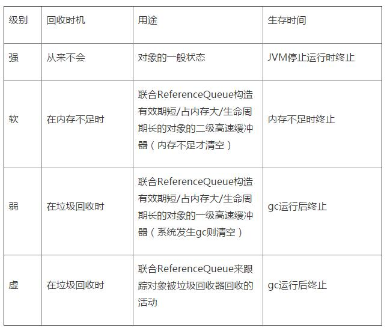

## Java内存分配策略

Java 程序运行时的内存分配策略有三种,分别是静态分配,栈式分配,和堆式分配，对应的，三种存储策略使用的内存空间主要分别是静态存储区（也称方法区）、栈区和堆区。

- 静态存储区（方法区）：主要存放静态数据、全局 static 数据和常量。这块内存在程序编译时就已经分配好，并且在程序整个运行期间都存在。
- 栈区 ：当方法被执行时，方法体内的局部变量都在栈上创建，并在方法执行结束时这些局部变量所持有的内存将会自动被释放。因为栈内存分配运算内置于处理器的指令集中，效率很高，但是分配的内存容量有限。
- 堆区 ： 又称动态内存分配，通常就是指在程序运行时直接 new 出来的内存。这部分内存在不使用时将会由 Java 垃圾回收器来负责回收。

## 常见内存泄漏的场景

- 集合类泄漏。
- 单例模式中，单例引用的对象的生命周期与应用的生命周期不一致。
- 非静态内部类持有外部类的引用。

```java
public class MainActivity extends AppCompatActivity {
	private static TestResource mResource = null;
    @Override
    protected void onCreate(Bundle savedInstanceState) {
        super.onCreate(savedInstanceState);
        setContentView(R.layout.activity_main);
        if(mManager == null){
            mManager = new TestResource();
        }
        //...
    }
    class TestResource {
    //...
    }
}
```

TestResource是Activity的非静态内部类，持有了Activity的引用。假如mResource对象在Activity的生命周期外仍被其他对象引用，那么就会导致Activity无法被回收，造成内存泄漏。

- 匿名内部类也会持有外部类的引用。

```java
public class MainActivity extends Activity {
	...
    // 应该这样
    Runnable ref1 = new MyRunable();
    // 不应该这样
    Runnable ref2 = new Runnable() {
        @Override
        public void run() {

        }
    };
    // 可以这样
    static Runnable ref3 = new Runnable() {
        @Override
        public void run() {

        }
    };
   	...
}
```

- Handler 造成内存泄漏。解决方法是：在Activity中避免使用非静态内部类，Handler通过弱引用来引用Activity。

```java
public class SampleActivity extends Activity {

  /**
   * Instances of static inner classes do not hold an implicit
   * reference to their outer class.
   */
  private static class MyHandler extends Handler {
    private final WeakReference<SampleActivity> mActivity;

    public MyHandler(SampleActivity activity) {
      mActivity = new WeakReference<SampleActivity>(activity);
    }

    @Override
    public void handleMessage(Message msg) {
      SampleActivity activity = mActivity.get();
      if (activity != null) {
        // ...
      }
    }
  }
```

Java四种引用的区别：




**LeakCanary的原理**

ReferenceQueue+WeakReference+手动调用GC

WeakReference 创建时，传入一个 ReferenceQueue 对象。当被 WeakReference 引用的对象的生命周期结束，一旦被 GC 检查到，GC 将会把该对象添加到 ReferenceQueue 中，待ReferenceQueue处理。当 GC 过后对象一直不被加入 ReferenceQueue，它可能存在内存泄漏。