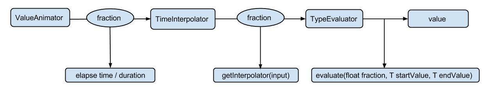

## View动画

### 用法

官方文档：https://developer.android.google.cn/guide/topics/resources/animation-resource.html

```xml
<?xml version="1.0" encoding="utf-8"?>
<set xmlns:android="http://schemas.android.com/apk/res/android"
    android:interpolator="@[package:]anim/interpolator_resource"
    android:shareInterpolator=["true" | "false"] >
    <alpha
        android:fromAlpha="float"
        android:toAlpha="float" />
    <scale
        android:fromXScale="float"
        android:toXScale="float"
        android:fromYScale="float"
        android:toYScale="float"
        android:pivotX="float"
        android:pivotY="float" />
    <translate
        android:fromXDelta="float"
        android:toXDelta="float"
        android:fromYDelta="float"
        android:toYDelta="float" />
    <rotate
        android:fromDegrees="float"
        android:toDegrees="float"
        android:pivotX="float"
        android:pivotY="float" />
    <set>
        ...
    </set>
</set>
```

```java
        Animation animation = AnimationUtils.loadAnimation(ctx, R.anim.abc_fade_in);
        animation.setAnimationListener(new Animation.AnimationListener() {
            @Override
            public void onAnimationStart(Animation animation) {
                
            }

            @Override
            public void onAnimationEnd(Animation animation) {

            }

            @Override
            public void onAnimationRepeat(Animation animation) {

            }
        });
        view.startAnimation(animation);
```


### 自定义View动画：

继承Animation这个抽象类，实现它的initialize和applyTransaction方法，在initialize方法中进行一些初始化工作，在applyTransaction方法对Transformation对象的属性进行变换。


### 帧动画

使用AnimationDrawable来使用帧动画。

```xml
<?xml version="1.0" encoding="utf-8"?>
<animation-list xmlns:android="http://schemas.android.com/apk/res/android"
    android:oneshot=["true" | "false"] >
    <item
        android:drawable="@[package:]drawable/drawable_resource_name"
        android:duration="integer" />
</animation-list>
```

```java
ImageView rocketImage = (ImageView) findViewById(R.id.rocket_image);
rocketImage.setBackgroundResource(R.drawable.rocket_thrust);
rocketAnimation = (AnimationDrawable) rocketImage.getBackground();
rocketAnimation.start();
```


## 使用场景

### LayoutAnimation

LayoutAnimation作用于ViewGroup，为ViewGroup指定一个动画，这样当它的子元素出场时都会具有这种动画效果。

```xml
<?xml version="1.0" encoding="utf-8"?>
<layoutAnimation xmlns:android="http://schemas.android.com/apk/res/android"
    android:delay="0.5"
    android:animationOrder="normal"
    android:animation="@anim/abc_fade_in"
    >
</layoutAnimation>
```

```xml
<listview android:layoutAnimation="@anim/anim_layout"/>
```


### Activity的切换动画

启动Activity

```java
        Intent intent = new Intent(MainActivity.this, AidlClientActivity.class);
        startActivity(intent);
        overridePendingTransition(R.anim.abc_fade_in, R.anim.abc_fade_out);
```

Activity退出

```java
	    finish();
        overridePendingTransition(R.anim.abc_fade_in, R.anim.abc_fade_out);
```

## 属性动画

官方文档：https://developer.android.google.cn/guide/topics/graphics/prop-animation.html

步骤流程：



### ObjectAnimator

```java
ObjectAnimator.ofFloat(view,"translationX",300).setDuration(1000).start(); 
PropertyValuesHolder pvh1 = PropertyValuesHolder.ofFloat("translation", 300f);
PropertyValuesHolder pvh2 = PropertyValuesHolder.ofFloat("scaleX",1f,0,1f);
PropertyValuesHolder pvh3 = PropertyValuesHolder.ofFloat("scaleY", 1f,0,1f);
ObjectAnimator.ofPropertyValuesHolder(view,pvh1,pvh2,pvh3).setDuration(1000).start();
```

常用的属性：

- translationX和translationY：控制着View对象从布局容器左上角坐标偏移的增量
- rotation、rotationX，rotationY：控制View对象围绕支点进行2D和3D旋转
- scaleX、scaleY：控制着View对象围绕它支点进行2D缩放
- pivotX、pivotY：控制着View对象支点的位置，围绕这个支点进行旋转和缩放变换，默认情况下该支点的位置就是VIew对象的中心点
- x、y：描述VIew对象在它的容器中的最终位置，等于最初的左上角坐标和translationX、translationY值得累计和。
- alpha：设置View对象的alpha透明度，默认值是1,，不透明，0代表完全透明，不可见

### **ValueAnimator**

ObjectAnimator是ValueAnimator的子类，本身并没有提供动画效果，而更像是一个数值产生器。

```java
ValueAnimator animator = ValueAnimator.ofFloat(0,100);
animator.setTarget(view);
animator.setDuration(1000).start();
animator.addUpdateListener(new ValueAnimator.AnimatorUpdateListener() {
    @Override
    public void onAnimationUpdate(ValueAnimator animation) {
        float value = (float) animation.getAnimatedValue();
        //TODO use the value to set the property.
     }
});
```


### 插值器和估值器

时间插值器TimeInterpolator作用是根据时间流逝的百分比来计算出当前属性值改变的百分比。

估值器TypeEvaluator作用是根据当前属性改变的百分比来计算改变后的属性值。


### 对任意属性做自定义属性动画

属性动画原理：属性动画要求动画作用对象提供该属性的get和set方法，内部通过Java反射调用getter获取view中属性初始值，然后多次调用setter来实现动态改变view的属性。

- 使用包装类包装原始对象，间接为其提供getter和setter。

```java
public class WrapperView {
    private View mTarget;
    public WrapperView(View target){
        mTarget=target;
    }
    public int getWidth(){
        return mTarget.getLayoutParams().width;
    }
    public void setWidth(int width){
        mTarget.getLayoutParams().width=width;
        mTarget.requestLayout();
    }
}
```

- 使用ValueAnimator


## Notice

1. 在Activity退出或停止时，需要停止正在播放的属性动画，防止Activity的引用无法释放而导致内存泄漏
2. 开启硬件加速会提高动画的流畅性。