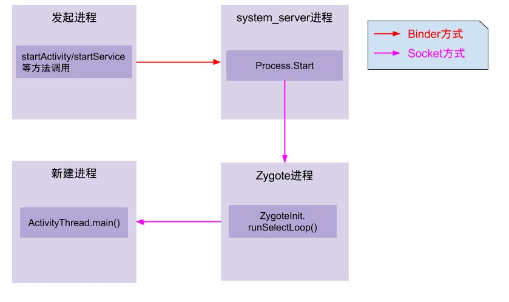
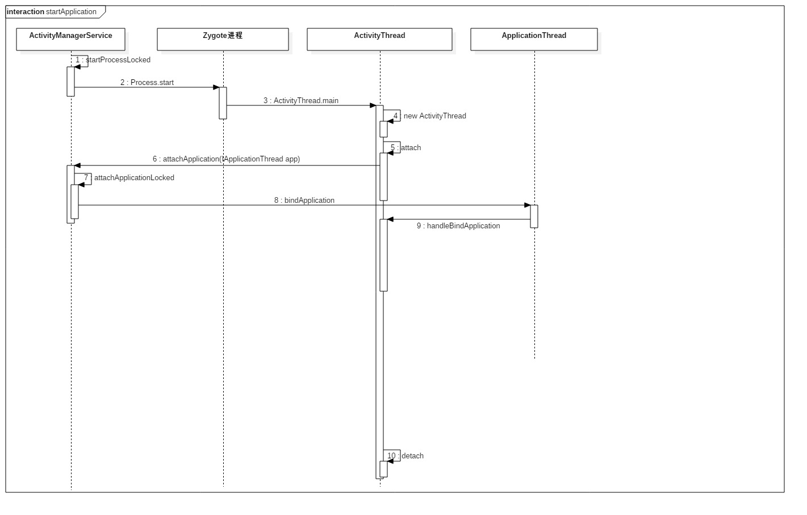

## 大致分析


1. **App发起进程**：当从桌面启动应用，则发起进程便是Launcher所在进程；当从某App内启动远程进程，则发送进程便是该App所在进程。发起进程先通过binder发送消息给system_server进程；
2. **system_server进程**：调用Process.start()方法，通过socket向zygote进程发送创建新进程的请求；
3. **zygote进程**：在执行`ZygoteInit.main()`后便进入`runSelectLoop()`循环体内，当有客户端连接时便会执行ZygoteConnection.runOnce()方法，再经过层层调用后fork出新的应用进程；
4. **新进程**：执行handleChildProc方法，最后调用ActivityThread.main()方法。


## 源码的角度



- Process.start方法完成一个新进程的启动
- 新进程的入口方法为ActivityThread.main方法。


```java
    public static void main(String[] args) {
      	...
        Looper.prepareMainLooper();
        ActivityThread thread = new ActivityThread();
        thread.attach(false);
      	...
        Looper.loop();
    }
```

- attach方法内会调用attachApplication，将**ApplicationThead与AMS**绑定起来

- 接着AMS通过ApplicationThead的代理对象和ActivityThread的H对象通知ActivityThread调用handleBindApplication，着手以下工作：

  - 创建ContextImpl和Instrumentation
  - 创建**Application**对象
  - 调用installContentProvider，启动当前进程的**ContentProvider**并调用其onCreate方法。
  - 调用Application对象的onCreate方法。（mInstrumentation.callApplicationOnCreate）

  ​


当点击`桌面App`的时候，发起进程就是`Launcher`所在的进程，启动远程进程，利用`Binder`发送消息给`system_server进程`；

在`system_server进程`中启动了N多服务，例如`ActiivityManagerService，WindowManagerService`等。启动进程的操作会先调用`AMS.startProcessLocked`方法，内部调用 `Process.start(android.app.ActivityThread);`而后通过`socket`通信告知`Zygote进程fork子进程`，即app进程。进程创建后将`ActivityThread`加载进去，执行`ActivityThread.main()`方法。

在`app进程`中，`main方法`会实例化`ActivityThread`，同时创建`ApplicationThread，Looper，Hander对象`，调用`attach方法`进行`Binder`通信，`looper`启动循环。`attach`方法内部获取`ActivityManagerProxy`对象，其实现了`IActivityManager`接口，作为客户端调用`attachApplication(mAppThread)`方法，将`thread`信息告知`AMS`。

在`system_server进程`中，`AMS`中会调用`ActivityManagerNative.onTransact`方法，真正的逻辑在服务端`AMS.attachApplication`方法中，内部调用`AMS.attachApplicationLocked`方法，方法的参数是`IApplicationThread`，在此处是`ApplicationThreadProxy`对象,用于跟前面通过`Process.start()`所创建的进程中`ApplicationThread`对象进行通信。
`attachApplicationLocked`方法会处理`Provider, Activity, Service, Broadcast`相应流程，调用`ApplicationThreadProxy.bindApplication`方法，通过`Binder`通信，传递给`ApplicationThreadNative.onTransact`方法。

在`app进程`中，真正的逻辑在`ActivityThread.bindApplication`方法中。`bindApplication`方法的主要功能是依次向主线程发送消息`H.SET_CORE_SETTINGS 和H.BIND_APPLICATION`。后续创建`Application,Context`等。`Activity`的回调也会是通过Binder通信，然后发送不同消息处理。

## Android启动流程

参考：[Android Application启动流程分析](http://www.jianshu.com/p/a5532ecc8377)

首先, 让我们快速看下Android启动流程. 与众多基于Linux内核的系统类似, 启动系统时, bootloader启动内核和init进程. init进程分裂出更多名为"daemons(守护进程)"的底层的Linux进程, 诸如android debug deamon, USB deamon等. 这些守护进程处理底层硬件相关的接口.

随后, init进程会启动一个非常有意思的进程---"Zygote". 顾名思义, 这是一个Android平台的非常基础的进程. 这个进程初始化了第一个VM, 并且预加载了framework和众多App所需要的通用资源. 然后它开启一个Socket接口来监听请求, 根据请求孵化出新的VM来管理新的App进程. 一旦收到新的请求, Zygote会基于自身预先加载的VM来孵化出一个新的VM创建一个新的进程。

启动Zygote之后, init进程会启动runtime进程. Zygote会孵化出一个超级管理进程---System Server. SystemServer会启动所有系统核心服务, 例如Activity Manager Service, 硬件相关的Service等. 到此, 系统准备好启动它的第一个App进程---Home进程了.


**摘自《深入理解Android》**http://wiki.jikexueyuan.com/project/deep-android-v1/zygote.html

Zygote是创建Android系统中Java世界的盘古，它创建了第一个Java虚拟机，同时它又是女娲，它成功地繁殖了framework的核心system_server进程。做为Java语言的受益者，我们理应回顾一下Zygote创建Java世界的步骤：

·  第一天：创建AppRuntime对象，并调用它的start。此后的活动则由AppRuntime来控制。

·  第二天：调用startVm创建Java虚拟机，然后调用startReg来注册JNI函数。

·  第三天：通过JNI调用com.android.internal.os.ZygoteInit类的main函数，从此进入了Java世界。然而在这个世界刚开创的时候，什么东西都没有。

·  第四天：调用registerZygoteSocket。通过这个函数，它可以响应子孙后代的请求。同时Zygote调用preloadClasses和preloadResources，为Java世界添砖加瓦。

·  第五天：Zygote觉得自己工作压力太大，便通过调用startSystemServer分裂一个子进程system_server来为Java世界服务。

·  第六天：Zygote完成了Java世界的初创工作，它已经很满足了。下一步该做的就是调用runSelectLoopMode后，便沉沉地睡去了。

·  以后的日子：Zygote随时守护在我们的周围，当接收到子孙后代的请求时，它会随时醒来，为它们工作。

如果支持中文编码的话，我一定要为Zygote取名为盘古_女娲。