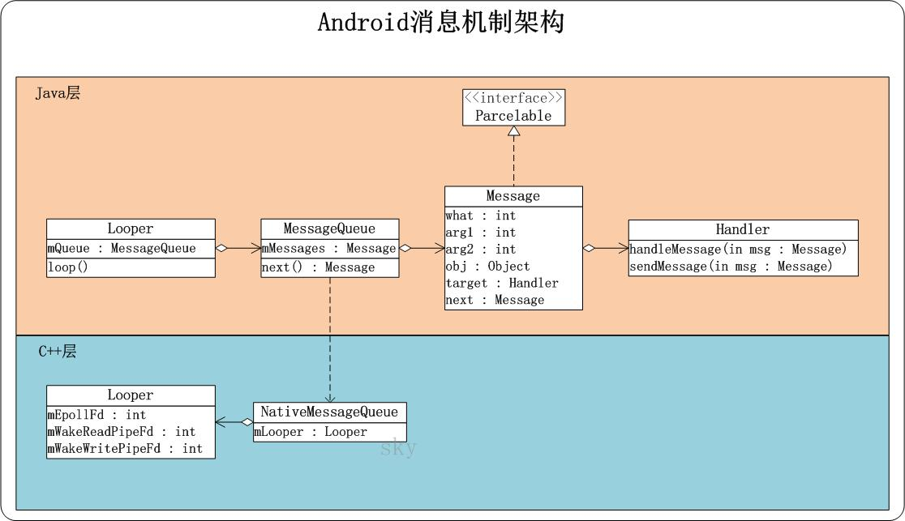
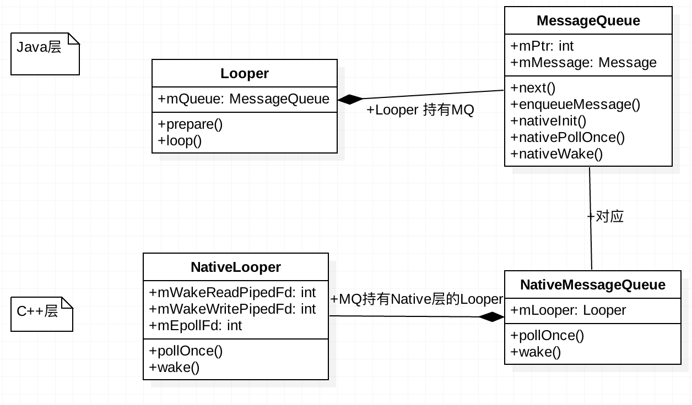
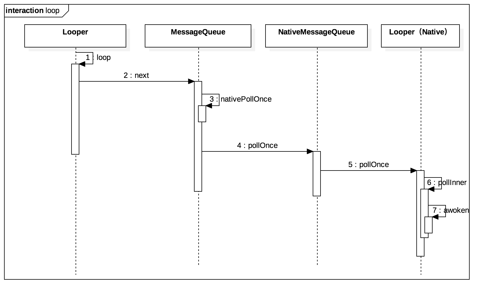
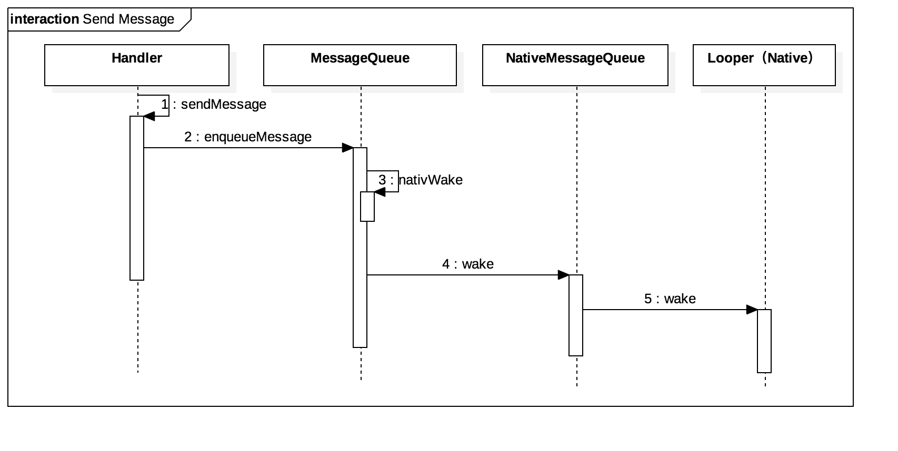

## 概述

Android的消息机制可以分为消息循环，消息发送，消息处理三部分，主要涉及到Looper，MessageQueue和Handler。

## Looper

通过Looper.prepare()即可为当前线程创建一个Looper，并把Looper存放在ThreadLocal中，然后调用Looper.loop来开启消息循环。

```java
    public static final void loop() {  
        Looper me = myLooper();  
        MessageQueue queue = me.mQueue;  
  
        ......  
  
        while (true) {  
            Message msg = queue.next(); // might block  
            ......  
  
            if (msg != null) {  
                if (msg.target == null) {  
                    // No target is a magic identifier for the quit message.  
                    return;  
                }  
  
                ......  
  
                msg.target.dispatchMessage(msg);  
                  
                ......  
  
                msg.recycle();  
            }  
        }  
    }  
```

在子线程中，如果手动为其创建了Looper，那么在所有的事情完成后应该调用quit方法来终止消息循环，否则子线程将一直处于等待状态。

##  MessageQueue

Looper内部拥有一个MessageQueue对象，是在Looper被实例化的时候实例化的。

消息的插入和读取对应的方法分别是enqueueMessage和next。其中queueMessage的作用是往消息队列中插入一条消息，next的作用是从消息队列中取出一条消息并将其移除。next方法是一个无限循环的方法。

## Handler

Handler实例化后会从当前线程获取Looper对象。

```java
public class Handler {  
    ......  
  
    public Handler() {  
        ......  
  
        mLooper = Looper.myLooper();  
        ......  
  
        mQueue = mLooper.mQueue;  
        ......  
    }  
  
  
    final MessageQueue mQueue;  
    final Looper mLooper;  
    ......  
      
    public void dispatchMessage(Message msg) {  
        if (msg.callback != null) {   // 这里的callback就是Runnable对象
            handleCallback(msg);  
        } else {  
            if (mCallback != null) {  
                if (mCallback.handleMessage(msg)) {  
                    return;  
                }  
            }  
            handleMessage(msg);  
        }  
    }  
}  
```


在dispatchMessage中，mCallback是Callback接口的实例。Callback提供了另外一种使用Handle的方式，当我们不想派生子类时，可以通过Callback来实现。

## Android消息机制架构





### 创建/准备阶段

消息循环的创建/准备阶段。该节点的主要工作可以概括为2部分内容：
(01) Java层，创建Looper对象，Looper的构造函数中会创建消息队列MessageQueue的对象。MessageQueue的作用存储消息队列，用来管理消息的。
(02) C++层，消息队列创建时，会调用JNI函数`nativeInit`，初始化NativeMessageQueue对象。NativeMessageQueue则会初始化C++层的Looper对象。在创建Looper的过程中又会创建一个管道，这个管道的读端fd和写端fd都保存到Looper的成员变量中。Looper的作用就是，当Java层的消息队列中没有消息时（在`next`方法中），就会在这个管道的读端文件描述符上阻塞，使线程进入休眠等待状态，而当Java层的消息队列中来了新的消息后（在`enqueueMessage`方法中），就唤醒线程来处理这个消息。


### 消息循环

Looper在`loop`的死循环内调用MQ的`next()`方法来获取Message来处理。MessageQueue中的Message是以处理时间来排序的，越靠前的Message需要优先处理。在`next()`方法中，先取队首的Message，如果该Message还没到处理的时间或者没有消息可以处理，那么调用`nativePollOnce`方法来让线程进入休眠等待状态，方法的第一个参数mPtr是对应于Native层MessageQueue的句柄，第二个参数是休眠时长。让线程休眠的原理是在Native层的Looper的`awoken`方法中调用`read`方法，将与线程关联的管道数据读出来，因为管道是空的，因此线程休眠。

```java
Message next() {
    int pendingIdleHandlerCount = -1; // -1 only during first iteration
    int nextPollTimeoutMillis = 0;
    for (;;) {
        . . . . . .
        nativePollOnce(mPtr, nextPollTimeoutMillis);// 当消息队列中没有新的消息需要处理时，当前线程需要进入睡眠等待状态的时间
        . . . . . .
            // 获取next消息，如能得到就返回之。
            final long now = SystemClock.uptimeMillis();
            Message prevMsg = null;
            Message msg = mMessages;  // 先尝试拿消息队列里当前第一个消息
            
            if (msg != null && msg.target == null) {
                // 如果从队列里拿到的msg是个“同步分割栏”，那么就寻找其后第一个“异步消息”
                do {
                    prevMsg = msg;
                    msg = msg.next;
                } while (msg != null && !msg.isAsynchronous());
            }
            
            if (msg != null) {
                if (now < msg.when) {
                    // Next message is not ready.  Set a timeout to wake up when it is ready.
                   // message还没到时间处理，继续让线程继续休眠
                    nextPollTimeoutMillis = (int) Math.min(msg.when - now, 
                                                                   Integer.MAX_VALUE);
                } else {
                    // Got a message.
                    mBlocked = false;
                    if (prevMsg != null) {
                        prevMsg.next = msg.next;
                    } else {
                        mMessages = msg.next;  // 重新设置一下消息队列的头部
                    }
                    msg.next = null;
                    if (false) Log.v("MessageQueue", "Returning message: " + msg);
                    msg.markInUse();
                    return msg;     // 返回得到的消息对象给Looper
                }
            } else {
                // No more messages. 没有消息需要处理了，让线程无限期休眠
                nextPollTimeoutMillis = -1;
            }
        . . . . . .
        // 处理idle handlers部分
    }
}
```



### 发送消息

一个消息队列中的消息是按照它们的处理时间从小到大排序的，一个消息插入到一个目标消息队列时，可能会插入到队首或队中。前者不需要对目标线程执行唤醒操作，后者需要将目标线程唤醒，以便它可以对保存在目标消息队列头部的新消息进行处理。唤醒线程的原理是，在目标线程的Native层looper的wake方法中调用write方法，向管道写入一个`w`字符，目标线程就会因为发生了IO读写时间而被唤醒。



### 管道机制

Looper是通过管道(pipe)实现的。

关于管道，简单来说，管道就是一个文件。
在管道的两端，分别是两个打开文件文件描述符，这两个打开文件描述符都是对应同一个文件，其中一个是用来读的，别一个是用来写的。
一般的使用方式就是，一个线程通过读文件描述符中来读管道的内容，当管道没有内容时，这个线程就会进入等待状态，而另外一个线程通过写文件描述符来向管道中写入内容，写入内容的时候，如果另一端正有线程正在等待管道中的内容，那么这个线程就会被唤醒。这个等待和唤醒的操作是如何进行的呢，这就要借助Linux系统中的epoll机制了。 Linux系统中的epoll机制为处理大批量句柄而作了改进的poll，是Linux下多路复用IO接口select/poll的增强版本，它能显著减少程序在大量并发连接中只有少量活跃的情况下的系统CPU利用率。

## 总结

message可以理解成消息body,loop可以理解成一个轮询器，负责Message的路由，messagequeue可以理解成一个队列，为loop提供消息，handler就是控制者，发送消息是通过handler发送的，最后消息处理也是路由到handler的。

A. Android应用程序的消息处理机制由消息循环、消息发送和消息处理三个部分组成的。

B. Android应用程序的主线程在进入消息循环过程前，会在内部创建一个Linux管道（Pipe），这个管道的作用是使得Android应用程序主线程在消息队列为空时可以进入空闲等待状态，并且使得当应用程序的消息队列有消息需要处理时唤醒应用程序的主线程。

C. Android应用程序的主线程进入空闲等待状态的方式实际上就是在管道的读端等待管道中有新的内容可读，具体来说就是是通过Linux系统的Epoll机制中的epoll_wait函数进行的。

D. 当往Android应用程序的消息队列中加入新的消息时，会同时往管道中的写端写入内容，通过这种方式就可以唤醒正在等待消息到来的应用程序主线程。

E. 当应用程序主线程在进入空闲等待前，会认为当前线程处理空闲状态，于是就会调用那些已经注册了的IdleHandler接口，使得应用程序有机会在空闲的时候处理一些事情。


博客：

- http://blog.csdn.net/luoshengyang/article/details/6817933

- http://wangkuiwu.github.io/2014/08/26/MessageQueue/

- https://www.zhihu.com/question/34652589/answer/157834250

- https://www.zhihu.com/question/34652589/answer/157834250

- http://www.jianshu.com/p/7bc2b86c4d89

- http://gityuan.com/2015/12/27/handler-message-native/

- [聊一聊Android的消息机制](https://my.oschina.net/youranhongcha/blog/492591)

- [Android Message Handling Mechanism](http://solarex.github.io/blog/2015/09/22/android-message-handling-mechanism/)


