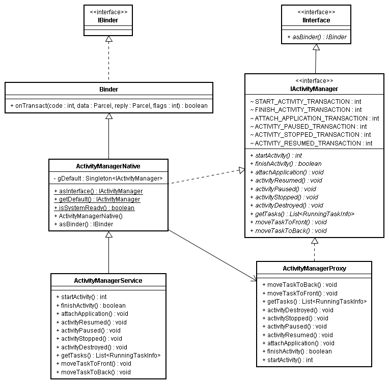

## 背景知识

- 进程隔离

操作系统之间的每一个进程之间数据是不共享的，进程有各自独立的虚拟地址空间。

- 系统调用/用户态/内核态

用户空间访问内核空间的唯一方式就是**系统调用**；通过这个统一入口接口，所有的资源访问都是在内核的控制下执行，以免导致对用户程序对系统资源的越权访问，从而保障了系统的安全和稳定。

当一个任务（进程）执行系统调用而陷入内核代码中执行时，我们就称进程处于内核运行态（或简称为内核态）此时处理器处于特权级最高的（0级）内核代码中执行。当进程在执行用户自己的代码时，则称其处于用户运行态（用户态）。即此时处理器在特权级最低的（3级）用户代码中运行。

- 驱动

通过系统调用，用户空间可以访问内核空间。那么两个不同的用户空间之间通信可以借助操作系统内核的支持。传统的Linux的进程通信机制，如Socket，管道等都是需要内核支持的。Android系统有一个内核模块负责用户进程之间通信的桥梁，这个内核模块就是Binder驱动。

- 数据copy

| IPC            | 数据拷贝次数 |
| -------------- | ------ |
| 共享内存           | 0      |
| Binder         | 1      |
| Socket/管道/消息队列 | 2      |

消息队列和管道采用存储-转发方式，即数据先从发送方缓存区（用户空间）拷贝到内核开辟的缓存区（内核空间）中，然后再从内核缓存区（内核空间）拷贝到接收方缓存区（用户空间），至少有两次拷贝过程，分别调用copy_from_user, copy_to_user。

而采用Binder机制的话，则只需要经过1次内存拷贝即可！ 即，从发送方的缓存区拷贝到内核的缓存区，而接收方的缓存区与内核的缓存区是映射到同一块物理地址的，因此只需要1次拷贝即可。

## 为什么使用Binder

1. 性能。Binder相对于传统的Socket方式更为高效。
2. 安全。Binder从协议本身支持对通信双方做身份校验。

### 第一. Binder能够很好的实现Client-Server架构

对于Android系统，Google想提供一套基于Client-Server的通信方式。
例如，将"电池信息/马达控制/wifi信息/多媒体服务"等等不同的服务都由不同的Server提供，当Client需要获取某Server的服务时，只需要Client向Server发送相应的请求，Server收到请求之后进行处理，处理完毕再将反馈内容发送给Client。

但是，目前Linux支持的"传统的管道/消息队列/共享内存/信号量/Socket等"IPC通信手段中，只有Socket是Client-Server的通信方式。但是，Socket主要用于网络间通信以及本机中进程间的低速通信，它的传输效率太低。

### 第二. Binder的传输效率和可操作性很好

前面已经说了，Socket传输效率很低，已经被排除。而消息队列和管道又采用存储-转发方式，使用它们进行IPC通信时，需要经过2次内存拷贝！效率太低！

为什么消息队列和管道的数据传输需要经过2次内存拷贝呢？ 首先，数据先从发送方的缓存区(即，Linux中的用户存储空间)拷贝到内核开辟的缓存区(即，Linux中的内核存储空间)中，是第1次拷贝。接着，再从内核缓存区拷贝到接收方的缓存区(也是Linux中的用户存储空间)，这是第2次拷贝。
而采用Binder机制的话，则只需要经过1次内存拷贝即可！ 即，从发送方的缓存区拷贝到内核的缓存区，而接收方的缓存区与内核的缓存区是映射到同一块物理地址的，因此只需要1次拷贝即可。

至于共享内存呢，虽然使用它进行IPC通信时进行的内存拷贝次数是0。但是，共享内存操作复杂，也将它排除。

### 第三. Binder机制的安全性很高

传统IPC没有任何安全措施，完全依赖上层协议来确保。传统IPC的接收方无法获得对方进程可靠的UID/PID(用户ID/进程ID)，从而无法鉴别对方身份。而Binder机制则为每个进程分配了UID/PID来作为鉴别身份的标示，并且在Binder通信时会根据UID/PID进行有效性检测。

摘自：http://wangkuiwu.github.io/2014/09/01/Binder-Introduce/

## Binder通信模型


### 通俗来讲

将Client(通信发起方)和Server(通信接收方)之间通信过程比作一次电话通信。那么，ServiceManager就相当于通信录，记录着通信方的地址，而信息传输是通过Binder驱动来做的。

通信步骤如下：

1. SM建立(建立通信录)；首先有一个进程向驱动提出申请为SM；驱动同意之后，SM进程负责管理Service（注意这里是Service而不是Server，因为如果通信过程反过来的话，那么原来的客户端Client也会成为服务端Server）不过这时候通信录还是空的，一个号码都没有。
2. 各个Server向SM注册(完善通信录)；每个Server端进程启动之后，向SM报告，我是zhangsan, 要找我请返回0x1234(这个地址没有实际意义，类比)；其他Server进程依次如此；这样SM就建立了一张表，对应着各个Server的名字和地址；就好比B与A见面了，说存个我的号码吧，以后找我拨打10086；
3. Client想要与Server通信，首先询问SM；请告诉我如何联系zhangsan，SM收到后给他一个号码0x1234；Client收到之后，开心滴用这个号码拨通了Server的电话，于是就开始通信了。
4. Server端的Binder对象会通过Binder驱动传递给Client。驱动在数据流过的时候做了一点手脚，它并不会给Client进程返回一个真正的`object`对象，而是返回一个看起来跟`object`一模一样的代理对象`objectProxy`，这个`objectProxy`也有一个`add`方法，但是这个`add`方法没有Server进程里面`object`对象的`add`方法那个能力；`objectProxy`的`add`只是一个傀儡，它唯一做的事情就是把参数包装然后交给驱动。
5. 当Client调用这个Binder对象的方法时，这个代理对象将调用的参数发给Binder驱动。
6. Binder驱动收到信息后，将信息传给Server本地Binder对象的transact方法。
7. Server调用具体的方法后将返回结果发给驱动，驱动将结果转发给Client。

其中Server，Client，SMgr运行于用户空间，驱动运行于内核空间。这四个角色的关系和互联网类似：Server是服务器，Client是客户终端，SMgr是域名服务器（DNS），驱动是路由器。


### Binder驱动程序

Binder驱动程序向用户空间暴露了一个设备文件/dev/binder，使得应用程序进程可以间接地通过它来建立通信通道。Client,Service,Service Manager都是通过系统调用open（打开），mmap（内存映射）和ioctl（内核缓冲区管理）来访问设备文件/dev/binder。任何一个使用Binder机制通信的进程都必须要对/dev/binder设备进行open和mmap操作之后才能使用，ProcessState封装了这部分逻辑。

#### mmap


#### Binder协议

Binder协议分为控制协议和驱动协议两类。

**控制协议**是进程通过ioctl与驱动/dev/binder设备进行通信的协议。最常用的命令是**BINDER_WRITE_READ**，IPC过程中进程和Binder驱动之间通过这个命令来进行数据传递。

**驱动协议**是进程与Binder驱动的交互协议。驱动协议又分为两类：

- 一类是`binder_driver_command_protocol`，进程发送给Binder驱动的命令
- 一类是`binder_driver_return_protocol`，Binder驱动传递给进程的命令

常用的`binder_driver_command_protocol`命令（以BC开头）：

| 命令                            | 说明                           | 参数类型                    |
| ----------------------------- | ---------------------------- | ----------------------- |
| **BC_TRANSACTION**            | Binder事务，即：Client对于Server的请求 | binder_transaction_data |
| **BC_REPLY**                  | 事务的应答，即：Server对于Client的回复    | binder_transaction_data |
| BC_FREE_BUFFER                | 通知驱动释放Buffer                 | binder_uintptr_t        |
| BC_ACQUIRE                    | 强引用计数+1                      | __u32                   |
| BC_RELEASE                    | 强引用计数-1                      | __u32                   |
| BC_INCREFS                    | 弱引用计数+1                      | __u32                   |
| BC_DECREFS                    | 弱引用计数-1                      | __u32                   |
| BC_ACQUIRE_DONE               | BR_ACQUIRE的回复                | binder_ptr_cookie       |
| BC_INCREFS_DONE               | BR_INCREFS的回复                | binder_ptr_cookie       |
| **BC_ENTER_LOOPER**           | 通知驱动主线程ready                 | void                    |
| **BC_REGISTER_LOOPER**        | 通知驱动子线程ready                 | void                    |
| BC_EXIT_LOOPER                | 通知驱动线程已经退出                   | void                    |
| BC_REQUEST_DEATH_NOTIFICATION | 请求接收死亡通知                     | binder_handle_cookie    |
| BC_CLEAR_DEATH_NOTIFICATION   | 去除接收死亡通知                     | binder_handle_cookie    |
| BC_DEAD_BINDER_DONE           | 已经处理完死亡通知                    | binder_uintptr_t        |

常用的`binder_driver_return_protocol`命令（以BR开头）：

| 返回类型                             | 说明                        | 参数类型                    |
| -------------------------------- | ------------------------- | ----------------------- |
| BR_OK                            | 操作完成                      | void                    |
| BR_NOOP                          | 操作完成                      | void                    |
| BR_ERROR                         | 发生错误                      | __s32                   |
| **BR_TRANSACTION**               | 通知进程收到一次Binder请求（Server端） | binder_transaction_data |
| **BR_REPLY**                     | 通知进程收到Binder请求的回复（Client） | binder_transaction_data |
| BR_TRANSACTION_COMPLETE          | 驱动对于接受请求的确认回复             | void                    |
| BR_FAILED_REPLY                  | 告知发送方通信目标不存在              | void                    |
| **BR_SPAWN_LOOPER**              | 通知Binder进程创建一个新的线程        | void                    |
| BR_ACQUIRE                       | 强引用计数+1请求                 | binder_ptr_cookie       |
| BR_RELEASE                       | 强引用计数-1请求                 | binder_ptr_cookie       |
| BR_INCREFS                       | 弱引用计数+1请求                 | binder_ptr_cookie       |
| BR_DECREFS                       | 若引用计数-1请求                 | binder_ptr_cookie       |
| BR_DEAD_BINDER                   | 发送死亡通知                    | binder_uintptr_t        |
| BR_CLEAR_DEATH_NOTIFICATION_DONE | 清理死亡通知完成                  | binder_uintptr_t        |
| BR_DEAD_REPLY                    | 告知发送方对方已经死亡               | void                    |

**Server，Client与Binder驱动的交互过程**


1. Server向Binder Driver发送**BC_ENTER_LOOPER**命令，通知驱动主线程就绪。
2. Client向Binder Driver发送**BC_TRANSACTION**命令，借助Binder Driver向Server发起通信请求；
3. Binder Driver回传给Client **BR_TRANSACTION_COMPLETE**命令，通知Client驱动接受通信请求的发起；
4. Binder Driver向Server端发送**BR_TRANSACTION**命令，通知Server处理通信请求；
5. Server处理完之后向Binder Driver发送**BC_REPLY**命令，将处理结果交给Binder Driver；
6. Binder Driver向Client发送**BR_REPLY**命令，将Server的处理结果回传给Client。

### Binder驱动中的数据结构


#### binder_node

binder_node是用来描述一个Binder实体对象。每个Server组件在Binder驱动中都对应有一个Binder实体对象，Binder驱动通过引用计数来维护它们的生命周期。

- 成员变量`binder_proc proc`指向一个Binder实体对象的宿主进程（binder_proc）。
- 成员变量`hlist_head refs`是一个hash列表，保存着所有引用该Binder实体对象的Binder引用。
- 成员变量`void __user *cookie`指向该Server组件的地址，是位于用户空间的地址。
- 成员变量`void __user *ptr`指向用户空间Binder本地对象的指针（跟老罗的观点不一致，有待考证）。

#### binder_ref

binder_ref是用来描述一个Binder引用对象。每一个Client组件在Binder驱动中都对应一个Binder引用对象，同样是通过引用计数来维护其生命周期。

- 成员变量`binder_node node` 是Binder引用对象所引用的一个Binder实体对象。
- 成员变量`binder_proc proc`指向一个Binder引用对象的宿主进程（binder_proc）。
- 成员变量`uint32_t desc`是一个描述符（或者说句柄值，引用号，ID等等），用来描述一个Binder引用对象。在Client进程的用户空间中，一个Binder引用对象是使用一个描述符（在进程中唯一）来标识的。当Client组件需要访问Server组件时，首先需要把这个描述符告诉Binder驱动，Binder驱动通过这个描述符在refs_by_desc这个红黑树中找到对应的Binder引用对象，然后再根据该Binder引用对象的成员变量node找到对应的Binder实体对象，最后就可以通过Binder实体对象找到要访问的Service组件了。

#### binder_proc

宿主进程是通过binder_proc结构体来描述的。

binder_proc有四棵红黑树。
```c++
struct binder_proc
{
    struct hlist_node proc_node;
    struct rb_root threads;
    struct rb_root nodes;
    struct rb_root refs_by_desc;
    struct rb_root refs_by_node;
    int pid;
    . . . . . .
};
```

- threads树用于记录执行数据传输动作的线程信息。
- nodes树来维护进程内部所有的Binder实体对象，以Binder在内核空间的地址指针（binder_node的成员变量ptr）作为索引。
- refs_by_desc树和refs_by_node树维护进程内部所有的Binder引用对象，它们分别以描述符（在用户空间中对应于Binder驱动中Binder引用的引用号）和对应的Binder实体对象的地址作为索引。

#### binder_transaction

binder_transaction用来描述进程间通信过程，这个过程被称为一个事务。

- 成员变量`binder_buffer buffer` 指向Binder驱动为该事务分配的一块内核缓冲区，保存了进程间通信数据。

binder_transaction_data用来描述进程间通信过程中所传输的数据。

- 成员变量`target` 是一个union，用来描述一个Binder实体对象或Binder引用对象。
- 成员变量`code`是执行进程间通信的两个进程互相约定好的一个通信代码。

#### binder_write_read

存储一次读写操作的数据

#### binder_transaction_data

存储一次事务的数据

### 用户空间中的Binder对象

Service组件和Client组件分别使用模板类BnInterface和BpInterface来描述，前者称为Binder本地对象，后者称为Binder代理对象。而Binder本地对象和Binder代理对象又分别对应于Binder驱动中的Binder实体对象和Binder引用对象。


#### Binder本地对象

```c++
template<typename INTERFACE>
class BnInterface : public INTERFACE , public BBinder{
  ...
}
```

INTERFACE是一个由一个进程自定义的Service组件接口，BnInterface和BpInterface都需要实现这个接口。

此外BnInterface还继承了BBinder类，为Binder本地对象提供了抽象的进程间通信接口。BBinder类有两个重要的成员函数transact和onTransact。当一个Binder代理对象通过Binder驱动程序向一个Binder本地对象发出一个进程间通信请求时，Binder驱动就会调用Binder本地对象的transact方法来处理该请求。成员函数onTransact是由BBinder的子类实现了，Server组件通过该方法来处理进程间通信请求。

#### Binder代理对象

```C++
template<typename INTERFACE>
class BpInterface : public INTERFACE , public BpRefBase{
  ...
}
class BpBinder :public IBinder{
  private:
  const int32_t mHandle;
  ...
}
```

BpRefBase持有BpBinder对象，后者为Binder代理对象提供了抽象的进程间通信接口。

成员变量mHandle是表示Binder引用对象的句柄值（描述符）。每个Client组件在Binder驱动中都对应一个Binder引用对象，而每个Binder引用对象都有一个句柄值。Client组件通过这个句柄值来和Binder驱动中的Binder引用对象建立映射。

BpBinder类的成员函数transact把mHandle和通信数据发送给Binder驱动，Binder驱动根据这个句柄值找到对应的Binder引用对象，继而找到对应的Binder实体对象，最后就可以找到对应的Service组件了。

#### ProcessState

ProcessState代表使用Binder的进程，所持有的mDriverFD域是binder驱动对应的句柄值，ProcessState对象采用了典型的单例模式，在一个应用进程中，只会有唯一的一个ProcessState对象，它将被进程中的多个线程共用。

#### IPCThreadState

IPCThreadState代表使用Binder的线程，封装了与驱动通信的细节处理。它拥有几个关键的方法。

| 方法                   | 说明                                  |
| -------------------- | ----------------------------------- |
| **transact**         | 公开接口。供Proxy发送数据到驱动，并读取返回结果          |
| **sendReply**        | 供Server端写回请求的返回结果                   |
| waitForResponse      | 发送请求后等待响应结果                         |
| **talkWithDriver**   | 通过ioctl BINDER_WRITE_READ来与驱动通信     |
| writeTransactionData | 写入一次事务的数据                           |
| **executeCommand**   | 处理binder_driver_return_protocol协议命令 |
| freeBuffer           | 通过BC_FREE_BUFFER命令释放Buffer          |


#### Binder线程池

**线程和线程池的创建**


1. 驱动在运行过程中，会根据需要，并在没有超过上限的情况下，通过`BR_SPAWN_LOOPER`命令通知进程创建线程
2. IPCThreadState在收到`BR_SPAWN_LOOPER`请求之后，便会调用`ProcessState::spawnPooledThread`来创建线程
3. 线程在run之后，会调用`threadLoop`将自身添加的线程池中

**Client端发起通信请求的过程**


binder_thread_write()的前两个参数，一个是binder_proc指针，另一个是binder_thread指针，表示发起传输动作的进程和线程。

- BpBinder的transact方法直接把工作交给IPCThreadState的transact方法
- 每个线程都有一个IPCThreadState，每个IPCThreadState中都有一个mIn，一个mOut，其中mIn是用来接收来自Binder设备的数据的，而mOut则是用来存储发往Binder设备的数据的。
- 当把请求信息写到mOut后，调用waitForResponse发送请求数据，并处理后续Binder驱动的回复。在waitForResponse内，调用talkWithDriver来发送请求数据，调用executeCommand来处理恢复的消息。
- 在executeCommand内对cmd进行switch-case判断，如果cmd==BR_TRANSACTION，调用BBinder的transact方法。

**事务的todo队列**

进程节点（binder_proc）和线程节点（binder_thread）都持有一个todo队列。todo队列存放的是一个个请求事务。从客户端BpBinder开始，binder驱动找到其对应的binder_node节点， binder驱动希望能把binder_transaction节点尽量放到目标进程里的某个线程的todo队列里，而如果找不到合适的线程，还可以把节点插入目标binder_proc的todo队列。

### 总结


在Client和Service的跨进程间通信过程中，涉及到四个对象，分别是位于Binder驱动中的Binder实体对象（binder_node）和Binder引用对象（binder_ref）,以及位于用户空间的Binder本地对象（BBinder）和Binder代理对象（BpBinder）。具体步骤如下：

1. 当运行在Client进程中Binder代理对象需要进行与Service进程通信时，会调用transact方法把句柄值（mHandle）和通信数据发送给Binder驱动
2. Binder驱动根据句柄值在红黑树refs_by_desc找到对应的Binder引用对象，通过Binder引用对象可以得到Binder实体对象，并创建一个事务（binder_transaction）来描述该次跨进程通信的过程
3. Binder驱动根据Binder实体对象找到运行在Server进程的Binder本地对象，调用其transact方法，将Client进程传递过来的通信数据交给它处理
4. Binder本地对象在onTransact方法中处理完成后，将通信结果返回给Binder驱动，Binder驱动接着找到之前所创建的事务
5. Binder驱动根据前面找到的事务的相关属性找到发出通信请求的Client进程，并将通信结果返回给Binder代理对象处理。


## Java层的Binder

### 相关类或接口的作用

- **IBinder**是一个接口，它代表了一种跨进程传输的能力；只要实现了这个接口，就能将这个对象进行跨进程传递；这是驱动底层支持的；在跨进程数据流经驱动的时候，驱动会识别IBinder类型的数据，从而自动完成不同进程Binder本地对象以及Binder代理对象的转换。
- IBinder负责数据传输，那么client与server端的调用契约（这里不用接口避免混淆）呢？这里的**IInterface**代表的就是远程server对象具有什么能力。只有一个方法：`IBinder asBinder()`
- Java层的**Binder类**，代表的其实就是Binder本地对象。**BinderProxy**类是Binder类的一个内部类，它代表远程进程的Binder对象的本地代理；这两个类都继承自IBinder, 因而都具有跨进程传输的能力；实际上，在跨越进程的时候，Binder驱动会自动完成这两个对象的转换。
- 在使用AIDL的时候，编译工具会给我们生成一个Stub的静态内部类；这个类继承了Binder, 说明它是一个Binder本地对象，它实现了IInterface接口，表明它具有远程Server承诺给Client的能力；Stub是一个抽象类，具体的IInterface的相关实现需要我们手动完成，这里使用了策略模式。Stub有一个Proxy类，其mRemote对象其实是驱动维护的一个代理对象。





IActivityManager是一个IInterface，它代表远程Service具有什么能力，ActivityManagerNative指的是Binder本地对象（类似AIDL工具生成的Stub类），这个类是抽象类，它的实现是`ActivityManagerService`；因此对于AMS的最终操作都会进入`ActivityManagerService`这个真正实现；同时如果仔细观察，ActivityManagerNative.java里面有一个非公开类ActivityManagerProxy, 它代表的就是Binder代理对象。

IBinder是对通信功能的抽象，IInterface是对业务逻辑的抽象，体现了桥接模式。


## 参考

- http://weishu.me/2016/01/12/binder-index-for-newer/
- https://github.com/GeniusVJR/LearningNotes/blob/master/Part1/Android/Binder%E6%9C%BA%E5%88%B6.md
- http://blog.csdn.net/universus/article/details/6211589
- http://wangkuiwu.github.io/2014/09/01/Binder-Introduce/
- https://my.oschina.net/youranhongcha/blog/149575
- https://my.oschina.net/youranhongcha/blog/152233
- https://my.oschina.net/youranhongcha/blog/167314
- http://gityuan.com/2016/09/04/binder-start-service/
- http://wiki.jikexueyuan.com/project/deep-android-v1/binder.html