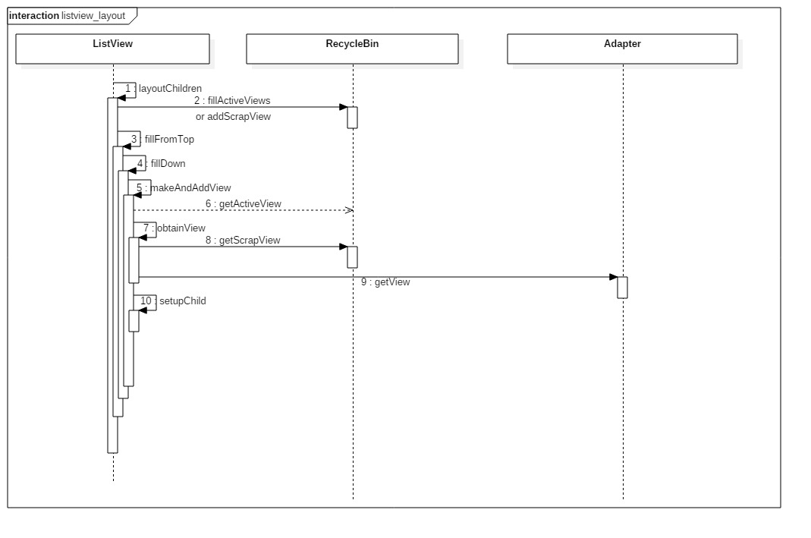
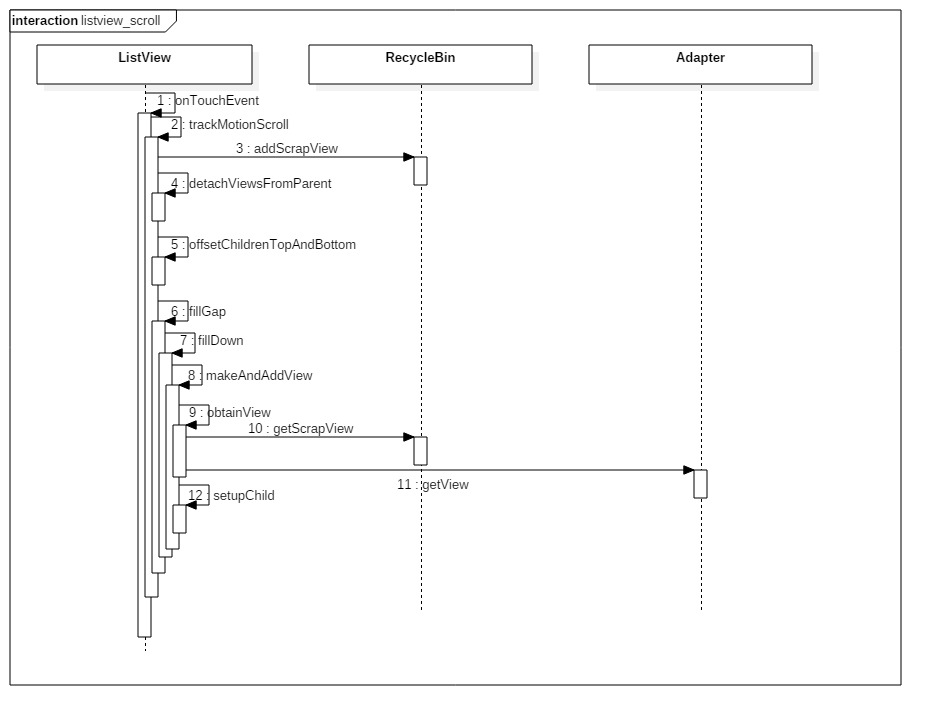

## RecycleBin缓存机制

```java
   class RecycleBin {
        /**
         * The position of the first view stored in mActiveViews.
         */
        private int mFirstActivePosition;

        /**
         * 储存屏幕上的View
         */
        private View[] mActiveViews = new View[0];

        /**
         * Unsorted views that can be used by the adapter as a convert view.
         * 每个item type对应一个ArrayList
         */
        private ArrayList<View>[] mScrapViews;

        private int mViewTypeCount; // item type 的个数
   }
```

RecyleBin实现了两级缓存：

- `View[] mActiveViews`: 缓存屏幕上的View，在该缓存里的View不需要调用`getView()`。
- `ArrayList[] mScrapViews;`: 每个Item Type对应一个列表作为回收站，缓存由于滚动而消失的View，此处的View如果被复用，会以参数的形式传给`getView()`。

## layout过程



## 滑动过程



## 参考

- http://blog.csdn.net/guolin_blog/article/details/44996879
- http://chuansong.me/n/1453225651817