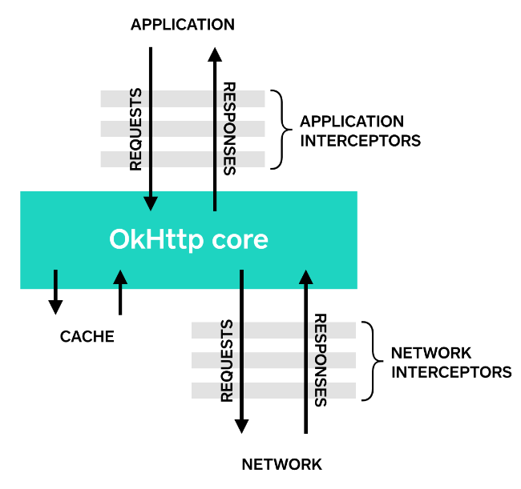
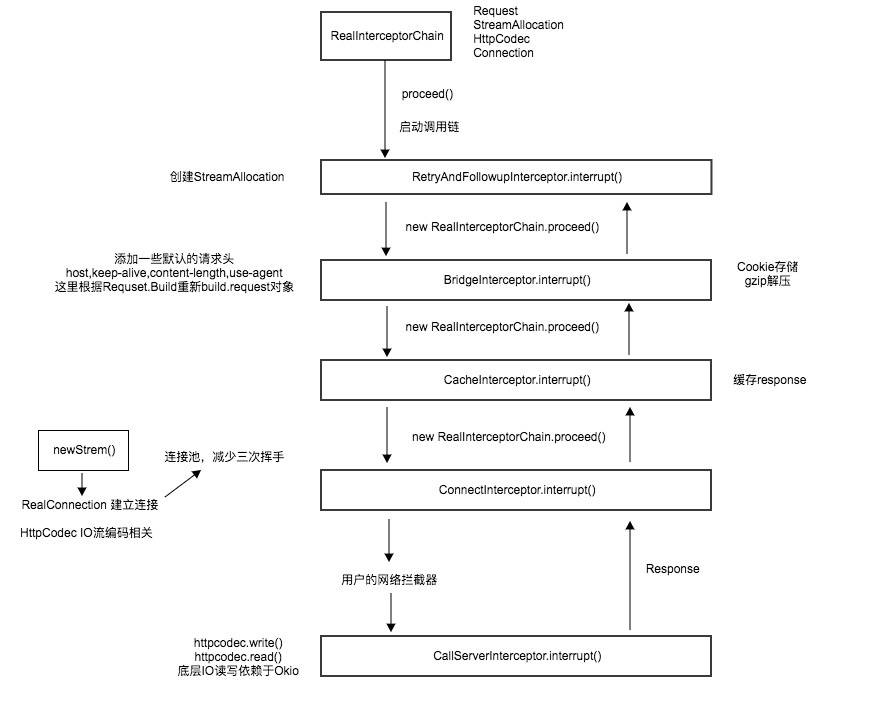
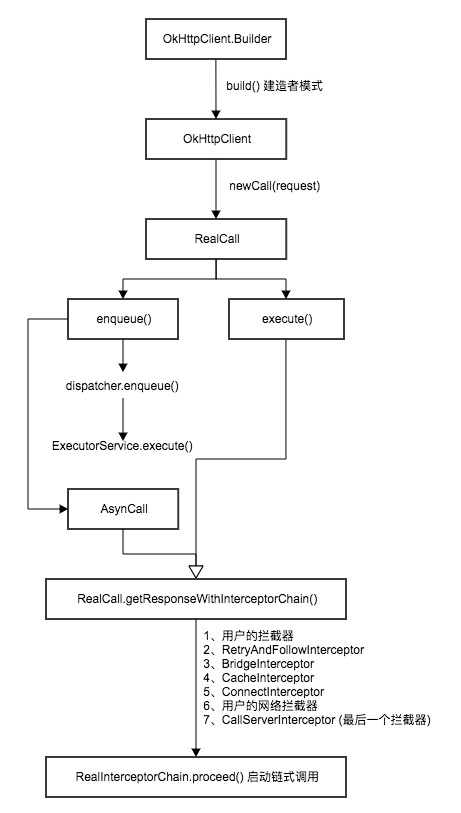

## 基本用法

```java
OkHttpClient client = new OkHttpClient();

String run(String url) throws IOException {
  Request request = new Request.Builder()
      .url(url)
      .build();

  Response response = client.newCall(request).execute();
  return response.body().string();
}
```


##重要的类

### Call

Call就是一个可以随时准备好执行的网络请求。

```java
/**
 * A call is a request that has been prepared for execution. A call can be canceled. As this object
 * represents a single request/response pair (stream), it cannot be executed twice.
 */
public interface Call {
  Request request();
  Response execute() throws IOException;
  void enqueue(Callback responseCallback);
  void cancel();
  boolean isExecuted();
  boolean isCanceled();
  interface Factory {
    Call newCall(Request request);
  }
}
```

Call接口的实现类：**RealCall**。所有请求对象都最终会调用它的`getResponseWithInterceptorChain`方法。


### OkHttpClient

```java
public class OkHttpClient implements Cloneable, Call.Factory {...}
```

OkHttpClient是一个Call工厂。调用`newCall`方法，传入Request对象可以得到RealCall对象。

### Dispatcher

调配异步请求，对线程池进行负载均衡。当线程池满负载时，将请求放到readyAsyncCalls等待队列中；每次有请求完成时，调用`promoteCalls`方法将等待队列中的请求尝试添加到线程池中。


## 异步请求

```java
  @Override public void enqueue(Callback responseCallback) {
    client.dispatcher().enqueue(new AsyncCall(responseCallback));
  }
  synchronized void enqueue(AsyncCall call) {
    if (runningAsyncCalls.size() < maxRequests && runningCallsForHost(call) < maxRequestsPerHost) {
      runningAsyncCalls.add(call);
      executorService().execute(call);
    } else {
      readyAsyncCalls.add(call);
    }
  }
/**
 * Policy on when async requests are executed.
 * Dispatcher有点像承担负载均衡的主机
 */
public final class Dispatcher {
  /** Executes calls. Created lazily. 线程池，执行异步任务*/
  private ExecutorService executorService;
  /** Ready async calls in the order they'll be run. 当线程池满了，网络请求会进入等待队列*/
  private final Deque<AsyncCall> readyAsyncCalls = new ArrayDeque<>();
  /** Running asynchronous calls. Includes canceled calls that haven't finished yet.
  
  */
  private final Deque<AsyncCall> runningAsyncCalls = new ArrayDeque<>();
  /** Running synchronous calls. Includes canceled calls that haven't finished yet. */
  private final Deque<RealCall> runningSyncCalls = new ArrayDeque<>();
}
```

AsyncCall实现Runnable接口，它的执行过程是怎样的呢？
```java
    @Override protected void execute() {
      boolean signalledCallback = false;
      try {
        Response response = getResponseWithInterceptorChain();
        if (retryAndFollowUpInterceptor.isCanceled()) {
          signalledCallback = true;
          responseCallback.onFailure(RealCall.this, new IOException("Canceled"));
        } else {
          signalledCallback = true;
          responseCallback.onResponse(RealCall.this, response);
        }
      } catch (IOException e) {
        if (signalledCallback) {
          ...
        } else {
          responseCallback.onFailure(RealCall.this, e);
        }
      } finally {
        client.dispatcher().finished(this);
      }
    }
```

## 同步请求

RealCall的execute会怎么执行呢？

```java
  @Override
  public Response execute() throws IOException {
    ...
    try {
      client.dispatcher().executed(this);
      Response result = getResponseWithInterceptorChain();
      ...
      return result;
    } finally {
      client.dispatcher().finished(this);
    }
  }
  private Response getResponseWithInterceptorChain() throws IOException {
    // Build a full stack of interceptors.
    List<Interceptor> interceptors = new ArrayList<>();
    interceptors.addAll(client.interceptors());
    interceptors.add(retryAndFollowUpInterceptor);
    interceptors.add(new BridgeInterceptor(client.cookieJar()));
    interceptors.add(new CacheInterceptor(client.internalCache()));
    interceptors.add(new ConnectInterceptor(client));
    if (!retryAndFollowUpInterceptor.isForWebSocket()) {
      interceptors.addAll(client.networkInterceptors());
    }
    interceptors.add(new CallServerInterceptor(
        retryAndFollowUpInterceptor.isForWebSocket()));

    Interceptor.Chain chain = new RealInterceptorChain(
        interceptors, null, null, null, 0, originalRequest);
    return chain.proceed(originalRequest);
  }
```

`getResponseWithInterceptorChain`方法将调用一层层的拦截器，对Request和Response进行层层加工，体现了责任链模式。

okhttp拦截器：

okhttp各个拦截器作用：


总流程图：


## 复用连接池

### 关键对象

- `Connection`: 对jdk的socket物理连接的包装，它内部有`List<WeakReference<StreamAllocation>>`，list的size就是引用的次数。
- `StreamAllocation`: 表示`Connection`被上层高级代码的引用
- `ConnectionPool`: Socket连接池，对连接缓存进行回收与管理
- `Deque`: Deque也就是双端队列，双端队列同时具有队列和栈性质，经常在缓存中被使用

### 引用计数法

Socket本质是已经封装好的流，要手动调用close释放连接才会被GC掉。而okhttp使用引用计数法来维护管理socket连接。Connection内部维护了一个`List<WeakReference<StreamAllocation>>`，StreamAllocation就是计数对象，它提供aquire和release方法来操作Connection里面的`List<WeakReference<StreamAllocation>>`，从而改变Connection的引用计数。当一个Connection引用次数为0，表明这个Connection没有再被引用。

### ConnectionPool

1. 维护一个无界线程池，用于自动清理无用的连接
2. 用一个`Deque<Connection>`来缓存Connection

### 自动回收的实现

当一个Socket连接成功，会向连接池中的Deque`put`一个新的Connection，如果连接池没有启动cleanup，则启动自动回收线程。

```java
  void put(RealConnection connection) {
    assert (Thread.holdsLock(this));
    if (!cleanupRunning) {
      cleanupRunning = true;
      executor.execute(cleanupRunnable);
    }
    connections.add(connection);
  }
```

线程池会执行`cleanupRunnable`

```java
while (true) {
  //执行清理并返回下次需要清理的时间
  long waitNanos = cleanup(System.nanoTime());
  if (waitNanos == -1) return;
  // 阻塞当前线程
  if (waitNanos > 0) {
    synchronized (ConnectionPool.this) {
      try {
        //在timeout内释放锁与时间片
        ConnectionPool.this.wait(TimeUnit.NANOSECONDS.toMillis(waitNanos));
      } catch (InterruptedException ignored) {
      }
    }
  }
}
```

`cleanup`方法类似于GC的标记-清除法，首先标记出最不活跃的连接，接着清除。

```java
  long cleanup(long now) {
    int inUseConnectionCount = 0; // 非空闲连接数
    int idleConnectionCount = 0;  // 空闲连接数
    RealConnection longestIdleConnection = null; // 最老的空闲连接
    long longestIdleDurationNs = Long.MIN_VALUE; // 空闲连接中最长的空闲时间
    synchronized (this) {
      // 遍历每个连接，统计空闲连接和非空闲连接
      for (Iterator<RealConnection> i = connections.iterator(); i.hasNext(); ) {
        RealConnection connection = i.next();
        // If the connection is in use, keep searching. Connection正在被使用，不是空闲连接
        if (pruneAndGetAllocationCount(connection, now) > 0) {
          inUseConnectionCount++;
          continue;
        }

        idleConnectionCount++; // 空闲连接数++

        // 更新统计最老的空闲连接
        long idleDurationNs = now - connection.idleAtNanos;
        if (idleDurationNs > longestIdleDurationNs) {
          longestIdleDurationNs = idleDurationNs;
          longestIdleConnection = connection;
        }
      }

      if (longestIdleDurationNs >= this.keepAliveDurationNs // 如果最老的空闲连接超时
          || idleConnectionCount > this.maxIdleConnections) { // 或者空闲连接数超过最大值
        // We've found a connection to evict. Remove it from the list, then close it below (outside
        // of the synchronized block).
        connections.remove(longestIdleConnection);
      } else if (idleConnectionCount > 0) { // 空闲连接数大于0
        // A connection will be ready to evict soon. 有空闲连接将要超时
        return keepAliveDurationNs - longestIdleDurationNs;
      } else if (inUseConnectionCount > 0) {
        // All connections are in use. It'll be at least the keep alive duration 'til we run again.
        // 没有空闲连接，等一个超时单位再来清理
        return keepAliveDurationNs;
      } else {
        // No connections, idle or in use.
        // 连接池为空，清理停止
        cleanupRunning = false;
        return -1;
      }
    }

    // 关闭Socket连接
    closeQuietly(longestIdleConnection.socket());

    // Cleanup again immediately. 并马上执行下一次清理
    return 0;
  }
```

`pruneAndGetAllocationCount`是通过遍历Connection内部的`List<WeakReference<StreamAllocation>>`，统计并返回Connection的引用计数。

## 缓存处理

CacheStrategy 和 HttpEngine，其中 CacheStrategy 包含缓存机制的所有逻辑，HttpEngine 是 CacheStrategy 被调用的地方。

```java
InternalCache responseCache = Internal.instance.internalCache(client);
//cacheCandidate从disklurcache中获取
//request的url被md5序列化为key,进行缓存查询
Response cacheCandidate = responseCache != null ? responseCache.get(request) : null;
//请求与缓存
factory = new CacheStrategy.Factory(now, request, cacheCandidate);
cacheStrategy = factory.get();
//输出结果
networkRequest = cacheStrategy.networkRequest;
cacheResponse = cacheStrategy.cacheResponse;
```

CacheStrategy.Factory  接受两个参数：`Request networkRequest`和`Response cacheResponse`，`factory.get()`是最关键的缓存策略的判断，根据Header对request和cacheResponse进行加工，返回合适的CacheStrategy，CacheStrategy内包含了networkRequest和cacheResponse。

## 参考

- http://www.jianshu.com/p/aad5aacd79bf#
- http://www.jianshu.com/p/6637369d02e7#
- https://blog.piasy.com/2016/07/11/Understand-OkHttp/
- http://www.jianshu.com/p/6ffde18fb034?hmsr=toutiao.io&utm_medium=toutiao.io&utm_source=toutiao.io
- https://blog.fangjie.info/2017/03/05/OkHttp%E6%BA%90%E7%A0%81%E5%88%86%E6%9E%90/
- [OkHttp3源码分析[复用连接池]](http://www.jianshu.com/p/92a61357164b)

