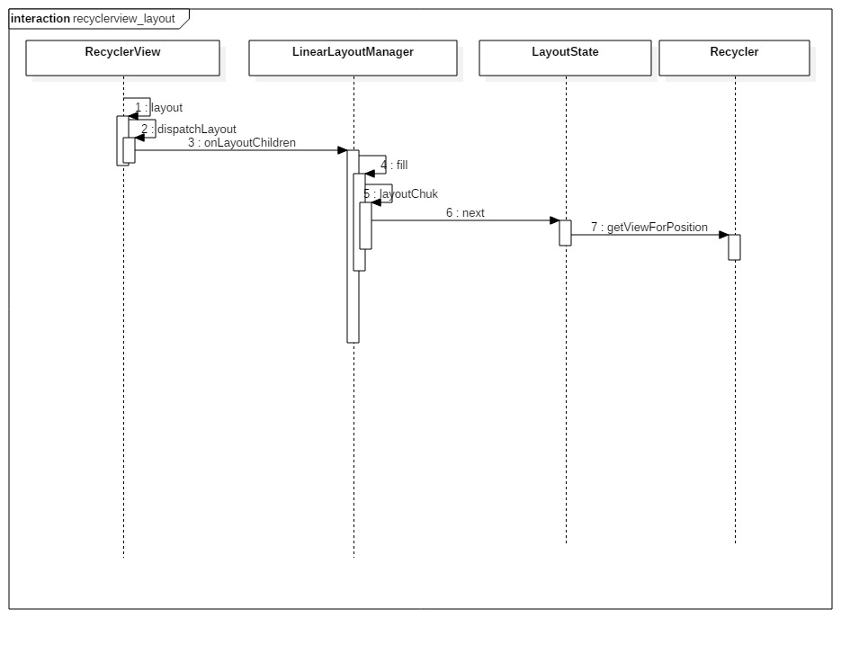

## ListView vs RecyclerView

ListView相比RecyclerView，有一些优点：

- `addHeaderView()`, `addFooterView()`添加头视图和尾视图。
- 通过”android:divider”设置自定义分割线。
- `setOnItemClickListener()`和`setOnItemLongClickListener()`设置点击事件和长按事件。

这些功能在RecyclerView中都没有直接的接口，要自己实现（虽然实现起来很简单），因此如果只是实现简单的显示功能，ListView无疑更简单。

RecyclerView相比ListView，有一些明显的优点：

- 默认已经实现了View的复用，不需要类似`if(convertView == null)`的实现，而且回收机制更加完善。
- 默认支持局部刷新。
- 容易实现添加item、删除item的动画效果。
- 容易实现拖拽、侧滑删除等功能。

RecyclerView是一个插件式的实现，对各个功能进行解耦，从而扩展性比较好。


| 角色                          | 功能                                   |
| --------------------------- | ------------------------------------ |
| RecyclerView.ItemDecoration | 给每一项Item视图添加子View,例如可以进行画分隔线之类       |
| RecyclerView.ItemAnimator   | 负责处理数据添加或者删除时候的动画效果                  |
| RecyclerView.Adapter        | 为每一项Item创建视图                         |
| RecyclerView.ViewHolder     | 承载Item视图的子布局                         |
| RecyclerView.LayoutManager  | 负责Item视图的布局的显示管理，items的滚动， 管理items动画 |


## RecyclerView

### Adapter工作原理

用于提供每个 item view 视图，并返回给 **RecyclerView** 作为其子布局添加到内部。
但是，与 **ListView** 不同的是，ListView 的适配器是直接返回一个 View，将这个 View 加入到 ListView 内部。而 RecyclerView 是返回一个 ViewHolder 并且不是直接将这个 holder 加入到视图内部，而是加入到一个缓存区域，在视图需要的时候去缓存区域找到 holder 再间接的找到 holder 包裹的 View。

### ViewHolder

每个 **ViewHolder** 的内部是一个 View，并且 **ViewHolder** 必须继承自`RecyclerView.ViewHolder`类。 这主要是因为 RecyclerView 内部的缓存结构并不是像 ListView 那样去缓存一个 View，而是直接缓存一个 ViewHolder ，在 ViewHolder 的内部又持有了一个 View。既然是缓存一个 ViewHolder，那么当然就必须所有的 ViewHolder 都继承同一个类才能做到了。

### Recycler

```java
public final class Recycler {
final ArrayList<ViewHolder> mAttachedScrap = new ArrayList<>(); // 屏幕上的ViewHolder
private ArrayList<ViewHolder> mChangedScrap = null; // notify...方法需要改变的ViewHolder

final ArrayList<ViewHolder> mCachedViews = new ArrayList<ViewHolder>(); // 缓存屏幕外的ViewHolder，默认大小为2

private final List<ViewHolder> mUnmodifiableAttachedScrap = Collections.unmodifiableList(mAttachedScrap);

private RecycledViewPool mRecyclerPool; // 允许共享的ViweHolder缓存池，依据ItemType来缓存ViewHolder

private ViewCacheExtension mViewCacheExtension;
}
public static class RecycledViewPool {
 // 根据 viewType 保存的被废弃的 ViewHolder 集合
 private SparseArray<ArrayList<ViewHolder>> mScrap = new SparseArray<ArrayList<ViewHolder>>();
}
public void setRecycledViewPool(RecycledViewPool pool) {
    mRecycler.setRecycledViewPool(pool);
}
```


## Layout过程



## 滑动过程

list的滑动最终会交由LayoutManager来处理，比如LinearLayoutManager的scrollBy方法：

```java
int scrollBy(int dy, RecyclerView.Recycler recycler, RecyclerView.State state) {
    ...
    final int absDy = Math.abs(dy);
    updateLayoutState(layoutDirection, absDy, true, state);
    final int consumed = mLayoutState.mScrollingOffset
            + fill(recycler, mLayoutState, state, false);
    ...
    final int scrolled = absDy > consumed ? layoutDirection * consumed : dy;
    mOrientationHelper.offsetChildren(-scrolled);
    ...
}
```

fill()方法，作用就是向可绘制区间填充ItemView，那么在这里，可绘制区间就是滑动偏移量！再看方法`mOrientationHelper.offsetChildren()`作用就是平移ItemView。

根据列表位置获取ItemView，先后从scrapped、cached、exCached、recycled集合中查找相应的ItemView，如果没有找到，就创建（Adapter.createViewHolder()），最后与数据集绑定。其中scrapped、cached和exCached集合定义在RecyclerView.Recycler中，分别表示将要在RecyclerView中删除的ItemView、一级缓存ItemView和二级缓存ItemView，cached集合的大小默认为２，exCached是需要我们通过RecyclerView.ViewCacheExtension自己实现的，默认没有；recycled集合其实是一个Map，定义在RecyclerView.RecycledViewPool中，将ItemView以ItemType分类保存了下来，这里算是设计的一个亮点，因为这样可以让不同的RecyclerView共享要给RecycledViewPool，而且它们之间的ViewHolder不会相互影响。


## 参考

- http://blog.csdn.net/qq_23012315/article/details/50807224
- https://kymjs.com/code/2016/07/10/01/
- http://chuansong.me/n/1453225651817
- https://www.youtube.com/watch?v=LqBlYJTfLP4

