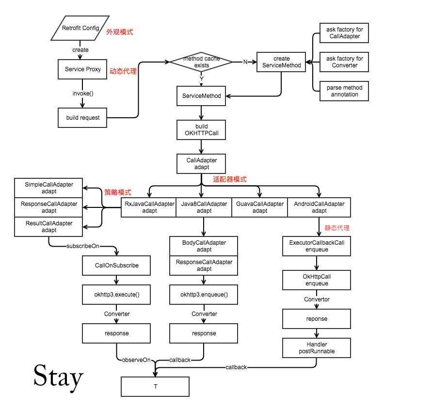

## 基本用法

```java
public interface GitHubService {
  @GET("users/{user}/repos")
  Call<List<Repo>> listRepos(@Path("user") String user);
}
Retrofit retrofit = new Retrofit.Builder()
    .baseUrl("https://api.github.com/")
    .build();

GitHubService service = retrofit.create(GitHubService.class);
Call<List<Repo>> repos = service.listRepos("octocat");
```

## 核心原理

```java
@SuppressWarnings("unchecked") // Single-interface proxy creation guarded by parameter safety.
public <T> T create(final Class<T> service) {
  Utils.validateServiceInterface(service);
  if (validateEagerly) {
    eagerlyValidateMethods(service);
  }
  return (T) Proxy.newProxyInstance(service.getClassLoader(), new Class<?>[] { service },
      new InvocationHandler() {
        private final Platform platform = Platform.get();

        @Override public Object invoke(Object proxy, Method method, Object... args)
            throws Throwable {
          // If the method is a method from Object then defer to normal invocation.
          //来自Object类的方法，如toString()
          if (method.getDeclaringClass() == Object.class) {
            return method.invoke(this, args);
          }
          if (platform.isDefaultMethod(method)) {
            return platform.invokeDefaultMethod(method, service, proxy, args);
          }
          //每个接口方法都对应一个ServiceMethod，将接口方法的注解解析成Http请求需要配置参数，并缓存下来
          //内部含有ResponseConverter、CallAdapter
          ServiceMethod serviceMethod = loadServiceMethod(method);
          //封装了一个Http请求，OkHttpCall是对OkHttp的封装
          OkHttpCall okHttpCall = new OkHttpCall<>(serviceMethod, args);
          //近CallAdapter适配Call，并返回适配后的产物
          return serviceMethod.callAdapter.adapt(okHttpCall);
        }
      });
}
```

## 图解



## 参考&拓展

- [拆轮子系列：拆 Retrofit](http://blog.piasy.com/2016/06/25/Understand-Retrofit/)
- [Retrofit分析-漂亮的解耦套路](http://www.jianshu.com/p/45cb536be2f4#)
- [Retrofit分析-经典设计模式案例](http://www.jianshu.com/p/fb8d21978e38)

