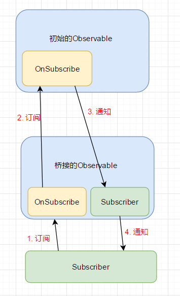

## 什么是响应式编程

用一个字来概括就是流(Stream)。Stream 就是一个**按时间排序的 Events 序列**,它可以放射三种不同的 Events：(某种类型的)Value、Error 或者一个" Completed" Signal。通过分别为 Value、Error、"Completed"定义事件处理函数，我们将会**异步地**捕获这些 Events。基于观察者模式，事件流将从上往下，从订阅源传递到观察者。

至于使用Rx框架的优点，它可以避免回调嵌套，更优雅地切换线程实现异步处理数据。配合一些操作符，可以让处理事件流的代码更加简洁，逻辑更加清晰。

## 搭建大体的框架

要造一座房子，首先要把大体的框架搭好。在RxJava里面，有两个必不可少的角色：Subscriber（观察者） 和 Observable（订阅源）。

###  Subscriber（观察者）

Subsribler在RxJava里面是一个抽象类，它实现了`Observer`接口。

```java
public interface Observer<T> {
    void onCompleted();
    void onError(Throwable t);
    void onNext(T var1);
}
```

为了尽可能的简单，将Subscriber简化如下：

```java
public abstract class Subscriber<T> implements Observer<T> {
    public void onStart() {
    }
}
```

###  Observable（订阅源）

Observable（订阅源）在RxJava里面是一个大而杂的类，拥有很多工厂方法和各式各样的操作符。每个Observable里面有一个`OnSubscribe`对象，只有一个方法（`void call(Subscriber<? super T> subscriber);`），用来产生数据流，这是典型的命令模式。

```java
public class Observable<T> {
    final OnSubscribe<T> onSubscribe;

    private Observable(OnSubscribe<T> onSubscribe) {
        this.onSubscribe = onSubscribe;
    }

    public static <T> Observable<T> create(OnSubscribe<T> onSubscribe) {
        return new Observable<T>(onSubscribe);
    }

    public void subscribe(Subscriber<? super T> subscriber) {
        subscriber.onStart();
        onSubscribe.call(subscriber);
    }

    public interface OnSubscribe<T> {
        void call(Subscriber<? super T> subscriber);
    }
}
```

### 实践

到此，一个小型的RxJava的雏形就出来了。不信？我们来实践一下吧。

```java
        Observable.create(new Observable.OnSubscribe<Integer>() {
            @Override
            public void call(Subscriber<? super Integer> subscriber) {
                for (int i = 0; i < 10; i++) {
                    subscriber.onNext(i);
                }
            }
        }).subscribe(new Subscriber<Integer>() {
            @Override
            public void onCompleted() {
                
            }
            @Override
            public void onError(Throwable t) {

            }
            @Override
            public void onNext(Integer var1) {
                System.out.println(var1);
            }
        });
```

## 添加操作符

其实，强大的RxJava的核心原理并没有想象中那么复杂和神秘，运用的就是典型的观察者模式。有了基本雏形之后，我们继续为这个框架添砖加瓦吧。RxJava之所以强大好用，与其拥有丰富灵活的操作符是分不开的。那么我们就试着为这个框架添加一个最常用的操作符：map。

那么RxJava是如何实现操作符的呢？其实，每调用一次操作符的方法，就相当于在上层数据源和下层观察者之间桥接了一个新的Observable。桥接的Observable内部会实例化有新的OnSuscribe和Subscriber。OnSuscribe负责接受目标Subscriber传来的订阅请求，并调用源Observable.OnSubscribe的subscribe方法。源Observable.OnSubscribe将Event往下发送给桥接Observable.Subscriber，最终桥接Observable.Subscriber将Event做相应处理后转发给目标Subscriber。流程如下图所示：



接着，我们用代码实现这一过程。在Observable类里面添加如下代码：

```java
    public <R> Observable<R> map(Transformer<? super T, ? extends R> transformer) {
        return create(new OnSubscribe<R>() { // 生成一个桥接的Observable和 OnSubscribe
            @Override
            public void call(Subscriber<? super R> subscriber) {
                Observable.this.subscribe(new Subscriber<T>() { // 订阅上层的Observable
                    @Override
                    public void onCompleted() {
                        subscriber.onCompleted();
                    }
                    @Override
                    public void onError(Throwable t) {
                        subscriber.onError(t);
                    }
                    @Override
                    public void onNext(T var1) {
                        // 将上层的onSubscribe发送过来的Event，通过转换和处理，转发给目标的subscriber
                        subscriber.onNext(transformer.call(var1));
                    }
                });
            }
        });
    }
    public interface Transformer<T, R> {
        R call(T from);
    }
```

map操作符的作用是将T类型的Event转化成R类型，转化策略抽象成`Transformer<T, R>`（RxJava中用的是`Func1<T, R>`，但为了便于理解，起了一个有意义的名字）这一个函数接口，由外部传入。

上面代码中使用到一些泛型的通配符，有些地方使用了super，有些地方使用了extends，其实这是有讲究的，传给Transformer#call方法的参数是T类型的，那么call方法的参数类型可以声明成是T的父类，Transformer#call方法的返回值要求是R类型的，那么它的返回值类型应该声明成R的子类。如果大家不能理解，也可以不用在意这些细节。

那么我们一起来测试一下吧。

```java
        Observable.create(new Observable.OnSubscribe<Integer>() {
            @Override
            public void call(Subscriber<? super Integer> subscriber) {
                for (int i = 0; i < 10; i++) {
                    subscriber.onNext(i);
                }
            }
        }).map(new Observable.Transformer<Integer, String>() {
            @Override
            public String call(Integer from) {
                return "maping " + from;
            }
        }).subscribe(new Subscriber<String>() {
            @Override
            public void onNext(String var1) {
                System.out.println(var1);
            }
            @Override
            public void onCompleted() {}
            @Override
            public void onError(Throwable t) {}
        });
```

但是，我们看到`map()`方法内内部类有点多，代码缺少拓展性和可读性，我们应该进行适当地重构，将主要的逻辑抽离成独立的模块，并保证模块间尽量解耦，否则Observable只会越来越臃肿。

```java
    public <R> Observable<R> map(Transformer<? super T, ? extends R> transformer) {
        return create(new MapOnSubscribe<T, R>(this, transformer));
    }
public class MapOnSubscribe<T, R> implements Observable.OnSubscribe<R> {
    final Observable<T> source;
    final Observable.Transformer<? super T, ? extends R> transformer;
    public MapOnSubscribe(Observable<T> source, Observable.Transformer<? super T, ? extends R> transformer) {
        this.source = source;
        this.transformer = transformer;
    }
    @Override
    public void call(Subscriber<? super R> subscriber) {
        source.subscribe(new MapSubscriber<R, T>(subscriber, transformer));
    }
}
public class MapSubscriber<T, R> extends Subscriber<R> {
    final Subscriber<? super T> actual;
    final Observable.Transformer<? super R, ? extends T> transformer;
    public MapSubscriber(Subscriber<? super T> actual, Observable.Transformer<? super R, ? extends T> transformer) {
        this.actual = actual;
        this.transformer = transformer;
    }
    @Override
    public void onCompleted() {
        actual.onCompleted();
    }
    @Override
    public void onError(Throwable t) {
        actual.onError(t);
    }
    @Override
    public void onNext(R var1) {
        actual.onNext(transformer.call(var1));
    }
}
```

## 添加线程切换功能

RxJava中最激动人心的功能是异步处理，能够自如地切换线程。利用 `subscribeOn()` 结合 `observeOn()` 来实现线程控制，让事件的产生和消费发生在不同的线程。 `observeOn()` 可以多次调用，实现了线程的多次切换，最终目标Subscriber的执行线程与最后一次`observeOn()`的调用有关。但`subscribeOn()` 多次调用只有第一个`subscribeOn()` 起作用。为什么呢？因为 `observeOn()` 作用的是Subscriber，而`subscribeOn()` 作用的是OnSubscribe。

这里借用扔物线的图：


简单地调用一个方法就可以完成线程的切换，很神奇对吧。RxJava是如何实现的呢？除了桥接Observable以外，RxJava还用到一个很关键的类---Scheduler（调度器）。文档中给Scheduler的定义是：`A Scheduler is an object that schedules units of work.`，也就是进行任务的调度的一个东西。Scheduler里面有一个重要的抽象方法：

```java
    public abstract Worker createWorker();
```

Worker是Scheduler的内部类，它是具体任务的执行者。当要提交任务给Worker执行需要调用Worker的`schedule(Action0 aciton)`方法。

```java
        public abstract Subscription schedule(Action0 action);
```

要获得一个Scheduler并不需要我们去new，一般是调用Schedulers的工厂方法。

```java
public final class Schedulers {
    private final Scheduler computationScheduler;
    private final Scheduler ioScheduler;
    private final Scheduler newThreadScheduler;
    public static Scheduler io() {
        return RxJavaHooks.onIOScheduler(getInstance().ioScheduler);
    }
    public static Scheduler computation() {
        return RxJavaHooks.onComputationScheduler(getInstance().computationScheduler);
    }
  ...
}
```

具体的Scheduler的实现类就不带大家一起看了，但我们需要知道，能做到线程切换的关键Worker的`schedule`方法，因为它会把传过来的任务放入线程池，或新线程中执行，这取决于具体Scheduler的实现。

### 自定义Scheduler

那么，下面我们先来自定义一个简单的Scheduler和Worker。

```java
public class Scheduler {
    final Executor executor;
    public Scheduler(Executor executor) {
        this.executor = executor;
    }
    public Worker createWorker() {
        return new Worker(executor);
    }
    public static class Worker {
        final Executor executor;
        public Worker(Executor executor) {
            this.executor = executor;
        }
      // 这里接受的是Runnable而不是Action0，其实这没什么关系，主要是懒得自定义函数式接口了。
        public void schedule(Runnable runnable) {
            executor.execute(runnable);
        }
    }
}
```

为了达到高仿效果，我们也提供相应的工厂方法。

```java
public class Schedulers {
    private static final Scheduler ioScheduler = new Scheduler(Executors.newSingleThreadExecutor());
    public static Scheduler io() {
        return ioScheduler;
    }
}
```

### 实现subscribeOn

`subscribeOn`是作用于上层OnSubscribe的，可以让OnSubscribe的call方法在新线程中执行。

因此，在Observable类里面，添加如下代码：

```java
    public Observable<T> subscribeOn(Scheduler scheduler) {
        return Observable.create(new OnSubscribe<T>() {
            @Override
            public void call(Subscriber<? super T> subscriber) {
                subscriber.onStart();
                // 将事件的生产切换到新的线程。
                scheduler.createWorker().schedule(new Runnable() {
                    @Override
                    public void run() {
                        Observable.this.onSubscribe.call(subscriber);
                    }
                });
            }
        });
    }
```

测试一下：

```java
        Observable.create(new Observable.OnSubscribe<Integer>() {
            @Override
            public void call(Subscriber<? super Integer> subscriber) {
                System.out.println("OnSubscribe@ "+Thread.currentThread().getName()); //new Thread
                subscriber.onNext(1);
            }})
                .subscribeOn(Schedulers.io())
                .subscribe(new Subscriber<Integer>() {
                  ...
                    @Override
                    public void onNext(Integer var1) {
                        System.out.println("Subscriber@ "+Thread.currentThread().getName()); // new Thread
                        System.out.println(var1);
                    }
                });
```

### 实现observeOn

`subscribeOn`是作用于下层Subscriber的，需要让下层Subscriber的事件处理方法放到新线程中执行。

为此，在Observable类里面，添加如下代码：

```java
    public Observable<T> observeOn(Scheduler scheduler) {
        return Observable.create(new OnSubscribe<T>() {
            @Override
            public void call(Subscriber<? super T> subscriber) {
                subscriber.onStart();
                Scheduler.Worker worker = scheduler.createWorker();
                Observable.this.onSubscribe.call(new Subscriber<T>() {
                    @Override
                    public void onCompleted() {
                        worker.schedule(new Runnable() {
                            @Override
                            public void run() {
                                subscriber.onCompleted();
                            }
                        });
                    }
                    @Override
                    public void onError(Throwable t) {
                        worker.schedule(new Runnable() {
                            @Override
                            public void run() {
                                subscriber.onError(t);
                            }
                        });
                    }
                    @Override
                    public void onNext(T var1) {
                        worker.schedule(new Runnable() {
                            @Override
                            public void run() {
                                subscriber.onNext(var1);
                            }
                        });
                    }
                });
            }
        });
    }

```

测试一下：

```java
        Observable.create(new Observable.OnSubscribe<Integer>() {
            @Override
            public void call(Subscriber<? super Integer> subscriber) {
                System.out.println("OnSubscribe@ " + Thread.currentThread().getName()); // main
                subscriber.onNext(1);
            }
        })
                .observeOn(Schedulers.io())
                .subscribe(new Subscriber<Integer>() {
                  ...
                    @Override
                    public void onNext(Integer var1) {
                        System.out.println("Subscriber@ " + Thread.currentThread().getName()); // new Thread
                        System.out.println(var1);
                    }
                });
```


### 在Android中切换线程

经过以上实践，我们终于知道了RxJava线程切换的核心原理了。下面我们顺便来看看Android里面是如何进行线程切换的。

首先找到`AndroidSchedulers`，发现一个Scheduler的具体实现类：LooperScheduler。

```java
    private AndroidSchedulers() {
    ...
            mainThreadScheduler = new LooperScheduler(Looper.getMainLooper());
            ...
    }
    /** A {@link Scheduler} which executes actions on the Android UI thread. */
    public static Scheduler mainThread() {
        return getInstance().mainThreadScheduler;
    }
```

LooperScheduler的代码很清晰，内部持有一个Handler，用于线程的切换。在Worker的`schedule(Action0 action,...) `方法中，将action通过Handler切换到所绑定的线程中执行。

```java
class LooperScheduler extends Scheduler {
    private final Handler handler;

    LooperScheduler(Looper looper) {
        handler = new Handler(looper);
    }

    LooperScheduler(Handler handler) {
        this.handler = handler;
    }

    @Override
    public Worker createWorker() {
        return new HandlerWorker(handler);
    }

    static class HandlerWorker extends Worker {
        private final Handler handler;
      
      ...
        
        @Override
        public Subscription schedule(Action0 action, long delayTime, TimeUnit unit) {
        ...
            action = hook.onSchedule(action);

            ScheduledAction scheduledAction = new ScheduledAction(action, handler);

            Message message = Message.obtain(handler, scheduledAction);
            message.obj = this; // Used as token for unsubscription operation.

            handler.sendMessageDelayed(message, unit.toMillis(delayTime));
        ...
            return scheduledAction;
        }

        @Override
        public Subscription schedule(final Action0 action) {
            return schedule(action, 0, TimeUnit.MILLISECONDS);
        }
    }

    static final class ScheduledAction implements Runnable, Subscription {
        private final Action0 action;
        private final Handler handler;
        private volatile boolean unsubscribed;
      ...
        @Override public void run() {
            try {
                action.call();
            } ...
        }
        ...
    }
}
```


## 结语

就这样，以上用代码演示了RxJava一些核心功能是如何实现的，希望能给大家带来不一样的启发。但这只是一个小小的Demo，离真正能运用于工程的Rx框架还差太远。这也让我们明白到，一个健壮的框架，需要考虑太多东西，比如代码的可拓展性和可读性，性能优化，可测试性，兼容性，极端情况等等。但有时要想深入理解一个复杂框架的实现原理，就需要剥离这些细节代码，多关注主干的调用逻辑，化繁为简。

Demo代码可到Github获取：https://github.com/TellH/RxJavaDemo/tree/master/src/my_rxjava

## 参考&拓展

- https://mp.weixin.qq.com/s?__biz=MzI1MTA1MzM2Nw==&mid=2649796857&idx=1&sn=ed8325aeddac7fd2bd81a0717c010e98&scene=1&srcid=0817o3Xzkx4ILR6FKaR1M9LX#rd
- https://gank.io/post/560e15be2dca930e00da1083
- https://zhuanlan.zhihu.com/p/22338235