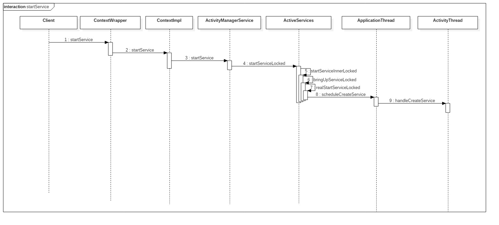
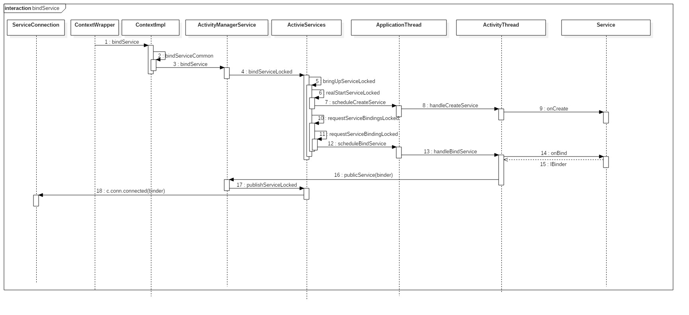

## 生命周期


## 两种启动方式的区别

**startService**只是启动Service，启动它的组件（如Activity）和Service并没有关联，只有当Service调用stopSelf或者其他组件调用stopService服务才会终止。
**bindService**方法启动Service，其他组件可以通过回调获取Service的代理对象和Service交互，而这两方也进行了绑定，当启动方销毁时，Service也会自动进行unBind操作，当发现所有绑定都进行了unBind时才会销毁Service。

## startService



第9步的handleCreateService方法主要完成以下事情：

1. 通过类加载器创建Service实例
2. 创建或获取Application对象
3. 创建ContextImpl对象并通过Service的attach方法建立二者的关系
4. 调用Service的onCreate方法并将Service对象存储到ActivityThread的一个列表中`ArrayMap<IBinder, Service> mServices`
5. ActivityThread还会通过handleServiceArgs方法调用Service的onStartCommand方法

```java
    private void handleCreateService(CreateServiceData data) {
	...
        Service service = null;
        try {
            java.lang.ClassLoader cl = packageInfo.getClassLoader();
            service = (Service) cl.loadClass(data.info.name).newInstance();
        } catch (Exception e) {
          ...
        }
        try {
            ContextImpl context = ContextImpl.createAppContext(this, packageInfo);
            context.setOuterContext(service);

            Application app = packageInfo.makeApplication(false, mInstrumentation);
            service.attach(context, this, data.info.name, data.token, app,
                    ActivityManagerNative.getDefault());
            service.onCreate();
            mServices.put(data.token, service);
            try {
                ActivityManagerNative.getDefault().serviceDoneExecuting(
                        data.token, SERVICE_DONE_EXECUTING_ANON, 0, 0);
            } catch (RemoteException e) {
                throw e.rethrowFromSystemServer();
            }
        } catch (Exception e) {
          ...
        }
    }
```

由此看来，onCreate是不能进行耗时操作的，因为此方法运行在ActivityThread中，也就是主线程中。

## bindService



### 2. bindServiceCommon

```java
    private boolean bindServiceCommon(Intent service, ServiceConnection conn, int flags, Handler
            handler, UserHandle user) {
        IServiceConnection sd;
      ...
        if (mPackageInfo != null) {
            sd = mPackageInfo.getServiceDispatcher(conn, getOuterContext(), handler, flags);
        } else {
            throw new RuntimeException("Not supported in system context");
        }
        validateServiceIntent(service);
        try {
          ...
            int res = ActivityManagerNative.getDefault().bindService(
                mMainThread.getApplicationThread(), getActivityToken(), service,
                service.resolveTypeIfNeeded(getContentResolver()),
                sd, flags, getOpPackageName(), user.getIdentifier());
          ...
            return res != 0;
        } catch (RemoteException e) {
            throw e.rethrowFromSystemServer();
        }
    }
```

 LoadedApk.getServiceDispatcher方法将ServiceConnection转成IServiceConnection，实际上就是ServiceDispatcher.InnerConnection对象，是一个Binder。ServiceDispatcher连接着ServiceConnection和InnerConnect。

```java
final class LoadedApk {  
    ......  
  
    public final IServiceConnection getServiceDispatcher(ServiceConnection c,  
            Context context, Handler handler, int flags) {  
        synchronized (mServices) {  
            LoadedApk.ServiceDispatcher sd = null;  
            HashMap<ServiceConnection, LoadedApk.ServiceDispatcher> map = mServices.get(context);  
            if (map != null) {  
                sd = map.get(c);  
            }  
            if (sd == null) {  
                sd = new ServiceDispatcher(c, context, handler, flags);  
                if (map == null) {  
                    map = new HashMap<ServiceConnection, LoadedApk.ServiceDispatcher>();  
                    mServices.put(context, map);  
                }  
                map.put(c, sd);  
            } else {  
                sd.validate(context, handler);  
            }  
            return sd.getIServiceConnection();  
        }  
    }  
  
    ......  
  
    static final class ServiceDispatcher {  
        private final ServiceDispatcher.InnerConnection mIServiceConnection;  
        private final ServiceConnection mConnection;  
        private final Handler mActivityThread;  
        ......  
  
        private static class InnerConnection extends IServiceConnection.Stub {  
            final WeakReference<LoadedApk.ServiceDispatcher> mDispatcher;  
            ......  
  
            InnerConnection(LoadedApk.ServiceDispatcher sd) {  
                mDispatcher = new WeakReference<LoadedApk.ServiceDispatcher>(sd);  
            }  
  
            ......  
        }  
  
        ......  
  
        ServiceDispatcher(ServiceConnection conn,  
                Context context, Handler activityThread, int flags) {  
            mIServiceConnection = new InnerConnection(this);  
            mConnection = conn;  
            mActivityThread = activityThread;  
            ......  
        }  
  
        ......  
  
        IServiceConnection getIServiceConnection() {  
            return mIServiceConnection;  
        }  
  
        ......  
    }  
  
    ......  
}  
```

LoadApk内部有一个数据结构mService，存储着当前Activity中ServiceConnection与ServiceDispatch的映射关系。

` ArrayMap<Context, ArrayMap<ServiceConnection, LoadedApk.ServiceDispatcher>> mServices`

返回的InnerConnection对象将用于AMS与ServiceConnection进行通信。

### 12. handleBindService

```java
    private final void handleBindService(BindServiceData data) {  
        Service s = mServices.get(data.token);  
        if (s != null) {  
            try {  
                data.intent.setExtrasClassLoader(s.getClassLoader());  
                try {  
                    if (!data.rebind) {  
                        IBinder binder = s.onBind(data.intent);  
                        ActivityManagerNative.getDefault().publishService(  
                            data.token, data.intent, binder);  
                    } else {  
                        ......  
                    }  
                    ......  
                } catch (RemoteException ex) {  
                }  
            } catch (Exception e) {  
                ......  
            }  
        }  
    }  
```

data.token就是存在于AMS中的binder对象，实际上是ServiceRecord，在AMS中，Service是以ServiceRecord的形态存在的，就像Activity是以ActivityRecord的形态存在于AMS中一样。

`ArrayMap<IBinder, Service> mServices` 是ActivityThread中用于存储Service对象的数据结构，这里的IBinder(key)存在于AMS，Service(value)存在于ActivityThread。

取出了Servcice对象后调用其onBind方法获取binder，调用publishService方法将其传递给AMS。在publishService方法当中，再调用ActiveServices的publishServiceLocked方法。

在publishServiceLocked，取出之前从客户端传过来的InnerConnection对象，调用其connected方法，把binder对象传进去，最终会调用ServiceConnection对象的onServiceConnected方法。


### 总结绑定过程

1. 客户端调用bindService函数通知ActivityManagerService，它要启动Service，ActivityManagerService于是在MainActivity所在的进程内部把Service启动起来，并且调用它的onCreate函数，同时ActivityThread保存了Service的引用
2. ActivityManagerService把Service启动起来后，继续让ActivityThread调用Service的onBind函数，要求其返回一个Binder对象给AMS
3. ActivityManagerService从Service处得到这个Binder对象后，就把它传给客户端，即把这个Binder对象作为参数传递给客户端内部定义的ServiceConnection对象的onServiceConnected函数；


## F&A

- 同一个Service的类在android中可以有多个实例吗？ 

  答：不可以。Service的启动模式决定它不会在系统中存在多个实例，当有新的Intent传递过来的时候，android系统会直接使用已经存在的Service实例而不会重新创建（onCreate方法会被调用，但会调用onStartCommand方法），所以在android系统中的Service都是单例的。

这样就说明了Service是Android的一个独立组件，不依附于启动它的Activity。

- 多次调用startService方法会发生什么？

onCreate只会调用一次；每次调用startService都会调用onStartCommand。

## 相关源码

- https://github.com/android/platform_frameworks_base/blob/master/services/core/java/com/android/server/am/ActivityManagerService.java
- https://github.com/android/platform_frameworks_base/blob/master/core/java/android/app/ActivityThread.java
- https://github.com/android/platform_frameworks_base/blob/master/services/core/java/com/android/server/am/ActiveServices.java
- https://github.com/android/platform_frameworks_base/blob/master/core/java/android/app/ContextImpl.java
- https://github.com/android/platform_frameworks_base/blob/master/core/java/android/app/LoadedApk.java


## 参考博文

- [Android系统在新进程中启动自定义服务过程（startService）的原理分析](http://blog.csdn.net/luoshengyang/article/details/6677029)
- [Android应用程序绑定服务（bindService）的过程源代码分析](http://blog.csdn.net/luoshengyang/article/details/6745181)


