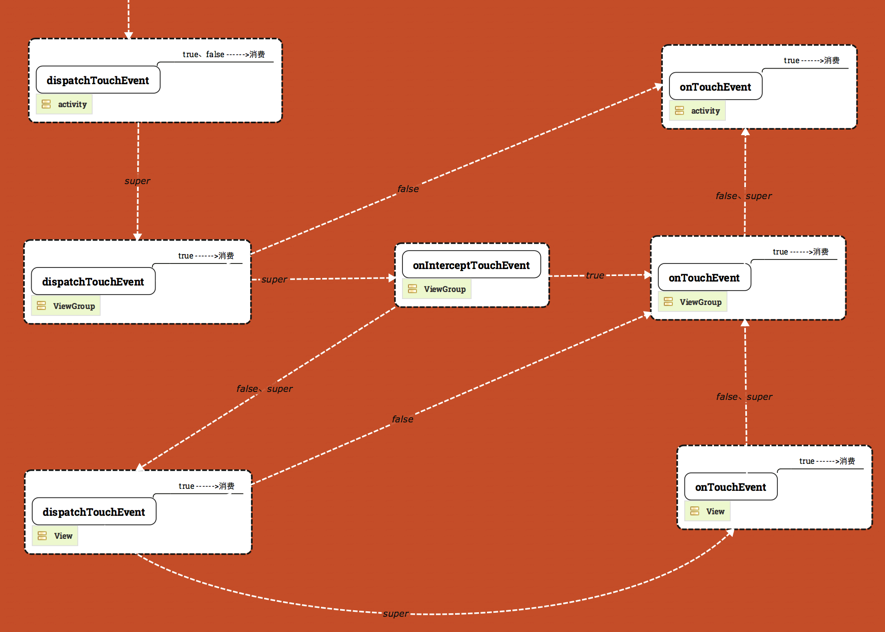
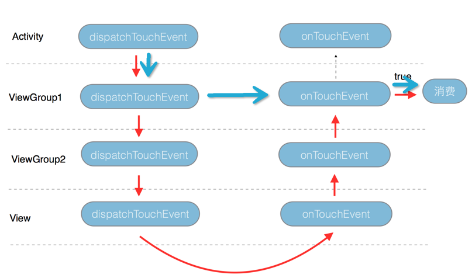

## View的基础

### View的位置参数

- Left 相对于父容器左上角的x值
- Right 相对于父容器右下角的x值
- Top 相对于父容器左上角的y值
- Bottom 相对于父容器右下角的y值
- translateX和translateY View的左上角相对于初始位置的偏移量
- x 和 y 此刻View的左上角相对于父容器的偏移量

View在平移的过程中，top和left标识的是原始左上角的位置信息，其值不会改变，而ranslateX和translateY，x 和 y这两对属性会发生改变。

`x = left + translationX`

`y = top + translationY`

### 常用对象

#### MotionEvent

通过MotionEvent对象可以得到点击事件发生的x和y坐标，getX/getY返回相对于当前View左上角的x和y坐标，而getRawX/getRawY返回的是相对于手机屏幕左上角的绝对坐标。

#### TouchSlop

TouchSlop是系统所能识别出的被仍未是滑动的最小距离，可以通过这样获取：`ViewConfiguration.get(getContext()).getScaledTouchSlop()`。

#### VelocityTracker

对滑动过程中，追踪水平和竖直方向的速度。

```java
        private void acquireVelocityTracker(final MotionEvent event) {
            if (null == mVelocityTracker) {
                mVelocityTracker = VelocityTracker.obtain();
            }
            mVelocityTracker.addMovement(event);
        }
        view.setOnTouchListener(new View.OnTouchListener() {
            @Override
            public boolean onTouch(View v, MotionEvent event) {
                acquireVelocityTracker(event);
                final int action = event.getAction();
                final VelocityTracker tracker = mVelocityTracker;
                switch (action) {
                    case MotionEvent.ACTION_DOWN:
                        //求第一个触点的id， 此时可能有多个触点，但至少一个
                        mPointerId = event.getPointerId(0);
                        break;
                    case MotionEvent.ACTION_MOVE:
                        //求伪瞬时速度
                        tracker.computeCurrentVelocity(1000);
                        final float xVelocity = tracker.getXVelocity(mPointerId);
                        final float yVelocity = tracker.getYVelocity(mPointerId);
                        Logger.d("x: " + xVelocity + " , y:" + yVelocity);
                        break;
                    case MotionEvent.ACTION_UP:
                        releaseVelocityTracker();
                        break;
                    case MotionEvent.ACTION_CANCEL:
                        releaseVelocityTracker();
                        break;
                    default:
                        break;
                }
                return true;
            }
        });
```


#### Scroller

用于对View的内容进行弹性滑动。

```java
            @Override
            public void computeScroll() {
                super.computeScroll();
                if (mSroller.computeScrollOffset()){
                    ((View)getParent()).scrollTo(mSroller.getCurrX(),mSroller.getCurrY());
                    //通过重绘间接实现不断调用该方法
                    invalidate();
                }
            }

            mSroller.startScroll(startX,startY,dx,dy,duration);
            postInvalidate();
```


调用mSroller.startScroll时，内部只是保存了我们传递的几个参数。而紧接着调用的invalidate方法会导致View重绘，在View的draw方法中又会去调用computeScroll方法，而我们在computeScroll中获取当前的scrollX和scrollY，然后通过scrollTo方法实现滑动，紧接着又调用postInvalidate再次进行重绘，如此往复直到整个滑动过程结束。


## View的事件分发

### 宏观的角度

View 事件分发涉及到三种角色，三个方法，三种重点事件，分别是Activity，ViewGroup，View；dispatchTouchEvent， onInterceptTouchEvent，onTouchEvent和ACTION_DOWN，ACTION_MOVE，ACTION_UP。

三个方法的关系可概括为如下伪代码：

```java
	public boolean dispatchTouchEvent(MotionEvent ev){
      boolean consume = false;
      if (onInterceptTouchEvent(ev)){
        consume = onTouchEvent(ev);
      } else {
        consume = child.dispatchTouchEvent(ev);
      }
      return consume;
	}
```


值得记住的几个结论：

1. activity的dispatchTouchEvent无论返回true or false都没有意义，但当View or ViewGroup的dispatchTouchEvent返回true时，表示它要消耗了该事件，并且该事件不会再向下传递。
2. onTouchEvent返回ture表示它要消耗该事件，并且该事件不会再往下或往上传递。同一个View or ViewGroup的dispatchTouchEvent的返回值会与onTouchEvent的返回值同步，也就是说当onTouchEvent返回true，它的dispatchTouchEvent也会返回true。
3. 因此，第一个View or ViewGroup要消耗一个事件，除了可以在onTouchEvent中返回true，还可以在dispatchTouchEvent中返回true。而前者是后者的充分非必要条件，
4. 一个事件序列包含若干个事件，一般地，ACTION_DOWN是一个事件序列的开头，ACTION_UP是一个事件序列的结尾。
5. 一个事件序列只能被一个VIew拦截且消耗。同一个事件序列中的事件不能分别由两个View同时处理。某个View一旦消耗了ACTION_DOWN事件，那么这一个事件序列的事件，都会从上往下一直传递到这个View为止（但往下传递的过程中上层的onInterceptTouchEvent仍会被调用，上层仍可以拦截事件），而且它的onInterceptTouchEvent不会再被调用了（如果有的话）。
6. 如果一个事件序列本来要交给下层某一View or ViewGroup（代号A）来处理，但某个事件从上往下传递的过程中被上层某一个ViewGroup（代号B）拦截（onInterceptTouchEvent return true），那么A会收到一个ACTION_CANCEL事件，而原事件也消失了。此事件序列以后的事件就不会再传到A而是传给B，B获得了事件序列处理权。


ACTION_DOWN的事件分发图解



- 带箭头的虚线上的super表示在起点方法内调用父类的重写方法后事件的流向，也就是说带super的虚线标识着事件默认的流动。
- 带箭头的虚线上的true or false标识起点方法返回值，方法返回后事件的流动，
- 令dispatchTouchEvent 直接返回false时，系统会回调父容器的onTouchEvent，事件会回流给父容器。

```java
    @Override
    public boolean dispatchTouchEvent(MotionEvent ev) {
        return false;
    }
```

- ACTION_MOVE,ACTION_UP与ACTION_DOWN的事件分发的异同可以概括为：ACTION_MOVE,ACTION_UP跟ACTION_DOWN从上往下传递，只不过当ACTION_MOVE,ACTION_UP传到拥有事件序列接管权的那一层View or ViewGroup时，不再调用该层的onInterceptTouchEvent 了，而是直接调用该层的onTouchEvent，不管它返回true or false，事件不再往别处传递。举个例子：Activity中依次套着ViewGroup1(ViewGroup2(View)) ，ACTION_UP在ViewGroup的onTouchEvent中被消费（红线表示），那么之后同一个事件序列的ACTION_MOVE,ACTION_UP的流向都会像蓝线那样。



### 源代码的角度

#### Activity对事件的分发过程

当一个点击操作发生时，事件最先传递到当前的Activity，由Activity的dispatchTouchEvent进行事件分发。

```java
    public boolean dispatchTouchEvent(MotionEvent ev) {
        if (ev.getAction() == MotionEvent.ACTION_DOWN) {
            onUserInteraction();
        }
        if (getWindow().superDispatchTouchEvent(ev)) {
            return true;
        }
        return onTouchEvent(ev);
    }
```

事件会先传递给PhoneWindow中的DecorView，如果DecorView不能处理，则调用自己的onTouchEvent。


#### ViewGroup对事件的分发过程

在ViewGroup的dispatchTouchEvent中，有如下代码判断是否拦截点击事件。

```java
            // Check for interception.
            final boolean intercepted;
            if (actionMasked == MotionEvent.ACTION_DOWN
                    || mFirstTouchTarget != null) {
                final boolean disallowIntercept = (mGroupFlags & FLAG_DISALLOW_INTERCEPT) != 0;
                if (!disallowIntercept) {
                    intercepted = onInterceptTouchEvent(ev);
                    ev.setAction(action); // restore action in case it was changed
                } else {
                    intercepted = false;
                }
            } else {
                // There are no touch targets and this action is not an initial down
                // so this view group continues to intercept touches.
                intercepted = true;
            }
```


当事件由VIewGroup的子元素消耗时，mFirstTouchTarget会指向该元素。mFirstTouchTarget其实是一种单链表结构，如果mFirstTouchTarget==null，那么ViewGroup就默认拦截接下来同一事件序列的事件。

- 当`(actionMasked == MotionEvent.ACTION_DOWN|| mFirstTouchTarget != null)==false`时，ViewGroup的onInterceptTouchEvent不会再被调用，并且同一个事件序列的其他事件都会默认交给它处理，因为此时的传过来的事件为ACTION_MOVE or ACTION_UP，而且没有一个子元素能处理，那就这能交给自己来处理了。
- 当`(actionMasked == MotionEvent.ACTION_DOWN|| mFirstTouchTarget != null)==true`，这时，是否拦截事件取决于标记位FLAG_DISALLOW_INTERCEPT，它是通过requestDisallowInterceptTouchEvent方法来设置，一般用于子View请求让父容器不要拦截除了ACTION_DOWN以外的事件。可以用于解决滑动冲突。


接着根据点击坐标定位候选子元素，并将事件逐个分发给子元素来处理。

```java
				for (...){
  					if (dispatchTransformedTouchEvent(ev, false, child, idBitsToAssign)) {
                                // Child wants to receive touch within its bounds.
                                mLastTouchDownTime = ev.getDownTime();
                                if (preorderedList != null) {
                                    // childIndex points into presorted list, find original index
                                    for (int j = 0; j < childrenCount; j++) {
                                        if (children[childIndex] == mChildren[j]) {
                                            mLastTouchDownIndex = j;
                                            break;
                                        }
                                    }
                                } else {
                                    mLastTouchDownIndex = childIndex;
                                }
                                mLastTouchDownX = ev.getX();
                                mLastTouchDownY = ev.getY();
                                newTouchTarget = addTouchTarget(child, idBitsToAssign);
                                alreadyDispatchedToNewTouchTarget = true;
                                break;
                            }
                        }
				}
```


如果某一子元素成功处理，mFirstTouchTarget会在addTouchTarget内被赋值。


#### View对事件的分发过程

在View的dispatchTouchEvent方法中进行事件分发

```java
    public boolean dispatchTouchEvent(MotionEvent event) {
        boolean result = false;
        if (onFilterTouchEventForSecurity(event)) {
            //noinspection SimplifiableIfStatement
            ListenerInfo li = mListenerInfo;
            if (li != null && li.mOnTouchListener != null
                    && (mViewFlags & ENABLED_MASK) == ENABLED
                    && li.mOnTouchListener.onTouch(this, event)) {
                result = true;
            }

            if (!result && onTouchEvent(event)) {
                result = true;
            }
        }
    }
```

首先会判断是否设置了OnTouchListener，如果OnTouchListener#onTouch返回true，那么onTouchEvent就不会被调用了。由此可见，OnTouchListener#onTouch的优先级高于onTouchEvent。


在View中的onTouchEvent中会对点击事件做处理

```java
        if (((viewFlags & CLICKABLE) == CLICKABLE ||(viewFlags & LONG_CLICKABLE) == LONG_CLICKABLE)) {
          ...
                            if (!focusTaken) {
                                // Use a Runnable and post this rather than calling
                                // performClick directly. This lets other visual state
                                // of the view update before click actions start.
                                if (mPerformClick == null) {
                                    mPerformClick = new PerformClick();
                                }
                                if (!post(mPerformClick)) {
                                    performClick();
                                }
                            }
          
          return true;
        } else {
          return false;
        }
```

只要VIew的CLICKABLE和LONG_CLICKABLE有一个为true，那么它就会消耗这个事件。在ACTION_UP事件传来时，如果VIew设置了OnClickListener，那么performClick方法内部会调用它的onClick方法。


## View的事件来源

有屏幕硬件捕捉事件交给WindowManagerService，WMS传给相应的ViewRootImpl来处理，ViewRootImpl交给对应的DecorView来处理，DecorView回调activity的dispatchTouchEvent方法。


## 滑动冲突

- 外部拦截法

在父容器的onInterceptTouchEvent方法中，ACTION_DOWN这个事件，父容器必须返回false，因为一旦父容器拦截了ACTION_DOWN事件，那么后序的ACTION_MOVE和ACTION_UP事件都会直接交给父容器来处理，无法传递到子元素了。其次是ACTION_MOVE事件，可根据需求来决定是否拦截；最后是ACTION_UP事件，这里必须返回false，不拦截。


- 内部拦截法

在子容器的dispatchTouchEvent方法，在ACTION_DOWN事件中，调用`parent.requestDisallowInterceptTouchEvent(true)`来告诉父容器，不要拦截这个事件序列的事件，都交给我来处理。

在ACTION_MOVE事件中，判断如果父容器需要此类点击事件，调用`parent.requestDisallowInterceptTouchEvent(fale)`将事件交给父容器来处理。