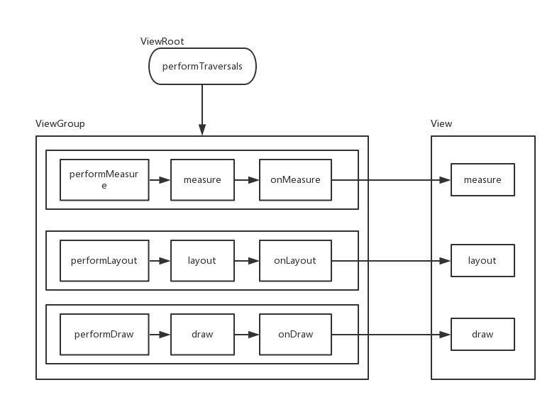
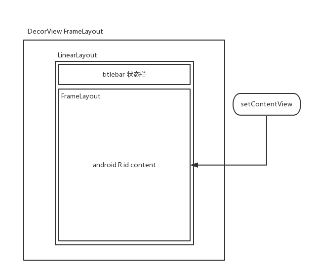
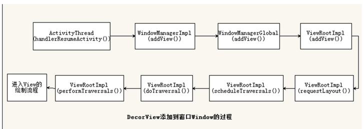

## ViewRoot和DecorView

ViewRoot对应的实现类是ViewRootImpl类，View的三大流程均是通过ViewRoot来完成的。在ActivityThread中，当Activity对象被创建后，DecorView会被添加到Window中，同时会实例化ViewRootImpl，将ViewRootImpl对象与DecorView关联起来。

View的绘制过程是从ViewRoot的performTraversals方法开始的，它经过measure，layout和draw三个过程才能最终将一个VIew绘制出来，其中

- measure用来测量View的宽高，Measure完成后可以通过getMeasureWidth和getMeasureHeight方法来获取View的测量后的宽高。

```java

    private void performMeasure(int childWidthMeasureSpec, int childHeightMeasureSpec) {
        Trace.traceBegin(Trace.TRACE_TAG_VIEW, "measure");
        try {
            mView.measure(childWidthMeasureSpec, childHeightMeasureSpec);
        } finally {
            Trace.traceEnd(Trace.TRACE_TAG_VIEW);
        }
    }
```

- layout用来确定View在父容器中的放置位置同时决定了View的最终宽高，Layout完成后可通过getTop，getBottom，getLeft和getRight来获得View的四个顶点的位置，通过getWidth和getHeight来获取View的实际宽高。
- draw则负责将View绘制在屏幕上。



DecorView是一个顶级View，它内部会包含一个竖直方向的LinearLayout。



## MeasureSpec

MeasureSpec代表一个32位的int值，高2位代表SpecMode，指测量模式；低30位代表SpecSize，指在某种测量模式下的规格大小。

SpecSize有三类：

- UNSPECIFIED

用于系统内部，表示一种测量状态。

- EXACTLY

表示View的大小已经可以精确确定，对应于LayoutParams中的match_parent和指定具体数值的模式。它的SpecSize就是它的最终大小。

- AT_MOST

表示View的LayoutParams指定了wrap_content，View的具体大小要看具体内容的大小，通过onMeasure对View的内容大小进行测量方可确定。


对于DecorView，其MeasureSpec由窗口的尺寸和其自身的LayoutParams共同决定；而对于普通的VIew or ViewGroup，其MeasureSpec由父容器的MeasureSpec和自身的LayoutParams共同决定。

在父容器的onMeasure中对子VIew进行测量之前，要先调用`getChildMeasureSpec`生成针对子View的MeasureSpec。在`getChildMeasureSpec`中，根据子VIew的LayoutParams(childDimension)，父容器的MeasureSpec(SpecMode,SpecSize)确定子VIew的MeasureSpec。

| childLayoutParams/parentSpecMode | EXACTLY            | AT_MOST            | UNSPECIFIED       |
| -------------------------------- | ------------------ | ------------------ | ----------------- |
| dp/px                            | EXACTLY childSize  | EXACTLY childSize  | EXACTLY childSize |
| match_parent                     | EXACTLY parentSize | AT_MOST parentSize | UNSPECIFIED 0     |
| wrap_content                     | AT_MOST parentSize | AT_MOST parentSize | AT_MOST 0         |


## View的Measure过程

View的Measure过程由其measure方法来完成，measure方法是一个final方法，在方法内会调用VIew的onMeasure方法。

```java
    protected void onMeasure(int widthMeasureSpec, int heightMeasureSpec) {
        setMeasuredDimension(getDefaultSize(getSuggestedMinimumWidth(), widthMeasureSpec),
                getDefaultSize(getSuggestedMinimumHeight(), heightMeasureSpec));
```

getSuggestedMinimumWidth和getSuggestedMinimumHeight是View在UNSPECIFIED情况下的测量宽高，因此在getDefaultSize中当VIew设置了wrap_content或match_parent时，View的宽高同样由传过来的widthMeasureSpec和heightMeasureSpec决定。

```java
    public static int getDefaultSize(int size, int measureSpec) {
        int result = size;
        int specMode = MeasureSpec.getMode(measureSpec);
        int specSize = MeasureSpec.getSize(measureSpec);

        switch (specMode) {
        case MeasureSpec.UNSPECIFIED:
            result = size;
            break;
        case MeasureSpec.AT_MOST:
        case MeasureSpec.EXACTLY:
            result = specSize;
            break;
        }
        return result;
    }
```

也就是说，如果是直接继承自View的自定义控件，需要重写onMeasure方法并根据自身的实际情况设置wrap_content时自身的大小。

```java
    @Override
    protected void onMeasure(int widthMeasureSpec, int heightMeasureSpec) {
        super.onMeasure(widthMeasureSpec, heightMeasureSpec);
        int widthSpecMode = MeasureSpec.getMode(widthMeasureSpec);
        int widthSpecSize = MeasureSpec.getSize(widthMeasureSpec);
        int heightSpecMode = MeasureSpec.getMode(heightMeasureSpec);
        int heightSpecSize = MeasureSpec.getSize(heightMeasureSpec);
        if (widthSpecMode == MeasureSpec.AT_MOST && heightSpecMode == MeasureSpec.AT_MOST) {
            setMeasuredDimension(mWidth, mHeight);
        } else if (widthSpecMode == MeasureSpec.AT_MOST) {
            setMeasuredDimension(mWidth, heightSpecSize);
        } else if (heightSpecMode == MeasureSpec.AT_MOST) {
            setMeasuredDimension(widthSpecSize, mHeight);
        }
    }
```


## VIewGroup的Measure过程

ViewGroup是一个抽象类，没有重写measure和onMeasure。ViewGroup没有定义其测量的具体过程，因此各个子类需要重写onMeasure来定义测量过程。


## 能获取某个View的宽高的场景

- Activity#onWIndowFocusChanged
- view.post(runnable)

```java
        view.post(new Runnable() {
            @Override
            public void run() {
                int height = view.getMeasuredHeight();
                int width = view.getMeasuredWidth();
            }
        });
```

- ViewTreeObserver

当View树的状态发生改变或者View树内部的View的可见性发生改变时，onGlobalLayout方法将会被回调。

```java
        observer.addOnGlobalLayoutListener(new ViewTreeObserver.OnGlobalLayoutListener() {
            @Override
            public void onGlobalLayout() {
                view.getViewTreeObserver().removeGlobalOnLayoutListener(this);
                int width = view.getMeasuredWidth();
                int height = view.getMeasuredHeight();
            }
        });
```


- 手动对view进行measure来得到VIew的宽高

当LayoutParams == wrap_content

```java
        int wms = View.MeasureSpec.makeMeasureSpec((1 << 30) - 1, View.MeasureSpec.AT_MOST);
        int hms = View.MeasureSpec.makeMeasureSpec((1 << 30) - 1, View.MeasureSpec.AT_MOST);
        view.measure(wms, hms);
```

当LayoutParams == 具体数值

```java
        int wms = View.MeasureSpec.makeMeasureSpec(100, View.MeasureSpec.EXACTLY);
        int hms = View.MeasureSpec.makeMeasureSpec(100, View.MeasureSpec.EXACTLY);
        view.measure(wms, hms);
```


## Layout过程

layout方法确定View本身的位置，onLayout方法确定所有子元素的位置。

layout方法大致逻辑如下：

首先调用setFrame方法初始化View的四个顶点的位置，即初始化变量mLeft,mRIght,mTop,mBottom；接着调用onLayout方法，确定子元素的位置。View和ViewGroup都没有实现onLayout方法。


getWidth得到的是最终的宽高，等于mRight-mLeft，形成于View的layout过程；getMeasureWidth得到的是测量的宽高，形成于View的measure过程，


## Draw过程

View的Draw流程如下：

1. 绘制背景 drawBackground(canvas);
2. 绘制自己 onDraw(canvas)
3. 绘制子元素 dispatchDraw(canvas);
4. 绘制装饰 onDrawScrollBars(canvas);

```java
public void draw(Canvas canvas) {
        final int privateFlags = mPrivateFlags;
        final boolean dirtyOpaque = (privateFlags & PFLAG_DIRTY_MASK) == PFLAG_DIRTY_OPAQUE &&
                (mAttachInfo == null || !mAttachInfo.mIgnoreDirtyState);
        mPrivateFlags = (privateFlags & ~PFLAG_DIRTY_MASK) | PFLAG_DRAWN;

        /*
         * Draw traversal performs several drawing steps which must be executed
         * in the appropriate order:
         *
         *      1. Draw the background
         *      2. If necessary, save the canvas' layers to prepare for fading
         *      3. Draw view's content
         *      4. Draw children
         *      5. If necessary, draw the fading edges and restore layers
         *      6. Draw decorations (scrollbars for instance)
         */

        // Step 1, draw the background, if needed
        int saveCount;

        if (!dirtyOpaque) {
            drawBackground(canvas);
        }

        // skip step 2 & 5 if possible (common case)
        final int viewFlags = mViewFlags;
        boolean horizontalEdges = (viewFlags & FADING_EDGE_HORIZONTAL) != 0;
        boolean verticalEdges = (viewFlags & FADING_EDGE_VERTICAL) != 0;
        if (!verticalEdges && !horizontalEdges) {
            // Step 3, draw the content
            if (!dirtyOpaque) onDraw(canvas);

            // Step 4, draw the children
            dispatchDraw(canvas);

            // Step 6, draw decorations (scrollbars)
            onDrawScrollBars(canvas);

            if (mOverlay != null && !mOverlay.isEmpty()) {
                mOverlay.getOverlayView().dispatchDraw(canvas);
            }

            // we're done...
            return;
        }
  	...
}
```


VIew的绘制是通过dispatchDraw来实现的，dispatchDraw会遍历调用所有子View的draw方法。

如果一个View不需要绘制任何内容，可以调用`setWillNotDraw(true);`以进行优化。View默认没由开启这个标志位，但ViewGroup默认启动了这个优化标志位。当明确直到一个VIewGroup需要通过onDraw来绘制内容时，需要显式关闭这个标志位。


## 自定义View

### 分类

- 继承View

重写onDraw方法，需考虑并处理好padding；如果需要支持wrap_content还需要重写onMeasure方法，根据具体情况设定大小。

- 继承ViewGroup

需要考虑padding属性和margin属性。重写onLayout进行子元素的布局，重写onMeasure来支持wrap_content。

- 继承特定的View或ViewGroup


View#onDetachedFromWindow是停止线程或动画的好时机，防止内存泄漏。

### 自定义属性

- 在values目录下创建自定义属性的xml，如attr_xxx.xml
- 自定义属性名和属性格式

```xml
<?xml version="1.0" encoding="utf-8"?>
<resources>
    <declare-styleable name="TestTouchView">
        <attr name="circle_color1" format="color"/>
        <attr name="circle_color2" format="enum">
        	<enum name="red" value="0"/>
    	</attr>
    </declare-styleable>
</resources>
```

属性格式还有：reference 指资源id，dimension指尺寸，enum指枚举。

- 获取自定义属性值

```java
        TypedArray a = context.obtainStyledAttributes(attrs, R.styleable.TestTouchView);
        int color = a.getColor(R.styleable.TestTouchView_circle_color, 0);
        a.recycle();
```


## 总结View的绘制和加载流程



- 1.ViewRootImpl会调用performTraversals(),其内部会调用performMeasure()、performLayout、performDraw()。
- 2.performMeasure()会调用最外层的DecorView(一个FrameLayout)的measure()-->onMeasure()。ViewGroup没有复写View的onMeasure方法，但提供了measureChildWithMargins()，其中会用getChildMeasureSpec()+父View的MeasureSpec+子View的LayoutParam一起获取本View的MeasureSpec，然后调用子View的measure()到View的onMeasure()-->setMeasureDimension(getDefaultSize(),getDefaultSize()),getDefaultSize()默认返回measureSpec的测量数值，所以继承View进行自定义的wrap_content需要重写。
- 3.performLayout()会调用最外层的ViewGroup的layout(l,t,r,b),本View在其中使用setFrame()设置本View的四个顶点位置。在onLayout(抽象方法)中确定子View的位置，如LinearLayout会遍历子View，循环调用setChildFrame()-->子View.layout()。
- 4.performDraw()会调用最外层ViewGroup的draw():其中会先后调用background.draw()(绘制背景)、onDraw()(绘制自己)、dispatchDraw()(绘制子View)、onDrawScrollBars()(绘制装饰)。


## 系统显示原理

Android应用程序把经过测量、布局、绘制后的surface缓存数据，通过SurfaceFlinger把数据渲染到屏幕上，通过Android的刷新机制来刷新数据。即**应用层**负责绘制，**系统层**负责渲染，通过**进程间通信**把应用层需要绘制的数据传递到系统层服务，系统层服务通过**显示刷新机制**把数据更新到屏幕。

### 应用层

在Android中每个View的绘制中有三个核心步骤，通过Measure和Layout来确定当前需要绘制的View所在的大小和位置，通过绘制(Draw)到surface。

Android UI 绘制工作分为两个阶段：运行在在UI线程的 `View#draw`，以及在RenderThread里执行的`DrawFrame`。第一个阶段会执行被标记为invalidated的View的 `draw(Canvas)` 方法，这个方法通常会调用很多你的App代码里面的自定义View的相关方法；第二个阶段发生在native线程RenderThread里面，它会基于第一阶段View#draw的调用来执行相应的操作。

 ### 系统层

应用层绘制到缓冲区，SurfaceFlinger把缓存区数据渲染到屏幕，两个进程之间使用Android的匿名共享内存SharedClient缓存需要显示的数据。

### 显示刷新机制

Android在绘制UI时，会采用一种称为“双缓冲”的技术，双缓冲即使用两个缓冲区（在SharedBufferStack中），其中一个称为Front Buffer，另外一个称为Back Buffer。当VSYNC刷新信号到来，CPU先在Back Buffer中绘制，然后再和Front Buffer交换，由GPU渲染到显示设备中。理想情况下，一个刷新会在16ms内完成（60FPS）。


## 参考

- http://blog.csdn.net/yanbober/article/details/46128379
- http://blog.csdn.net/luoshengyang/article/details/8372924
- http://blog.csdn.net/yanbober/article/details/46128379
- https://yq.aliyun.com/articles/3005?spm=5176.100239.blogcont93528.20.QU7W49
- [Android绘制优化----系统显示原理](https://zhuanlan.zhihu.com/p/27344882)
- [深入理解 Android 控件](https://pqpo.me/2017/07/01/learn-android-view/)
- [【深入理解 Android 卷I】深入理解Surface系统](http://wiki.jikexueyuan.com/project/deep-android-v1/surface.html)