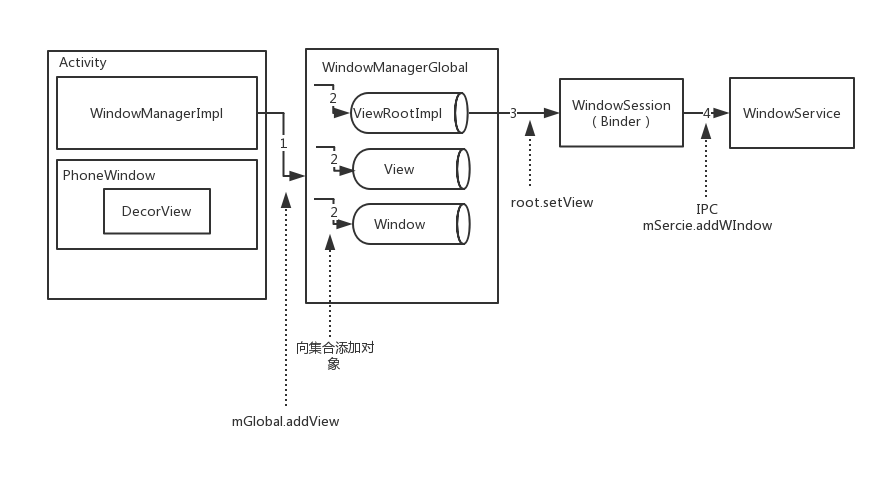
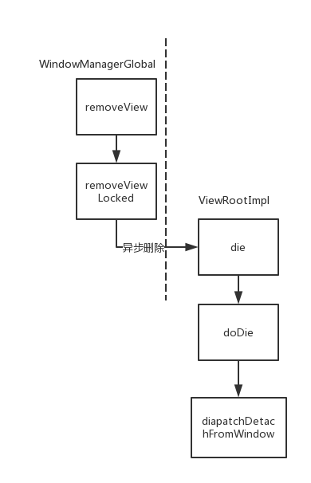
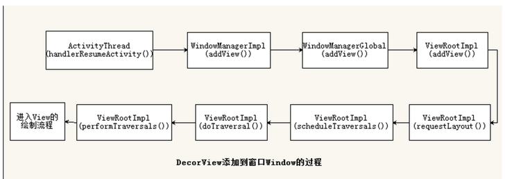

Android中所有View都是通过Window来呈现。WindowManager是外界访问Window的一个接口，Window的具体实现在WindowManagerService中，WindowManager与WindowManagerService的交互是一个IPC过程。

## Window的分类

通过WindowManager添加Window：

```java
        Button button = new Button(this);
        WindowManager.LayoutParams layoutParams = new WindowManager.LayoutParams(WindowManager.LayoutParams.WRAP_CONTENT, ViewGroup.LayoutParams.WRAP_CONTENT, 0, 0, PixelFormat.TRANSPARENT);
        layoutParams.flags = WindowManager.LayoutParams.FLAG_NOT_TOUCH_MODAL |
                WindowManager.LayoutParams.FLAG_NOT_FOCUSABLE |
                WindowManager.LayoutParams.FLAG_SHOW_WHEN_LOCKED;
        layoutParams.gravity = Gravity.LEFT | Gravity.TOP;
        layoutParams.x = 100;
        layoutParams.y = 300;
        getWindowManager().addView(button, layoutParams);
```


LayoutParams中的flags属性可以控制Window的显示特性，

LayoutParams中的type属性表示Window的类型。

- 应用Window，对应于一个Activity，
- 子WIndow，需要附属在特定的Window中，如一些常见的Dialog。
- 系统Window，需要声明权限才能创建，如Toast和ANR警告对话框

```
    <uses-permission android:name="android.permission.SYSTEM_ALERT_WINDOW"/>
    layoutParams.type = WindowManager.LayoutParams.TYPE_SYSTEM_ERROR;
```

WindowManager提供常用的对View增删改功能：

```java
public interface ViewManager
{
    public void addView(View view, ViewGroup.LayoutParams params);
    public void updateViewLayout(View view, ViewGroup.LayoutParams params);
    public void removeView(View view);
}
```


## Window的内部机制

每一个Window对应一个View和一个ViewRootImpl，Window和View通过ViewRootImpl来建立联系。

### Window的添加过程

WindowManagerImpl直接实现了Window的三大操作，而且全部委托给WIndowManagerGlobal来处理（桥接模式）。

```java
    @Override
    public void addView(@NonNull View view, @NonNull ViewGroup.LayoutParams params) {
        applyDefaultToken(params);
        mGlobal.addView(view, params, mContext.getDisplay(), mParentWindow);
    }
```

在WIndowManagerGlobal的addView方法的逻辑如下：

- 创建ViewRootImpl并将View添加到列表中

```java
    private final ArrayList<View> mViews = new ArrayList<View>(); // 存储所有WIndow对应的View
    private final ArrayList<ViewRootImpl> mRoots = new ArrayList<ViewRootImpl>(); // 存储所有Window所对应的ViewRootImpl
    private final ArrayList<WindowManager.LayoutParams> mParams =
            new ArrayList<WindowManager.LayoutParams>(); // 存储所有Window所对应的布局参数
    private final ArraySet<View> mDyingViews = new ArraySet<View>(); //存储正要被删除的View对象
// -----------
            root = new ViewRootImpl(view.getContext(), display);

            view.setLayoutParams(wparams);

            mViews.add(view);
            mRoots.add(root);
            mParams.add(wparams);
```

- 调用ViewRootImpl的setView方法，更新界面并添加Window

```java
root.setView(view, wparams, panelParentView);
---> 
				  requestLayout();  // 调用scheduleTraversals()绘制View

                    res = mWindowSession.addToDisplay(mWindow, mSeq, mWindowAttributes,
                            getHostVisibility(), mDisplay.getDisplayId(),
                            mAttachInfo.mContentInsets, mAttachInfo.mStableInsets,
                            mAttachInfo.mOutsets, mInputChannel);
```

- 由WIndowSession将WIndow添加请求交给WidnowManagerServcice处理

WIndowSession最终完成Window的添加过程，它是一个Binder，远程IPC调用WidnowManagerServcice的addWindow方法。



### Window的删除过程



真正删除WIndow的逻辑在diapatchDetachFromWindow内部：

1. 一些垃圾回收的工作
2. 通过Session的remove方法移除window。mWindowSession.remove(mWindow);
3. 回调View的dispatchDetachedFromWindow方法，内部会调用View的onDetachedFromWindow。


### Window的更新过程

```java
    public void updateViewLayout(View view, ViewGroup.LayoutParams params) {
        if (view == null) {
            throw new IllegalArgumentException("view must not be null");
        }
        if (!(params instanceof WindowManager.LayoutParams)) {
            throw new IllegalArgumentException("Params must be WindowManager.LayoutParams");
        }

        final WindowManager.LayoutParams wparams = (WindowManager.LayoutParams)params;

        view.setLayoutParams(wparams); //替换布局

        synchronized (mLock) {
            int index = findViewLocked(view, true);
            ViewRootImpl root = mRoots.get(index);
            mParams.remove(index);
            mParams.add(index, wparams);
            root.setLayoutParams(wparams, false);
        }
    }
```

在ViewRootImpl的setLayoutParams方法中，会调用scheduleTraversals方法来对View进行重新布局，还会通过WindowSession来更新Window视图，最终由WindowManagerService的relayoutWindow来具体实现。


## Activity的Window创建过程

### PhoneWindow的创建

在Activity的启动过程中，最终会调用ActivityThread的performLaunchActivity来完成整个启动过程，在这个方法内，会通过类加载器创建Activity的实例对象，并调用activity.attach方法。而Window对象就是在attach方法内被创建的。

```java
        mWindow = PolicyManager.makeNewWindow(this);
        mWindow.setCallback(this);
        mWindow.setOnWindowDismissedCallback(this);
        mWindow.getLayoutInflater().setPrivateFactory(this);
```

系统通过PolicyManager.makeNewWindow来创建Window（PhoneWindow），PolicyManager是一个策略类，实现了几个工厂方法。

Activity实现了Window的Callback接口，因此当Window接收到外界的状态改变时会通知Activity，回调onAttachToWindow,onDetachedFromWindow，dispatchTouchEvent。


### 关联视图setContentView，初始化DecorView

Activity 的setContentView方法内部调用Window的setContentView，方法内部逻辑：

```java
    @Override
    public void setContentView(int layoutResID) {
        if (mContentParent == null) {
            installDecor();
        } else if (!hasFeature(FEATURE_CONTENT_TRANSITIONS)) {
            mContentParent.removeAllViews();
        }
        ...
          mLayoutInflater.inflate(layoutResID, mContentParent);
      ...
        final Callback cb = getCallback();
        if (cb != null && !isDestroyed()) {
            cb.onContentChanged();
        }
     }
   private void installDecor() {
        ......
        if (mDecor == null) {
            mDecor = generateDecor(-1);
        }
        if (mContentParent == null) {
            mContentParent = generateLayout(mDecor);
            ......
        }
        ......
    }
```

所做工作：

- installDecor()创建并初始化DecorView，方法内调用generateDecor方法来加载布局文件来初始化DecorView
- 将View添加到DecorView中的mContentParent
- 回调Activity的onContentChanged方法通知Activity视图已经发生改变

参考：[Android setContentView源码分析](http://rkhcy.github.io/2017/05/16/setContentView%E6%BA%90%E7%A0%81%E5%88%86%E6%9E%90/?utm_medium=email&utm_source=gank.io)

### 添加PhoneWindow，显示视图

在ActivityThread的handleResumeActivity方法中，会首先调用onResume方法，然后调用activity的makeVisible方法，在makeVisible方法内，Window被添加到WindowManager中，DecorView才真正显示出来。

```java
    void makeVisible() {
        if (!mWindowAdded) {
            ViewManager wm = getWindowManager();
            wm.addView(mDecor, getWindow().getAttributes());
            mWindowAdded = true;
        }
        mDecor.setVisibility(View.VISIBLE);
    }
```



### 总结

在Activity的启动过程中，Activity被实例化后调用attach方法，PhoneWindow被创建。

用户调用Activity的setContentView方法，然后DecorView被创建并初始化，加载用户传过来的布局文件，把加载完成的View放入DecorView的mContentParent。

当Activity的handleResumeActivity被调用时，onResume被回调，然后PhoneWindow被添加到WindowManager（ViewRootImpl的创建，View的绘制都在这里完成）。将初始化好的DecorView显示出来。

```Java
public class Activity {
    private Window mWindow;
    final void attach(...) {
        mWindow = PolicyManager.makeNewWindow(this);
    }
}
public class PhoneWindow extends Window{
    private DecorView mDecor;
}
public final class WindowManagerGlobal {
    private final ArrayList<View> mViews = new ArrayList<View>();
    private final ArrayList<ViewRootImpl> mRoots = new ArrayList<ViewRootImpl>();
    private final ArrayList<WindowManager.LayoutParams> mParams =
            new ArrayList<WindowManager.LayoutParams>();
}
```


相关源码：

https://github.com/android/platform_frameworks_base/blob/master/core/java/android/view/WindowManagerImpl.java

https://github.com/android/platform_frameworks_base/blob/master/core/java/android/view/WindowManagerGlobal.java

https://github.com/android/platform_frameworks_base/blob/76fdbb7/core/java/android/view/ViewRootImpl.java

https://github.com/android/platform_frameworks_base/blob/d59921149bb5948ffbcb9a9e832e9ac1538e05a0/core/java/com/android/internal/policy/PhoneWindow.java

