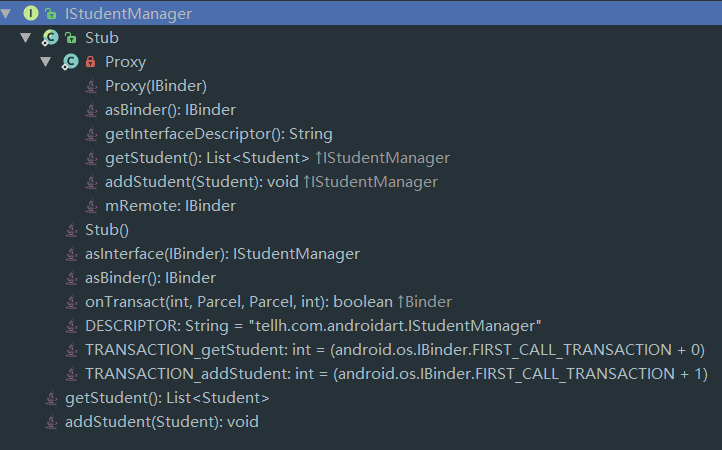

# AIDL的使用和工作原理

AIDL是一种接口定义语言，用于生成可在Android设备上两个进程之间进行进程间通信(IPC)的代码。


## AIDL的使用

- 新建一个aidl文件，定义进程间通信的接口

```java
// IStudentManager.aidl
package com.tellh.androidart;

// Declare any non-default types here with import statements
import com.tellh.androidart.Student;

interface IStudentManager {
    List<Student> getStudent();
    void addStudent(in Student student);
}
```

注意点：

1. aidl中支持的参数类型为：基本类型（int,long,char,boolean等）,String,CharSequence,List,Map，其他类型必须使用import导入，即使它们可能在同一个包里。
2. 接口中的参数除了aidl支持的类型，其他类型必须标识其方向：到底是输入还是输出抑或两者兼之，用in，out或者inout来表示。


- 如果有自定义的数据类型，需要把自定义类实现Parcelable接口并新建aidl声明文件。

```
// Student.aidl
package tellh.com.androidart;
parcelable Student;
```

```java
public class Student implements Parcelable {...}
```


点击**sycn project**，对应的接口java类就被自动生成在gen目录中。

- 创建服务端的Service，运行在服务端进程

```java
public class AidlTestService extends Service {
    private final static String TAG = "AidlTestService";
    private static final String PACKAGE_CLIENT = "com.example.test.aidlclient&&com.tellh.androidart";
    private final List<Student> mStudents = new ArrayList<>();
    private IBinder mBinder = new IStudentManager.Stub() {
        @Override
        public List<Student> getStudent() throws RemoteException {
            synchronized (mStudents) {
                return mStudents;
            }
        }

        @Override
        public void addStudent(Student student) throws RemoteException {
            synchronized (mStudents) {
                if (!mStudents.contains(student))
                    mStudents.add(student);
            }
        }

        @Override
        public boolean onTransact(int code, Parcel data, Parcel reply, int flags) throws RemoteException {
            //权限控制
            String packageName = null;
            String[] packages = AidlTestService.this.getPackageManager().
                    getPackagesForUid(getCallingUid());
            if (packages != null && packages.length > 0) {
                packageName = packages[0];
            }
            Log.d(TAG, "onTransact: " + packageName);
            String[] clients = PACKAGE_CLIENT.split("&&");
            for (String client : clients) {
                if (client.equals(packageName)) {
                    return super.onTransact(code, data, reply, flags);
                }
            }
            return false;
        }
    };

    @Override
    public void onCreate() {
        super.onCreate();
        synchronized (mStudents) {
            for (int i = 1; i < 6; i++) {
                Student student = new Student();
                student.sno = i;
                student.name = "student#" + i;
                student.age = i * 5;
                mStudents.add(student);
            }
        }
    }

    public AidlTestService() {
    }

    @Override
    public IBinder onBind(Intent intent) {
        return mBinder;
    }
}
```

注册Service

```xml
        <service
            android:name=".AidlTestService"
            android:enabled="true"
            android:exported="true">
            <intent-filter>
                <category android:name="android.intent.category.DEFAULT" />
                <action android:name="com.tellh.androidart.AidlTestService" />
            </intent-filter>
        </service>
```

- 新建一个进程作为客户端，隐式启动服务端的Service，在绑定的回调函数中通过`IStudentManager.Stub.asInterface(binder)`获得通信接口的代理对象。

```java
public class AidlClientActivity extends ActionBarActivity {
    private String tag = "AidlClient";

    private static final String ACTION_BIND_SERVICE = "com.tellh.androidart.AidlTestService";
    private IStudentManager mStudentManager;
    private IBinder.DeathRecipient mDeathRecipient = new IBinder.DeathRecipient() {
        @Override
        public void binderDied() {
            if (mStudentManager == null)
                return;
            mStudentManager.asBinder().unlinkToDeath(mDeathRecipient, 0);
            mStudentManager = null;
            bindService();
        }
    };
    private ServiceConnection mServiceConn = new ServiceConnection() {
        @Override
        public void onServiceConnected(ComponentName name, IBinder service) {
            mStudentManager = IStudentManager.Stub.asInterface(service);
            try {
                service.linkToDeath(mDeathRecipient, 0);
            } catch (RemoteException e) {
                e.printStackTrace();
            }
        }

        @Override
        public void onServiceDisconnected(ComponentName name) {
            mStudentManager = null;
        }
    };

    @Override
    protected void onCreate(Bundle savedInstanceState) {
        super.onCreate(savedInstanceState);
        setContentView(R.layout.activity_aidl_client);
        bindService();
    }

    private void bindService() {
        Intent intent = new Intent(ACTION_BIND_SERVICE);
        intent.setFlags(Intent.FLAG_ACTIVITY_NEW_TASK);
        intent.setPackage("com.tellh.androidart");
        bindService(intent, mServiceConn, BIND_AUTO_CREATE);
    }

    @Override
    protected void onDestroy() {
        super.onDestroy();
        if (mStudentManager != null)
            unbindService(mServiceConn);
    }

    public void onClickGetStudent(View view) {
        if (mStudentManager == null)
            return;
        try {
            Log.d(tag, mStudentManager.getStudent().toString());
        } catch (RemoteException e) {
            e.printStackTrace();
        }
    }

    public void onClickAddStudent(View view) {
        if (mStudentManager == null)
            return;
        try {
            Student student = new Student();
            student.sno = 7;
            student.age = 10;
            student.name = "TellH";
            student.sex = Student.SEX_MALE;
            mStudentManager.addStudent(student);
            Log.d(tag, mStudentManager.getStudent().toString());
        } catch (RemoteException e) {
            e.printStackTrace();
        }
    }
}
```

[死亡回调的底层原理](http://light3moon.com/2015/01/28/Android%20Binder%20%E5%88%86%E6%9E%90%E2%80%94%E2%80%94%E6%AD%BB%E4%BA%A1%E9%80%9A%E7%9F%A5[DeathRecipient]/)

注册Activity，在新的进程中启动

```xml
        <activity
            android:name=".AidlClientActivity"
            android:process=":client" />
```

如果在应用之间通信，客户端应用需要把服务端的aidl文件全部copy过来，并且保证包名相同，

## AIDL的工作原理

分析自动生成的java接口代码：

```java
public interface IStudentManager extends android.os.IInterface {
	public static abstract class Stub extends android.os.Binder implements tellh.com.androidart.IStudentManager {...}
	public java.util.List<tellh.com.androidart.Student> getStudent() throws android.os.RemoteException;
    public void addStudent(tellh.com.androidart.Student student) throws android.os.RemoteException;
```



这个接口类继承IInterface，所有在Binder中传输的接口都必须继承IInterface。

它除了保留了我们定义在aidl文件中的两个方法外，还自动生成一个名为Stub的静态类。

这个Stub是抽象类，实现了这个接口类并继承自Binder，将会在服务端的Service中被实例化，作为onBind的返回指返回给客户端，客户端通过`IStudentManager.Stub.asInterface(binder)`转化为这个接口类的代理对象。

抽象类Stub的成员和属性：

- `DESRIPTOR`

Binder的唯一标识，一般用当前Binder的全类名表示。

- `public static IStudentManager asInterface(IBinder obj)`


如果客户端和服务端位于同一个进程，那么直接返回服务端的Stub对象本身，否则返回Stub.Proxy代理对象。

- `public boolean onTransact(int code, android.os.Parcel data, android.os.Parcel reply, int flags)`

该方法运行在服务端中的Binder线程池中，服务端通过code确定客户端所请求的目标方法是什么，从data中取出目标方法所需的参数，然后执行目标方法，并将目标方法的返回值写入reply。如果该方法的返回false，那么客户端的请求回失败。因此，我们可以利用这个特性来做权限验证。

- Proxy#addStudent

Proxy是一个代理类，或者说是装饰者类。

```java
@Override
public java.util.List<tellh.com.androidart.Student> getStudent() throws android.os.RemoteException {
                android.os.Parcel _data = android.os.Parcel.obtain();
                android.os.Parcel _reply = android.os.Parcel.obtain();
                java.util.List<tellh.com.androidart.Student> _result;
                try {
                    _data.writeInterfaceToken(DESCRIPTOR);
                    mRemote.transact(Stub.TRANSACTION_getStudent, _data, _reply, 0);
                    _reply.readException();
                    _result = _reply.createTypedArrayList(tellh.com.androidart.Student.CREATOR);
                } finally {
                    _reply.recycle();
                    _data.recycle();
                }
                return _result;
            }
```

每一个代理方法都是相同的套路，将方法的标识，参数和返回值对象传入方法`mRemote.transact`中，发起远程调用请求，同时挂起当前线程，然后服务端的Stub#onTransact被调用。当onTransact返回true，调用成功，从reply对象中取出返回值，返回给客户端调用方。

## 服务端回调客户端

有些场景，客户端扮演观察者，服务端需要回调服务端的方法来通知客户端，这也是一个IPC的过程。

- 定义观察者和被观察者的AIDL接口

```java
interface Observer {
  void onNext();
}
interface Observable {
  void registerListener(Observer o);
  void unregisterListener(Observer o);
}
```

- 在服务端实现Observable，用RemoteCallbackList保存Observer对象

```java
        private final RemoteCallbackList<Observer> mListenerList = new RemoteCallbackList<>();

        @Override
        public void registerListener(Observer listener) throws RemoteException {
            mListenerList.register(listener);
        }

        @Override
        public void unregisterListener(Observer listener) throws RemoteException {
            // 这里的listener与客户端的listener不是同一个对象，但有同一个binder
            mListenerList.unregister(listener);
        }
```

为什么要用RemoteCallbackList？因为客户端和服务端中的Observer不是同一个对象（Binder相同），所以在服务端中难以寻找与客户端对应的Observer。但他们的底层Binder是相同的，所以内部RemoteCallbackList是以IBinder为key的

```java
ArrayMap<IBinder, Callback> mCallbacks = new ArrayMap<>();
IBinder key = observer.asBinder();
Callback value = new Callback(observer,cookie);
```


- 服务端回调观察者的方法

```java
        int N = mListenerList.beginBroadcast();
        for (int i = 0; i < N; i++) {
            Observer l = mListenerList.getBroadcastItem(i);
            if (l != null)
                l.onNext();
        }
        mListenerList.finishBroadcast();
```


- 在客户端实现观察者，注册和解注册

```java
    private ServiceConnection mServiceConn = new ServiceConnection() {
        @Override
        public void onServiceConnected(ComponentName name, IBinder service) {
            try {
                mServer = Observable.Stub.asInterface(service);
                mServer.registerListener(mListener);
                service.linkToDeath(mDeathRecipient, 0);
            } catch (RemoteException e) {
                e.printStackTrace();
            }
        }
      ...
    }

    @Override
    protected void onDestroy() {
        if (mStudentManager != null && mStudentManager.asBinder().isBinderAlive()) {
            try {
                mStudentManager.unregisterListener(mListener);
            } catch (RemoteException e) {
                e.printStackTrace();
            }
        }
        super.onDestroy();
    }

    private Observable mListener = new Observable.Stub() {
        @Override
        public void onNext() throws RemoteException {
            // 运行在客户端的Binder线程池, 不是UI线程
            mHandler.obtainMessage(MSG_STUDENT_ARRIVED).sendToTarget();
        }
    };
```


## 总结

高度概括AIDL的用法，就是服务端进程有一个Service，给与之绑定(bindService)的特定客户端进程提供Binder对象。客户端通过AIDL接口的静态方法`asInterface` 将Binder对象转化成AIDL接口的代理对象，通过这个代理对象就可以发起远程调用请求了。

至于更深入的，远程调用的过程可以概括如下图


AIDL接口的方法是在服务端的Binder线程池中执行的，因此当多个客户端同时访问的时候需要处理线程同步问题，比如用CopyOnWriteArrayList代替ArrayList，ConcurrentHashMap代替HashMap等。
