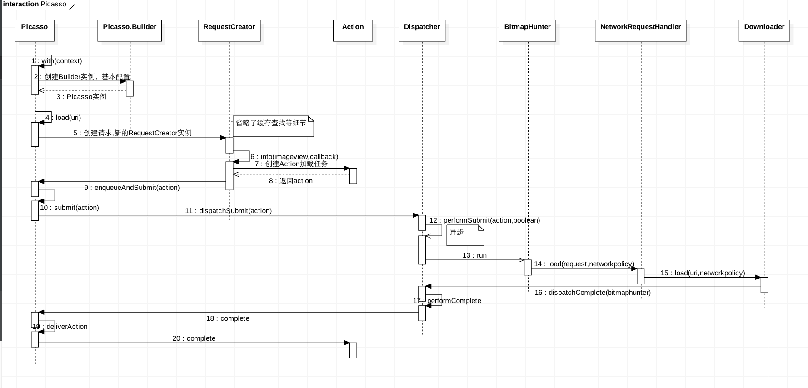

## 三大图片加载框架优缺点对比

### Glide

1. 因为Glide的with方法不光接受Context，还接受Activity 和 Fragment，Context会自动的从他们获取。同时将Activity/Fragment作为with()参数的好处是：图片加载会和Activity/Fragment的生命周期保持一致，比如Paused状态在暂停加载，在Resumed的时候又自动重新加载。
2. Glide加载的图片质量要差于Picasso。这是因为Glide默认的Bitmap格式是RGB_565，比ARGB_8888格式的内存开销要小一半。
3. Picasso和Glide在磁盘缓存策略上有很大的不同。Picasso缓存的是全尺寸的，而Glide缓存的是跟ImageView尺寸相同的。Glide的这种方式优点是**加载显示非常快**。而Picasso的方式则因为需要在显示之前重新调整大小而导致一些延迟.
4. Glide支持gif图的加载

### Picasso

1. 自带统计监控功能
2. 支持优先级处理
3. 本地缓存交给OkHttp来实现

### Fresco

Fresco将Bitmap放在Native堆中，极大地减少OOM的几率。

## Picasso源码分析

```java
Picasso.with(this).load("url").placeholder(R.mipmap.ic_default).into(imageView);
```

### 初始化单例Picasso

```java
  public static Picasso with(Context context) {
    if (singleton == null) {
      synchronized (Picasso.class) {
        if (singleton == null) {
          singleton = new Builder(context).build();
        }
      }
    }
    return singleton;
  }
```

在Picasso的构造器里面，初始化加载处理器：

```java
    allRequestHandlers.add(new ResourceRequestHandler(context));
    if (extraRequestHandlers != null) {
      allRequestHandlers.addAll(extraRequestHandlers);
    }
    allRequestHandlers.add(new ContactsPhotoRequestHandler(context));
    allRequestHandlers.add(new MediaStoreRequestHandler(context));
    allRequestHandlers.add(new ContentStreamRequestHandler(context));
    allRequestHandlers.add(new AssetRequestHandler(context));
    allRequestHandlers.add(new FileRequestHandler(context));
    allRequestHandlers.add(new NetworkRequestHandler(dispatcher.downloader, stats));
    requestHandlers = Collections.unmodifiableList(allRequestHandlers);
```

### load

```java
 public RequestCreator load(Uri uri) {
    return new RequestCreator(this, uri, 0);
  }
```

加载请求在Picasso中被抽象成Request，由于Request的可配置项太多，RequestCreater内部通过Request.Builder来配置Request的参数。

### into

```java
  public void into(ImageView target, Callback callback) {
    long started = System.nanoTime();
    checkMain(); // 发出请求的线程必须是主线程
    ...

    Request request = createRequest(started); // 创建Request对象，使用RequestTransformer转换
    String requestKey = createKey(request);

    if (shouldReadFromMemoryCache(memoryPolicy)) { // 根据缓存策略决定是否使用缓存
      Bitmap bitmap = picasso.quickMemoryCacheCheck(requestKey);
      if (bitmap != null) {
        picasso.cancelRequest(target);
        setBitmap(target, picasso.context, bitmap, MEMORY, noFade, picasso.indicatorsEnabled);
        if (picasso.loggingEnabled) {
          log(OWNER_MAIN, VERB_COMPLETED, request.plainId(), "from " + MEMORY);
        }
        if (callback != null) {
          callback.onSuccess();
        }
        return;
      }
    }
    ...
    Action action =
        new ImageViewAction(picasso, target, request, memoryPolicy, networkPolicy, errorResId,
            errorDrawable, requestKey, tag, callback, noFade); // Action是Request之上的又一层封装

    picasso.enqueueAndSubmit(action); // 交给Dispatcher来分发处理
  }
```

- 关于Action

`Request`关注的是请求本身，比如请求的源、id、开始时间、图片变换配置、优先级等等，而`Action`则代表的是一个加载任务，所以不仅需要 `Request`对象的引用，还需要`Picasso`实例，是否重试加载，ErrorView等。

`Action`有个需要关注的点，那就是`WeakReference<T> target`,它持有的是Target(比如ImageView..)的弱引用，这样可以保证加载时间很长的情况下也不会影响到Target的gc。

### Dispatcher

Dispatcher顾名思义是一个任务分发器，关联了线程池(service)、下载器(downloader)、主线程的Handler(mainThreadHandler)、关联HandlerThread的Handler、缓存(cache)、 监控器(stats)。

#### PicassoExecutorService

`Picasso`默认的线程池叫`PicassoExecutorService`,它继承自`ThreadPoolExecutor`,默认线程数量为3。但是`PicassoExecutorService`的特性是可以根据网络情况调整线程数量，wifi下是4个线程，而2g网只有一个线程。具体是通过在`Dispatcher`中注册了监听网络变化的广播接收者。

#### performSubmit

```java
  void performSubmit(Action action, boolean dismissFailed) {
    ...
    BitmapHunter hunter = hunterMap.get(action.getKey());
    ...
    hunter = forRequest(action.getPicasso(), this, cache, stats, action);
    hunter.future = service.submit(hunter);
    hunterMap.put(action.getKey(), hunter);
    ...
  }
```

该方法的逻辑很简单，有两部分：

- 获取BitmapHunter

通过静态方法`forRequest` 方法来获取BitmapHunter：

```java
  static BitmapHunter forRequest(Picasso picasso, Dispatcher dispatcher, Cache cache, Stats stats,
      Action action) {
    Request request = action.getRequest();
    List<RequestHandler> requestHandlers = picasso.getRequestHandlers();
    for (int i = 0, count = requestHandlers.size(); i < count; i++) {
      RequestHandler requestHandler = requestHandlers.get(i);
      if (requestHandler.canHandleRequest(request)) {
        return new BitmapHunter(picasso, dispatcher, cache, stats, action, requestHandler);
      }
    }
    return new BitmapHunter(picasso, dispatcher, cache, stats, action, ERRORING_HANDLER);
  }
```

这是一个典型的责任链模式，通过RequestHandler来匹配Request，并将能处理该Request的RequestHandler封装到BitmapHunter。

- 将hunter提交给线程池执行

BitmapHunter其实是一个Runnable，它会把真正的加载工作交给RequestHandler。而线程池会调用BitmapHunter的run方法开始加载。

```java
  @Override public void run() {
    ...
      result = hunt();
    ...
  }
  Bitmap hunt() throws IOException {
    Bitmap bitmap = null;
    if (shouldReadFromMemoryCache(memoryPolicy)) {
      bitmap = cache.get(key);
      if (bitmap != null) {
        stats.dispatchCacheHit();
        loadedFrom = MEMORY;
        if (picasso.loggingEnabled) {
          log(OWNER_HUNTER, VERB_DECODED, data.logId(), "from cache");
        }
        return bitmap;
      }
    }

    data.networkPolicy = retryCount == 0 ? NetworkPolicy.OFFLINE.index : networkPolicy;
    RequestHandler.Result result = requestHandler.load(data, networkPolicy); //
      ...
      bitmap = result.getBitmap();
      ...
    return bitmap;
  }
```

BitmapHunter调用RequestHandler的load方法来加载图片，这体现了策略模式。

最终，会调用ImageViewAction#complete来将加载得到的Bitmap设置到Target上。



### 关于缓存

Picasso的缓存是内存缓存+磁盘缓存，内存缓存基于`LruCache`类，可配置替换。磁盘缓存依赖于http缓存，不可配置，它基于`Http`语义来判断是否缓存。

### 总结 

`Picasso`的核心类主要包括:`Picasso`,`RequestCreator`,`Action`,`Dispatcher`,`Request`,`RequestHandler`,`BitmapHunter`等等。要加载一张图片需要以下过程：

```java
Picasso.with(this).load("url").placeholder(R.mipmap.ic_default).into(imageView);
```

1. 创建Picasso单例，实例化并配置线程池，LruCache，Dispatcher，RequestHandler等等。
2. 利用Builder模式构造Request对象
3.  判断缓存是否命中；构造ImageAction，分发到Dispacher线程，交给Dispatcher来处理
4. 找到合适的RequestHandler来处理Request，创建BitmapHunter（继承自Runnable），将BitmapHunter放入线程池
5. 利用RequestHandler来load 图片，将结果分发到Dispatcher线程
6. 将图片分发到UI线程，ImageAction把图片设置到target（ImageView）上

参考：

- http://blog.csdn.net/chdjj/article/details/49964901
- http://skykai521.github.io/2016/02/25/Picasso%E6%BA%90%E4%BB%A3%E7%A0%81%E5%88%86%E6%9E%90/

