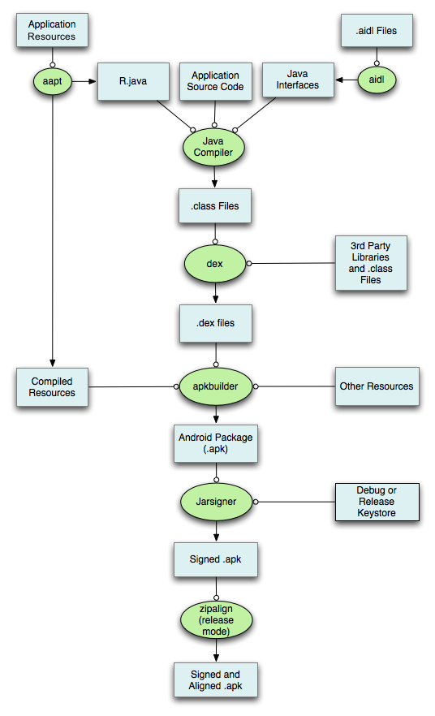
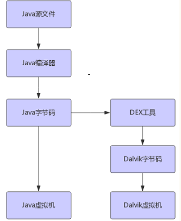
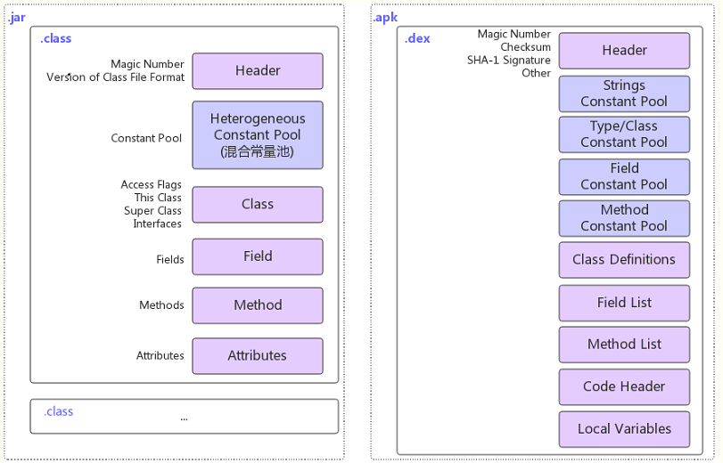

### Asset目录与res目录的区别

- res/raw和assets的相同点：　

　　两者目录下的文件在打包后会原封不动的保存在apk包中，不会被编译成二进制。

- res/raw和assets的不同点：

  - res/raw中的文件会被映射到R.java文件中，访问的时候直接使用资源ID即R.id.filename；assets文件夹下的文件不会被映射到R.java中，访问的时候需要AssetManager类。
  - res/raw不可以有目录结构，而assets则可以有目录结构，也就是assets目录下可以再建立文件夹　
  - assets 文件夹一般放一些图片，html，js，css等文件
  - 写的方式有所不同

  ```java
  	InputStream is =getResources().openRawResource(R.id.filename);  
  	/**  
       * 从assets中读取图片 
       */  
      private Bitmap getImageFromAssetsFile(String fileName)  
        {  
            Bitmap image = null;
            AssetManager am = getResources().getAssets();  
            try  
            {  
                InputStream is = am.open(fileName);  
                image = BitmapFactory.decodeStream(is);  
                is.close();  
            }  
            catch (IOException e)  
            {  
                e.printStackTrace();  
            }   
            return image;  
        }  
  ```

  ​


### Android为什么需要数字签名

所有的Android应用程序都要求开发人员用一个证书进行数字签名，anroid系统不会安装没有进行签名的应用程序。平时我们的程序可以在模拟器上安装并运行，是因为在应用程序开发期间，由于是以Debug调试模式进行编译的，因此ADT根据会自动用默认的密钥和证书来进行签名，而在以发布模式编译时，apk文件就不会得到自动签名，这样就需要进行手工签名。
给apk签名可以带来以下好处：

1. 应用程序升级：如果你希望用户无缝升级到新的版本，那么你必须用同一个证书进行签名。这是由于只有以同一个证书签名，系统才会允许安装升级的应用程序。如果你采用了不同的证书，那么系统会要求你的应用程序采用不同的包名称，在这种情况下相当于安装了一个全新的应用程序。如果想升级应用程序，签名证书要相同，包名称要相同！
2. 应用程序模块化：Android系统可以允许同一个证书签名的多个应用程序在一个进程里运行，系统实际把他们作为一个单个的应用程序，此时就可以把我们的应用程序以模块的方式进行部署，而用户可以独立的升级其中的一个模块。
3. 代码或者数据共享：Android提供了基于签名的权限机制，那么一个应用程序就可以为另一个以相同证书签名的应用程序公开自己的功能。以同一个证书对多个应用程序进行签名，利用基于签名的权限检查，你就可以在应用程序间以安全的方式共享代码和数据了。不同的应用程序之间，想共享数据，或者共享代码，那么要让他们运行在同一个进程中，而且要让他们用相同的证书签名。


### Android APK打包过程

- 打包资源文件，生成R.java文件

  打包资源的工具是**aapt（The Android Asset Packaing Tool）**，位于android-sdk/platform-tools目录下。在这个过程中，项目中的AndroidManifest.xml文件和布局文件XML都会编译，然后生成相应的R.java。

- 处理相应的AIDL文件，生成相应的java文件

- 编译项目源码，生成.class文件

- 使用dx工具将所有的.class文件生成class.dex文件，任何第三方的*libraries*和*.class*文件都会被转换成*.dex*文件。dx工具的主要工作是将Java字节码转成成Dalvik字节码、压缩常量池、消除冗余信息等。

- 使用apkbuilder工具打包生成APK文件

  所有没有编译的资源（如images等）、编译过的资源和*.dex*文件都会被**apkbuilder**工具打包到最终的*.apk*文件中。

- 通过Jarsigner工具，对APK文件进行签名。


- 使用zipalign工具将APK文件进行对齐处理

  对齐的主要过程是将APK包中所有的资源文件距离文件起始偏移为4字节整数倍，这样通过内存映射访问apk文件时的速度会更快。




### Sqlite与MySQL的区别

SQLITE功能简约，小型化，追求最大磁盘效率；MYSQL功能全面，综合化，追求最大并发效率。如果只是单机上用的，数据量不是很大，需要方便移植或者需要频繁读/写磁盘文件的话，就用SQLite比较合适；如果是要满足多用户同时访问，或者是网站访问量比较大是使用MYSQL比较合适。

sqlite优点：

1. 整个数据库都包含在磁盘上的一个文件中，因此它有很好的迁移性。
2. 小型

sqlite的缺点；

1. 没有用户管理
2. 数据库同一时间只允许一个写操作，因此吞吐量有限。

MySQL的优点：

1. 功能丰富
2. 安全，允许多用户
3. 支持分布式
4. 支持高并发的读写


### Dalvik虚拟机和ART虚拟机

- Dalvik与Java虚拟机的区别



dex工具会消除其中class文件的冗余信息，重新组合形成一个常量池，所有的类文件共享同一个常量池。由于dx工具对常量池的压缩，使得相同的字符串，常量在DEX文件中只出现一次，从而减小了文件的体积。



Java虚拟机是基于栈架构，Dalvik虚拟机基于寄存器架构。

- ART(Android Runtime)

其处理应用程序执行的方式完全不同于Dalvik，Dalvik是依靠一个Just-In-Time (JIT)编译器去解释字节码。开发者编译后的应用代码需要通过一个解释器在用户的设备上运行，这一机制并不高效，但让应用能更容易在不同硬件和架构上运 行。ART则完全改变了这套做法，在应用安装时就预编译字节码到机器语言，这一机制叫Ahead-Of-Time (AOT）编译。

参考：http://www.jianshu.com/p/92227738f270#


### 四大组件之间，Activity与Fragment之间通信

1. 信息存在形式：Intent，Bundle，静态变量，全局变量，还是点击事件，触摸事件的回调监听，或者文件形式（Sharepreference，SQLite，File , NetStream） ，本质就是信息源
2. 信息传递的形式：网路，回调监听，线程，Intent，全局Application，Binder，AIDL，Handler

- Activity与Fragment

Fragment通过调用`getActivity()`方法可以调用得到Activity的实例，`onAttach`方法也可以得到Activity实例；Activity通过FragmentManager可以找到Fragment实例。

- Fragment与Fragment

以宿主Activity作为媒介，使用接口调用的方式。

- Activity与Activity之间

  用Bundle和Intent

```java
startActivity(new Intent(),new Bundle());
startActivityForResult(new Intent(),FLAG,new Bundle());
```

​	用onActivityResult回调

- Activity与Service

`startService`通过Bundle对象的形式存储，通过Intent传输，来完成Activity向Service传递数据的操作。

`bindService`通过ServiceConnection获取binder对象。

- Activity与BroadcastReceiver

用Intent传递，Bundle存储。

参考：http://www.jianshu.com/p/442a9e32ab52#

### dp px dpi

```
px = dp * (dpi / 160)
```

DPI的全称是 Dots Per Inch，指的是屏幕像素密度。

dp是一个虚拟的像素单位 － DP 或者 DIP (Density-Independent pixel)，当然也可以理解为 Device-Independent Pixel。为什么说是**虚拟**呢，因为它的大小不是一个物理（Phisical）值，而是由操作系统根据屏幕大小和密度动态渲染出来的。

它能保证相同dp值的图片在不同像素密度的屏幕上显示效果一样。

### SurfaceView与View的区别

SurfaceView和View最本质的区别在于，surfaceView是在一个新起的单独线程中可以重新绘制画面而View必须在UI的主线程中更新画面。

SurfaceView封装的Surface支持使用本章前面所描述的所有标准Canvas方法进行绘图，同时也支持完全的OpenGL ES库。

根据游戏特点，一般分成两类。
1 被动更新画面的。比如棋类，这种用view就好了。因为画面的更新是依赖于 onTouch 来更新，可以直接使用 invalidate。 因为这种情况下，这一次Touch和下一次的Touch需要的时间比较长些，不会产生影响。
2 主动更新。比如一个人在一直跑动。这就需要一个单独的thread不停的重绘人的状态，避免阻塞main UI thread。所以显然view不合适，需要surfaceView来控制。

出现SurfaceView的原因在于：虽然说通常情况下View已经可以满足大部分的绘图需求了，但是在有些时候还是有缺陷的，View是通过刷新来重绘视图的，Android系统通过发出VSYNC信号来进行屏幕的重绘，刷新的时间间隔是16ms，如果在16ms内刷新完成的话是没有什么影响的，但是 如果刷新的时候执行的操作逻辑太多，那么会出现卡顿的现象，SurfaceView就是解决这个问题的；
(1)：View主要用于主动更新的情况下，而SurfaceView主要用于被动更新，例如频繁的刷新；
(2)：View在主线程中对画面进行更新，而SurfaceView通常会通过一个子线程来进行更新；
(3)：View在绘图的时候是没有使用双缓冲机制的，而SurfaceView在底层实现中使用了双缓冲机制；

### Android操作系统的四层架构

Applications(应用程序层)、Application Framework(应用程序框架层)、Libraries(系统库)以及Android Runtime、Linux Kernal(Linux内核)。


### 进程保活

**Android 进程保活包括两个层面：**

A. 提高进程优先级，降低进程被杀死的概率

B. 在进程被杀死后，进行拉活

C. 申请加入厂商的白名单

#### 提高进程的优先级

##### 各种进程

**前台进程**

A. 拥有用户正在交互的 Activity（已调用 onResume()）

B. 拥有某个 Service，后者绑定到用户正在交互的 Activity

C. 拥有正在“前台”运行的 Service（服务已调用 startForeground()）

D. 拥有正执行一个生命周期回调的 Service（onCreate()、onStart() 或 onDestroy()）

E. 拥有正执行其 onReceive() 方法的 BroadcastReceiver

**可见进程**

A. 拥有不在前台、但仍对用户可见的 Activity（已调用 onPause()）。

B. 拥有绑定到可见（或前台）Activity 的 Service

**服务进程**

A. 正在运行 startService() 方法启动的服务，且不属于上述两个更高类别进程的进程。

**后台进程**

如果某个 Activity 正确实现了生命周期方法，并保存了其当前状态，则终止其进程不会对用户体验产生明显影响，因为当用户导航回该 Activity 时，Activity 会恢复其所有可见状态。

A. 对用户不可见的 Activity 的进程（已调用 Activity的onStop() 方法）

**空进程**

保留这种进程的的唯一目的是用作缓存，以缩短下次在其中运行组件所需的启动时间。

A. 不含任何活动应用组件的进程

##### 具体方案

1. 用广播监听熄屏事件，启动一个Activity设置为透明的，大小为1个像素。用户解锁时自动销毁Activity。
2. 利用Notification提升权限，通过 setForeground 接口可以将后台 Service 设置为前台 Service

#### 进程死后拉活

1. 利用系统广播拉活。缺点：广播接收器容易被系统自启动管理屏蔽，而收不到广播
2. 利用第三方应用广播拉活。通过反编译TOP应用的广播，
3. 利用Native进程拉活
4. 将 Service 设置为 START_STICKY，利用系统机制在 Service 挂掉后自动拉活


参考：https://zhuanlan.zhihu.com/p/21987083


### 网络请求框架Volley VS Retrofit

- 解耦

Retrofit就是一个门面，解耦的更彻底:比方说通过注解来配置请求参数，通过工厂来生成CallAdapter，Converter，你可以使用不同的请求适配器(CallAdapter), 比方说RxJava，Java8, Guava。你可以使用不同的反序列化工具(Converter)，比方说json, protobuff, xml, moshi等等。

Volley允许配置切换HTTP加载模块，支持OkHttp，HttpUrlConnection，HttpClient。

- 同步与异步

Volley支持异步请求；Retrofit支持同步和异步请求。

- 图片加载

Retrofit不支持图片加载，但Square提供Picasso这个图片加载框架。

Volley支持基本的图片加载功能。

- Cache

Retrofit根据Http cache control header来处理缓存。如果需要另外的扩展，需要配置OkHttpClient。

Volley的cache做的比较灵活和完善。

```
mRequestQueue = new RequestQueue(cache, network);
```

- 请求优先级

Retrofit不支持请求优先级；Volley支持请求优先级。

- 都不支持大文件下载


### MVC&MVP&MVVM

#### MVC


MVC模式所有的模块通信都是单向的。

1. View传递更新UI的指令给Controller
2. Controller处理业务逻辑，要求Model改变状态
3. Model更新数据后，通知View更新UI

Android里面的对应关系：

**View：**对应于xml布局文件
**Model：**实体模型
**Controllor：**对应于Activity业务逻辑，数据处理和UI处理

Android中纯粹作为View的各个XML视图功能太弱，Activity基本上都是View和Controller的合体，既要负责视图的显示又要加入控制逻辑，承担的功能过多。

#### MVP


1. 各部分之间的通信，都是双向的
2. View和Model不发生联系，都通过Presenter传递
3. Presenter包含所有的业务逻辑，View非常薄，几乎不含任何业务逻辑

在Presenter中持有View（Activity或者Fragment）的引用，然后在Presenter调用View暴露的接口对视图进行操作，这样有利于把视图操作和业务逻辑分开来。MVP能够让Activity成为真正的View而不是View和Control的合体，Activity只做UI相关的事。但是这个模式还是存在一些不好的地方，比较如说：

- Activity需要实现各种跟UI相关的接口，同时要在Activity中编写大量的事件，然后在事件处理中调用presenter的业务处理方法，View和Presenter只是互相持有引用并互相做回调,代码不美观。
- 复杂的业务同时会导致presenter层太大，代码臃肿的问题。
- Presenter会持有View的引用，需要通知Presenter释放View的引用，避免内存泄漏。


#### MVVM

MVM模式将Presenter改名ViewModel，View和ViewModel是data-binding，View的变动自动反映在ViewModel，反之亦然。ViewModel不会持有View的引用。

- http://www.jianshu.com/p/2fc41a310f79#
- https://tech.meituan.com/android_mvvm.html


### 65535问题

- **原因**

在Dalvik指令集里，调用方法的invoke-kind指令中，method reference index只给了16bits，最多能调用65535个方法，所以在生成dex文件的过程中，当方法数超过65535就会报错。细看指令集，除了method，field和class的index也是16bits，所以也存在65535的问题。

在dex的过程中有一下一段代码：

```java
// 如果方法数大于0xffff就提示65k错误
if (items().size() > DexFormat.MAX_MEMBER_IDX + 1) {
    throw new DexIndexOverflowException(getTooManyMembersMessage());
}
```

- Google 的MultiDex方案

MultiDex在冷启动时，因为会同步的反射安装Dex文件，进行IO操作，如果主dex比较大，容易导致ANR。

- 美团的分包，动态加载方案

1. 自定义dex分包策略，减小主dex的class数量；
2. 异步加载Dex文件，在加载的过程启动Waitting Activity进行轮询，当Dex文件加载好后，启动目标Activity。这个过程涉及到hook Instrumentation的newActivity方法。

- 参考：

1. [关于『65535问题』的一点研究与思考](http://blog.csdn.net/zhaokaiqiang1992/article/details/50412975)
2. [当Field邂逅65535](http://jiajixin.cn/2015/10/21/field-65535/)
3. [由Android 65K方法数限制引发的思考](http://jayfeng.com/2016/03/10/%E7%94%B1Android-65K%E6%96%B9%E6%B3%95%E6%95%B0%E9%99%90%E5%88%B6%E5%BC%95%E5%8F%91%E7%9A%84%E6%80%9D%E8%80%83/)


### Fragment传参为什么不能通过构造方法

当一个fragment重新创建的时候，系统会再次调用 Fragment中的默认构造函数。官方推荐使用Fragment的setArguments方法来传递参数。

### 系统杀进程后对Activity的影响

当系统把app进程杀死，用户有返回到该应用时，之前的Activity栈仍然存在，但Activity实例和相关的变量已经被销毁。因此，重建后的Activity里的静态变量在引用时需要进行判空处理。为了防止NPE，有两种解决办法：

1. 将Activity的相关变量进行持久化操作，保护现场
2. 在Activity的onCreate方法中判断Activity是否是被销毁后重启，如果是就清空Activity栈并重新进行app启动流程。


### ARM vs x86

**ARM**

采用RISC指令集架构，具有以下优点：

- 指令集精简，硬件实现简单，所需晶体管较少，芯片体积小，成本低
- 低功耗，耗电少，适合于嵌入式领域（移动设备）
- 流水线处理方式

缺点如下：

- 程序占用内存较大，指令执行速度较慢

**x86**

采用CISC指令集架构，各条指令顺序执行，指令执行速度快，功耗较高。

x86指令集只有8个通用寄存器，所以CISC指令执行时会频繁访问存储器，拖慢整个系统的速度；

而RISC系统有非常多的通用寄存器，采用重叠寄存器窗口和寄存器堆等技术使寄存器资源得以充分利用。