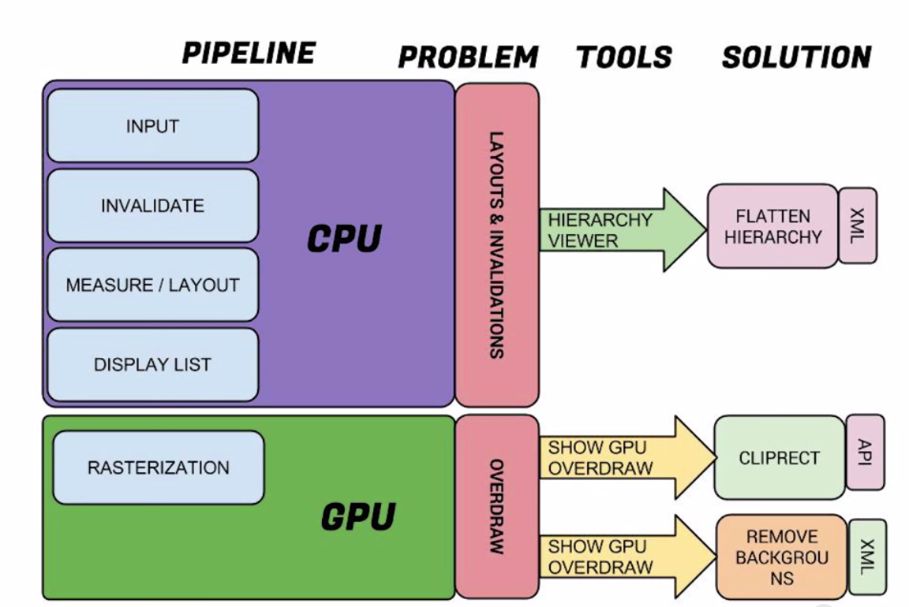

### 性能优化的工具

- TraceView：最好用也是最强大的性能跟踪工具。
- SysTrace：主要用于查看UI的绘制问题。
- Trace OpenGL：可以录制每一帧的绘制过程，逐个绘制命令查看。
- Threads：显示所有线程信息。
- Heap：堆的分配和使用信息。
- AlloCation Tracker：用于内存分配跟踪，也是个调试性能的强大工具。
- HierarchyViewer：用于查看层级以及一些耗时等。

### 关于对onDraw()的优化

1. 如果在onDraw里面执行内存分配的操作，会容易导致内存抖动，频繁触发GC。
2. 尽量使用ClipRect等方法来避免overdraw
3. 对于不在屏幕上的元素，可以使用canvas.quickReject把他们剔除
4. 对于不透明的View，显示它只需要渲染一次即可，可是如果这个View设置了alpha值，会至少需要渲染两次。原因是包含alpha的view需要事先知道混合View的下一层元素是什么，然后再结合上层的View进行Blend混色处理。

### 关于图片加载的优化

1. 常见的png,jpeg,webp等格式的图片在设置到UI上之前需要经过解码的过程，而解压时可以选择不同的解码率，不同的解码率对内存的占用是有很大差别的。在不影响到画质的前提下尽量减少内存的占用，这能够显著提升应用程序的性能。
2. 相比起JPEG，PNG能够提供更加清晰无损的图片，但是PNG格式的图片会更大，占用更多的磁盘空间。
3. 使用inBitmap属性可以告知Bitmap解码器去尝试使用已经存在的内存区域，新解码的bitmap会尝试去使用之前那张bitmap在heap中所占据的pixel data内存区域，而不是去问内存重新申请一块区域来存放bitmap。

### apk安装包瘦身

- 减少图片资源的大小
  - 在build.gradle文件中开启`minifEnabled`与`shrinkResources`的属性，移除那些在程序中使用不到的代码
  - 有选择性的提供对应分辨率的图片资源
  - 使用代码的方式对已有的资源进行复用
- 减少程序代码量
  - 开启MinifEnabled，Proguard。打开这些编译属性之后，程序在打包的时候就不会把没有引用到的代码编译进来，以此达到减少安装包大小的目的。

### UI优化

1. RelativeLayouts经常需要measure所有子节点两次才能把子节点合理的布局。如果子节点设置了weights属性，LinearLayouts也需要measure这些节点两次，才能获得精确的展示尺寸。如果LinearLayouts或者RelativeLayouts被套嵌使用，measure所费时间可能会呈指数级增长。
2. 理想情况下，总共的measure，layout，draw时间应该被很好的控制在16ms以内，以保证滑动屏幕时UI的流畅。
3. overdraw 重复绘制
4. GPU渲染 测量丢帧，卡顿
5. 使用**Systrace**工具定位jank问题。参考：https://zhuanlan.zhihu.com/p/27065828



#### OverDraw

打开手机开发者选项中的Show GPU OverDraw，可以发现屏幕中有不同色块。颜色越深越红的色块就是过度绘制最严重的区域。

解决方案：

- 移除不必要的background。容易被忽视的点是ListView中ImageView的背景和Activity中mDecorView中的背景。后者通过调用`mDecor.setWindowBackground(drawable)`来去除背景。
- 使用`canvas.clipRect`将多余的部分剪切掉。


#### 减小不必要的层次

使用Hierarchy Viewer工具可以看到分别看到View 的measure，layout，draw的时间。

使用include，merge标签减少嵌套布局的层数，使用ViewStub对View进行懒加载。

http://blog.csdn.net/lmj623565791/article/details/45556391/

#### 卡顿检测

- 利用Looper#loop方法中消息处理的时长来判断是否发生卡顿

```java
public static void loop() {
    final Looper me = myLooper();
    final MessageQueue queue = me.mQueue;
    // ...
    for (;;) {
        Message msg = queue.next(); // might block
        // This must be in a local variable, in case a UI event sets the logger
        Printer logging = me.mLogging;
        if (logging != null) {
            logging.println(">>>>> Dispatching to " + msg.target + " " +
                    msg.callback + ": " + msg.what);
        }
        // focus
        msg.target.dispatchMessage(msg);
        if (logging != null) {
            logging.println("<<<<< Finished to " + msg.target + " " + msg.callback);
        }
        // ...
    }
}
```

- 利用Choreographer

参考：[Android UI性能优化 检测应用中的UI卡顿](http://blog.csdn.net/lmj623565791/article/details/58626355)