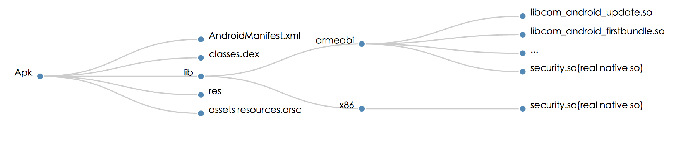

### APK结构

使用Atlas框架的apk是由一个主apk和一堆业务模块apk（bundle）组成。在打包的过程中，gradle插件将所有bundle中AndroidManifest注册信息合并到主apk的AndroidManifest文件中。打包完成后，业务bundle名变为libxxx_xxx_xxx.so的形式，放在主apk的lib目录下。在系统安装apk时，会将bundle解压到系统app的lib目录下。

### 类加载

Atlas里面通常会创建了两种classLoader,第一个是DelegateClassLoader，他作为类查找的一个路由器而存在，本身并不负责真正类的加载；DelegateClassLoader启动时被atlas注入LoadedApk中，替换原有的PathClassLoader；第二个是BundleClassLoader，参考OSGI的实现，每个bundle resolve时会分配一个BundleClassLoader，负责该bundle的类加载。DelegateClassLoader以PathClassLoader为parent，同时在路由过程中能够找到所有bundle的classloader；BundleClassLoader以BootClassLoader为parent，同时引用PathClassLoader,BundleClassLoader自身findClass的顺序为

1. findOwn： 查找bundle dex 自身内部的class

2. findDependency: 查找bundle依赖的bundle内的class

3. findPath： 查找主apk中的class

例子：

1. ActivityThread从LoadedApk中获取classloader去load Activity Class；
2. 根据上面的classloader关系，先去parent里面加载class；
3. 由于class在bundle里面，所以pathclassloader内查找失败，接着delegateclassloader根据bundleinfo信息查找到classloader在bundle中（假设为bundleA）；
4. 从bundleA中加载class，并且创建class；
5. 后面在Activity起来后，如果bundleA对bundleB有依赖关系，那么如果用到了bundleB的class，又会根据bundlA的bundleClassloader的dependency去获取bundleB的classloader去加载；

### 资源加载

类似ClassLoader，LoadedApk中的Resources被替换成Atlas内部的DelegateResources,同时在每个Bundle安装的过程中，每个bundle的assetspath会被更新到DelegateResources的AssetsManager中。

### 参考

- [Atlas原理](https://lark.alipay.com/youku_android_arch/atlas/nltxv9)
- [Atlas文档](https://alibaba.github.io/atlas/principle-intro/Runtime_principle.html)

