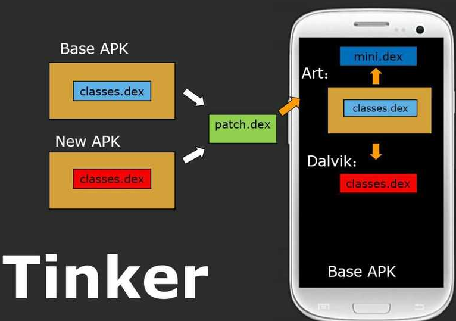

## 热修复

### QQ空间的方案

QQ空间热修复的方案是基于dex分包方案的基础之上，简单来说就是把BUG方法修复以后，重新生成一个dex，从服务器下载之后，将其插入到dexElements数组的最前面，让虚拟机去优先加载修复后的类。

使用这种方案时，必须避免类被打上`CLASS_ISPREVERIFIED`标志，具体的做法就是在每一个类的构造函数中单独引用一个在另外dex中的类。

该方案存在如下的缺点： 

1. 不支持即时生效，必须重启虚拟机才能生效
2. patch.dex是用来存储修复的类，启动应用时，就要加载patch.dex，当修复的类到了一定数量，加载时间会变得很长，造成应用启动卡顿

**优化方案**：[QFix](https://mp.weixin.qq.com/s?__biz=MzA3NTYzODYzMg==&mid=2653577964&idx=1&sn=bac5c8883b7aaaf7d7d9ea227f200412&chksm=84b3b0ebb3c439fd56a502a27e1adc18f600b875718e537191ef109e2d18dae1c52e5e36f2d9&scene=0#wechat_redirect)

QFix官方还没开源，但有开源实现：https://github.com/lizhangqu/QFix

### 微信Tinker的方案

通过生成dex差量包的方式，与QQ空间超级补丁技术基本相同，区别在于不再将patch.dex增加到elements数组中，而是差量的方式给出patch.dex，然后将patch.dex与应用的classes.dex合并，然后整体替换掉旧的dex文件，以达到修复的目的。



缺点：

1. 不支持即时生效
2. 合并算法需要比较大的计算资源，需要单独开一个进程，系统可能会把进程杀掉，降低成功率

### 阿里AndFix方案

以上两种热修复方案都是针对Java层的，而AndFix的原理是基于native层的，修复单位是方法级别的。它是通过运行时在Native修改Filed指针，实现方法的替换。

优点：

1. 不需要重启虚拟机，即时生效
2. patch包体积小

不足：

1. 不支持新增字段，以及修改方法，也不支持对资源的替换。
2. 需要针对dalvik虚拟机和art虚拟机做适配，需要考虑指令集的兼容问题

### 美团Robust方案

Robust插件对每个产品代码的每个函数都在编译打包阶段自动的插入了一段代码和一个静态变量。

```java
    public static ChangeQuickRedirect changeQuickRedirect;
    public long getCount() {
        if(changeQuickRedirect != null) {
            //PatchProxy中封装了获取当前className和methodName的逻辑，并在其内部最终调用了changeQuickRedirect的对应函数
            if(PatchProxy.isSupport(new Object[0], this, changeQuickRedirect, false)) {
                return ((Long)PatchProxy.accessDispatch(new Object[0], this, changeQuickRedirect, false)).longValue();
            }
        }
        return 100L;
    }
```

补丁包patch.dex包含有修复好的类。当客户端拿到补丁包后，用DexClassLoader加载patch.dex，拿到修复好的类的信息。通过反射找到有bug的类，并给它的成员变量changeQuickRedirect赋值。当这个类的有bug的方法被调用时就会被重定向到执行修复好的方法。


优点：

- 只用到了ClassLoader，兼容性好
- 补丁下发立即生效，不需要重新启动

缺点：

- 编译阶段有插件侵入了产品代码，给每个方法插桩，对方法运行时间，包体积和方法数会有一点的影响
- 不支持资源和so的替换

### 参考

- [Android热修复学习之旅开篇——热修复概述](http://blog.csdn.net/u012124438/article/details/62107035)
- [安卓App热补丁动态修复技术介绍](https://mp.weixin.qq.com/s?__biz=MzI1MTA1MzM2Nw==&mid=400118620&idx=1&sn=b4fdd5055731290eef12ad0d17f39d4a&scene=1&srcid=1106Imu9ZgwybID13e7y2nEi#wechat_redirect)
- [Android热修复学习之旅开篇——热修复概述](http://blog.csdn.net/u012124438/article/details/62107035)
- [Android热更新方案Robust](https://tech.meituan.com/android_robust.html)


## 插件化

### Hook组件的启动

Android的四大组件都需要在AndroidManifest.xml中声明，而插件化要实现的目标是启动没有在AndroidManifest.xml中声明的组件。要做到这一点就必须要欺骗AMS的验证过程和让系统回调我们启动的组件的生命周期。

以Activity的启动为例。


Activity的栈管理，启动模式和校验等工作都是由AMS来做的，然后AMS通过ApplicationThread来通知ActivityThread来实例化和初始化Activity，并回调Activity的生命周期方法。至此，我们可以这样做。

1. 我们可以事先在AndroidManifest.xml里面声明一个StubActivity（龙套）。通过反射和动态代理Hook掉ActivityManagerNative的startActivity方法。把startActivity传过来的Intent对象里面的Activity替换成龙套Activity。
2. ActivityThread里面有一个Handler，专门来处理ApplicationThread传过来的通知。这些通知是由AMS通过Binder发过来的，当AMS处理完Activity校验和栈管理等手续后就会通知ActivityThread来实例化Activity。Activity在App端的启动工作是放在Handler.Callback里面。我们可以把这个Callback Hook掉，把Intent替换为原来真正的Intent。后面，ActivityThread会从这个Intent里的Activity的Class把Activity实例化。

### Hook类加载器

Android系统使用了ClassLoader机制来进行Activity等组件的加载；apk被安装之后，APK文件的代码以及资源会被系统存放在固定的目录（比如/data/app/package_name/base-1.apk )系统在进行类加载的时候，会自动去这一个或者几个特定的路径来寻找这个类；但是系统并不知道存在于插件中的Activity组件的信息(插件可以是任意位置，甚至是网络，系统无法提前预知)，因此正常情况下系统无法加载我们插件中的类。如果我们能把这个ClassLoader替换成我们自己的代理ClassLoader，就能操控Android的类加载过程。

```Java
java.lang.ClassLoader cl = r.packageInfo.getClassLoader();
activity = mInstrumentation.newActivity(cl, component.getClassName(), r.intent);
StrictMode.incrementExpectedActivityCount(activity.getClass());
r.intent.setExtrasClassLoader(cl);
```

r.packageInfo是一个LoadedApk类的对象，**LoadedApk对象是APK文件在内存中的表示。** Apk文件的相关信息，诸如Apk文件的代码和资源，甚至代码里面的Activity，Service等组件的信息我们都可以通过此对象获取。而packageInfo被缓存到ActivityThread的mPackages的字段中。


