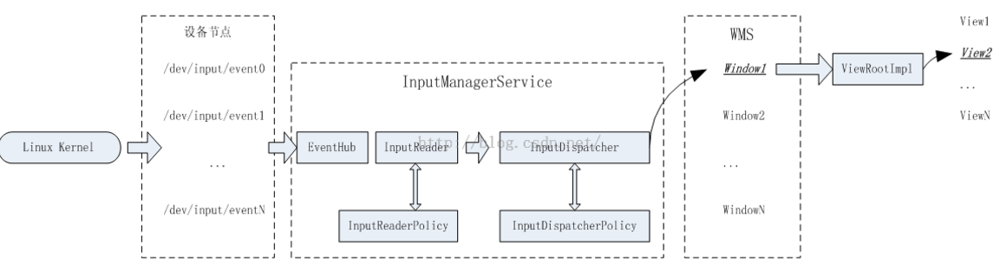
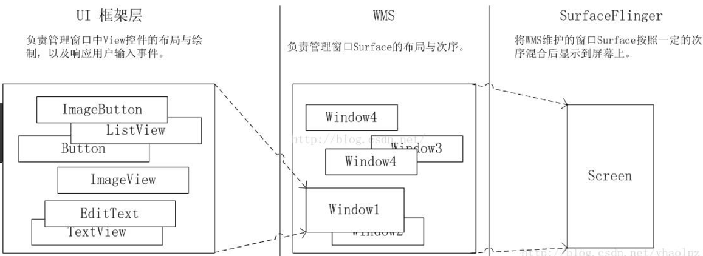
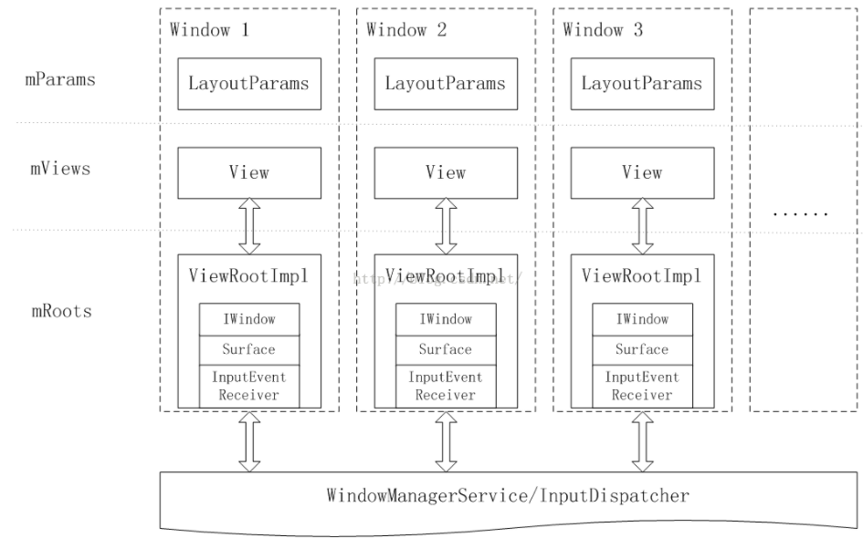
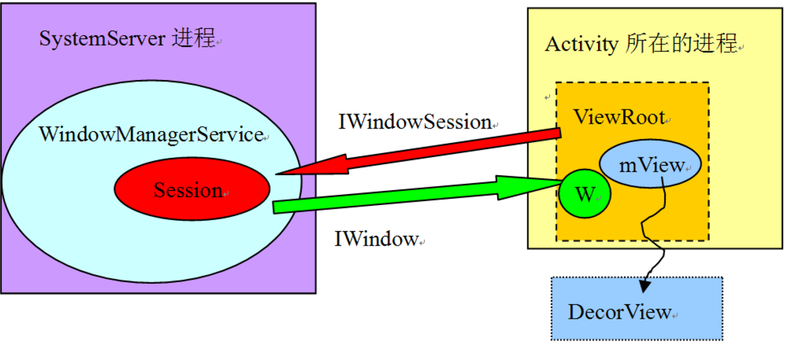

### 什么是Window

Window是View的载体，持有一个Surface实例来绘制各种UI元素，并可以响应用户的输入事件。

Window的类型：

- 应用Window，对应于一个Activity，
- 子WIndow，需要附属在特定的Window中，如一些常见的Dialog。
- 系统Window，需要声明权限才能创建，如Toast和ANR警告对话框

    `<uses-permission android:name="android.permission.SYSTEM_ALERT_WINDOW"/>`
    `layoutParams.type = WindowManager.LayoutParams.TYPE_SYSTEM_ERROR;`
### WindowManagerService

#### 重要成员

- mInputManger:`InputManagerService`。用于管理每个窗口的输入事件通道以及向通道上派发事件。
- mChoreographer:`Choreographer`。功能类似于Handler，但处理消息的时机是由VSYNC来触发的。WMS使用Choreographer来驱动窗口动画，屏幕旋转动画。
- mPolicy:`WindowPolicyManager`。WMS的首席顾问。
- mTokenMap:`HashMap`。保存所有WindowToken，用于窗口管理。

> WindowToken的意义：
>
> 1. 在WMS对窗口管理的过程中，用WindowToken指代一个应用组件，WindowToken将属于同一个应用组件的Window组织在一起。
> 2. WindowToken具有令牌的作用。WindowToken由应用组件或客户端负责向WMS声明并持有。应用组件在需要添加新的窗口时，必须提供WindowToken以表明自己的身份，但添加系统窗口时不需要提供WindowToken，但需要申请权限。
> 3. 对于应用组件或客户端来说，Token仅仅是一个Binder对象而已。
> 4. 在Activity启动过程中，AMS将ActivityRecord.appToken向WMS声明为Activity的WindowToken，并且将其传给即将启动的Activity。AMS通过ActivityRecord表示一个Activity，AMS可以通过ActivityRecord的appToken和WMS来操纵Activity的窗口绘制。比如，AMS将Task切换到前台或后台，除了要调整ActivityRecord在ActivityStack中的顺序，还要调用WMS的相关接口移动AppWindowToken在mAppTokens中的顺序，以保证两者的顺序一致。

- mWindowMap:`HashMap<IBinder,WindowState>`。保存了所有窗口的状态信息，key是IWindow的Bp端。而IWindow的Bn端即IWindow.Stub提供了很多与窗口管理相关通知的回调，例如尺寸变化，焦点变化等。
- mSession:`List<Session>`。保存了所有当前想向WMS寻求窗口管理服务的客户端，Session是进程唯一的。

#### 窗口创建

- 获取IWindowSession和WMS实例。客户端通过IWindowSession向WMS发送请求。
- 创建并初始化WindowManager.LayoutParams。其中最重要的是type属性，它是WMS对多个窗口进行ZOrder排序的依据。
- 向WMS添加一个WindowToken，后续添加的应用窗口都需要带上这个Token。
- 向WMS添加窗口。调用IWindowSession.add方法。向WMS添加一个窗口之后，其仅仅是将它在WMS中注册而已。
- 向WMS申请对窗口进行重新布局，调用IWindowSession.relayout方法（对应于WMS的relayoutWindow方法），根据客户端提供的布局参数为窗口创建Surface，并将其放置在屏幕的指定位置。
- 在WMS的relayoutWindow中，修改指定窗口的布局参数，然后调用performLayoutAndPlaceSurfacesLocked遍历所有窗口并对它们进行重新布局。
- 客户端有了Surface之后，就可以进行窗口绘制了。

#### 输入系统



- InputDispatcher保管了来自WMS的所有窗口的信息，其收到来自InputReader的输入事件后，会在其保管的窗口中寻找合适的窗口，并将事件派发给此窗口。
- WMS找到派发事件的目标Window所对应的IWindow对象，调用这个IWindow对象的dispatchKey。IWindow对象的Bn端位于ViewRoot中，ViewRoot再根据内部View的位置信息找到真正处理这个事件的View。

#### WMS的作用和地位



- UI框架层为在Surface上绘制的UI元素以及响应输入事件
- WMS主要工作是管理Surface的分配，Window的层级顺序等
- SurfaceFlinger负责将多个Surface混合并渲染输出到屏幕上

### WindowManager

WIndowManager是一个继承自ViewManger的接口。ViewManager定一个了三个函数，分别用于添加/删除一个控件，以及更新控件的布局。
``` java
public interface ViewManager
{
    public void addView(View view, ViewGroup.LayoutParams params);
    public void updateViewLayout(View view, ViewGroup.LayoutParams params);
    public void removeView(View view);
}
```

鉴于窗口布局和控件布局的一致性，WindowManger和ViewGroup都继承并实现了ViewManger接口，可以把WindowManger设想成一个ViewGroup，其区域为整块屏幕，其中的各个窗口就是一个一个的View。WindowManger通过WMS将这些View按照其布局参数显示到屏幕的特定位置。

#### WindowManger的实现类

WindowManger的实现者是WindowMangerImpl，WindowMangerImpl除了保存窗口所属的屏幕以及父窗口，有关窗口管理的接口方法都委托给WindowMangerGlobal的实例来完成。

WindowMangerGlobal在一个进程中只有一个实例，它有三个数组统一挂历整个进程中所有窗口的信息，这些信息包括View，LayoutParam和ViewRoot三个元素。WindowMangerGlobal将窗口的创建，销毁和布局更新等操作交给相应的ViewRootImpl来完成。

调用ViewRootImpl.setView方法，将View交给ViewRootImpl进行托管。这个动作将使得ViewRootImpl向WMS添加窗口，获取Surface以及重绘等一系列操作。这一步是控件能够作为一个窗口显示在屏幕上的根本原因。



### ViewRoot

ViewRootImpl实现了ViewParent接口，是整个控件树的根部。它负责与WMS直接通信以创建窗口和更新窗口，负责管理Surface，负责触发View的测量，布局与绘制，同时也是输入事件的中转站，它是WindowMangerGlobal的实际执行者。

ViewRootImpl继承了Handler类，重写了handleMessage方法。Android的UI操作不是线程安全的，而且很多操作也是建立在单线程的假设之上。采用单线程模型的目的是降低系统的复杂度，并降低锁的开销。

#### 重要成员

- mWindowSession:`IWindowSession`。它是ViewRootImpl和WMS的通信代理
- mThread:`Thread`。UI线程
- mDirty:`Rect`。窗口中的无效区域（需要重绘的区域）
- mWindow:`W`。W是IWIndow.Stub的子类。在WMS中作为新窗口的ID，并接收来自WMS的回调。
- mSurface。在WMS通过relayoutWindow为其分配一块Surface之前尚不能使用。

#### setView

```java
    public void setView(View view, WindowManager.LayoutParams attrs, View panelParentView) {
        synchronized (this) {
            if (mView == null) {
                mView = view;
                int res; /* = WindowManagerImpl.ADD_OKAY; */
                requestLayout();
                try {
                    res = mWindowSession.addToDisplay(mWindow, mSeq, mWindowAttributes,
                            getHostVisibility(), mDisplay.getDisplayId(),
                            mAttachInfo.mContentInsets, mAttachInfo.mStableInsets,
                            mAttachInfo.mOutsets, mInputChannel);
                } catch (RemoteException e) {...}
        }
    }
```

ViewRoot的setView做了三件事：

- 保存传入的View
- 调用requestLayout，内部其实就是往Handler发送一个DO_TRAVERSAL消息，这个消息最终会在ViewRoot的handleMessage方法中执行
- 调用IWindowSession的add方法，mWindow就是IWindow.Stub类型，向WMS添加窗口。

#### perforTraversals

ViewRootImpl在其创建过程中通过requestLayout向主线程发送一条触发遍历操作的消息，ViewRootImpl的performTraversals会被调用。

- 预测量阶段。这个阶段，View及其子类的onMeasure方法会沿着控件树依次得到回调，计算出控件树显示其内容所需的尺寸，即期望的窗口尺寸。
- 布局窗口阶段。根据预测量的结果，通过IWindowSession.relayout方法向WMS请求调整窗口的尺寸等属性，并将布局结果返回给ViewRootImpl。
- 最终测量阶段。以窗口的实际尺寸对控件进行最终测量。这个阶段，View及其子类的onMeasure方法会沿着控件树依次得到回调。
- 布局控件树阶段。完成最终测量之后便可以对控件树进行布局。这个阶段中，View的onLayout方法会被调用。
- 绘制阶段。确定了控件的位置与尺寸之后，便可以对控件树进行绘制。这个阶段中，View及其子类的onDraw方法将会被回调。

#### 与 WMS的关系



### Surface

Surface是一块画布，App可以通过Canvas或OpenGL在其上作画。SurfaceFlinger将多块Surface的内容按照特定的顺序Z-Order进行混合并输入到FrameBuffer（存储图形/图像帧数据的缓冲）。窗口绘制过程：

1. 通过Surface.lock()函数获取可以在其上作画的Canvas实例
2. 使用Canvas实例进行作画
3. 通过Surface.unlockCanvasAndPost()函数提交绘制结果

