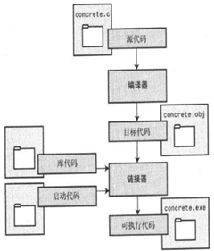

## 概览

### 编译过程



### 头文件

在C的语法里，函数必须先定义后使用，或者在使用前先声明，后边再定义。.h头文件包含函数的声明，实现文件在同名的.c文件。编译时，编译器一次只能处理一个文件，它会依次将所有的.c文件编译成目标文件，然后链接器将它们链接成可执行程序。如果不引入头文件，而是写成`#include "xxx.c"`，这样虽然编译时不会出错，但链接时就会出错了，因为这样会重复定义了（multiple definition）。

## printf()和scanf()函数

转换说明符.png)

```c
    char str[30];
    int age;
    float assets;
    scanf("%d %f", &age, &assets);
    scanf("%s", str);
    printf("%d,%f", age, assets);
    printf("Input string is %s", str);
```

常用的字符串输入输出函数有：gets，puts等等。

## 指针和数组

```c
    char str[] = "Hello World!";
    printf("%s\n", str == &str[0] ? "true" : "false");// 相同的地址
    printf("%s\n", str + 1 == &str[1] ? "true" : "false");// 相同的地址
    printf("%s\n", *(str + 1) == str[1] ? "true" : "false");// 相同的值
```

**const 指针与指向const的指针**

const 所修饰的右边就是const类型的。

```c
    /*定义指向const的指针（指针指向的内容不能被修改）*/
    const int *p1;
    int const *p2;
    /*定义const指针(由于指针本身的值不能改变所以必须得初始化）*/
    int *const p3;
    /*指针本身和它指向的内容都是不能被改变的所以也得初始化*/
    const int *const p4;
    int const *const p5;
```

**二维数组与指针**

```c
    int a[4][2] = {
            {2, 4},
            {6, 8},
            {1, 3},
            {5, 7}
    };
    printf("%d", *(*(a + 2) + 1));
```

| `a+2`             | 二维数组的第三个子数组的地址                         |
| ----------------- | -------------------------------------- |
| `*(a+2)`          | 二维数组的第三个子数组，包含2个int的数组，也是这个数组第一个元素的首地址 |
| `*(a + 2) + 1`    | 二维数组的第三个子数组的第二个元素的地址                   |
| `*(*(a + 2) + 1)` | 二维数组的第三个子数组的第二个元素                      |


## 内存管理

### 存储类

C是没有命名空间的。C使用作用域，链接和存储时期来定义5种存储类。

| 存储类       | 时期   | 作用域  | 链接   | 声明方式             |
| --------- | ---- | ---- | ---- | ---------------- |
| 自动        | 自动   | 代码块  | 空    | 代码块内             |
| 具有外部链接的静态 | 静态   | 文件   | 外部   | 所有函数之外           |
| 具有内部链接的静态 | 静态   | 文件   | 内部   | 所有函数之外，使用static  |
| 空链接       | 静态   | 代码块  | 空    | 代码块内，使用static关键字 |

```c
/*People.c*/
int vars1; // 外部链接
static int vars2; // 内部链接，外部不能访问，作用域在文件内
/*Main.c*/
extern int vars1;
// extern int vars2; // 不能访问内部链接静态变量
int run() {
    static int a = 0; // 变量a是run函数内的局部变量，但每次调用同一个函数，都是访问同一个变量。
    a++;
    return a;
}
```


### 内存分配malloc()和free()

malloc接受一个参数：所需内存字节数，然后malloc()找到可用内存中一个大小合适的块，返回那块内存第一个字节的地址。

```c
    double *items = malloc(n * sizeof(double));
```

每一次malloc分配的内存都需要调用一次free方法来释放内存。

## 结构体

内存对齐：按字对齐，假如一个字是4个字节，那么一个变量所占内存的偏移量必须是4byte的整数倍。

```c
typedef struct {
    int a;
    short b;
    char c;
} Library1;
/**
 * +-------+-------+-------+-------+
 * |               a               |
 * +-------+-------+-------+-------+
 * |       b       |   c   |  pad  |
 * +-------+-------+-------+-------+
 */

typedef struct {
    char a[3];
    short b;
    long c;// long占4个字节
    char d[3];
} Library2;
/**
 * +-------+-------+-------+-------+
 * |           a           | pad1  |
 * +-------+-------+-------+-------+
 * |       b       |     pad2      |
 * +-------+-------+-------+-------+
 * |               c               |
 * +-------+-------+-------+-------+
 * |           d           | pad3  |
 * +-------+-------+-------+-------+
 */

typedef struct {
    int a;
    char c[3];
    short b;
} Library;
/**
 * +-------+-------+-------+-------+
 * |               a               |
 * +-------+-------+-------+-------+
 * |           c           |  pad1 |
 * +-------+-------+-------+-------+
 * |       b       |     pad2      |
 * +-------+-------+-------+-------+
 */
```

## 函数指针

函数也有地址，函数的机器语言实现是由载入到内存的代码组成，指向函数的指针中保持着函数代码起始处的地址。

```c
int add(int a, int b);
int call(int (*pf)(int a, int b));
int call(int (*pf)(int, int)) {
    return pf(1, 2);
}
int main() {
    printf("%d", call(add));
    return 0;
}
```

## C预处理器

### #define

```c
#define P(x) printf("%d\n",x)
#define AVG(X, Y) (X+Y)/2
#define PI 3.14
int main() {
    P(AVG(2, 6));
    return 0;
}
```

### #include

预处理器发现`#include`指令后，就会寻找后跟的文件名并把这个文件的内容包含到当前文件中，被包含文件的文本将替换源代码文件中的`#include`指令。

| `#include <stdio.h>`       | 搜索系统目录        |
| -------------------------- | ------------- |
| `#include "hot.h"`         | 搜索当前工作目录      |
| `#include "/usr/biff/p.h"` | 搜索/usr/biff目录 |

头文件通常包含：

- 明显常量
- 宏函数
- 函数声明
- 结构模板定义
- 类型定义

