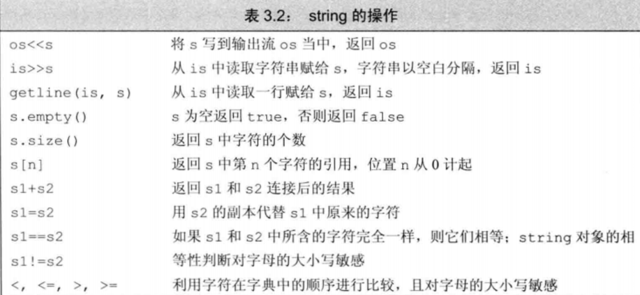
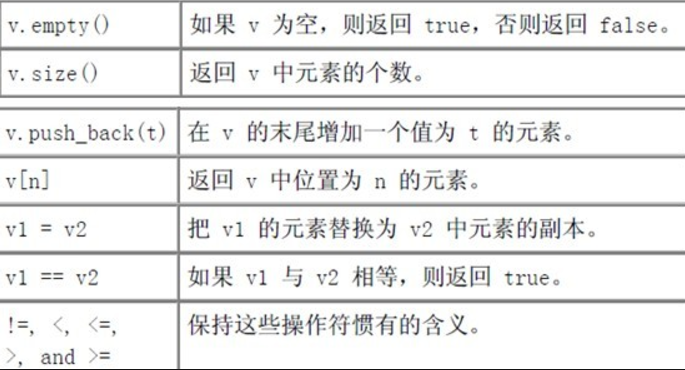

## struct

C里面的struct结构体是用来定义复杂的数据类型；而C++里也保留了struct关键字，但C++里的struct关键字相当于用来声明类类型，而class和struct关键字定义类的唯一差别在于默认访问级别：默认情况下struct的成员为public，class的成员为private。

## 标准库类型

### string



任何存储string的size操作结果的变量必须为string::size_type类型。不要把size的返回值赋值给一个int变量。

C风格的字符串是指那种以'\0'结尾的字符串，比如字符串字面量。而string.h是C语言提供的标准库来处理C风格字符串，cstring是C++的版本。

|       API        | 功能                                    |
| :--------------: | :------------------------------------ |
|    strlen(s)     | 返回s的长度，不包括'\0'                        |
|  strcmp(s1,s2)   | 标胶s1和s2是否相同。若相等，返回0；若大于，返回正数；若小于，返回负数 |
|  strcat(s1,s2)   | 将s2连接到s1后，返回s1                        |
|  strcpy(s1,s2)   | 将s2复制给s1，返回s1                         |
| strncat(s1,s2,n) | 将s2的前n个字符连接到s1后面，返回s                  |
| strncpy(s1,s2,n) | 将s2的前n个字符复制给s1，返回s1                   |

建议使用标准库类型string，尽量避免使用C风格字符串。


### vector



```c++
    for (vector<string>::size_type i = 0; i != text.size(); ++i) {
        cout << text[i] << endl;
    }
```

## 类

```c++
#include <string>
class Sales_item {
public:
    double avg_price();
    bool is_same_item(const Sales_item &item);
    Sales_item(std::string name) : units_sold(0), revenue(0), name(name) {}
private:
    std::string name;
    unsigned units_sold;
    double revenue;
};
double Sales_item::avg_price() {
    return units_sold == 0 ? 0 : revenue / units_sold;
}
bool Sales_item::is_same_item(const Sales_item &item) {
    return item.name == name;
}
```

### 构造函数

**成员初始化次序**

构造函数初始化列表仅指定用于初始化成员的值，并不指定这些初始化执行的次序。成员被初始化的次序就是定义成员的次序。

**类类型的数据成员的初始化**

初始化类类型的成员时，要指定实参并传递给成员类型的一个构造函数。可以使用该类型的任意构造函数。

**默认构造函数**

如果一个类定义了一个构造函数，编译器就不会再生成默认构造函数。只有当一个类没有定义构造函数时，编译器才会自动生成一个默认构造函数。

**抑制由构造函数定义的隐式转换**

将构造函数声明为explicit，来防止隐式转换时使用构造函数。单形参构造函数应该声明为explicit。

**复制构造函数**

复制构造函数是一种特殊构造函数，具有单个形参，该形参是对该类类型的引用。当定义一个新对象并用一个同类型的对象对它进行初始化时，将显示使用复制构造函数。当将该类型的对象传递给函数或从函数返回该类型的对象时，将隐式使用复制构造函数。

```c++
    Sales_item(const Sales_item &item);
```

- 当形参非引用类型的时候，将复制实参的值。以非引用类型作返回值时，将返回return语句中的值的副本。当形参或返回值为类类型时，由复制构造函数进行复制。
- 如果将复制构造函数定义成private，那么类将不允许复制。

### 赋值运算符函数

```c++
Sales_item &Sales_item::operator=(const Sales_item &item) {
    cout << "operator=" << endl;
    if (this != &item) {
        // 执行深拷贝
    }
    return *this;
}
```

调用时机：

```c++
    Sales_item item;
    Sales_item item1 = item; // 不会调用赋值运算符函数
    Sales_item item2;
	item2 = item; // 会调用赋值运算符函数
```

原则：当一个类需要深拷贝时，需要定义复制构造函数，重载赋值运算符和自定义析构函数。

参考：[一文说尽C++赋值运算符重载函数(operator=)](http://www.cnblogs.com/zpcdbky/p/5027481.html)

### 析构函数

```c++
~Sales_item();
Sales_item::~Sales_item() {s
}
```

局部变量在超过作用域时会自动调用析构函数；当对象的引用或指针超出作用域时，不会运行析构函数，只有删除指向动态分配对象的指针才会运行析构函数。

### 友元

友元机制允许一个类将其非公有成员的访问权授予指定的函数或类。友元的声明以关键字friend开始。

```C++
class Screen {
  friend class Window_Mgr; // 友元类
  friend Window_Mgr& Window_Mgr::relocate(Window_Mgr::index,Window_Mgr::index,Screen&); // 友元函数
}
```

