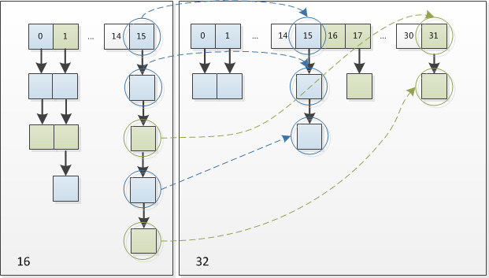

# HashMap
1. 有两个参数可以影响*HashMap*的性能：初始容量（inital capacity）和负载系数（load factor）。初始容量指定了初始`table`的大小，负载系数用来指定自动扩容的临界值。当`entry`的数量超过`capacity*load_factor`时，容器将自动扩容并重新哈希。|Capacity就是bucket的大小，Load factor就是bucket填满程度的最大比例。如果对迭代性能要求很高的话不要把`capacity`设置过大，也不要把`load_factor`设置过小。当bucket中的entries的数目大于`capacity*load factor`时就需要调整bucket的大小为当前的2倍。|
2. 将对向放入到*HashMap*或*HashSet*中时，有两个方法需要特别关心：`hashCode()`和`equals()`。**hashCode()方法决定了对象会被放到哪个bucket里，当多个对象的哈希值冲突时，equals()方法决定了这些对象是否是“同一个对象”**。所以，如果要将自定义的对象放入到`HashMap`或`HashSet`中，需要@Override `hashCode()`和`equals()`方法。
3. 方法剖析

- get()

`get(Object key)`方法根据指定的`key`值返回对应的`value`，该方法调用了`getEntry(Object key)`得到相应的`entry`，然后返回`entry.getValue()`。因此`getEntry()`是算法的核心。

算法思想是首先通过`hash()`函数得到对应`bucket`的下标，然后依次遍历冲突链表，通过`key.equals(k)`方法来判断是否是要找的那个`entry`。


上图中`hash(k)&(table.length-1)`等价于`hash(k)%table.length`，原因是*HashMap*要求`table.length`必须是2的指数，因此`table.length-1`就是二进制低位全是1，跟`hash(k)`相与会将哈希值的高位全抹掉，剩下的就是余数了。

```java
//getEntry()方法
final Entry<K,V> getEntry(Object key) {
    ......
    int hash = (key == null) ? 0 : hash(key);
    for (Entry<K,V> e = table[hash&(table.length-1)];//得到冲突链表
         e != null; e = e.next) {//依次遍历冲突链表中的每个entry
        Object k;
        //依据equals()方法判断是否相等
        if (e.hash == hash &&
            ((k = e.key) == key || (key != null && key.equals(k))))
            return e;
    }
    return null;
}
```

- put()

`put(K key, V value)`方法是将指定的`key, value`对添加到`map`里。该方法首先会对`map`做一次查找，看是否包含该元组，如果已经包含则直接返回，查找过程类似于`getEntry()`方法；如果没有找到，则会通过`addEntry(int hash, K key, V value, int bucketIndex)`方法插入新的`entry`，插入方式为**头插法**。

```java
//addEntry()
void addEntry(int hash, K key, V value, int bucketIndex) {
    if ((size >= threshold) && (null != table[bucketIndex])) {
        resize(2 * table.length);//自动扩容，并重新哈希
        hash = (null != key) ? hash(key) : 0;
        bucketIndex = hash & (table.length-1);//hash%table.length
    }
    //在冲突链表头部插入新的entry
    Entry<K,V> e = table[bucketIndex];
    table[bucketIndex] = new Entry<>(hash, key, value, e);
    size++;
}
```
- resize

当超过限制的时候会resize，然而又因为我们使用的是2次幂的扩展(指长度扩为原来2倍)，所以，元素的位置要么是在原位置，要么是在原位置再移动2次幂的位置。因此元素在重新计算hash之后，因为n变为2倍，那么n-1的mask范围在高位多1bit(红色)，我们在扩充HashMap的时候，不需要重新计算hash，只需要看看原来的hash值新增的那个bit是1还是0就好了，是0的话索引没变，是1的话索引变成“原索引+oldCap”。



既省去了重新计算hash值的时间，而且同时，由于新增的1bit是0还是1可以认为是随机的，因此resize的过程，均匀的把之前的冲突的节点分散到新的bucket了。

4. hash函数


```java
static final int hash(Object key) {
    int h;
  	// 扰动函数：把hashCode的高16位移动到低16位后与自身进行异或
    return (key == null) ? 0 : (h = key.hashCode()) ^ (h >>> 16);
}
```

如果传过来的key是null，则插入的数组下标是0。

5. Entry对象里缓存了对应key的再hash值。如果散列值不匹配，也不必检验key对象的等同性了。

6. 参考

- http://blog.csdn.net/ns_code/article/details/36034955
- http://blog.jobbole.com/101493/
- http://yikun.github.io/2015/04/01/Java-HashMap%E5%B7%A5%E4%BD%9C%E5%8E%9F%E7%90%86%E5%8F%8A%E5%AE%9E%E7%8E%B0/
- [Java进阶（六）从ConcurrentHashMap的演进看Java多线程核心技术](http://www.jasongj.com/java/concurrenthashmap/)


# HashMap和HashTable的区别

http://www.importnew.com/7010.html

- HashMap可以接收null的key,HashTable存入null key后，以后可能会抛NullPointException。
- HashMap的迭代器(Iterator)是fail-fast迭代器，而Hashtable的enumerator迭代器不是fail-fast的。所以当有其它线程改变了HashMap的结构（增加或者移除元素），将会抛出ConcurrentModificationException。
- HashTable是线程安全的也是synchronized，所以在单线程环境下它比HashMap要慢。
- HashTable直接使用key的hashCode方法返回的hash值；HashMap需要调用hash方法对key的hashCode再hash。
- HashTable在不指定容量的情况下的默认容量为11，而HashMap为16，Hashtable不要求底层数组的容量一定要为2的整数次幂，而HashMap则要求一定为2的整数次幂。因此它们求出table的index的方式是不一样的，hashtable是与table的容量取模，HashMap是通过与table的容量减一做与&操作。
- hashtable的默认容量为11，hashmap的默认容量为16.


