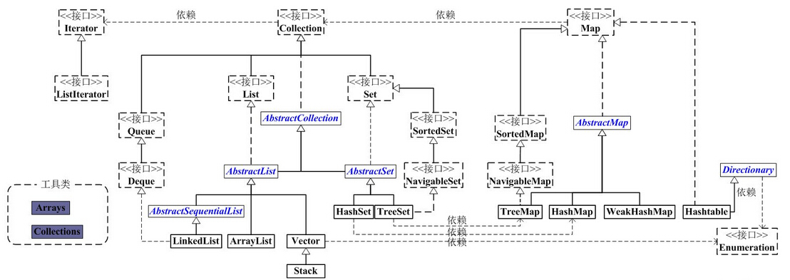

### 集合框架

集合类主要分为两大类：Collection和Map。

**Collection**是List、Set等集合高度抽象出来的接口，它包含了这些集合的基本操作，它主要又分为两大部分：List和Set。

Collection保存单一元素，而Map保存相关联的键值对。

**List**接口通常表示一个列表（数组、队列、链表、栈等），其中的元素可以重复，常用实现类为ArrayList和LinkedList，另外还有不常用的Vector。另外，LinkedList还是实现了Queue接口，因此也可以作为队列使用。

**Set**接口通常表示一个集合，其中的元素不允许重复（通过hashcode和equals函数保证），常用实现类有HashSet和TreeSet，HashSet是通过Map中的HashMap实现的，而TreeSet是通过Map中的TreeMap实现的。另外，TreeSet还实现了SortedSet接口，因此是有序的集合（集合中的元素要实现Comparable接口，并覆写Compartor函数才行）。

### 关于Java容器类的知识点

1# Collection不支持随机访问，没有get和set方法，只能用迭代器访问元素。