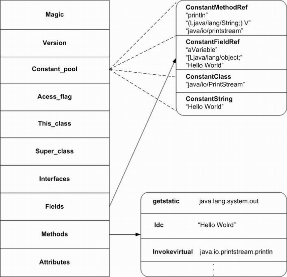
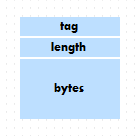
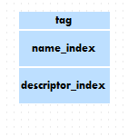
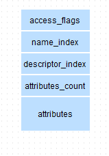
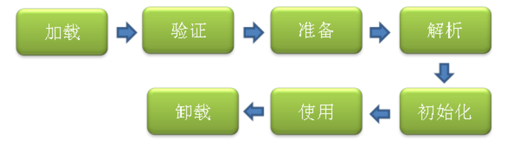
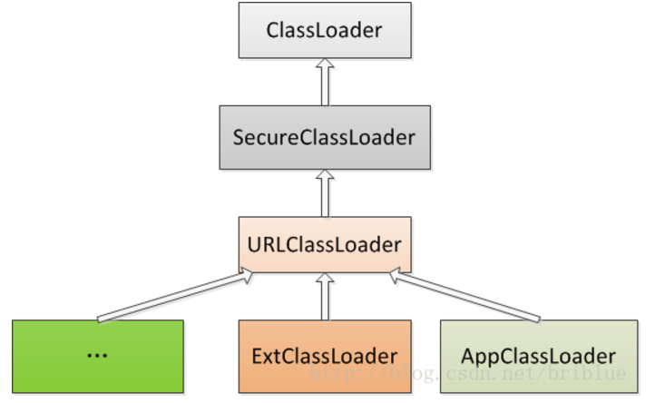
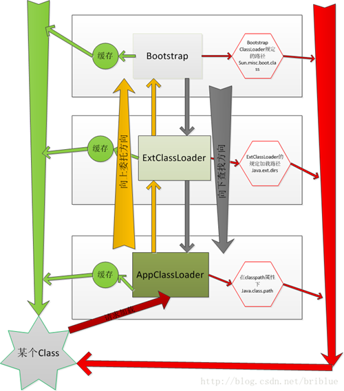

## Class文件结构

我们的Java源文件， 在被编译之后， 每个类（或者接口）都单独占据一个class文件， 并且类中的所有信息都会在class文件中有相应的描述， 由于class文件很灵活， 它甚至比Java源文件有着更强的描述能力。使用命令`javap -v `+类名可以反编译Class文件，查看字节码。

class文件中的信息是一项一项排列的， 每项数据都有它的固定长度， 有的占一个字节， 有的占两个字节， 还有的占四个字节或8个字节， 数据项的不同长度分别用u1, u2, u4, u8表示， 分别表示一种**数据项**在class文件中占据一个字节， 两个字节， 4个字节和8个字节。 可以把u1, u2, u3, u4看做class文件数据项的“类型” 。所有表习惯性以"_info"结尾，用于描述有层次关系的复合结构的数据。



| **类型**         | **名称**              | **数量**                  | 解析                                       |
| -------------- | ------------------- | ----------------------- | ---------------------------------------- |
| u4             | magic               | 1                       | 魔数 0xCAFEBABE                            |
| u2             | minor_version       | 1                       | 次版本号                                     |
| u2             | major_version       | 1                       | 主版本号                                     |
| u2             | constant_pool_count | 1                       | 常量池容量计数值                                 |
| cp_info        | constant_pool       | constant_pool_count - 1 | 常量池                                      |
| u2             | access_flags        | 1                       | 定义的是类还是接口；类或接口的访问标志（ public，private, abstract ） |
| u2             | this_class          | 1                       | 指向表示该类全限定名称的字符串常量的指针                     |
| u2             | super_class         | 1                       | 指向表示父类全限定名称的字符串常量的指针                     |
| u2             | interfaces_count    | 1                       |                                          |
| u2             | interfaces          | interfaces_count        | 一个指针数组，存放了该类或父类实现的所有接口名称的字符串常量的指针        |
| u2             | fields_count        | 1                       |                                          |
| field_info     | fields              | fields_count            | 对类或接口中声明的字段进行了细致的描述，不包括继承自父类的字段          |
| u2             | methods_count       | 1                       |                                          |
| method_info    | methods             | methods_count           | 对类或接口中声明的方法进行了细致的描述，不包括继承自父类的方法          |
| u2             | attribute_count     | 1                       |                                          |
| attribute_info | attributes          | attributes_count        |                                          |

### 常量池

常量池是Class文件的资源仓库，主要存放两大类常量：**字面量和符号引用**。字面量如文本字符串，声明为final的常量值等。

#### 符号引用

- 类和接口的全限定名

源文件中的全新定名是包名加类名， 包名的各个部分之间，包名和类名之间， 使用点号分割。 如Object类， 在源文件中的全限定名是java.lang.Object 。 而class文件中的全限定名是将点号替换成“/” 。

- 字段名称和描述符
- 方法名称和描述符

所有的类型在**描述符**中都有对应的字符或字符串来对应。

| **基本数据类型和void类型** | **类型的对应字符** |
| ----------------- | ----------- |
| byte              | B           |
| char              | C           |
| double            | D           |
| float             | F           |
| int               | I           |
| long              | J           |
| short             | S           |
| boolean           | Z           |
| void              | V           |

**引用类型**的对应字符串（注意， 引用类型在描述符中使用一个字符串做对应） ， 这个字符串的格式是：`“L” + 类型的全限定名 + “;”  `。如Object在描述符中的对应字符串是： Ljava/lang/Object;

在class文件的描述符中， **数组类型**中每个维度都用一个 [ 代表， 数组类型整个类型的对应字符串的格式如下：`若干个“[”  +  数组中元素类型的对应字符串`。

**方法**的描述符包括所有参数的类型列表和方法返回值。 它的格式是这样的：`(参数1类型 参数2类型 参数3类型 ...)返回值类型`。如方法`int read(byte[] b, int off, int len )`的描述符是：`([BII)I`。

**类的构造方法的方法名**使用字符串 `<init>` 表示， 而静态初始化方法的方法名使用字符串 `<clinit>` 表示。 除了这两种特殊的方法外， 其他普通方法的方法名， 和源文件中的方法名相同。

常量池对于类加载和动态连接的实现有举足轻重的作用。

参考：http://blog.csdn.net/zhangjg_blog/article/details/21487287


#### 常量池中的数据项

常量池中的数据项是通过索引来引用的， 常量池中的各个数据项之间也会相互引用。

**CONSTANT_Utf8_info**

一个`CONSTANT_Utf8_info`是一个CONSTANT_Utf8类型的常量池数据项， 它存储的是一个常量字符串。 常量池中的所有字面量几乎都是通过`CONSTANT_Utf8_info`描述的。


tag是指数据项类型，length表示常量大小，bytes是存储的内容。

`CONSTANT_Utf8_info`可包括的字符串主要以下这些：

- 程序中的字符串常量
- 常量池所在当前类（包括接口和枚举）的全限定名
- 常量池所在当前类的直接父类的全限定名
- 常量池所在当前类型所实现或继承的所有接口的全限定名
- 常量池所在当前类型中所定义的字段的名称和描述符
- 常量池所在当前类型中所定义的方法的名称和描述符
- 由当前类所引用的类型的全限定名
- 由当前类所引用的其他类中的字段的名称和描述符
- 由当前类所引用的其他类中的方法的名称和描述符
- 与当前class文件中的属性相关的字符串， 如属性名等

**CONSTANT_NameAndType**

从这个数据项的名称可以看出， 它描述了两种信息，第一种信息是名称（Name）， 第二种信息是类型（Type） 。 这里的名称是指方法的名称或者字段的名称， 而Type是广义上的类型， 它其实描述的是字段的描述符或方法的描述符。 



name_index， 指向常量池中的一个`CONSTANT_Utf8_info`， 这个`CONSTANT_Utf8_info`中存储的就是方法或字段的名称。 name_index以后的两个字节叫做descriptor_index， 它指向常量池中的一个`CONSTANT_Utf8_info`， 这个`CONSTANT_Utf8_info`中存储的就是方法或字段的描述符。

```
 #9 = Utf8               s
#10 = Utf8               Ljava/lang/String;
#21 = NameAndType        #9:#10         // s:Ljava/lang/String;
```

参考：http://blog.csdn.net/zhangjg_blog/article/details/21557357

### 类字段描述

field_info 的结构如下：


例如源文件中有类字段：

```java
    private int age;
    public String s = "Hello";
```

那么字节码的表示成：

```
  private int age;
    descriptor: I
    flags: ACC_PRIVATE

  public java.lang.String s;
    descriptor: Ljava/lang/String;
    flags: ACC_PUBLIC
```

### 类方法描述

method_info的结构与field_info类似：



任何实例方法都可以通过this关键字访问到此方法所属的对象。通过Javac编译的时候把对this关键字的访问转变为对一个普通方法参数的访问，然后在虚拟机调用实例方法时自动传入此参数而已。因此非静态方法的Code属性的局部变量表和参数列表至少有一个变量，指向实例的引用。


## 类加载

### 类加载的时机

类的生命周期包括：加载，验证，准备，解析，初始化，使用和卸载7个阶段。其中验证，准备和解析统称为连接。



1. 遇到new，getstatic，putstatic或invokestatic这4条指令时，如果类没有被初始化过则需要先初始化类。例如：使用new关键字实例化对象的时候，读取或设置一个类的静态字段（被final修饰或已在编译期放入常量池的字段除外），以及调用一个类的静态方法的时候。
2. 使用反射调用类方法时，需要先加载类。
3. 当初始化一个类时，发现其父类还没被加载，则先加载其父类的初始化。
4. 当虚拟机启动时，需要先加载主类（包含main方法那个类）。

### 类加载的过程

#### 加载

在加载阶段，虚拟机需要完成三件事：

1. 通过一个类的全限定名来获取定义此类的二进制字节流
2. 将字节流所描述的静态存储结构转换成方法区的运行时结构。
3. 在方法区中生成代表该类的java.lang.Class对象，作为方法区这个类的各种数据的访问入口。

#### 验证

验证主要工作分4阶段：

1. 文件格式验证：验证是否符合Class文件格式规范；
2. 元数据验证：验证是否符合Java语言规范；
3. 字节码验证：验证数据流和控制流分析；
4. 符号引用验证：验证符号引用转化为直接引用。

#### 准备

为类变量（static变量）分配内存（在方法区），并为变量设置零值（final常量除外）。

#### 解析

虚拟机将常量池内的符号引用替换成直接引用的过程。

- **符号引用(Symbolic Reference)**：以一组符号来描述引用目标，符号可以是任意形式的字面量。只能要准确定位到目标即可。符号引用与虚拟机的内存布局无关，引用的目标也不一定存在内存。这样兼容性强，各种虚拟机只需要能接受符号引用即可。
- **直接引用(Direct Reference)**：直接引用就是指向目标的指针、相对偏移量或者能简介定位到目标的句柄。直接引用和虚拟机内存布局息息相关。直接引用的目标必然存在与内存中。

#### 初始化

执行类构造器`<clinit>()`方法。`<clinit>()`方法是有编译器自动收集类中的所有类变量的赋值动作的静态语句块中的语句合并产生的。静态语句块中只能访问到定义在静态语句块之间的变量。初始化被延迟到了对静态方法或者非常数静态域进行首次引用时才执行。调用Class.forName方法会导致类的加载和初始化。

如果一个static域而不是final的，那么在对它的访问前，要先进行链接（为这个域分配存储空间）和初始化，因为它不属于编译期常量。

```java
import java.util.Random;
public class Main {
    public static Random rand = new Random();

    static class ClassA {
        public static final int staticFinal = 1; // 属于编译期常量，不会直接导致类的初始化
        public static final int staticFinalNotConst = Main.rand.nextInt(100); // 不属于编译期常量

        static {
            System.out.println("ClassA was Initializing");
        }
    }

    static class ClassB {
        public static int staticNonFinal = 2;

        static {
            System.out.println("ClassB was Initializing");
        }
    }

    static class ClassC {
        public static int staticNonFinal = 3;

        static {
            System.out.println("ClassC was Initializing");
        }
    }

    public static void main(String[] args) throws ClassNotFoundException {
        System.out.println(ClassA.staticFinal); // ClassA未被初始化
        System.out.println(ClassA.staticFinalNotConst); // ClassA被初始化
        System.out.println(ClassB.staticNonFinal); // ClassB 被初始化
        Class<?> classC = Class.forName("Main$ClassC"); // ClassC被加载和初始化
        System.out.println("After calling Class.forName, ClassC was Initializing.");
        System.out.println(ClassC.staticNonFinal); // ClassC 已被初始化
        /**
         * 输出：
         1
         ClassA was Initializing
         82
         ClassB was Initializing
         2
         ClassC was Initializing
         ClassC was not initializing
         3
         */
    }
}
```


### 类加载器 ClassLoader

http://blog.csdn.net/briblue/article/details/54973413

#### Java自带的ClassLoader

Java系统自带了三个ClassLoader：Bootstrap CLassloder， Extention ClassLoader，AppClassLoader。

其中Bootstrap CLassloder是用C++写的，其余两个用Java来实现，属于Launcher的内部类，它们的继承关系如下：



- **Bootstrap ClassLoader** 最顶层的加载类，主要加载核心类库，%JRE_HOME%\lib下的rt.jar、resources.jar、charsets.jar和class等。另外需要注意的是可以通过启动jvm时指定-Xbootclasspath和路径来改变Bootstrap ClassLoader的加载目录。比如`java -Xbootclasspath/a:path`被指定的文件追加到默认的bootstrap路径中。我们可以打开我的电脑，在上面的目录下查看，看看这些jar包是不是存在于这个目录。 
- **Extention ClassLoader** 扩展的类加载器，加载目录%JRE_HOME%\lib\ext目录下的jar包和class文件。还可以加载`-D java.ext.dirs`选项指定的目录。 
- **App ClassLoader也称为SystemAppClass** 加载当前应用的classpath的所有类。

#### 双亲委派模型

每一个ClassLoader都有一个父ClassLoader，可以通过`getParent`方法来得到。AppClassLoader的parent是ExtClassLoader，而ExtClassLoader为null，因为BootstrapClassLoader是C++对象，无法被Java对象引用。

步骤：

1. 一个AppClassLoader查找资源时，先看看缓存是否有，缓存有从缓存中获取，否则委托给父加载器（ExtClassLoader）。 
2. 递归，重复第1部的操作。 
3. 如果ExtClassLoader也没有加载过，则由Bootstrap ClassLoader出面，它首先查找缓存，如果没有找到的话，就去找自己的规定的路径下，也就是`sun.mic.boot.class`下面的路径。找到就返回，没有找到，让子加载器自己去找。 
4. Bootstrap ClassLoader如果没有查找成功，则ExtClassLoader自己在`java.ext.dirs`路径中去查找，查找成功就返回，查找不成功，再向下让子加载器找。 
5. ExtClassLoader查找不成功，AppClassLoader就自己查找，在`java.class.path`路径下查找。找到就返回。如果没有找到就让子类找，如果没有子类会抛出异常。



**为什么要用双亲委派模型？**

使用双亲委派模型的好处在于Java类随着它的类加载器一起具备了一种带有优先级的层次关系。

1. **共享功能**，一些Framework层级的类一旦被顶层的ClassLoader加载过就缓存在内存里面，以后任何地方用到都不需要重新加载。
2. **隔离功能**，保证java/Android核心类库的纯净和安全，防止恶意加载。

例如类java.lang.Object，它存在在rt.jar中，无论哪一个类加载器要加载这个类，最终都是委派给处于模型最顶端的Bootstrap ClassLoader进行加载，因此Object类在程序的各种类加载器环境中都是同一个类。相反，如果没有双亲委派模型而是由各个类加载器自行加载的话，如果用户编写了一个java.lang.Object的同名类并放在ClassPath中，那系统中将会出现多个不同的Object类，程序将混乱。因此，如果开发者尝试编写一个与rt.jar类库中重名的Java类，可以正常编译，但是永远无法被加载运行。

#### 重要的方法

**loadClass()**

一般这个方法的实现的是双亲委派的逻辑：

1. 执行`findLoadedClass(String)`去检测这个class是不是已经加载过了。 
2. 执行父加载器的`loadClass`方法。如果父加载器为null，则jvm内置的加载器去替代，也就是Bootstrap ClassLoader。这也解释了ExtClassLoader的parent为null,但仍然说Bootstrap ClassLoader是它的父加载器。 
3. 如果向上委托父加载器没有加载成功，则通过`findClass(String)`查找。

```java
protected Class<?> loadClass(String name, boolean resolve)
        throws ClassNotFoundException
    {
        synchronized (getClassLoadingLock(name)) {
            // 首先，检测是否已经加载
            Class<?> c = findLoadedClass(name);
            if (c == null) {
                long t0 = System.nanoTime();
                try {
                    if (parent != null) {
                        //父加载器不为空则调用父加载器的loadClass
                        c = parent.loadClass(name, false);
                    } else {
                        //父加载器为空则调用Bootstrap Classloader
                        c = findBootstrapClassOrNull(name);
                    }
                } catch (ClassNotFoundException e) {
                    // ClassNotFoundException thrown if class not found
                    // from the non-null parent class loader
                }

                if (c == null) {
                  ...
                    //父加载器没有找到，则调用findclass
                    c = findClass(name);
                  ...
                }
            }
            if (resolve) {
                //调用resolveClass()
                resolveClass(c);
            }
            return c;
        }
    }
```

**findClass()**

JDK建议把自己类的加载逻辑写到findClass方法中，在loadClass方法的逻辑里如果父类加载失败，则会调用自己的findClass方法来完成加载，这样就可以保证自定义的ClassLoader符合双亲委派规则。

**defineClass()**

将二进制内容转换成Class对象，如果非法Class文件会抛异常。

**resolveClass()**

这个方法用来链接一个Java类，包括验证，准备，解析。

#### 自定义类加载器

```java
public class DiskClassLoader extends ClassLoader {
    private String mLibPath;
    public DiskClassLoader(String path) {
        mLibPath = path;
    }
    @Override
    protected Class<?> findClass(String name) throws ClassNotFoundException {
        String fileName = getFileName(name);
        File file = new File(mLibPath,fileName);
        try {
            FileInputStream is = new FileInputStream(file);
            ByteArrayOutputStream bos = new ByteArrayOutputStream();
            int len = 0;
            try {
                while ((len = is.read()) != -1) {
                    bos.write(len);
                }
            } catch (IOException e) {
                e.printStackTrace();
            }
            byte[] data = bos.toByteArray();
            is.close();
            bos.close();
            return defineClass(name,data,0,data.length);
        } catch (IOException e) {
            e.printStackTrace();
        }
        return super.findClass(name);
    }

    //获取要加载 的class文件名
    private String getFileName(String name) {
        int index = name.lastIndexOf('.');
        if(index == -1){ 
            return name+".class";
        }else{
            return name.substring(index)+".class";
        }
    }
}
```

#### Android中的ClassLoader

- PathClassLoader


PathClassLoader是ClassLoader的简单实现，可以用来加载系统类和应用程序中的类。

- DexClassLoader


可以加载jar/apk/dex，可以从SD卡中加载未安装的apk。

PathClassLoader和DexClassLoader都是继承自[BaseDexClassLoader](http://www.android-doc.com/reference/dalvik/system/BaseDexClassLoader.html)，两者的区别在于构造函数内。

DexClassLoader的构造器参数optimizedDirectory：类加载器把dexPath路径上的文件，进行ODEX优化到内部存储路径，该路径就是由optimizedDirectory指定的。

```java
// PathClassLoader.java
public class PathClassLoader extends BaseDexClassLoader {
    public PathClassLoader(String dexPath, ClassLoader parent) {
        super(dexPath, null, null, parent);
    }
    public PathClassLoader(String dexPath, String libraryPath,
            ClassLoader parent) {
        super(dexPath, null, libraryPath, parent);
    }
}

// DexClassLoader.java
public class DexClassLoader extends BaseDexClassLoader {
    public DexClassLoader(String dexPath, String optimizedDirectory,
            String libraryPath, ClassLoader parent) {
        super(dexPath, new File(optimizedDirectory), libraryPath, parent);
    }
}
```

参考：[Android类加载器](http://www.jianshu.com/p/b187dcc21114)


## 字节码执行引擎

### 基于栈的指令集

Javac编译器完成程序代码经过词法分析，语法分析到抽象语法树，再遍历抽象语法树生成线性的字节码指令流的过程。编译器独立于虚拟机的外部，解析器在虚拟机的内部，这是典型的桥接模式。

字节码指令大部分都是零地址指令，它们依赖操作数栈进行工作。基于栈的指令集主要优点是可移植性好，寄存器由硬件直接提供，因此程序难免会受到硬件的约束；代码更加紧凑，编译器工作更为简单，不需要考虑空间分配的问题。

栈架构指令集的主要缺点是执行速度相对来说会稍慢一些。栈实现在内存之中，频繁的栈访问也就意味着频繁的内存访问，而访存速度是比访问寄存器速度要慢不少的。

指令解析执行的概念模型参考 《深入理解Java虚拟机》p272。

http://rednaxelafx.iteye.com/blog/492667

### 常用的字节码指令

- bipush n 将一个字节作为整型n压入操作数栈
- istore_0 将操作数栈顶元素弹出，存入局部变量表的0号Slot
- aload_0 将局部变量表中的0号Slot(this引用)压入操作数栈
- invokespecial 用来调用对象实例的构造方法，私有方法和父类中的方法
- putfield 它接受一个操作数，这个操作数引用的是运行时常量池里的一个字段，在这里这个字段是simpleField。赋给这个字段的值，以及包含这个字段的对象引用，在执行这条指令的时候，都 会从操作数栈顶上pop出来。前面的aload_0指令已经把包含这个字段的对象压到操作数栈上了，而后面的bipush又把100压到栈里。最后putfield指令会将这两个值从栈顶弹出。执行完的结果就是这个对象的simpleField这个字段的值更新成了100。

参考：

http://ifeve.com/javacode2bytecode/

http://ifeve.com/javacode2bytecode2/

### 栈帧结构

栈帧是用于支持JVM进行方法调用和方法执行的数据结构。每一个栈帧都包括了局部变量表，操作数栈，动态连接，方法返回地址和一些额外的附加信息。在编译时，栈帧中需要多大的局部变量表，多深的操作数栈都已经完全确定了，并且写入到方法表的Code属性之中。

#### 局部变量表

局部变量表用于存放方法参数和方法内部定义的局部变量。局部变量表的容量以Slot为最小单位，一个Slot可以存放一个32位以内的数据类型，long和double需要两个Slot存放。

如果执行的方法是非static方法，那局部变量表中第0位索引的Slot默认是用于传递方法所属对象实例的引用（this）。

为了节省栈帧空间，局部变量表中的Slot是可以重用的。

如果一个局部变量定义了但没有赋初值是不能使用的。

#### 操作数栈

JVM解析执行字节码是基于栈结构的。比如做算术运算时是通过操作数栈来进行的，在调用其他方法时是通过操作数栈来进行参数的传递的。

### 方法调用

Class文件的编译过程中不包含传统编译中的连接步骤，一切方法调用在Class文件里面存储的都是符号引用而已，不是方法实际运行的入口地址。Java方法调用需要在类加载的解析期间，甚至到运行期间才能确定目标方法的直接引用。

#### 静态解析

在Java语言中，符合“编译器可知，运行期不可变”这个要求的方法主要有**静态方法**和**私有方法**两大类，前者与类型直接关联，后者在外部不可被访问，这两种方法都不可能通过继承或别的方式重写出其他的版本，因此它们都适合在类加载阶段进行解析。

#### 分派

**静态分派**

静态分派用于方法重载，在编译期依赖静态类型来定位方法的执行版本。

**动态分派**

1. 在方法调用指令之前，需要将对象的引用压入操作数栈
2. 在执行方法调用时，找到操作数栈顶的第一个元素所指向的对象实际类型，记作C
3. 在类型C中找到与常量池中的描述符和方法名称都相符的方法，并校验访问权限。如果找到该方法并通过校验，则返回这个方法的引用；
4. 否则，按照继承关系往上查找方法并校验访问权限
5. 如果没找到方法，则抛出java.lang.AbstractMethodError异常

为了提高动态分配时方法查找的效率，为类在方法区中建立一个虚方法表。虚方法表中存放着各个方法的实际入口地址。如果某个方法在子类中没有被重写，那子类的虚方法表里面的地址入口和父类相同的方法的入口地址一致。如果子类重写了这个方法，子类方法表中的地址将会替换为指向子类实现版本的入口地址。

JVM会为每个已加载类维护一个运行时常量池。 

## Dalvik虚拟机

dex字节码和标准Java的字节码（Class）在结构上的一个区别是dex字节码将多个文件整合成一个，这样，**除了减少整体的文件尺寸，I/O操作，也提高了类的查找速度。** 
原来每个类文件中的常量池现在由DEX文件中一个常量池来管理。 
DEX文件可以进行进一步优化。优化主要是针对以下几个方面： 

1、调整所有字段的字节序（LITTLE_ENDIAN）和对齐结构中的没一个域 
2、验证DEX文件中的所有类 
3、对一些特定的类进行优化，对方法里的操作码进行优化 

参考：https://www.zhihu.com/question/20207106


## JIT

即时编译器可以把程序全部或部分翻译成本地机器码。当需要加载某个类时，编译器会先找到.class文件，然后将该类的字节码装入内存。此时，如果让JIT编译所有代码，有两个缺点。一个是让加载动作放到程序运行周期内，累加起来要花更多的时间；并且会增加可执行代码的长度，导致页面调度，从而降低程序运行速度。更加合理的做法是惰性评估，让JIT有必要时才对代码进行编译。