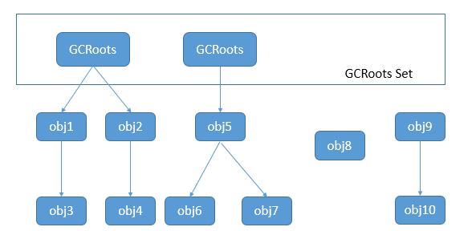
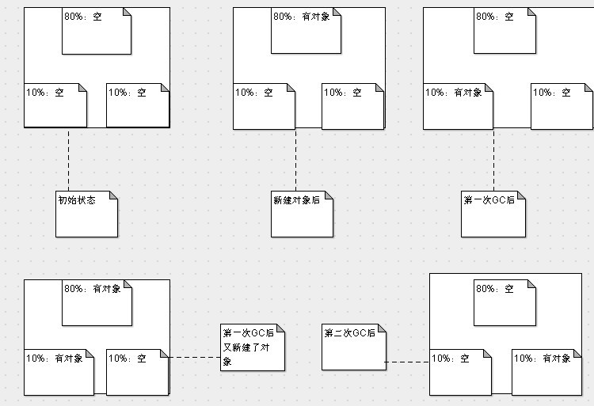
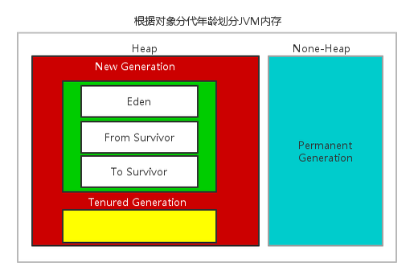
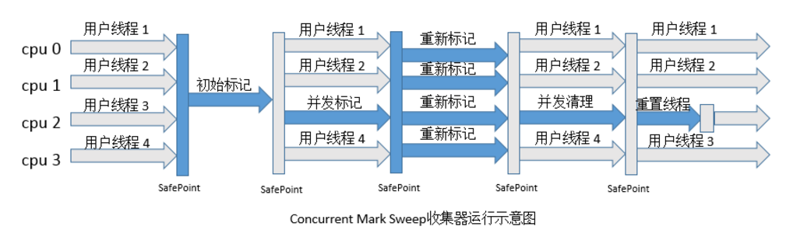

## 什么时候回收？When

当方法结束或线程结束时，内存自然就跟着回收了。

## 哪些对象需要回收？What

无法被其他途径引用的对象需要被回收，如何判断一个对象已死？有两种判断方法。

### 引用计数算法

给对象添加一个引用计数器，每当一个地方引用它时，计数器的值就加一；当引用失效时，计数器的值就减一。当计数器的值为0时，证明该对象不可能再被引用了。

这种算法的优点：实现简单，判定效率高。缺点：很难解决对象之间的**相互循环引用**的问题。

### 可达性分析算法

通过一系列的GC Roots的对象作为起始点，从这些节点开始向下搜索，搜索所走过的路径成为引用链，当一个对象到GC Roots没有任何引用链相连则证明此对象不可用。

GC Roots对象包括：

1. 虚拟机栈 栈帧中的本地变量表的引用对象
2. 方法区中类静态属性引用变量
3. 方法区中常量引用的对象
4. Native 方法引用的对象

### Java中引用的类型

- 强引用。GC不会回收被强引用的对象。
- 软引用。描述一些还有用但非必需的对象。再OOM之前，将会把软引用关联的对象进行回收。
- 弱引用，描述非必需对象。GC会回收掉只被弱引用关联的对象。
- 虚引用。无法用过虚引用获取对象实例，唯一目的是能在这个对象被GC时收到一个系统的通知。

## GC算法 How

### 标记-清除算法

首先标记出所有需要回收的对象，在标记完成后统一回收所有被标记的对象。

缺点：效率不高；空间问题，会产生大量不连续的内存碎片，导致大对象无法分配。

### 复制算法

将内存分为两等块，每次使用其中一块。当这一块内存用完后，就将还存活的对象复制到另外一个块上面，然后再把已经使用过的内存空间一次清理掉。

缺点：浪费一半的内存；如果对象存活率很高，复制的操作会有不少的开销。

### 标记-整理算法

标记：它的第一个阶段与标记/清除算法是一模一样的，均是遍历GC Roots，然后将存活的对象标记。

整理：移动所有存活的对象，且按照内存地址次序依次排列，然后将末端内存地址以后的内存全部回收。

标记/整理算法不仅可以弥补标记/清除算法当中，内存区域分散的缺点，也消除了复制算法当中，内存减半的高额代价。

标记/整理算法唯一的缺点就是效率也不高，效率低于复制算法。

### 分代搜集算法

JVM对象可以分为新生代，老年代和永生代。新生代和老年代位于Java堆，而永生代位于方法区。

由于新生代的存活率低，适合用复制算法；老年代的存活率高，适合用标记-清除法或标记整理法。

因此，JVM将内存的80%分为Eden空间和各10%的Survivor空间。当回收时，将Eden和Survior中还存活的对象一次性复制到另一个Survior空间上，最后清理掉Eden空间和刚才用过的Survior空间。

​         JVM在进行GC时，并非每次都对上面三个内存区域一起回收的，大部分时候回收的都是指新生代。因此GC按照回收的区域又分了两种类型，一种是普通GC（minor GC），一种是全局GC（major GC or Full GC），它们所针对的区域如下。

​         **普通GC（minor GC）**：只针对新生代区域的GC。

​         **全局GC（major GC or Full GC）**：针对年老代的GC，偶尔伴随对新生代的GC以及对永久代的GC。

​         由于年老代与永久代相对来说GC效果不好，而且二者的内存使用增长速度也慢，因此一般情况下，需要经过好几次普通GC，才会触发一次全局GC。

大多数情况下，对象在新生代Eden区中分配。当Eden区没有足够空间分配时，虚拟机将发起一次Minor GC。

Minor GC（新生代回收）的触发条件比较简单，Eden空间不足就开始进行Minor GC

回收新生代。而Full GC（老年代回收，一般伴随一次Minor GC）则有几种触发条件：

（1）老年代空间不足

（2）PermSpace空间不足

（3）统计得到的Minor GC晋升到老年代的平均大小大于老年代的剩余空间

### 内存分代

从对象分代的角度来说，JVM的内存划分大致分为3块：分别是`Permanent Generation`（简称PermGen、持久代）、`New Generation`(又叫Young Generation，年轻代)和`Tenured Generation`（又叫Old Generation，年老代）。其中Permanent Generation位于non-heap区。New和Old是Java应用的Heap区，用来存放类的实例Instance的。

其中New Generation的目标就是尽可能快速的收集掉那些生命周期短的对象；New Generation又分为Eden Space，From Survivor Space和To Survivor Space三块，Eden Space用于存放新创建的对象，From区和To区都是救助空间Survivor Space（图中的S0和S1）；当Eden区满时，JVM执行垃圾回收GC（Garbage Collection），垃圾收集器暂停应用程序，并会将Eden Space还存活的对象复制到当前的From救助空间，一旦当前的From救助空间充满，此区的存活对象将被复制到另外一个To区，当To区也满了的时候，从From区复制过来并且依然存活的对象复制到Old区，从而From和To救助空间互换角色，维持活动的对象将在救助空间不断复制，直到最终转入Old域。需要注意，Survivor的两个区是对称的，没先后关系，所以同一个区中可能同时存在从Eden复制过来对象，和从前一个Survivor复制过来的对象，而且，Survivor区总有一个是空的。同时，根据程序需要，Survivor区是可以配置为多个的(多于两个)，这样可以增加对象在年轻代中的存在时间，减少被放到年老代的可能。每一次垃圾回收后，Eden Space都会被清空。

Old区用于存放长寿的对象，在New区中经历了N次垃圾回收后仍然存活的对象，就会被放到Old区中；如那些与业务信息相关的对象，包括Http请求中的Session对象、线程、Socket连接，这类对象跟业务直接挂钩，因此生命周期比较长。

### 内存分配与回收策略

1. 对象优先在新生代Eden区分配，如果启动了本地线程缓冲，将按线程优先在TLAB上分配。当Eden区内存不足时，将促发一次Minor GC。
2. 大对象直接进入老年代。
3. 长期存活的对象将进入老年代。JVM为每一个对象定义了一个对象年龄计数器，每熬过一次Minor GC就增加一岁，年龄增加到一定阈值将晋升到年老代。

## 垃圾收集器

参考：http://www.tianshouzhi.com/api/tutorials/jvm/96

### CMS收集器

一种以获取最短回收停顿时间为目标的收集器，基于标记清除算法。整个过程分为4个步骤：

- 初始标记：需要Stop World，仅仅标记一下GC Roots能直接关联到的对象。
- 并发标记：GC Roots tracing。
- 重新标记：修正并发标记期间产生变动那一部分对象的标记记录。
- 并发清除：可以与用户线程并发执行。

优点：并发低停顿

缺点：

- 会产生大量碎片。
- 对CPU资源非常敏感，CMS需要的CPU资源较多，导致应用程序变慢，总吞吐量会降低。
- 无法处理浮动垃圾。由于CMS并发清理时用户线程再次产出的垃圾成为浮动垃圾。

### G1

http://www.importnew.com/15311.html

- 基于标记-整理算法，不会产生空间碎片。
- 极力避免全区域的GC。将整个堆分成多个大小固定的Region，跟踪区域里面的垃圾堆积程度，在后台维护一个优先列表，优先回收垃圾最多的区域。

## Android中的虚拟机

### Dalvik虚拟机

**Java堆**

Java堆实际上是由一个Active堆和一个Zygote堆组成的。当创建第一个应用程序进程时，会将已经使用了的那部分堆内存划分为一部分，还没有使用的堆内存划分为另外一部分。前者就称为Zygote堆，后者就称为Active堆。这样只需把zygote堆中的内容复制给应用程序进程就可以了。以后无论是Zygote进程，还是应用程序进程，当它们需要分配对象的时候，都在Active堆上进行。这样就可以使得Zygote堆尽可能少地被执行写操作，因而就可以减少执行写时拷贝的操作。在Zygote堆里面分配的对象其实主要就是Zygote进程在启动过程中预加载的类、资源和对象了。

**GC算法和内存碎片**

主流的大部分Davik采取的都是标注与清理（Mark and Sweep）回收算法，也有实现了拷贝GC的，这一点和HotSpot是不一样的，具体使用什么算法是在编译期决定的，无法在运行的时候动态更换。

采用标记清除法时，难以避免会有内存碎片的问题。所以对于Dalvik虚拟机的手机来说，我们首先要尽量避免掉频繁生成很多临时小变量（比如说：getView, onDraw等函数中new对象），另一个又要尽量去避免产生很多长生命周期的大对象。当VM不足以为一个对象分配内存时，会触发GC。频繁的GC会造成卡顿的问题。

### ART内存回收机制

**Java堆**

ART运行时内部使用的Java堆的主要组成包括Image Space、Zygote Space、Allocation Space和Large Object Space四个Space，Image Space用来存在一些预加载的类， Zygote Space和Allocation Space与Dalvik虚拟机垃圾收集机制中的Zygote堆和Active堆的作用是一样的，Large Object Space就是一些离散地址的集合，用来分配一些大对象从而提高了GC的管理效率和整体性能。

**并发GC与非并发GC**

Alloc内存不够的时候会采用非并发GC，而在Alloc后发现内存达到一定阀值的时候又会触发并发GC。

- **非并发GC**

步骤1. 调用子类实现的成员函数InitializePhase执行GC初始化阶段。

步骤2. 挂起所有的ART运行时线程。

步骤3. 调用子类实现的成员函数MarkingPhase执行GC标记阶段。

步骤4. 调用子类实现的成员函数ReclaimPhase执行GC回收阶段。

步骤5. 恢复第2步挂起的ART运行时线程。

步骤6. 调用子类实现的成员函数FinishPhase执行GC结束阶段。

- **并发GC**

步骤1. 调用子类实现的成员函数InitializePhase执行GC初始化阶段。

步骤2. 获取用于访问Java堆的锁。

步骤3. 调用子类实现的成员函数MarkingPhase执行GC并行标记阶段。

步骤4. 释放用于访问Java堆的锁。

步骤5. 挂起所有的ART运行时线程。

步骤6. 调用子类实现的成员函数HandleDirtyObjectsPhase处理在GC并行标记阶段被修改的对象。

步骤7. 恢复第4步挂起的ART运行时线程。

步骤8. 重复第5到第7步，直到所有在GC并行阶段被修改的对象都处理完成。

步骤9. 获取用于访问Java堆的锁。

步骤10. 调用子类实现的成员函数ReclaimPhase执行GC回收阶段。

步骤11. 释放用于访问Java堆的锁。

步骤12. 调用子类实现的成员函数FinishPhase执行GC结束阶段。

**前后台GC**

前台Foreground指的就是应用程序在前台运行时，而后台Background就是应用程序在后台运行时。应用程序在前台运行时，响应性是最重要的，因此也要求执行的GC是高效的。相反，应用程序在后台运行时，响应性不是最重要的，这时候就适合用来解决堆的内存碎片问题。因此，Mark-Sweep GC适合作为Foreground GC，而Mark-Compact GC适合作为Background GC。

ART在GC上做的比Dalvik好太多了，不光是GC的效率，减少Pause时间，而且还在内存分配上对大内存的有单独的分配区域，同时还能有算法在后台做内存整理，减少内存碎片。对于开发者来说ART下我们基本可以避免很多类似GC导致的卡顿问题了。另外根据谷歌自己的数据来看，ART相对Dalvik内存分配的效率提高了10倍，GC的效率提高了2-3倍。

## 参考

- http://www.cnblogs.com/zuoxiaolong/p/jvm6.html
- http://www.cnblogs.com/zuoxiaolong/p/jvm5.html
- http://www.cnblogs.com/leesf456/p/5218594.html
- http://www.tianshouzhi.com/api/tutorials/jvm/97
- http://www.tianshouzhi.com/api/tutorials/jvm/96

