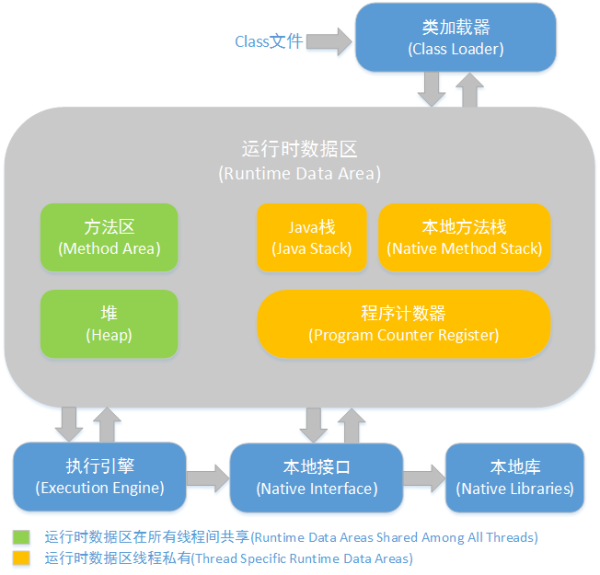

## JVM内存结构


### 程序计数器

PC是一块较小的内存空间，可以看作是当前线程所执行的字节码的行号指示器。为了线程切换后能恢复到正确执行位置，每条线程都需要有一个独立的程序计数器。各条线程之间计数器互不影响。如果正在执行的是Native方法，这个PC值为Undefined。

### VM Stack

Java虚拟机栈也是线程私有的。Stack描述的是Java方法执行的内存模型：每一个方法执行时都会创建一个栈帧，用于存储局部变量表，操作数栈，动态链接表，方法出口等信息。

局部变量表存放了编译期可知的各种基本数据类型和对象引用。其中64位长度long和double类型的数据会占用2个Slot，其余类型只占用1个。局部变量表所需的内存空间在编译期已经决定，因此在方法运行期间不会改变局部变量表的大小。

### 本地方法栈

虚拟机栈为虚拟机执行Java方法服务，而本地方法栈则为虚拟机使用到的Native方法服务。

### Java堆

Java堆是被所有线程共享的一块内存区域，在JVM启动时创建。此内存区域唯一目的是存放对象实例，几乎所有的对象实例都是在这里分配内存。Java堆可以分为新生代和老年代；在细致一点有Eden空间，From Survivor空间，To Survivor空间等。线程共享的Java堆可能划分出多个线程私有的分配缓冲区（TLAB）。

### 方法区

方法区与Java堆一样，是各个线程共享的内存区域，用于存储已被虚拟机加载的类信息，常量，静态变量等。

**运行时常量池**是方法区的一部分。Class文件中除了有类的描述信息外，还有一项信息是常量池，用于存放编译期生成的各种字面量和符号引用，在类加载后进入方法区的运行时常量池中存放。在运行期间也可以将新的常量放入池中，比如String类的intern方法。

## 对象
### 对象的创建

虚拟机遇到一条new指令时，首先在常量池中定位到一个类的符号引用，并检查这个符号引用代表的类是否已被加载，解析和初始化过。如果没有那必须先执行相应的类加载的过程。

对象所需内存的大小在类加载完成后便可完全确认，在堆中分配内存的方式有：

1. 指针碰撞：假设Java堆中内存是绝对规整的，所有用过的内存都放在一边，空闲的内存放在另一边，中间放一个指针作为分界点指示器。分配内存就仅仅把那个指针向空闲空间那边挪动一段与对象大小相等的距离。
2. 空闲列表：如果堆内存不是规整的，那么需要维护一个表，记录哪些内存块是可用的，在分配时在列表中找到一块足够大的空间划分给对象实例，记录哪些内存块是可用的。

在堆中为对象分配空间时候会有并发的问题，解决方法有：

1. 采用CAS配上失败重试的方式保证更新操作的原子性。
2. 每个线程在Java堆中预先分配一块内存，称为本地线程分配缓冲（Thread Local Allocation Buffer，TLAB）。

执行new指令之后会接着执行`<init>`方法，把对象按照程序员的意愿进行初始化。

### 对象的内存布局

对象在内存中存储的布局可以分为3个区域：对象头（Header），实例数据（Instance Data）和对齐填充（Padding）。

对象头分为：

1. 用于存储对象自身的运行时数据，如HashCode，GC分代年龄，锁状态标志等。
2. 类型指针，用于确定这个对象是那个类的实例。

对齐填充：

JVM规定对象的大小必须是8字节的整数倍。而对象头正好是8字节的倍数，如果对象实例数据部分不足8字节的整数倍，通过对齐填充来补全。


### 对象的访问定位

- 使用句柄访问

Java堆中会划分出一块内存作为句柄池，reference存储的是对象的句柄地址，而句柄中包含了对象实例数据和地址信息。

好处就是在对象被移动时只会改变句柄中实例数据的指针，而reference本身不必修改。

- 直接指针访问

reference直接存储对象的地址。

好处就是速度更快，节省了一次指针定位的开销，但对象地址发生改变时需要频繁改变reference的值。


## 谈谈String

String.intern()是一个Native方法，它的作用是，如果字符串常量池中已经包含该String对象的字符串，则返回代表池中这个字符串的String对象；否则将此String对象包含的字符串添加到常量池中，并返回此String对象的引用。

```java
public class Test {
    static String a = "ab";
    public static void main(String[] args) {
        String s1 = "a";
        String s2 = "b";
        String s3 = s1 + s2;
        String s4 = "a1";
        String s5 = "a" + "1";
        System.out.println(s3 == a); // false
        System.out.println(s3.intern() == a); // true
        System.out.println(s4 == s5); // true
    }
}
```


