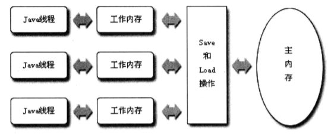
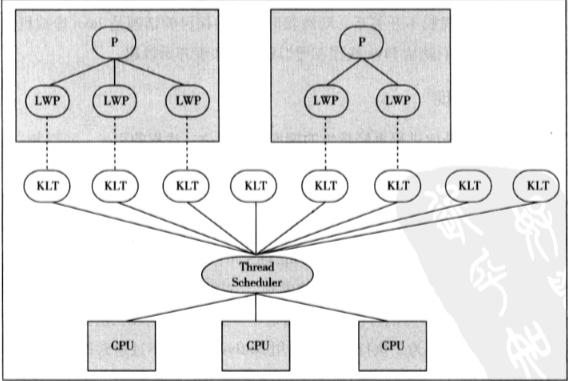
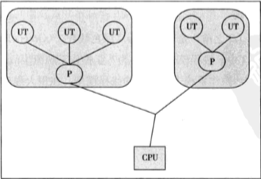
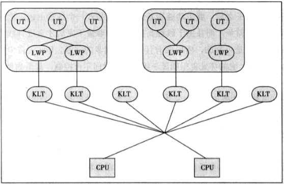
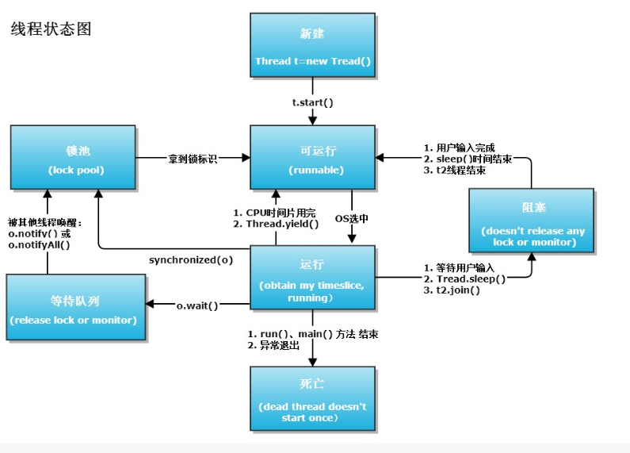

## Java内存模型

### 为什么会有JMM

1. **缓存一致性**。Cache能很好解决CPU与内存的速度矛盾，但在多CPU系统中，每个处理器都有自己的Cache，而它们又共享同一个主存。当多个CPU的运算任务都涉及同一块主存区域时，将可能导致各自的缓存数据不一致。为了解决缓存一致性的问题，需要各个CPU访问Cache时都遵循一些协议。而内存模型就是在特定的操作协议下，对特定的内存或Cache进行读写访问的抽象过程。
2. **不同硬件平台的兼容性**。JVM规范试图定义一种JMM来屏蔽各种硬件和OS的内存访问差异，以实现让Java程序在各种平台下都能达到一致的内存访问效果。

### 主内存与工作内存

JMM的主要目标是定义程序中各个变量的存取规则。JMM规定了所有变量都存储在主内存中，每条线程还有自己的工作内存，线程的工作内存（类比Cache）中保存了被该线程使用到的变量的主内存副本，线程对变量的所有操作都必须在工作内存中进行。

JMM定义了8中原子操作完成工作内存和主内存之间的交互：lock，unlock，read，load，use，assign，store，write。

### volatile关键字

volatile关键字有两种语义：

1. 变量在线程之间可见
2. 禁止指令重排

实现原理：如果一个变量是volatile修饰的，JMM会在写入这个字段之后插进一个Write-Barrier指令，并在读这个字段之前插入一个Read-Barrier指令。多执行一条以lock为前缀的空操作指令，将对Cache的修改写入主存，让前面对volatile变量的修改对其他CPU立即可见。同时lock前缀指令会形成一道内存屏障，禁止指令重排。

volatile变量的读操作性能消耗与普通变量几乎没什么差别，但写操作则可能会慢一些，因为它需要在本地代码插入许多内存屏障指令来保证CPU不发生乱序执行。

### JMM的三大特征

**原子性**：由JMM直接保证的原子性变量操作包括read，load，assign，use，store和write。如果应用场景选的一个更大范围的原子性保证，需要用到lock和unlock操作，对应的更高层次的字节码指令monitorenter和monitorexit来隐式地使用这两个操作，这两个字节码指令反映到Java代码中就是同步快--synchronized关键字。

**可见性**：指当一个线程修改了共享变量的值，其他线程能够立即得知这个修改。volatile，synchronized和final都能实现可见性。

**有序性**：volatile和synchronized两个关键字来保证线程之间操作的有序性，volatile关键字包含了禁止指令重排序的语义，而synchronized规定持有同一个锁的两个同步块只能串行地进入。

### happens-before原则

happens-before原则用于判断资源是否存在竞争，线程是否安全的重要依据。如果操作A happens-before B，那么在发生B操作之前，A操作产生的影响能被操作B观察到。

参考：http://www.jianshu.com/p/d3fda02d4cae

## Java线程

### 线程的实现方式

实现线程主要有3种方式：使用内核线程实现，使用用户线程实现和使用用户线程加轻量级线程混合实现。

- 使用内核线程实现

内核线程就是直接由操作系统内核（kernel）支持的线程，这种线程由内核来完成线程切换，内核通过操作调度器对线程进行调度，将线程的任务映射到各个CPU上。每个内核线程相当于内核的一个分身。

程序一般不会直接使用内核线程，而是使用内核线程的一种高级接口--轻量级进程（LWP）。

缺点：由于基于内核线程实现的，各种线程操作，如创建，析构及同步都需要进行系统调用。而用户态与内核态的切换代价相对较高。其次，一个系统支持LWP数量是有限的。

- 使用用户线程实现

狭义上的用户线程指的是完全建立在用户空间的线程库上，系统内核不能感知线程存在的实现。用户线程的建立，同步，销毁和调度完全在用户态中完成，不需要内核的帮助。

缺点：线程的创建，切换和调度都是需要考虑的问题，诸如阻塞如何处理，多处理器系统如何将线程映射到其他CPU上等问题难以解决。

- 使用用户线程+轻量级进程混合实现

用户线程还是完全建立在用户空间中，因此线程的创建，切换，析构等操作依然廉价，并且可以支持大规模的用户线程并发。而OS提供轻量级进程作为用户线程和内核线程的桥梁，可以使用内核提供的线程调度功能及处理器映射。

### Java线程调度

线程调度是指系统为线程分配处理器使用权的过程。主要的调度方式为协同式线程调度和抢占式线程调度。

协同式调度：线程的执行时间由线程本身来控制，线程把自己的工作执行完之后，要主动通知系统切换到另外一个线程上。优点：实现简单。缺点：线程执行时间不可控制，如果一个线程堵塞了，那么程序就会一直阻塞在那里。

抢占式调度；每一个线程将由系统来分配执行时间，线程的切换不由线程本身来决定。通过设置线程的优先级，可以让线程更容易被系统选择执行。

### 线程状态转换

## 线程安全与锁

线程安全：当多个线程访问一个对象时，如果不用考虑这些线程在运行时环境下的调度和交替执行，也不需要进行额外的同步，或者在调用方进行任何其他的协调操作，调用这个对象的行为都可以获得正确的结果，那这个对象是线程安全的。

### 线程安全的实现方法

#### 互斥同步

synchronized关键字经过编译之后，会在同步块的前后分别形成monitorenter和monitorexit这两个字节码指令，这两个字节码都需要一个reference类型的参数来指明要锁定和解锁的对象，如果Java程序中的synchronized明确指定了对象参数，那这就是这个对象的reference；如果没有明确指定，那就根据synchronized修饰的实例方法还是类方法，取对应的对象实例或Class对象所谓锁对象。

如果需要阻塞或唤醒一个线程都需要操作系统帮忙完成，这就需要从用户态转换到核心态中，因此状态转换需要耗费很多的处理器时间。

**synchronized的实现原理**

每个对象有一个监视器锁（monitor）。当monitor被占用时就会处于锁定状态，线程执行monitorenter指令时尝试获取monitor的所有权，过程如下：

1、如果monitor的进入数为0，则该线程进入monitor，然后将进入数设置为1，该线程即为monitor的所有者

2、如果线程已经占有该monitor，只是重新进入，则进入monitor的进入数加1

3、如果其他线程已经占用了monitor，则该线程进入阻塞状态，直到monitor的进入数为0，再重新尝试获取monitor的所有权

**synchronized与ReentrantLock的区别**

1. 一个表现为原生语法层面的互斥锁，一个表现为API层面的互斥锁(lock()和unlock()方法配合try/finally语句块来完成)
2. ReentrantLock等待可中断。即当持有锁的线程长期不释放锁时，正在等待的线程可以选择放弃等待。
3. ReentrantLock可以实现公平锁。即按照申请锁的时间顺序来依次获得锁。
4. ReentrantLock可以绑定多个条件。即一个ReentrantLock对象可以同时绑定多个Condition对象。

#### 非阻塞同步

互斥同步主要问题是进行线程阻塞和唤醒所带来的性能问题，互斥同步属于一种悲观的并发策略。

非阻塞同步是基于冲突监测的乐观并发策略，不需要将线程挂起，而是通过CAS来实现线程的同步。乐观并发策略需要操作和冲突检测这两个步骤具备原子性，如CAS指令。

CAS指令需要3个操作数，分别是内存地址V，旧的预期值A和新值B。CAS指令执行时，当且仅当V的值符合旧的预期值A时，处理器用新值更新V的值，否则不执行更新。

缺点：CAS会存在ABA问题，但一般不会影响程序并发的正确性，如果需要解决ABA问题，可以改用传统的互斥同步。

### synchronized底层原理

#### Mark Word与Monitor

对象在堆中内存包含对象头，实例数据和对齐填充。对象头包含Mark Word和类型指针，Mark Word占一个字的大小，包含指向Monitor的指针等锁信息。每个对象都存在着一个monitor与之关联。monitor包含一个owner变量，用于记录持有锁的线程；一个等待队列和一个同步队列。

#### 同步代码块

使用的是monitorenter 和 monitorexit 指令，其中monitorenter指令指向同步代码块的开始位置，monitorexit指令则指明同步代码块的结束位置，当执行monitorenter指令时，当前线程将试图获取 objectref(即对象锁) 所对应的 monitor 的持有权，当 objectref 的 monitor 的进入计数器为 0，那线程可以成功取得 monitor，并将计数器值设置为 1，取锁成功。如果当前线程已经拥有 objectref 的 monitor 的持有权，那它可以重入这个 monitor (关于重入性稍后会分析)，重入时计数器的值也会加 1。倘若其他线程已经拥有 objectref 的 monitor 的所有权，那当前线程将被阻塞，直到正在执行线程执行完毕，即monitorexit指令被执行，执行线程将释放 monitor(锁)并设置计数器值为0 ，其他线程将有机会持有 monitor 。

#### 同步方法

方法级的同步是隐式，即无需通过字节码指令来控制的，它实现在方法调用和返回操作之中。JVM可以从方法常量池中的方法表结构(method_info Structure) 中的 ACC_SYNCHRONIZED 访问标志区分一个方法是否同步方法。当方法调用时，调用指令将会 检查方法的 ACC_SYNCHRONIZED 访问标志是否被设置，如果设置了，执行线程将先持有monitor（虚拟机规范中用的是管程一词）， 然后再执行方法，最后再方法完成(无论是正常完成还是非正常完成)时释放monitor。在方法执行期间，执行线程持有了monitor，其他任何线程都无法再获得同一个monitor。

参考：[深入理解Java并发之synchronized实现原理](http://blog.csdn.net/javazejian/article/details/72828483)

### 锁优化

#### 自旋锁和自适应自旋

互斥同步对性能最大的影响时阻塞的实现。一般情况下，共享数据的锁定状态只会持续很短一段时间，为了这段时间去挂起和恢复线程并不值得。在多核处理器中，我们可以让后面请求锁的线程稍等一会，暂时不放弃CPU的执行时间，通过自旋看看持有锁的线程是否很快就会释放锁。

自适应的自旋锁意味着自旋的时间不再固定，而是由前一次在同一个锁上的自旋时间及锁的拥有者状态来决定。

#### 锁消除

锁消除是指虚拟机即时编译器在运行时，对一些代码要求同步，但被检测 到不可能存在共享数据竞争的锁进行消除。

#### 锁粗化

如果虚拟机检测到有一串零碎的操作都对同一个对象加锁，就会把加锁同步的范围扩展到整个操作序列的外部。因为频繁地进行不必要的互斥同步操作会导致性能损耗。

#### 轻量级锁与偏向锁

Synchronized是通过对象内部的一个叫做监视器锁（monitor）来实现的。但是监视器锁本质又是依赖于底层的操作系统的Mutex Lock来实现的。而操作系统实现线程之间的切换这就需要从用户态转换到核心态，这个成本非常高，状态之间的转换需要相对比较长的时间。为了减少获得锁和释放锁所带来的性能消耗，提高性能，引入了“轻量级锁”和“偏向锁”。

偏向锁的核心思想是，如果一个线程获得了锁，那么锁就进入偏向模式，此时Mark Word 的结构也变为偏向锁结构，当这个线程再次请求锁时，无需再做任何同步操作，即获取锁的过程，这样就省去了大量有关锁申请的操作，从而也就提供程序的性能。

轻量级锁是在没有多线程竞争的前提下，减小传统的重量级锁使用操作系统互斥量产生的性能消耗。

轻量级锁是在无竞争的情况下使用CAS操作去消除同步使用的互斥量，那偏向锁就是在无竞争的情况下把整个同步都消除掉，连CAS操作都不做了。

