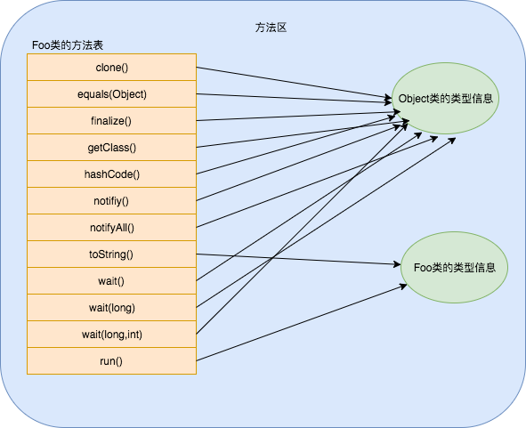

我们都知道，Java源代码需要编译成字节码文件，由JVM解释执行，而方法调用可以说是很常见的操作。Java不同于C++，Java中的实例方法默认是虚方法，因此父类引用调用被子类覆盖的方法时能体现多态性。下面我们来看看JVM是如何完成方法调用操作并实现动态绑定的。

### 栈帧结构

为了能高效地管理程序方法调用，有条不紊地进行嵌套的方法调用和方法返回，JVM维护了一个栈结构，称为虚拟机方法栈（这里没考虑Native方法）。栈里面存放的一个个实体称为栈帧，每一个栈帧都包括了局部变量表，操作数栈，动态连接，方法返回地址和一些额外的附加信息。在编译时，栈帧中需要多大的局部变量表，多深的操作数栈都已经完全确定了，并且写入到方法表的Code属性之中。

#### 局部变量表

局部变量表用于存放方法参数和方法内部定义的局部变量。局部变量表的容量以Slot为最小单位，一个Slot可以存放一个32位以内的数据类型，long和double需要两个Slot存放。

如果执行的方法是非static方法，那局部变量表中第0位索引的Slot默认是用于传递方法所属对象实例的引用（this）。

为了节省栈帧空间，局部变量表中的Slot是可以重用的。如果一个局部变量定义了但没有赋初值是不能使用的。

#### 操作数栈

JVM解析执行字节码是基于栈结构的。比如做算术运算时是通过操作数栈来进行的，在调用其他方法时是通过操作数栈来进行参数的传递。

#### 方法调用大致过程

1. 除非被调用的方法是类方法，每一次方法调用指令之前，JVM先会把方法被调用的对象引用压入操作数栈中，除了对象的引用之外，JVM还会把方法的参数依次压入操作数栈。
2. 在执行方法调用指令时，JVM会将函数参数和对象引用依次从操作数栈弹出，并新建一个栈帧，把对象引用和函数参数分别放入新栈帧的局部变量表slot0，1，2…。
3. JVM把新栈帧push入虚拟机方法栈，并把PC指向函数的第一条待执行的指令。

到此，有人可能会问，JVM是如何得到被调用方法的地址呢？两种方式，一种是编译期的静态绑定，另一种是运行期的动态绑定。不同类型的方法用不同的绑定方式。

### 方法调用的字节码指令

JVM里面提供了4条方法调用字节码指令。分别如下：

- **invokestatic**:调用静态方法
- **invokespecial**:调用实例构造器`<init>`方法、私有方法和父类方法（super(),super.method()）
- **invokevirtual**:调用所有的虚方法(静态方法、私有方法、实例构造器、父类方法、final方法都是非虚方法)
- **invokeinterface**:调用接口方法，会在运行时期再确定一个实现此接口的对象

invokestatic和invokespecial指令调用的方法都可以在解析阶段中确定唯一的调用版本，符合这个条件的有静态方法、私有方法、实例构造器、父类方法4类，它们在类加载阶段就会把符号引用解析为该方法的直接引用。直接引用就是一个指针或偏移量，可以让JVM快速定位到具体要调用的方法。

invokevirtual和invokeinterface指令调用的方法是在运行时确定具体的方法地址，接口方法和实例对象公有方法可以用这两个指令来调用。

下面我们通过一个代码示例来展现这几种方法调用：

```Java
public class Test {
    private void run() {
        List<String> list = new ArrayList<>(); // invokespecial 构造器调用
        list.add("a"); // invokeinterface 接口调用 
        ArrayList<String> arrayList = new ArrayList<>(); // invokespecial 构造器调用
        arrayList.add("b"); // invokevirtual 虚函数调用
    }
    public static void main(String[] args) {
        Test test = new Test(); // invokespecial 构造器调用
        test.run(); // invokespecial 私有函数调用
    }
}
```

反编译字节码：

```
public class Test {
  public Test();
    Code:
       0: aload_0
       1: invokespecial #1                  // Method java/lang/Object."<init>":()V
       4: return

  private void run();
    Code:
       0: new           #2                  // class java/util/ArrayList
       3: dup
       4: invokespecial #3                  // Method java/util/ArrayList."<init>":()V
       7: astore_1
       8: aload_1
       9: ldc           #4                  // String a
      11: invokeinterface #5,  2            // InterfaceMethod java/util/List.add:(Ljava/lang/Object;)Z
      16: pop
      17: new           #2                  // class java/util/ArrayList
      20: dup
      21: invokespecial #3                  // Method java/util/ArrayList."<init>":()V
      24: astore_2
      25: aload_2
      26: ldc           #6                  // String b
      28: invokevirtual #7                  // Method java/util/ArrayList.add:(Ljava/lang/Object;)Z
      31: pop
      32: return

  public static void main(java.lang.String[]);
    Code:
       0: new           #8                  // class Test
       3: dup
       4: invokespecial #9                  // Method "<init>":()V
       7: astore_1
       8: aload_1
       9: invokespecial #10                 // Method run:()V
      12: return
}
```

从上面的字节码可以看出，每一条方法调用指令后面都带一个Index值，JVM可以通过这个索引值从常量池中获取到方法的符号引用。

每个class文件都有一个常量池，主要是关于类、方法、接口等中的常量，也包括字符串常量和符号引用。方法的符号引用是唯一标识一个方法的信息结构体，包含类名，方法名和方法描述符，方法描述符又包含返回值、函数名和参数列表。这些字符值都存放到class文件的常量池中，通过整型的Index来标识和索引。

### 动态分派

当JVM遇到invokevirtual或invokeinterface时，需要运行时根据方法的符号引用查找到方法地址。具体过程如下：


1. 在方法调用指令之前，需要将对象的引用压入操作数栈
2. 在执行方法调用时，找到操作数栈顶的第一个元素所指向的对象实际类型，记作C
3. 在类型C中找到与常量池中的描述符和方法名称都相符的方法，并校验访问权限。如果找到该方法并通过校验，则返回这个方法的引用；
4. 否则，按照继承关系往上查找方法并校验访问权限；
5. 如果始终没找到方法，则抛出java.lang.AbstractMethodError异常；

可以看到，JVM是通过继承关系从子类往上查找的对应的方法的，为了提高动态分派时方法查找的效率，JVM为每个类都维护一个虚函数表。

#### 虚函数表

JVM实现动态绑定的原理类似于C++的虚函数表机制，但C++的虚函数表是实现多态中必不可少的数据结构，但JVM里引入虚函数表的目的是加快虚方法的索引。

JVM 会在链接类的过程中，给类分配相应的方法表内存空间。每个类对应一个方法表。这些都是存在于方法区中的。这里与 C++略有不同，C++中每个对象的第一个指针就是指向了相应的虚函数表。而 Java 中每个对象的对象头有一个类型指针，可以索引到对应的类，在对应的类数据中对应一个方法表。也就是C++的方法表是对象级别的，而Java的方法表是类级别的。

一个类的方法表包含类的所有方法入口地址，从父类继承的方法放在前面，接下来是接口方法和自定义的方法。如果某个方法在子类中没有被重写，那子类的虚方法表里面的地址入口和父类相同的方法的入口地址一致。如果子类重写了这个方法，子类方法表中的地址将会替换为指向子类实现版本的入口地址。

比如对于如下的Foo类：

```Java
    class Foo {
        @Override
        public String toString() {
            return "Foo";
        }
        void run(){}
    }
```

它的虚函数表如下：




#### invokevirtual和invokeinterface的区别

从上面我们可以发现，虚函数表上的虚方法是按照从父类到子类的顺序排序的，因此对于使用invokevirtual调用的虚函数，JVM完全可以在编译期就确定了虚函数在方法表上的offset，或者在首次调用之后就把这个offset缓存起来，这样就可以快速地从方法表中定位所要调用的方法地址。

然而对于接口类型引用，由于一个接口可以被不同的Class来实现，所以接口方法在不同类的方法表的offset当然就（很可能）不一样了。因此，每次接口方法的调用，JVM都会搜寻一遍虚函数表，效率会比invokevirtual要低。


### 参考链接

- [How the Java virtual machine handles method invocation and return](http://www.javaworld.com/article/2076949/learn-java/how-the-java-virtual-machine-handles-method-invocation-and-return.html?page=2)
- [图解JVM执行引擎之方法调用](http://www.cnblogs.com/chenyangyao/p/5305352.html)
- [Java：方法的虚分派(virtual dispatch)和方法表（method table）](http://blog.csdn.net/biaobiaoqi/article/details/6894869)
- [Java调用重载方法(invokevirtual)和接口方法(invokeinterface)的解析](http://blog.csdn.net/pun_c/article/details/43118697)