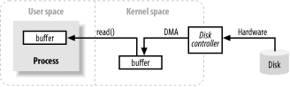
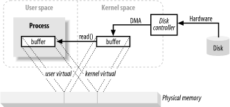
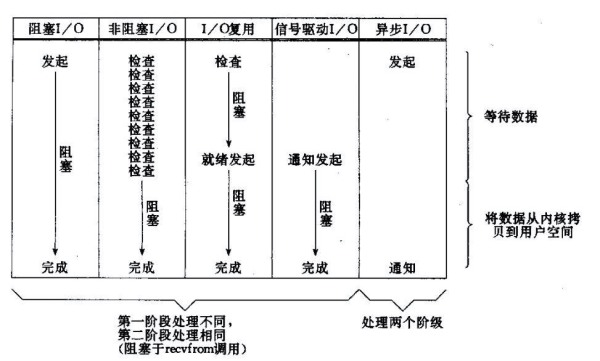
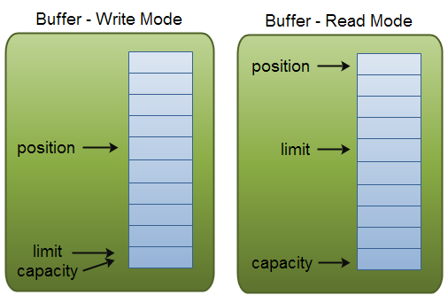
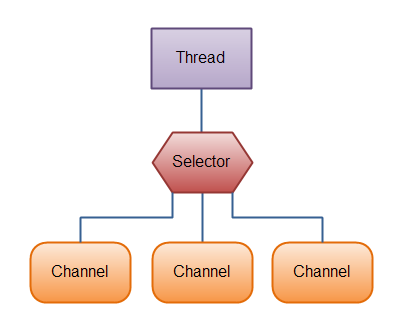
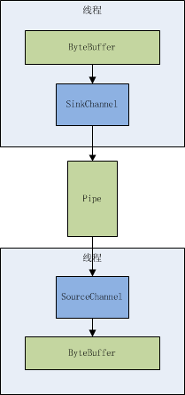

## IO底层原理



通常，进程执行操作系统的I/O请求包括数据从缓冲区排出（写操作）和数据填充缓冲区（读操作）。以Input为例，首先，进程要求其缓冲通过read()系统调用填满。这个系统调用导致内核向磁盘控制硬件发出一条命令要从磁盘获取数据。磁盘控制器通过DMA直接将数据写入内核的内存缓冲区，不需要主CPU进一步帮助。当请求read()操作时，一旦磁盘控制器完成了缓存的填充，内核从内核空间的临时缓存拷贝数据到进程指定的缓存中。

由于现代操作系统都是用了虚拟内存，这意味着：

1. 多个虚拟地址可以映射到相同的物理地址
2. 进程的虚拟地址空间可以大于实际可用的硬件内存

因此，用户空间内的buffer与内核空间内的buffer可以映射到同一块物理内存当中。从而避免了一次拷贝。



## IO模型

- **同步模型（synchronous IO）**
  - 阻塞IO（bloking IO）
  - 非阻塞IO（non-blocking IO）
  - 多路复用IO（multiplexing IO）
  - 信号驱动式IO（signal-driven IO）
- **异步IO（asynchronous IO）**



参考：[也谈IO模型](http://mp.weixin.qq.com/s?__biz=MjM5NzMyMjAwMA==&mid=2651477804&idx=1&sn=c764e6318eb5ffd8fc045f5f786e0e6e&chksm=bd253b538a52b245ec41022c13ef15190afe549b4d1180814a08544d88a0805840903d32b8e5&mpshare=1&scene=23&srcid=1127ZQuCkomrtx4j8eLOrKEC#rd)

http://www.jianshu.com/p/486b0965c296#

## NIO

NIO的速度提高来自于所使用的结构更接近于操作系统执行IO的方式：通道和缓冲器。

我们可以把数据源比喻成煤矿，通道是一个通往矿藏的地道，而缓冲器则是运输煤炭的卡车。也就是说，IO操作直接与缓冲器交互，并把缓冲器派送到通道。通道要么从缓冲器获取数据，要么向缓冲器发送数据。

### 示例

ByteBuffer是唯一直接与通道交互的缓冲器，只能保存字节类型的数据。旧IO类库中FileInputStream，FileOutputStream以及用于既读又写的RandomAccessFile都可以用来产生FileChannel。

```java
public class GetChannel {
    public static final int BSIZE = 1024;
    public static void main(String[] args) throws IOException {
        FileChannel fc = new FileOutputStream(new File("data.txt")).getChannel();
        fc.write(ByteBuffer.wrap("Some text ".getBytes()));
        fc.close();
        fc = new RandomAccessFile(new File("data.txt"), "rw").getChannel();
        fc.position(fc.size());
        fc.write(ByteBuffer.wrap("Some more ".getBytes()));
        fc.close();
        fc = new FileInputStream(new File("data.txt")).getChannel();
        ByteBuffer buffer = ByteBuffer.allocate(BSIZE);
        fc.read(buffer);
        buffer.flip(); //做好数据被读取的准备
        while (buffer.hasRemaining()) {
            System.out.print((char) buffer.get());
        }
        fc.close();
    }
}
```

简单的文件复制操作：

```java
    public static void copy(FileInputStream in, FileOutputStream out) throws IOException {
        FileChannel fcin = in.getChannel();
        FileChannel fcout = out.getChannel();
        fcin.transferTo(0, fcin.size(), fcout);
//        fcout.transferFrom(fcin, 0, fcin.size());
    }

    public static void copy_(FileInputStream in, FileOutputStream out) throws IOException {
        FileChannel fcin = in.getChannel();
        FileChannel fcout = out.getChannel();
        ByteBuffer buffer = ByteBuffer.allocate(1024);
        while ((fcin.read(buffer) != -1)) {
            buffer.flip(); // Prepare for writing
            fcout.write(buffer);
            buffer.clear(); // Prepare for reading
        }
    }
```

### Buffer

#### 四个索引

缓冲区是对Java原生数组的对象封装，Buffer有四个索引：mark，position，limit和capacity。

容量（Capacity）：缓冲区能够容纳的数据元素的最大数量。初始设定后不能更改。 
上界（Limit）：缓冲区中第一个不能被读或者写的元素位置。或者说，缓冲区内现存元素的上界。 
位置（Position）：缓冲区内下一个将要被读或写的元素位置。在进行读写缓冲区时，位置会自动更新。 
标记（Mark）：一个备忘位置。初始时为“未定义”，调用mark时mark=positon，调用reset时position=mark。 



#### 操作函数

所有Buffer都有get和put函数，用来写入和读取数据。注意，每put一个元素，position自动加1；而每get一个元素，position也自动加1。

flip()就是从写入转为读出前的一个设置buffer属性的操作，其意义是将limit=position，position=0。

compact()方法是为了将读取了一部分的buffer，其剩下的部分整体挪动到buffer的头部（即从0开始的一段位置），便于后续的写入或者读取。其含义为limit=limit-position，position=0。

### Channel

通道代表一个通向具有独立IO能力实体的连接。

**1）通道是一种高效传输数据的管道，2）通道的一端（接收端或发送端）必须是字节缓冲区，3）另一端则是拥有IO能力的实体，4）通道本身不能存储数据，5）且往往通过流或套接字来创建，6）一旦创建，则通道与之形成一一对应的依赖关系。**

通道主要分为文件通道和Socket通道。文件通道是通过文件流对象来获取的，只支持阻塞模式。Socket通道支持阻塞模式和非阻塞模式。

### Selector

Selector是Java NIO中的一个组件，用于检查一个或多个NIO Channel的状态是否处于可读、可写。如此可以实现单线程管理多个channels，也就是可以管理多个网络链接。Selector在Linux等主流操作系统上是通过epoll实现的。



具体的实现流程如下：

1. 创建ServerSocketChannel监听客户端连接并绑定监听端口，设置为非阻塞模式。
2. 创建Reactor线程，创建多路复用器(Selector)并启动线程。
3. 将ServerSocketChannel注册到Reactor线程的Selector上。监听accept事件。
4. Selector在线程run方法中无线循环轮询准备就绪的Key。
5. Selector监听到新的客户端接入，处理新的请求，完成tcp三次握手，建立物理连接。
6. 将新的客户端连接注册到Selector上，监听读操作。读取客户端发送的网络消息。
7. 客户端发送的数据就绪则读取客户端请求，进行处理。

### Pipe管道

Pipe管道的概念最先应该出现在Unix系统里，用来表示连接不同进程间的一种单向数据通道，很多Unix系统都提供了支持管道的API。Java NIO借用了这个概念，发明了NIO中的Pipe，它是指同一个Java进程内，不同线程间的一种单向数据管道，其sink端通道写入数据，source端通道则读出数据，其间可以保证数据按照写入顺序到达。



## 参考

- https://zhuanlan.zhihu.com/p/23488863?utm_source=qq&utm_medium=social
- http://www.jianshu.com/p/a9b2fec31fd1
- http://wiki.jikexueyuan.com/project/java-nio-zh/java-nio-selector.html
- https://zhuanlan.zhihu.com/p/25701512
- http://www.importnew.com/14111.html
- http://www.rowkey.me/blog/2016/01/18/io-model/