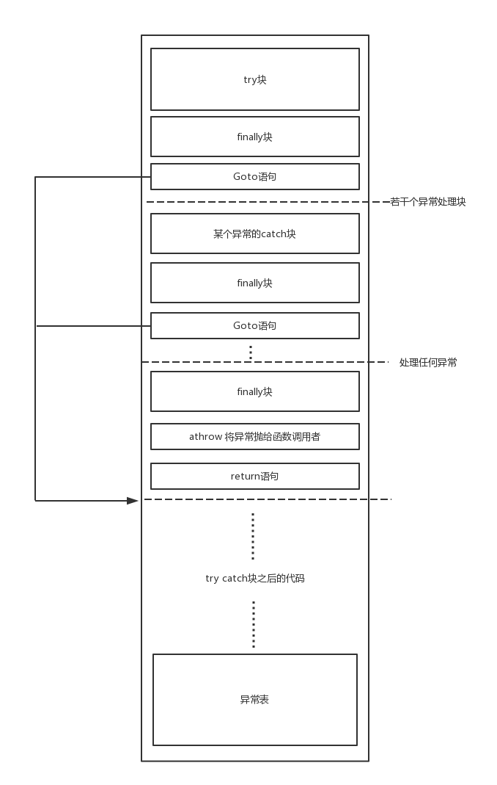

## Java异常的层次结构


**Throwable：** 它是Java所有异常的一个共同祖先。有三个重要方法：`getCause`，`getMeage` ，`printStackTrace`。

**Error：** 程序无法处理的错误，表示代码运行时JVM出现错误。如OutOfMemoryError，StackOverFlowError等。

**Exception：** 程序可处理的错误。 

Java异常可以分为可查异常和不可查异常。

**可查异常 Checked Exception：** 编译器要求必须处理的异常。除了RuntimeException及其子类以外，其他的Exception类及其子类都属于可查异常。这种异常的特点是Java编译器会检查它，也就是说，当程序中可能出现这类异常，要么用try-catch语句捕获它，要么用throws子句声明抛出它，否则编译不会通过。如IOException、SQLException等以及用户自定义的Exception异常，一般情况下不自定义检查异常。

**运行时异常 RuntimeException：** 都是RuntimeException类及其子类异常，如NullPointerException(空指针异常)、IndexOutOfBoundsException(下标越界异常)等，这些异常是不检查异常，程序中可以选择捕获处理，也可以不处理。这些异常一般是由程序逻辑错误引起的，程序应该从逻辑角度尽可能避免这类异常的发生。


参考：http://blog.csdn.net/hguisu/article/details/6155636


## JVM异常处理的原理

```java
public class Main {
    public static void main(String[] args) {
        int a = 1;
        int b = 3;
        try {
            b = a + b;
            return;
        } catch (RuntimeException e1) {
            b = a - b;
        } catch (Exception e2) {
            b = a * b;
        } finally {
            a = 0;
        }
    }
}
```

```
  public static void main(java.lang.String[]);
    Code:
       0: iconst_1
       1: istore_1 // 给局部变量表1号slot赋值为1，代表a
       2: iconst_3
       3: istore_2 // 给局部变量表2号slot赋值为3，代表b
       4: iload_1  // try块开始！
       5: iload_2
       6: iadd
       7: istore_2 // 指令4-7 完成了操作：b = a + b
       8: iconst_0 // finally块开始！
       9: istore_1 // 指令8-9 完成操作a=0
      10: return // 函数执行完毕，返回
      11: astore_3 // RuntimeException e1异常处理块开始！
      12: iload_1
      13: iload_2
      14: isub
      15: istore_2
      16: iconst_0 // finally处理块
      17: istore_1
      18: goto          38 // RuntimeException e1异常处理块结束！
      21: astore_3 // Exception e2异常处理块开始！
      22: iload_1
      23: iload_2
      24: imul
      25: istore_2
      26: iconst_0 // finally处理块
      27: istore_1
      28: goto          38 // Exception e2 异常处理块结束！
      31: astore        4 // 其他任何异常处理块
      33: iconst_0
      34: istore_1
      35: aload         4
      37: athrow // 往将异常外抛
      38: return
    Exception table: // 异常表
       from    to  target type
           4     8    11   Class java/lang/RuntimeException //4-8 号指令中，碰到 NullPointerException时，跳到 11 号指令
           4     8    21   Class java/lang/Exception
           4     8    31   any
          11    16    31   any
          21    26    31   any
          31    33    31   any
}
```

try 的范围就是体现在异常表行记录的起点和终点。JVM 在 try 住的代码区间内如有异常抛出的话，就会在当前栈桢的异常表中，找到匹配类型的异常记录的入口指令号，然后跳到该指令处执行。异常指令块执行完后，再回来继续执行后面的代码。JVM 按照每个入口在表中出现的顺序进行检索，如果没有发现匹配的项，JVM 将当前栈帧从栈中弹出，再次抛出同样的异常。当 JVM 弹出当前栈帧时，JVM 马上终止当前方法的执行，并且返回到调用本方法的方法中，但是并非继续正常执行该方法，而是在该方法中抛出同样的异常，这就使得 JVM 在该方法中再次执行同样的搜寻异常表的操作。

