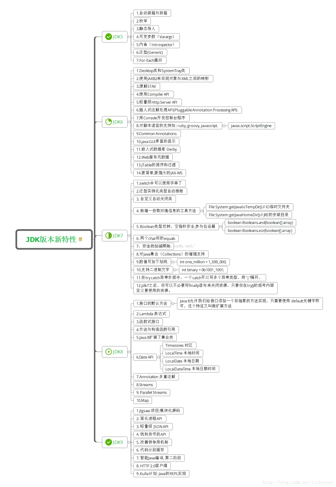
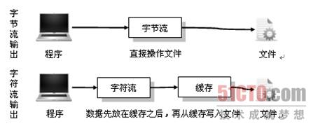

### 接口和抽象类的区别

抽象类不能被实例化，被用作子类模板；接口是抽象方法的集合，可以说是一种契约或协议。

| **参数**      | **抽象类**                                  | **接口**                                   |
| ----------- | ---------------------------------------- | ---------------------------------------- |
| 默认的方法实现     | 它可以有默认的方法实现                              | 接口完全是抽象的。它根本不存在方法的实现                     |
| 实现          | 子类使用**extends**关键字来继承抽象类。如果子类不是抽象类的话，它需要提供抽象类中所有声明的方法的实现。 | 子类使用关键字**implements**来实现接口。它需要提供接口中所有声明的方法的实现 |
| 构造器         | 抽象类可以有构造器                                | 接口不能有构造器                                 |
| 与正常Java类的区别 | 除了你不能实例化抽象类之外，它和普通Java类没有任何区别            | 接口是完全不同的类型                               |
| 访问修饰符       | 抽象方法可以有**public**、**protected**和**default**这些修饰符 | 接口方法默认修饰符是**public**。你不可以使用其它修饰符。        |
| main方法      | 抽象方法可以有main方法并且我们可以运行它                   | 接口没有main方法，因此我们不能运行它。                    |
| 多继承         | 抽象方法可以继承一个类和实现多个接口                       | 接口只可以继承一个或多个其它接口                         |
| 速度          | 它比接口速度要快                                 | 接口是稍微有点慢的，因为它需要时间去寻找在类中实现的方法。            |
| 添加新方法       | 如果你往抽象类中添加新的方法，你可以给它提供默认的实现。因此你不需要改变你现在的代码。 | 如果你往接口中添加方法，那么你必须改变实现该接口的类。              |

### 继承与组合

继承和组合都能从现有类型生成新类型。组合一般是将现有类型作为新类型底层实现的一部分加以复用，而继承复用的是接口。在开始一个设计时，一般应优先选择使用组合，必要时才使用继承。因为组合更具灵活性，可以在运行时改变成员对象的类型和行为。

### Arrays.sort和Collections.sort区别

Arrays用于操作数组，提供数组的复制，搜索，排序等方法；Collections是用于操作集合的的工具类，提供了排序，搜索，线程安全等方法。

在Collections.sort方法中，只是简单调用List.sort,然后最终调用Arrays.sort去实现排序的工作。

```java
	public static <T extends Comparable<? super T>> void sort(List<T> list) {
        Object[] a = list.toArray();
        Arrays.sort(a);
        ListIterator<T> i = list.listIterator();
        for (int j=0; j<a.length; j++) {
            i.next();
            i.set((T)a[j]);
        }
    }
```

Arrays.sort

在`JDK1.6`以下的时候：调用`sort`方法时，默认是使用`mergeSort`的算法
而`JDK1.7`后，使用`TimSort`的算法。

```java
    public static <T> void sort(T[] a, Comparator<? super T> c) {
        if (c == null) {
            sort(a);
        } else {
            if (LegacyMergeSort.userRequested)
                legacyMergeSort(a, c);
            else
                TimSort.sort(a, 0, a.length, c, null, 0, 0);
        }
    }
```

### Comparable 和 Comparator区别

```java
public interface Comparable<T> {
    public int compareTo(T o);
}
public interface Comparator<T> {
    public int compare(T lhs, T rhs);
    public boolean equals(Object object);
}
```

Comparable用于调用sort方法时传递进去，自定义排序策略。

Comparator用于构造集合类时传递进去，用于实现通过自定义排序策略的集合。

http://blog.csdn.net/u011240877/article/details/53399019

Comparator使用了典型的策略模式。

### Java反射为什么慢？

1. 编译器难以对动态调用的代码提前做优化，比如方法内联
2. 反射需要按名检索类和方法，有一定的时间开销
3. 因为接口的通用性，Java的invoke 方法 是传object和object[] 数组的。基本类型参数需要装箱和拆箱，产生大量额外的对象，频繁促发GC。

### jvm如何选择safepoint去进行GC

safepoint指的特定位置主要有:

1. 循环的末尾 (防止大循环的时候一直不进入safepoint，而其他线程在等待它进入safepoint)
2. 方法返回前
3. 调用方法的call之后
4. 抛出异常的位置

### JDK各个版本的新特性



Java8的新特性： https://zhuanlan.zhihu.com/p/26720346?utm_source=qq&utm_medium=social


### 重载"+"与StringBuilder区别

如果字符串操作比较简单，那可以信赖编译器的优化。但如果在循环内部使用"+"操作符拼接字符串的话，会造成大量无谓的StringBuilder对象产生。这时就应该使用StringBuilder了哦。

### instanceof 与 Class.isInstance VS Class.equals与==

instanceof 与 Class.isInstance的效果完全一样，equals与==的效果也一样。但instanceof保持了类型的概念，如果用==比较的是实际的Class对象，没有考虑继承。

### 如何实现equals方法

Object类的equals方法使用对象的地址计算散列码。正确的equals方法必须满足以下5个条件：

1. 自反性：对任意x，x.equals(x)==true
2. 对称性：对任意x和y，如果x.equals(y)==true，则y.equals(x)==true
3. 传递性
4. 一致性：只要对象中等价比较的信息没有改变，那么调用equals返回的结果应该一致
5. 考虑null值的比较。

### 如何实现hashCode方法

1. 给int变量result赋一个非零的值，如17
2. 为对象内每一个有意义的域计算一个int散列码
3. 合并计算得到的散列码：result=37*result+c
4. 返回result

如：

```java
    @Override
    public int hashCode() {
        int result = 17;
        result = 37 * result + f;
        result = 37 * result + obj.hashCode();
        return result;
    }
// String的hashCode实现：
    public int hashCode() {
        int h = hash; // Cache，默认为0
        if (h == 0 && value.length > 0) {
            char val[] = value;

            for (int i = 0; i < value.length; i++) {
                h = 31 * h + val[i];
            }
            hash = h;
        }
        return h;
    }
```

> 为什么要用31作为乘数？
>
> The value 31 was chosen because it is an odd prime（奇素数）. If it were even and the multiplication overflowed, information would be lost, as multiplication by 2 is equivalent to shifting. The advantage of using a prime is less clear, but it is traditional. A nice property of 31 is that the multiplication can be replaced by a shift and a subtraction for better performance: `31 * i == (i << 5) - i`. Modern VMs do this sort of optimization automatically.
>
> ---- 摘自《Effective Java》


###  面向对象三大特性

面向对象编程有三大特性：封装、继承、多态。

1. 封装：隐藏了类的内部实现机制，可以在不影响使用的情况下改变类的内部结构，同时也保护了数据。对外界而已它的内部细节是隐藏的，暴露给外界的只是它的访问方法。
2. 继承：为了重用父类代码。两个类若存在IS-A的关系就可以使用继承，同时继承也为实现多态做了铺垫。
3. 多态：在程序中所定义的引用变量以及它所调用的方法在编程时并不确定，而是程序运行时才确定，从而让程序有多种运行状态。
4. 多态分为编译时多态和运行时多态。编译时多态是指方法重载；运行时多态是通过动态绑定来实现的。
5. 多态实现的三个条件：继承，重写，向上转型。
6. 多态的实现方式：继承和接口。

### Java 序列化Serializable 

1. 序列化时，并不保存静态变量，这其实比较容易理解，序列化保存的是对象的状态，静态变量属于类的状态，因此 序列化并不保存静态变量。
2. 虚拟机是否允许反序列化，不仅取决于类路径和功能代码是否一致，一个非常重要的一点是两个类的序列化 ID 是否一致（就是 private static final long serialVersionUID = 1L）
3. 要想将父类对象也序列化，就需要让父类也实现Serializable 接口。如果父类不实现的话的，就 需要有默认的无参的构造函数。
4. 打开和读取序列化对象文件都需要相应对象的Class对象。
5. 通过实现Externalizable接口代替实现Serializable可以对序列化过程进行控制。
6. 使用transient关键字关闭对对象字段的序列化

Serializable与Parcelable：

1. Serializable的作用是为了保存对象的属性到本地文件、数据库、网络流、rmi以方便数据传输，当然这种传输可以是程序内的也可以是两个程序间的。而Android的Parcelable的设计初衷是因为Serializable效率过慢，为了在程序内不同组件间以及不同Android程序间(AIDL)高效的传输数据而设计，这些数据仅在内存中存在，Parcelable是通过IBinder通信的消息的载体。
2. Parcelable将如何打包和解包的工作自己来定义，而Serializable序列化的这些操作完全由底层实现。


### Java自定义序列化

可能是由于独特的序列化需求、性能方面的考虑又或是希望在对象反序列化后能够执行其他操作，我们需要重写这个默认的序列化实现。这时候，我们可以通过如下两个方法来实现。

- `private void writeObject(ObjectOutputStream out) throws IOException`
- `private void readObject(ObjectInputStream in) throws ClassNotFoundException, IOException`

由于这两个方法是私有的，那就意味着子类序列化方法既不会继承，也不会覆盖。也就是说，对于整个继承层次中的类，都会从父类至子类依次调用序列化操作。但是有的时候，我们希望子类复用父类的序列化实现，又或者子类重写父类的序列化实现，那么这时候我们就需要用到`java.io.Externalizable`接口了。

`java.io.Externalizable`接口具有两个公有的抽象方法：

- `public void writeExternal(ObjectOutput out) throws IOException`
- `public void readExternal(ObjectInput in) throws IOException, ClassNotFoundException`

### JSON的优缺点

1. 跟XML比传输体积更小，传输所需的带宽小。
2. 传输和解析的速度比XML快
3. JSON对数据的描述性比XML差

http://blog.jobbole.com/79252/

### finalize()方法什么时候被调用？作用是什么？

finalize是Object类的一个方法。垃圾回收器（garbage collector）决定回收某对象时，就会运行该对象的finalize()方法，但如果内存总是充足，那么gc就不会进行，那么finalize()方法就一直得不到执行。

它最主要的用途是回收特殊渠道申请的内存。java程序由垃圾回收器，所以一般情况下内存问题不用程序由操心。但有一种JNI(java native interface)调用non-java程序（c或c++），finalize()的工作就是回收这部分内存。

当GC发生时，如果对象被判定为有必要执行finalize方法，则将这个对象放置在一个F-Queue队列中，并在稍后一个由一个虚拟机自动建立的，低优先级的Finalizer线程去执行它。稍后GC将对F-Queue中的对象进行第二次小规模的标记。

一个对象的finalize方法都只会被系统自动调用一次。

### Java字节流与字符流

实际上字节流在操作时本身不会用到缓冲区（内存），是文件本身直接操作的，而字符流在操作时使用了缓冲区，通过缓冲区再操作文件。



### 你了解Kotlin吗？

- 支持类型推断，用 var 表示变量，val 表示常量
- Kotlin 支持类型推断，没有 Java 那样的啰嗦
- 用`?`解决空指针安全
- 支持方法扩展，类似于OC里的Category
- 支持字符串模板
- Lambda, 高阶函数，Streams API, 函数式编程支持
- Data Class

参考：[为什么我要改用Kotlin](http://droidyue.com/blog/2017/05/18/why-do-i-turn-to-kotlin/)