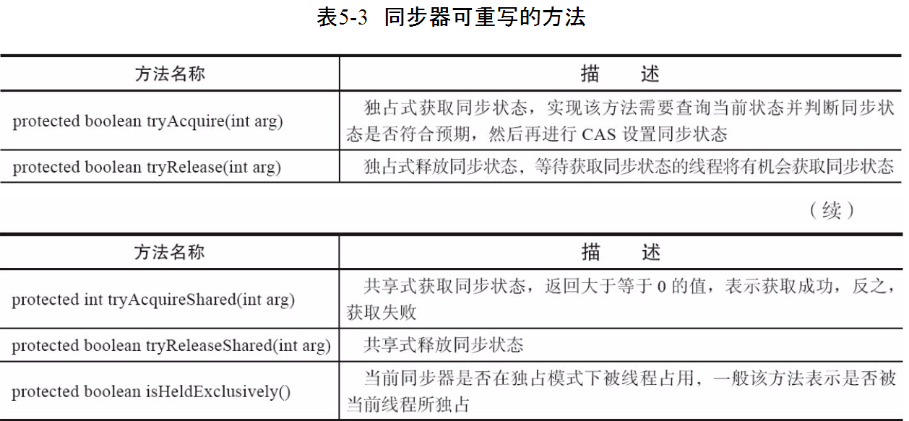
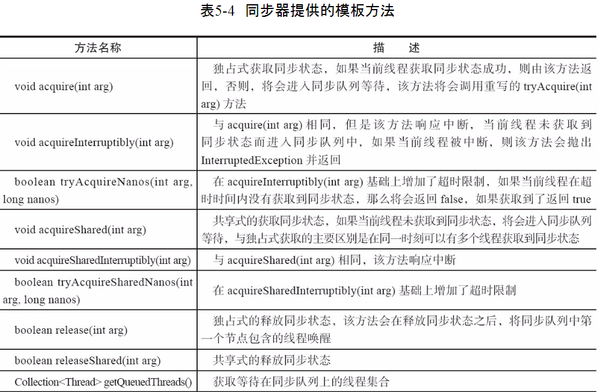
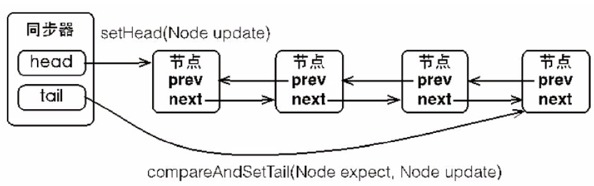
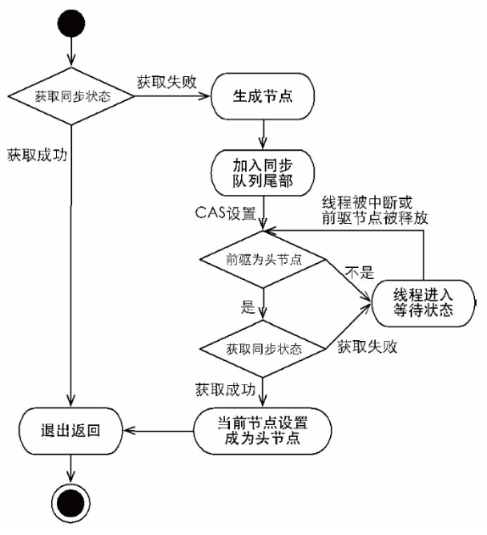
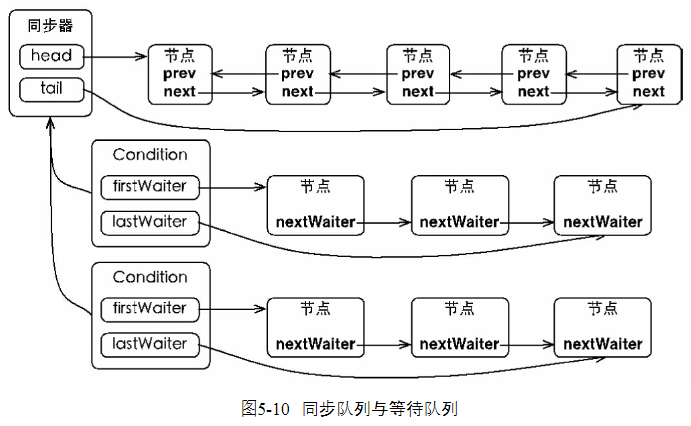
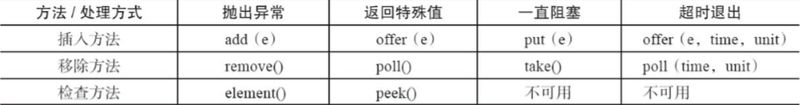
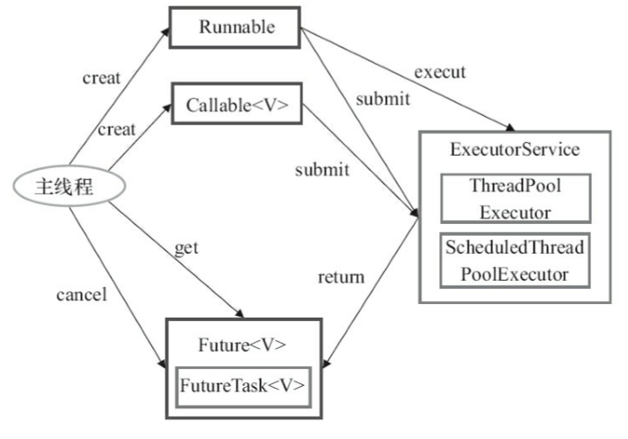
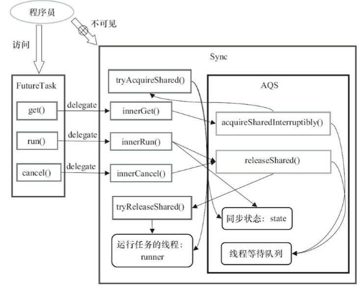

## volatile的实现原理

如果对声明了volatile的变量进行写操作，JVM就会向处理器发送一条Lock前缀的指令，将这个变量所在的缓存行数据写回到系统内存。这个写回操作会使其他CPU里缓存了该内存地址的数据无效。（处理器使用嗅探技术保证他的内部缓存，系统内存和其他处理器的缓存数据在总线上保持一致）

volatile的使用优化：

在使用volatile变量时追加到64个字节。一般的Cache的字长为64位，当处理器试图修改变量时，会将整个缓存行锁定。而如果一个volatile变量会独占一行，那么它的写操作就不会影响其他的volatile变量的读写了。

volatile的写-读的内存语义：

1. 当写一个volatile变量时，JMM会把该线程对应的本地内存中的共享变量值刷新到主内存。
2. 当读一个volatile变量时，JMM会把该线程对应的本地内存置为无效。线程接下来将从主内存中读取共享变量。


## synchronized 的实现原理

在编译后，monitorenter指令会插入到同步代码块的开始位置，monitorexit会插入到方法结束处和异常处。任何对象都有一个monitor与之关联。但线程执行到monitorenter指令时，将会尝试获取对象所对应的monitor的所有权，过程如下：

1. 如果monitor的进入数为0，则该线程进入monitor，然后将进入数设置为1，该线程即为monitor的所有者。

2. 如果线程已经占有该monitor，只是重新进入，则进入monitor的进入数加1.

3. 如果其他线程已经占用了monitor，则该线程进入阻塞状态，直到monitor的进入数为0，再重新尝试获取monitor的所有权。

当monitorexit执行后，monitor的进入数减1，如果减1后进入数为0，那线程退出monitor，不再是这个monitor的所有者。其他被这个monitor阻塞的线程可以尝试去获取这个 monitor 的所有权。 


偏向锁？轻量级锁？

http://www.cnblogs.com/paddix/p/5405678.html


## Java内存模型

Java的并发采用的是共享内存模型，Java线程之间的通信总是隐式进行，整个通信过程对程序员完全透明。


Java线程之间的通信由JMM控制，JMM决定一个线程对共享变量的写入何时对其他线程可见。线程的本地内存涵盖了缓存，写缓冲区，寄存器以及编译器优化等。

### 指令序列重排序

1. 编译器优化的重排序
2. 指令级并行的重排序
3. 内存系统的重排序。由于CPU使用缓存和读写缓冲区，这使得加载和存储操作是乱序执行的

软硬件技术的共同目标是在不改变程序执行结果的前提下，尽可能提高指令执行的并行度。

### happens-before

JMM中，如果一个操作执行的结果需要对另一个操作可见，那么这两个操作之间必须存在happens-before关系。happens-before仅仅要求前一个操作的执行结果对后一个操作可见，并不意味着前一个操作必须要在后一个操作之前执行。

一个happens-before规则对应一个或多个编译器和CPU重排序规则。因此happens-before是JMM给程序员的视图，重排序规则是JMM的实现。

### 锁的内存语义

1. 当线程释放锁时，JMM会把线程对应的本地内存中的共享变量刷新到主内存中。
2. 当线程获取锁时，JMM会把线程对应的本地内存置为无效。

加锁的过程需要读volatile变量state，释放锁的最后写volatile变量state。

### CAS

CAS:Compare and Swap。使用CAS循环来实现操作原子性和维护线程安全的方式是非阻塞算法的实现，即一个线程的失败或者挂起不应该影响其他线程的失败或挂起的算法。 

比如i++操作的原子性实现：

```java
public final int incrementAndGet() {
    for (;;) {
        int current = get();
        int next = current + 1;
        if (compareAndSet(current, next))
            return next;
    }
}
```

而compareAndSet利用JNI调用CPU的相应指令。

CAS的缺点：

1. ABA问题：因为CAS需要在操作值的时候检查下值有没有发生变化，如果没有发生变化则更新，但是如果一个值原来是A，变成了B，又变成了A，那么使用CAS进行检查时会发现它的值没有发生变化，但是实际上却变化了。ABA问题的解决思路就是使用版本号。在变量前面追加上版本号（类似于Serializable）。
2. 循环时间长开销大。
3. 只能保证一个共享变量的原子操作。


### concurrent包的实现

1. 声明共享变量为volatile变量
2. 使用CAS的原子条件更新来实现线程之间的同步
3. 配合以volatile的读写和CAS所具有的volatile读写的内存语义来实现线程间的通信


## Java中的锁

### 队列同步器

队列同步器AbstractQueuedSynchronizer，是用来构建锁或者其他同步组件的基础框架，它使用了**一个int成员变量表示同步状态**，通过内置的FIFO队列来完成资源获取线程的排队工作。同步器提供了`getState()`,`setState`,`compareAndSetState(int expect, int update)`三个方法来操作同步状态。

```java
public abstract class AbstractQueuedSynchronizer
    extends AbstractOwnableSynchronizer
    implements java.io.Serializable {
    static final class Node {...}
    private transient volatile Node head;
    private transient volatile Node tail;
    private volatile int state;//同步状态
```

**同步器面向的是锁的实现者，它简化了锁的实现方式，屏蔽了同步状态的管理，线程排队，等待与唤醒等底层的操作。**

同步器可重写的方法：



同步器提供的模板方法：



**同步器提供了独占式获取与释放同步状态，共享式获取与释放同步状态的模板方法。**

一个独占锁Mutex的实现：

```java
public class Mutex implements Lock {
    // 静态内部类，自定义同步器
    private static class Sync extends AbstractQueuedSynchronizer {
        // 是否处于占用状态
        protected boolean isHeldExclusively() {
            return getState() == 1;
        }

        // 当状态为0的时候获取锁
        public boolean tryAcquire(int acquires) {
            if (compareAndSetState(0, 1)) {
                setExclusiveOwnerThread(Thread.currentThread());
                return true;
            }
            return false;
        }

        // 释放锁，将状态设置为0
        protected boolean tryRelease(int releases) {
            if (getState() == 0) throw new
                    IllegalMonitorStateException();
            setExclusiveOwnerThread(null);
            setState(0);
            return true;
        }

        // 返回一个Condition，每个condition都包含了一个condition队列
        Condition newCondition() {
            return new ConditionObject();
        }
    }

	// 仅需要将操作代理到Sync上即可
    private final Sync sync = new Sync();
    public void lock() {
        sync.acquire(1);
    }

    public boolean tryLock() {
        return sync.tryAcquire(1);
    }

    public void unlock() {
        sync.release(1);
    }

    public Condition newCondition() {
        return sync.newCondition();
    }

    public boolean isLocked() {
        return sync.isHeldExclusively();
    }

    public boolean hasQueuedThreads() {
        return sync.hasQueuedThreads();
    }

    public void lockInterruptibly() throws InterruptedException {
        sync.acquireInterruptibly(1);
    }

    public boolean tryLock(long timeout, TimeUnit unit) throws InterruptedException {
        return sync.tryAcquireNanos(1, unit.toNanos(timeout));
    }

}
```


#### 同步队列

同步器依赖内部的同步队列(一个FIFO双向队列)来完成同步状态的管理，当前线程获取同步状态失效时，同步器会将当前线程以及等待状态等信息构造成为一个节点并将其加入同步队列，同时阻塞当前线程；当同步状态释放时，会把首节点中的线程唤醒，使其再次尝试获取同步状态。

在入队的过程中必须要保证线程安全，因此同步器提供了一个基于CAS来设置尾节点的方法：`compareAndSetTail(Node expect, Node update)`。

**首节点是获取同步状态成功的节点**，首节点的线程在释放同步状态时，会唤醒后继节点，而后继节点将会在获取同步状态成功时将自己设置为首节点。由于只有一个线程能够成功获取到同步的状态，因此设置首节点的方法并不需要使用CAS来保证。



#### 独占式同步状态的获取与释放

调用`acquire(int arg)`方法可以获取独占式同步状态：



将节点添加到队尾后，就进入一个自旋的过程，当前驱节点是首节点并且可以`tryAquire`可以获得同步状态时才会从自旋过程退出。

总结：在获取同步状态时，同步器维护一个同步队列，获取状态失败的线程都会被加入到队列中并在队列中进行自旋；移出队列的条件时前驱节点为头节点且成功获取同步状态。在释放同步状态时，同步器调用`tryRelease`方法释放同步状态，然后调用`unparkSuccessor`方法唤醒头节点的后继节点。


> AQS的模板方法acquire通过调用子类自定义实现的tryAcquire获取同步状态失败后
> ->将线程构造成Node节点(addWaiter)->将Node节点添加到同步队列对尾(addWaiter)
> ->节点以自旋的方法获取同步状态(acquirQueued)。在节点自旋获取同步状态时，只有其前驱节点是头节点的时候才会尝试获取同步状态，如果该节点的前驱不是头节点或者该节点的前驱节点是头节点单获取同步状态失败，则判断当前线程需要阻塞，如果需要阻塞则需要被唤醒过后才返回。
> -- 摘录自：https://zhuanlan.zhihu.com/p/27134110

#### 共享式同步状态的获取与释放

共享式访问资源时，其他共享式的访问均被允许，而独占式访问被阻塞；独占式访问资源时，同一个时刻其他访问均被阻塞。

### 重入锁ReetrantLock

当再次获取同步状态的处理逻辑：通过判断当前线程是否为获取锁的线程来决定获取操作是否成功，如果获取锁的线程再次请求，则将同步状态值进行增加并返回true，表示同步状态获取成功。

在释放锁时，如果该锁被获取了n次，那么前n-1次tryRelease方法必须返回false，而只有同步状态完全释放了，才能返回true。

公平与非公平获取锁的区别：如果是以公平锁的方式来获取锁，那么它会多判断一下同步队列中当前节点是否有前驱节点，只有等待前驱线程都获取并释放锁之后才能继续获取锁。

### 读写锁

因为同步器的同步变量是一个32位整型，需要采用按位切割的方法将变量切分成两部分，高16位表示读，低16位表示写。

写锁：只有等待其他线程都释放了读锁，写锁才能被当前线程获取，而写锁一旦被获取，则其他读写线程的后续访问均被阻塞。

读锁：如果其他线程已经获取了写锁，则当前线程无法获取锁，进入等待队列；如果当前线程获取了写锁或者写锁未被获取，则当前线程增加读状态（通过CAS来保证线程安全），成功获取写锁。

### LockSupport 工具

当需要阻塞或唤醒一个线程的时候，都会使用LockSupport工具类来完成。调用其park开头的方法来阻塞当前线程，以及unpark方法来唤醒一个被阻塞的线程。

### Condition

每个Condition对象都包含着一个FIFO等待队列，在队列中的每个节点都包含了一个线程引用，该线程就是在Condition对象上等待的线程，如果一个线程调用了Conditon.await方法，那么该线程将会释放锁，构造成节点加入等待队列并进入等待状态。

在Object的monitor监视器模型上，一个对象拥有一个同步队列（锁池）和等待队列，而并发包中的lock拥有一个同步队列（锁池）和多个等待队列。



调用Condition.await()方法会使当前线程进入等待队列并释放锁，同时线程进入等待状态。

调用Condition.signal()方法将会唤醒在等待队列中等待时间最长的节点，在唤醒节点之前，会将节点移到同步队列中。Condition.signalAll方法相当于对等待队列中每一个节点均执行一次signal方法，效果就是将等待队列中所有节点移到同步队列中。（跟Object的notify和notifyAll是可以类比的）

## 并发容器和框架

### ConcurrentHashMap

ConcurrentHashMap 类中包含两个静态内部类 HashEntry 和 Segment。HashEntry 用来封装映射表的键 / 值对；Segment 用来充当锁的角色，每个 Segment 对象守护整个散列映射表的若干个桶。每个桶是由若干个 HashEntry 对象链接起来的链表。一个 ConcurrentHashMap 实例中包含由若干个 Segment 对象组成的数组。

#### HashEntry

在 HashEntry 类中，key，hash 和 next 域都被声明为 final 型，value 域被声明为 volatile 型。

```java
 static final class HashEntry<K,V> { 
        final K key;                       // 声明 key 为 final 型
        final int hash;                   // 声明 hash 值为 final 型 
        volatile V value;                // 声明 value 为 volatile 型
        final HashEntry<K,V> next;      // 声明 next 为 final 型 
        HashEntry(K key, int hash, HashEntry<K,V> next, V value) { 
            this.key = key; 
            this.hash = hash; 
            this.next = next; 
            this.value = value; 
        } 
 }
```

散列时如果产生“碰撞”，将采用“分离链接法”来处理“碰撞”：把“碰撞”的 HashEntry 对象链接成一个链表。由于 HashEntry 的 next 域为 final 型，所以新节点只能在链表的表头处插入。

#### Segment

Segment 类继承于 ReentrantLock 类，从而使得 Segment 对象能充当锁的角色。每一个Segment守护着一个小型的hashmap。


#### 并发写 put

```java
 public V put(K key, V value) { 
        if (value == null)          //ConcurrentHashMap 中不允许用 null 作为映射值
            throw new NullPointerException(); 
        int hash = hash(key.hashCode());        // 计算键对应的散列码
        // 根据散列码找到对应的 Segment 
        return segmentFor(hash).put(key, hash, value, false); 
 }
 	// ----------------Segment中的put方法
 		V put(K key, int hash, V value, boolean onlyIfAbsent) { 
            lock();  // 加锁，这里是锁定某个 Segment 对象而非整个 ConcurrentHashMap 
            try { 
                int c = count; 

                if (c++ > threshold)     // 如果超过再散列的阈值
                    rehash();              // 执行再散列，table 数组的长度将扩充一倍

                HashEntry<K,V>[] tab = table; 
                // 把散列码值与 table 数组的长度减 1 的值相“与”
                // 得到该散列码对应的 table 数组的下标值
                int index = hash & (tab.length - 1); 
                // 找到散列码对应的具体的那个桶
                HashEntry<K,V> first = tab[index]; 

                HashEntry<K,V> e = first; 
                while (e != null && (e.hash != hash || !key.equals(e.key))) 
                    e = e.next; 

                V oldValue; 
                if (e != null) {            // 如果键 / 值对以经存在
                    oldValue = e.value; 
                    if (!onlyIfAbsent) 
                        e.value = value;    // 设置 value 值
                } 
                else {                        // 键 / 值对不存在 
                    oldValue = null; 
                    ++modCount;         // 要添加新节点到链表中，所以 modCont 要加 1  
                    // 创建新节点，并添加到链表的头部 
                    tab[index] = new HashEntry<K,V>(key, hash, first, value); 
                    count = c;               // 写 count 变量
                } 
                return oldValue; 
            } finally { 
                unlock();                     // 解锁
            } 
        }
```

#### 读 get

```java
public V get(Object key){
  int hash = hash(key.hashCode());
  return segmentFor(hash).get(key,hash);
}
 	// ----------------Segment中的get方法
		V get(Object key, int hash) { 
            if(count != 0) {       // 首先读 count 变量
                HashEntry<K,V> e = getFirst(hash); 
                while(e != null) { 
                    if(e.hash == hash && key.equals(e.key)) { 
                        V v = e.value; 
                        if(v != null)            
                            return v; 
                        // 如果读到 value 域为 null，说明发生了重排序，加锁后重新读取
                        return readValueUnderLock(e); 
                    } 
                    e = e.next; 
                } 
            } 
            return null; 
        }
```

整个get过程不需要加锁，除非读到的value为空时才会加锁重读。由于Segment的count属性和HashEntry的value属性都声明成volatile，它们对所有线程都是可见的，可以并发地读。

#### size操作

先尝试两次通过不加锁的方式统计各个Segment的count，如果统计过程容器的count发生变化(通过modCount变量)，则再采用加锁的方式来统计所有Segment的大小。

参考：https://www.ibm.com/developerworks/cn/java/java-lo-concurrenthashmap/#ibm-pcon

### 非阻塞队列 ConcurrentLinkedQueue

非阻塞队列的实现方式可以使用循环CAS的方式来实现。

1. 入队过程：定位出尾节点，使用CAS算法将入队设置成尾节点的next节点。
2. 出队过程：当head节点里有value时，直接弹出head节点里的元素，而不会更新head节点。只有当head节点里没有元素时，出队操作才会通过CAS更新head节点。

### BlockingQueue

阻塞队列是一个支持两个附加操作的队列，常用于生产者与消费者的场景。

1. 支持阻塞插入：当队列满时，队列会阻塞插入元素的线程
2. 支持阻塞移除：当队列为空，获取元素的线程会等待队列变为非空。 



JDK 7提供了7个阻塞队列，如下。

- ArrayBlockingQueue：一个由数组结构组成的有界阻塞队列。
- LinkedBlockingQueue：一个由链表结构组成的有界阻塞队列。
- PriorityBlockingQueue：一个支持优先级排序的无界阻塞队列。
- DelayQueue：一个使用优先级队列实现的无界阻塞队列。
- SynchronousQueue：一个不存储元素的阻塞队列。
- LinkedTransferQueue：一个由链表结构组成的无界阻塞队列。
- LinkedBlockingDeque：一个由链表结构组成的双向阻塞队列。


### CopyOnWriteArrayList

```java
	/** The lock protecting all mutators */
    final transient ReentrantLock lock = new ReentrantLock();
    /** The array, accessed only via getArray/setArray. */
    private transient volatile Object[] array;
```

每次修改数组的操作都需要加锁，copy整个数组，修改数组，通过setArray设置array的引用指向新数组，以此来实现读写分离，线程安全。

注意：array引用被声明了volatile，但这并不能保证数组内元素的值的线程间可见性。

## Executor框架

把工作单元与执行机制分离开来。工作单元包括Runnable和Callable，而执行机制由Executor框架提供。



ExecutorService的submit方法返回一个实现了Future接口的对象。

ThreadPoolExecutor通常适用工厂类Executors来创建。

### FixedThreadPool

```java
    public static ExecutorService newFixedThreadPool(int nThreads) {
        return new ThreadPoolExecutor(nThreads, nThreads,
                                      0L, TimeUnit.MILLISECONDS,
                                      new LinkedBlockingQueue<Runnable>());
    }
```

FixedThreadPool适用于为了满足资源管理的需求，而需要限制当前线程数量的应用场景，它适用于负载比较重的服务器。

FixedThreadPool使用无界队列LinkedBlockingQueue作为线程池的工作队列，典型的生产者和消费者模式，固定多个消费者。

### SingleThreadExecutor

```java
    public static ExecutorService newSingleThreadExecutor() {
        return new FinalizableDelegatedExecutorService
            (new ThreadPoolExecutor(1, 1,
                                    0L, TimeUnit.MILLISECONDS,
                                    new LinkedBlockingQueue<Runnable>()));
    }
```

SingleThreadExecutor适用于需要保证顺序执行各个任务；并且在任意时间点，不会有多个线程是活动的应用场景。

SingleThreadExecutor也使用无界队列LinkedBlockingQueue作为线程池的工作队列，只有一个消费者工作线程。

### CachedThreadPool

CacheThreadPool是一个大小无界的，无核心线程，但会根据需要创建新线程的线程池，适用于执行很多的短期异步任务的小程序，或者是负载较轻的服务器。使用SynchronousQueue作为工作队列。SynchronousQueue是一个无容量的阻塞队列，每个插入从左必须等待另一个线程对应的移除操作。

```java
    public static ExecutorService newCachedThreadPool() {
        return new ThreadPoolExecutor(0, Integer.MAX_VALUE,
                                      60L, TimeUnit.SECONDS,
                                      new SynchronousQueue<Runnable>());
    }
```

### ScheduledThreadPoolExecutor

```java
    public static ScheduledExecutorService newScheduledThreadPool(int corePoolSize) {
        return new ScheduledThreadPoolExecutor(corePoolSize);
    }
    public ScheduledThreadPoolExecutor(int corePoolSize) {
        super(corePoolSize, Integer.MAX_VALUE, 0, NANOSECONDS,
              new DelayedWorkQueue());
    }
```

ScheduledThreadPoolExecutor的核心线程数固定，容量无界。用于定时执行任务或在给定的延迟之后执行任务。

DelayedWorkQueue封装了一个PriorityQueue，对队列中的ScheduleFutureTask根据time进行排序。

### FutureTask

FutureTask实现了Future接口和Runnable接口。当FutureTask处于未启动或已启动状态时，执行FutureTask.get方法将导致调用线程阻塞，执行FutureTask.cancel方法将导致此任务永远不会执行；当FutureTask处于已完成状态时，执行FutureTask.get方法会立即返回执行结果，执行FutureTask.cancel(true)将试图中断任务线程，FutureTask.cancel(false)将不会对正在执行此任务的线程产生影响。

FutureTask的实现基于AbstractQueuedSynchronizer(AQS)，内部声明了一个继承于AQS的子类Sync。

JDK8：FutureTask通过自己维护state的值的更新并在内部构造线程阻塞队列。



FuturnTask.get会通过AQS的tryAcquire方法会检查同步状态state来决定将线程放入同步队列或者是返回结果数据；

FuturnTask.run会通过AQS的tryRelease会调用Callable.run方法，然后以CAS更新同步状态，最后是唤醒线程等待队列中的第一个线程，并调用FuturnTask.done方法。

