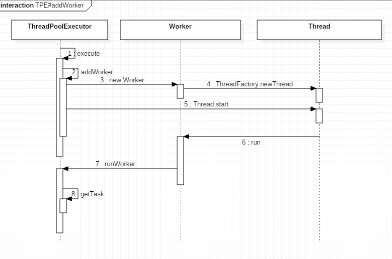

## 重要的类或成员

### ctl

```java
private final AtomicInteger ctl = new AtomicInteger(ctlOf(RUNNING, 0));
```

ThreadPoolExecutor用这一个原子整型变量保存了两个内容：

- 所有有效线程的数量
- 线程池的运行状态（runState）

低29位存线程数，高3位存`runState`(线程池的运行状态),这样runState有5个值：

- RUNNING:-536870912
- SHUTDOWN:0
- STOP:536870912
- TIDYING:1073741824
- TERMINATED:1610612736

### Worker

```java
private final class Worker extends AbstractQueuedSynchronizer implements Runnable
```

Worker是ThreadPoolExecutor的静态内部类，主要是对Thread对象的包装，一个Worker内部有一个Thread对象。同时Worker继承自AQS来实现一个简单互斥锁，每一个任务的执行前和执行后都会分别获取和释放一次锁。（acquiring and releasing a lock surrounding each task execution）这样做是为了让线程执行任务时屏蔽中断操作。

那么为什么不用ReentrantLock呢？其实是为了避免在任务执行中修改线程池的变量和状态，不能用可重入锁。参考：[stackoverflow](https://stackoverflow.com/questions/42189195/why-threadpoolexecutorworker-extends-abstractqueuedsynchronizer)

```
We implement a simple non-reentrant mutual exclusion lock rather than use ReentrantLock because we do not want worker tasks to be able to reacquire the lock when they invoke pool control methods like setCorePoolSize. -- From java doc
```


## execute

###  execute(Runnable command)

```java
    public void execute(Runnable command) {
        int c = ctl.get(); // 获取线程池的状态
        if (workerCountOf(c) < corePoolSize) { // 如果当前工作线程数小于所配置的核心线程数
            if (addWorker(command, true)) // 新建一个工作线程作为核心线程，并把该任务交给它执行
                return;
            c = ctl.get();
        }
        if (isRunning(c) && workQueue.offer(command)) { // 往等待队列添加任务
          // double-check
            int recheck = ctl.get();
            if (! isRunning(recheck) && remove(command))
                reject(command);
            else if (workerCountOf(recheck) == 0)
                addWorker(null, false);
        }
        else if (!addWorker(command, false)) // 开辟一个线程执行该任务
            reject(command);
    }
```

### addWorker

```java
    private boolean addWorker(Runnable firstTask, boolean core) {
      ...
        Worker w = null;
        try {
            w = new Worker(firstTask);// 参见1.
            final Thread t = w.thread;
            if (t != null) {
                final ReentrantLock mainLock = this.mainLock;
                mainLock.lock();
                try {
                  ...
                        workers.add(w); // workers是一个HashSet，一个工作线程的集合
                  ...
                } finally {
                    mainLock.unlock();
                }
                if (workerAdded) {
                    t.start(); // 参见2.
                    workerStarted = true;
                }
            }
        } finally {
            if (! workerStarted)
                addWorkerFailed(w);
        }
        return workerStarted;
    }
```

1.  创建Worker对象，同时通过线程工厂创建一个新的线程

```java
        Worker(Runnable firstTask) {
            setState(-1); // inhibit interrupts until runWorker
            this.firstTask = firstTask;
          // this是指Worker对象，它将作为Thread的Runnable target
            this.thread = getThreadFactory().newThread(this); 
        }
```


2.  启动Worker线程，由于Worker也是一个Runnable对象，在Worker线程启动之后，Worker的run方法会被调用

```java
        /** Delegates main run loop to outer runWorker  */
        public void run() {
            runWorker(this); //Worker线程开始工作啦
        }
```


### runWorker(Worker w)

ThreadPoolExecutor#runWorker会开启worker线程的子任务循环。

```java
    final void runWorker(Worker w) {
        Thread wt = Thread.currentThread();
        Runnable task = w.firstTask;
        w.firstTask = null;
        w.unlock(); // allow interrupts
        try {
            while (task != null || (task = getTask()) != null) { // 参见1.
                w.lock(); // 开始执行任务前加锁，屏蔽中断
              ...
                try {
                    beforeExecute(wt, task);
                  ...
                    try {
                        task.run(); // 执行子任务
                    } catch (RuntimeException x) {
                        thrown = x; throw x;
                    } catch (Error x) {
                        thrown = x; throw x;
                    } catch (Throwable x) {
                        thrown = x; throw new Error(x);
                    } finally {
                        afterExecute(task, thrown);
                    }
                } finally {
                    task = null;
                    w.completedTasks++;
                    w.unlock(); // 执行完任务，开中断
                }
            }
            completedAbruptly = false;
        } finally {
            processWorkerExit(w, completedAbruptly);
        }
    }
```

1. getTask()方法会从任务队列中取任务，如果工作队列没有任务则工作线程会被阻塞直到被生产者唤醒。

```java
    private Runnable getTask() {
    ...
        for (;;) {
          	...
            try {
                Runnable r = timed ?
                    workQueue.poll(keepAliveTime, TimeUnit.NANOSECONDS) :
                    workQueue.take(); // 从任务等待队列中取任务
              ...
            } catch (InterruptedException retry) {
                timedOut = false;
            }
        }
    }
```

### 调用时序



## 总结

ThreadPoolExecutor作为最基础的线程池，提供了多个可配置参数，如核心线程数，最大线程数，线程超时销毁，线程工厂，任务等待队列，拒绝策略等，方便开发者基于此做各种灵活的定制。

ThreadPoolExecutor利用BlockingQueue实现典型的生产者和消费者模型，为Java开发者提供了优秀的范本。


## 参考

http://www.cnblogs.com/zhanjindong/p/java-concurrent-package-ThreadPoolExecutor.html