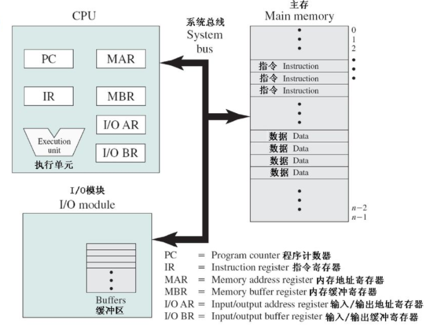
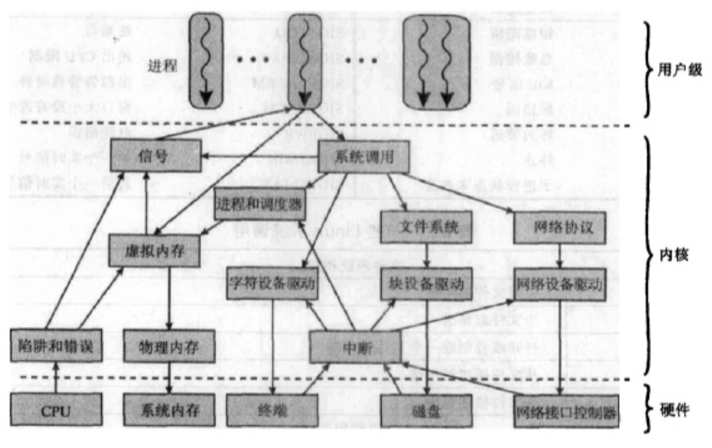
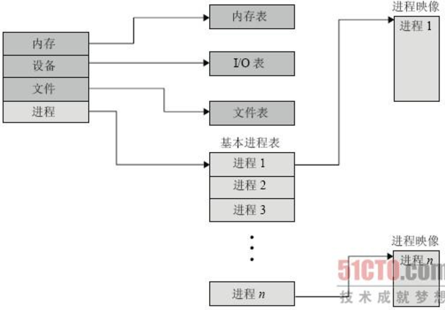
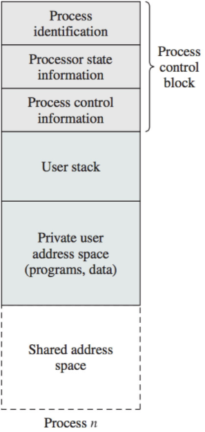
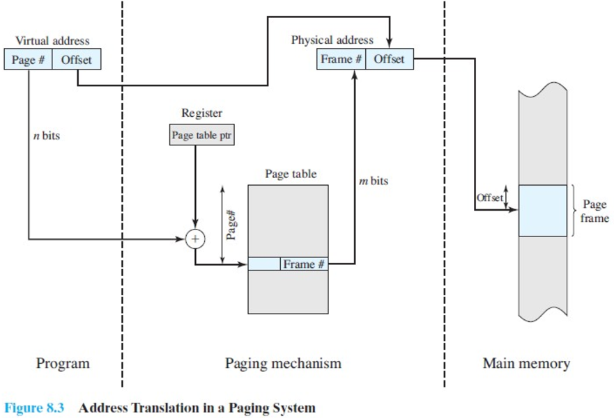
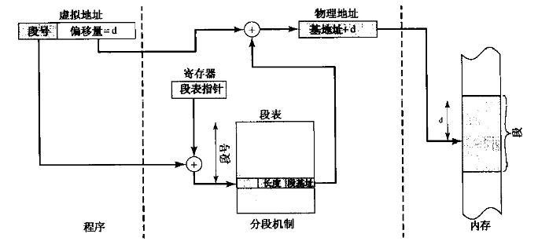
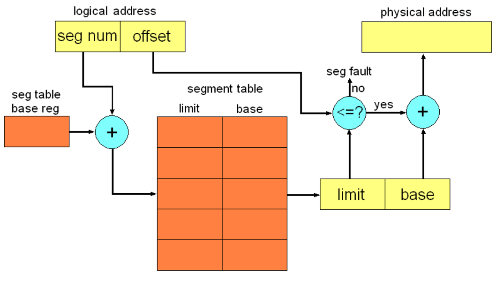
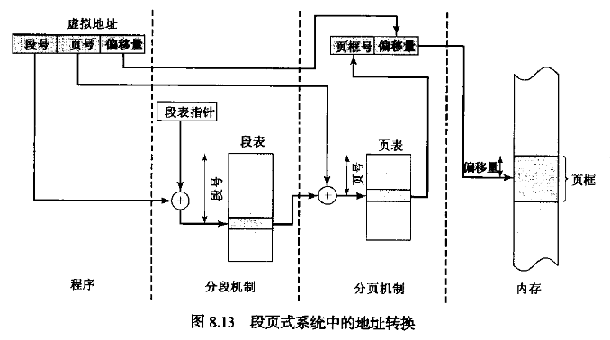
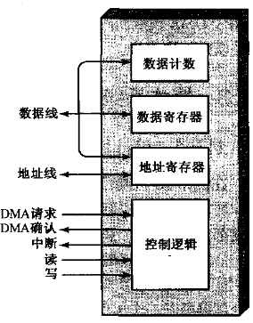

# 操作系统概述

## 计算机基本构成

- MAR确定下一次读写的内存地址
- MBR存放要写入存储器的数据或者从存储器中读取的数据
- IO AR确定一个特定的输入输出设备
- IO BR用于在IO模块和CPU之间交换数据

## 操作系统的基本功能

1. 作业管理
2. 进程管理
3. 存储管理
4. 文件管理
5. 设备管理

Linux 内核组件：

# 进程管理

## 进程控制块

进程是由程序代码和相关数据还有进程控制块组成。

进程控制块信息分为三类：

- 进程标识信息
- 处理器状态信息
- 进程控制信息

具体如下；

- 标识符：进程的ID
- 状态：如果进程正在执行，那么进程处于运行态
- 优先级
- 程序计数器
- 内存指针：包括程序代码和进程相关数据的指针，还有和其他进程共享内存块的指针
- 上下文数据：进程执行时CPU中寄存器中的数据
- I/O状态信息：包括显示I/O请求，分配给进程的I/O设备和被进程使用的文件列表
- 记账信息：使用时钟数总和，时间限制等待

## 进程状态

## 进程描述

一般操作系统维护着4种不同类型的表：内存，I/O，文件和进程。

- 内存表用于跟踪内存和外存。包含分配给进程的内存和外存的信息，进程共享内存区域的信息，管理虚拟内存所需的任何信息。
- I/O表管理计算机系统中I/O设备和通达。
- 文件表提供关于文件是否存在，文件在外存中的位置，当前状态和其他属性的信息。
- 进程表中每一个表项都含有一个指向进程映像的指针。

一个进程需要足够的内存空间来保存该进程的程序和数据。程序，数据，栈和属性的集合称为进程映像，属性的集合就是进程控制块。

## 进程创建

1. 给新进程分配一个唯一的进程标识符
2. 给进程分配空间。包括进程映像中的所有元素。
3. 初始化进程控制块PCB。进程ID，CPU状态信息，进程控制信息等信息的初始化
4. 设置新的连接。如将进程控制块链接到相应的调度队列的链表上。

## 进程和线程

**进程包含两个独立的特点**：

- 资源所有权。一个进程包括一个存放进程映像的虚拟地址空间。一个进程总是拥有对资源的控制或所有权，这些资源包括内存，I/O设备和文件。
- 程序调度/执行。一个进程沿着通过一个或多个程序的一条执行路径执行。

操作系统为了独立区分这两个特点，分派的单位通常是线程或轻量级进程，而拥有资源所有权的单位是进程。

多线程是指操作系统在单个进程内只吃多个并发执行路径的能力。在多线程环境中，进程只有一个与之关联的进程控制块和用户地址空间。但每个线程都有一个独立的栈和一个独立的线程控制块用于包含寄存器值，优先级和其他与线程相关的状态信息。

**内核线程与用户线程**

用户线程的优点：

- 线程的切换不需要切换到内核态，节省了状态转换的开销
- 线程调度算法的实现更加简单
- 用户线程可以在任何操作系统中运行，兼容性更好

用户线程的缺点：

- 当一个用户线程执行系统调用时，这个进程中的所有线程都会被阻塞
- 在纯粹的用户级线程策略中，一个多线程程序不能利用多处理器技术。内核只为一个进程分配一个处理器。

内核线程：

内核可以同时把一个进程中多个线程调度到多个处理器中；而且，如果进程中的一个线程被阻塞，内核可以调度进程中的另一个线程。

## 并发机制

操作系统为进程间的通信和同步提供了各种机制。管道，消息和共享内存提供了进程间传递数据的方法，而信号量和信号则用于其他进程的触发行为。

- 管道

管道是一个固定字节大小的缓冲区，允许两个进程以生产者/消费者的模型进行通信。因此，这是一个FIFO队列，一个进程写，另一个进程读。只有有亲缘关系的进程才可以共享匿名管道，而不相关的进程只能共享命名管道。

- 消息队列

每个进程都有与之关联的消息队列，其功能类似于信箱。

- 共享内存

共享内存是虚存中由多个进程共享的一个公共内存块。

- 信号量

操作系统通过PV原语来操作信号量。

- 信号

进程间可以互相发送信号，内核也可能在内部发送信号。信号的传递是通过修改信号要发送到的进程所对应的**进程表**中的一个域来完成。只有在进程被唤醒继续运行时，或者进程准备从系统调用中返回时，才能处理信号。

# 内存管理

内存管理技术：

| 技术     | 说明                                       | 优势                                  | 缺点                  |
| ------ | ---------------------------------------- | ----------------------------------- | ------------------- |
| 固定分区   | 在系统生成阶段，内存被划分成许多静态分区。进程可以被装入到大于或等于自身大小的分区 | 实现简单，开销小                            | 有内部碎片；活动进程的最大数目是固定的 |
| 动态分区   | 分区是动态生成的，每个进程可以被装入与自身大小正好相等的分区中          | 没有内部碎片，可以更充分地使用内存                   | 由于需要压缩外部碎片，处理器利用率低  |
| 简单分页   | 内存被划分成许多大小相等的页块；要装入进程，需要把进程包含的所有页都装入到内存中不一定连续的某些页块中 | 没有外碎片                               | 有少量内碎片              |
| 简单分段   | 每个进程被划分成许多段；要装入进程，需要把进程包含的所有段都装入到内存中不一定连续的某些动态分区中。 | 没有内碎片                               | 存在外碎片               |
| 虚拟内存分页 | 非驻留页在以后需要时自动调入内存                         | 没有外碎片；支持更高道数的多道程序设计；巨大的虚存空间         | 复杂的内存管理开销           |
| 虚拟内存分段 | 非驻留段在以后需要时自动调入内存                         | 没有内碎片；支持更高道数的多道程序设计；巨大的虚存空间；支持保护和共享 | 复杂的内存管理开销           |

## 分页

内存被划分成大小固定的页框，操作系统必须为每个进程维护一个页表，建立虚拟空间中的页块到物理内存中的页块的映射，CPU使用页号和页内位移来计算物理地址。

## 分段

分页对用户透明，分段对用户是可见的。
在段式存储管理中内存空间被动态的划分为若干长度不一的**物理段**，每个物理段在内存对应一个起始地址，称为**段首址**，在每一个物理段中由0开始编址，称为**段内地址**。每一个进程都有一个唯一的段表，每个段表项包含段号，相应段在内存中的起始地址和段的长度。

## 段页式

# I/O管理和磁盘调度

## I/O技术发展

执行I/O的三种技术：

- 可编程I/O：处理器代表一个进程给I/O模块发送一个I/O命令；该进程进入忙等待，直到操作完成才可以继续执行
- 中断驱动I/O
- DMA方式；一个DMA模块控制内存和I/O模块之间的数据交换。

## DMA

当处理器想读或写一块数据时，它通过向DMA模块发送一下信息：

- 是否请求读操作或写操作，通过CPU与DMA模块之间的读写控制线发送
- 相关I/O设备地址，通过数据线传送
- 操作内存的起始地址，在数据线上传送并保存在DMA模块的地址寄存器中
- 读或写的字数，通过数据线传送，保存在其数据计数寄存器中

DMA模块直接从内存或向内存传送整块数据，一次传送一个字，并不再需要通过CPU。传送结束后DMA给CPU发送一个中断信号。因此，只有在传送开始和结束时才会用到CPU。

