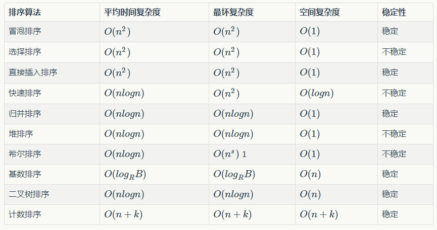

## 快速排序

```java
    private void quickSort(int[] a,int left, int right) {
        //if (a.length <= 1) return;
        if (right <= left) return;
        int base = a[left];
        int i = left, j = right;
        while (true) {
            while (a[j] >= base && i < j)
                j--;
            while (a[i] <= base && i < j)
                i++;
            if (i != j)//当i==j时就没必要交换了
                swap(a, i, j);
            else break;
        }
        swap(a, left, i);
        quickSort(a, left, i - 1);
        quickSort(a, i + 1, right);
    }
```

## 归并排序

```java
    private void mergeSort(int[] array, int start, int end) {
        if (start >= end) return;
        int mid = (start + end) >> 1;
        mergeSort(array, start, mid);
        mergeSort(array, mid + 1, end);
        merge(array, start, mid, end);
    }

    private void merge(int[] array, int start, int mid, int end) {
        System.arraycopy(array, start, bak, start, end - start + 1);
        int i = start, j = mid + 1;
        for (int k = start; k <= end; k++) {
            if (i > mid) {
                array[k] = bak[j++];
            } else if (j > end) {
                array[k] = bak[i++];
            } else if (bak[j] < bak[i]) {
                array[k] = bak[j++];
            } else {
                array[k] = bak[i++];
            }
        }
    }
```

## 堆排序

```java
    public void sort(int[] a) {
        int last = a.length - 1;
        for (int i = (last - 1) / 2; i >= 0; i--) {
            swiftDown_(a, i, last);
        }
        while (last != 0) {
            swap(a, 0, last--);
            swiftDown_(a, 0, last);
        }
    }

    // 调整最小堆
    private void swiftDown(int[] a, int p, int last) {
        while (true) {
            int left = p * 2 + 1;
            int right = p * 2 + 2;
            int sankVex = p;
            if (left <= last && a[sankVex] > a[left]) sankVex = left;
            if (right <= last && a[sankVex] > a[right]) sankVex = right;
            if (sankVex != p) {
                swap(a, p, sankVex);
                p = sankVex;
            } else break;
        }
    }

protected void swap(int i, int j, int[] a) {
    int t = a[i];
    a[i] = a[j];
    a[j] = t;
} 
```

## 冒泡排序

```java
    public void sort(int[] a) {
        if (a == null) return;
        for (int i = 0; i < a.length; i++) {
            for (int j = 1; j < a.length - i; j++) {
                if (a[j] < a[j - 1]) {
                    int temp = a[j];
                    a[j] = a[j - 1];
                    a[j - 1] = temp;
                }
            }
        }
    }
```

## 选择排序

```java
    public void sort(int[] a) {
        if (a == null) return;
        for (int i = 0; i < a.length; i++) {
            for (int j = i; j < a.length; j++) {
                if (a[i] > a[j]) {
                    int temp = a[i];
                    a[i] = a[j];
                    a[j] = temp;
                }
            }
        }
    }
```

## 插入排序

```java
    public void sort(int[] a) {
        for (int i = 1; i < a.length; i++) {
            int insertNum = a[i];
            int j = i - 1;
            while (j >= 0 && a[j] > insertNum) {
                a[j + 1] = a[j];
                j--;
            }
            a[j + 1] = insertNum;
        }
    }
```


## 总结



时间复杂度比较：

| **排序方法**   | **平均时间**  | **最好时间** | **最坏时间** |
| ---------- | --------- | -------- | -------- |
| 桶排序(不稳定)   | O(n)      | O(n)     | O(n)     |
| 基数排序(稳定)   | O(n)      | O(n)     | O(n)     |
| 归并排序(稳定)   | O(nlogn)  | O(nlogn) | O(nlogn) |
| 快速排序(不稳定)  | O(nlogn)  | O(nlogn) | O(n^2)   |
| 堆排序(不稳定)   | O(nlogn)  | O(nlogn) | O(nlogn) |
| 希尔排序(不稳定)  | O(n^1.25) |          |          |
| 冒泡排序(稳定)   | O(n^2)    | O(n)     | O(n^2)   |
| 选择排序(不稳定)  | O(n^2)    | O(n^2)   | O(n^2)   |
| 直接插入排序(稳定) | O(n^2)    | O(n)     | O(n^2)   |


## 问题

- 为什么快速排序的时间复杂度是o(nlogn)？

每次quicksort过程中，有一个partition操作和两个递归分支。因此一个完整的quicksort相当于在构造一个颗满二叉树。树高是logn，而树中每一层加起来的时间复杂度都是o(n)，因此整个快速排序的时间复杂度为o(nlogn)。