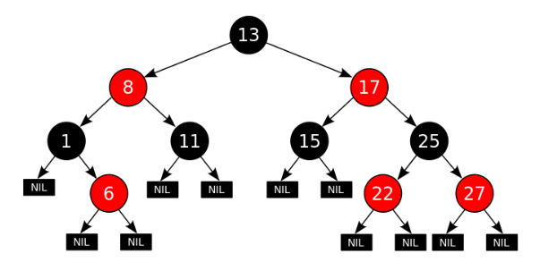
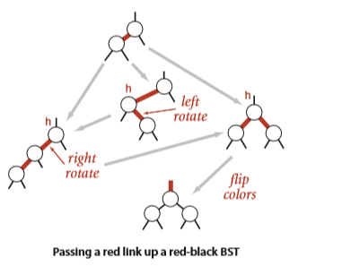
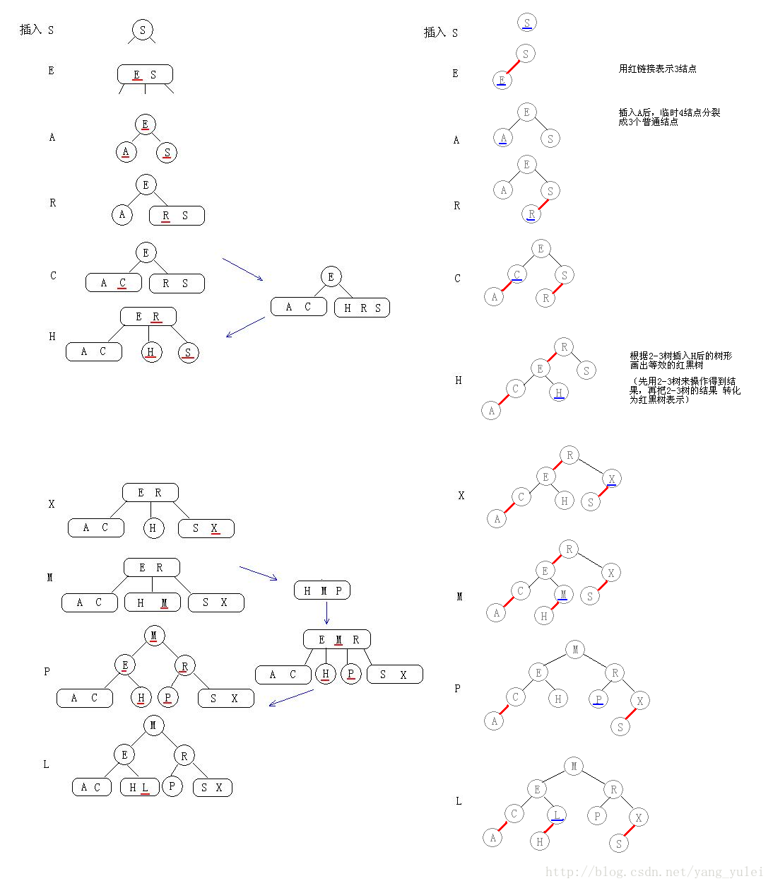

红黑树是2-3-4树的一种等同。

红黑树相对于AVL树来说，牺牲了部分平衡性以换取插入/删除操作时少量的旋转操作，整体来说性能要优于AVL树。

### 来自维基百科

红黑树的性质和定义：

红黑树是每个节点都带有颜色属性的二查搜索树，颜色为红色和黑色。

1. 根节点是黑色的
2. 所有叶子节点是黑色的。（叶子是NIL节点）
3. 每个红色节点必须有两个黑色的子节点
4. 从任意节点到其每个叶子的所有简单路径都包含相同数目的黑色节点

、

### 来自《算法》

用另一种等价的定义，定义边的红黑而不是节点的红黑。

红黑树就是用红链接表示3-结点的2-3树。

红黑树是满足下列条件的二叉查找树：

1. 红链接均为左链接。
2. 没有任何一个结点同时和两条红链接相连。
3. 该树是完美黑色平衡的，即任意空链接到根结点的路径上的黑链接数量相同。

如果我们将一颗红黑树中的红链接画平，那么所有的空链接到根结点的距离都将是相同的。

#### 旋转

#### 插入

