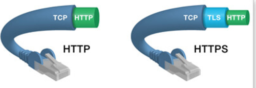
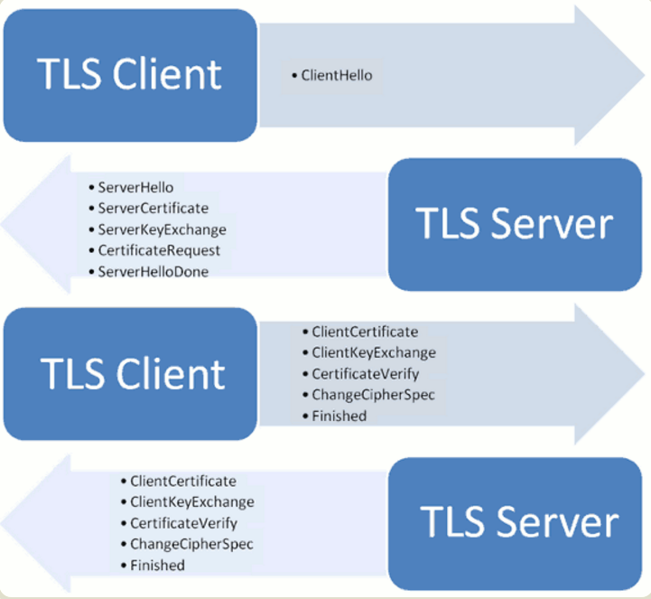

## 什么是HTTPS

**HTTP+数据加密+身份认证+数据完整性保护=HTTPS**

- 数据加密；传输内容进行加密
- 身份验证：通信双方验证对方的身份真实性
- 数据完整性保护：检测传统的内容是否被篡改或伪造

HTTPS由HTTP进行通信，但利用SSL/TLS来加密数据包，默认使用端口443。



### 加密方式

HTTPS采用混合加密机制：

1. 使用非对称加密技术对密钥进行加密
2. 再确保密钥安全的前提下，使用对称加密的方式进行通信


加密的过程中涉及到公钥和私钥。公钥就相当于锁头，任何人都能知道，私钥就相当于与锁头配对的唯一钥匙，不公开。

### 身份认证

数字签名是附加在报文上的特殊加密校验码，可以证明是作者编写了这条报文，前提是作者才会有私钥，才能算出这些校验码。如果传输的报文被篡改，则校验码不会匹配，因为校验码只有作者保存的私钥才能产生，所以前面可以保证报文的完整性。

证书信任的方式

- 操作系统和浏览器内置
- 权威的证书颁发机构
- 手动指定证书

**数字证书**包含以下内容；

- 对象名称
- 过期时间
- 证书发布者（担保者）
- 来自证书发布者的数字签名
- 对象的公开密钥

### 数据完整性

检测传输的内容是否被篡改或伪造。

**数字签名**是只有信息发送者才能产生的别人无法伪造的一段文本，这段文本是对信息发送者发送信息真实性的一个有效证明，具有不可抵赖性。

**数字签名的生成过程：**

报文的发送方从报文文本生成一个128位的散列值（或称为报文摘要活哈希值），发送方使用自己的私钥对这个摘要值进行加密来形成发送方的数字签名。然后这个数字签名将作为报文的附件一起发送给报文的接收方。报文的接收方首先从接收到的原始报文中计算出128位的散列值，再用发送方的公钥来对报文附加的数字签名进行解密。如果两次得到的结果是一致的那么接收方可以确认信息是真实的 ，否则说明发送方是假冒的或者报文被篡改了。


## SSL协议和握手过程

HTTP中没有加密机制，可以通过SSL（Secure Socket Layer 安全套接层）或TLS（Transport Layer Security 安全层传输协议）的组合使用，加密HTTP的通信内容。



**1. 客户端发出请求 ClientHello**

在这一步，客户端需要协商协议版本号和加密算法。

```
1. 服务端你好，我能理解的密码套件有RSA/3DES或DSS/AES，请问我们使用哪一种密码套件进行通信呢？
```

客户端主要向服务器提供以下信息：

（1） 支持的协议版本，比如TLS 1.0版。

（2） 一个客户端生成的随机数，稍后用于生成"对话密钥"。

（3） 支持的加密方法，比如RSA公钥加密。

（4） 支持的压缩方法。

**2. 服务端回应 ServerHello**

服务器收到客户端请求后，向客户端发出回应。

```
2.你好，我们就用RSA/3DES来进行通信吧。
3.这是我的证书（非匿名通信时）
4.我们用这些信息来进行密钥交换吧。（当证书的信息不足时）
5.对了，请给我看一下你的证书吧
6.问候到此结束
```

服务器的回应包含以下内容：

（1） 确认使用的加密通信协议版本，比如TLS 1.0版本。

（2） 一个服务器生成的随机数，稍后用于生成"对话密钥"。

（3） 确认使用的加密方法，比如RSA公钥加密。

（4） 服务器证书。

**3. 客户端回应**

客户端收到服务器回应以后，首先验证服务器证书。如果证书没有问题，客户端就会从证书中取出服务器的公钥。

```
7.这是我的证书
8.这是经过加密的预备主密钥(pre-master key)
9.我就是持有客户端证书的本人
10.好，现在我要切换密码了
11.握手协议到此结束
```

客户端的回应包含以下内容：

（1） 一个随机数。该随机数用服务器公钥加密，防止被窃听。

（2） 编码改变通知，表示随后的信息都将用双方商定的加密方法和密钥发送。

（3） 客户端握手结束通知，表示客户端的握手阶段已经结束。

此时客户端已经获取全部的计算协商密钥需要的信息：两个明文随机数 random_C 和 random_S 与自己计算产生的 Pre-master，计算得到协商密钥：enc_key=Fuc(random_C, random_S, Pre-Master)

**4. 服务端最后回应**

服务器收到客户端的第三个随机数pre-master key之后，计算生成本次会话所用的"会话密钥"。

```
12.好，现在我要切换密码了
13.握手协议到此结束
```

小结握手过程：

1. 客户端给出协议版本号、一个客户端生成的随机数（Client random），以及客户端支持的加密方法。
2. 服务器确认双方使用的加密方法，并给出数字证书、以及一个服务器生成的随机数（Server random）。
3. 客户端确认数字证书有效，然后生成一个新的随机数（Premaster secret），并使用数字证书中的公钥，加密这个随机数，发给服务器。
4. 服务器使用自己的私钥，获取客户端发来的随机数（即Premaster secret）。
5. 这样，客户端和服务器都可以根据约定的加密方法，使用前面的三个随机数，生成"对话密钥"（session key），用来加密接下来的整个对话过程。


## Android客户端与HTTPS

okhttp支持的https的网站基本都是CA机构颁发的证书，默认情况下是可以信任的。app客户端与自己服务端交互的时候可能也会遇到自签名证书。甚至在开发安全级别很高的app时，需要用到双向证书的验证。客户端需要预先把自签名证书注册为可信任证书。

**参考：**https://developer.android.google.cn/training/articles/security-ssl.html?hl=zh-cn


## 参考&拓展

- http://www.wosign.com/faq/faq2016-0309-04.htm
- http://mouxuejie.com/blog/2017-03-16/https-ssl-tls-introduction/
- http://www.ruanyifeng.com/blog/2014/02/ssl_tls.html
- http://www.ruanyifeng.com/blog/2014/09/illustration-ssl.html
- [深入理解HTTPS原理、过程与实践](https://zhuanlan.zhihu.com/p/26682342)
- [图解HTTPS](http://www.cnblogs.com/zhuqil/archive/2012/07/23/2604572.html)
- [一篇文章为你深度解析 HTTPS 协议](http://blog.csdn.net/qcloudcommunity/article/details/60964718)


