## 协议之间的关系

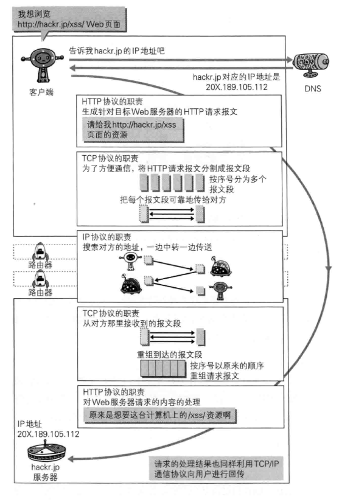

## URI的格式

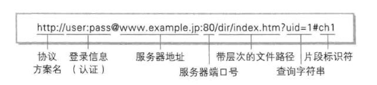

## Http/1.1 协议

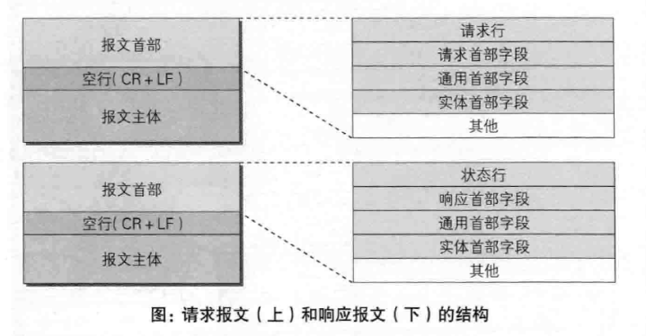

### 请求报文格式

请求报文由请求方法，请求URI，协议版本，可选的请求首部字段和内容实体构成。

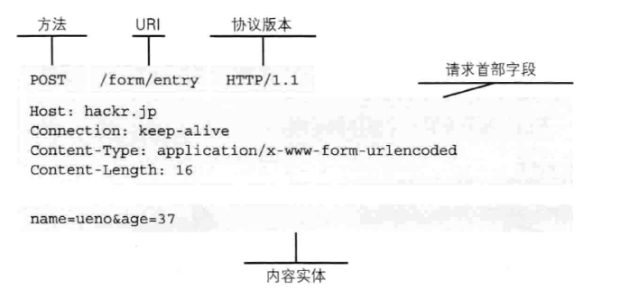

### 响应报文格式

响应报文基本由协议版本，状态码，用以解析状态码原因的短语，可选的响应首部字段以及实体主体构成。

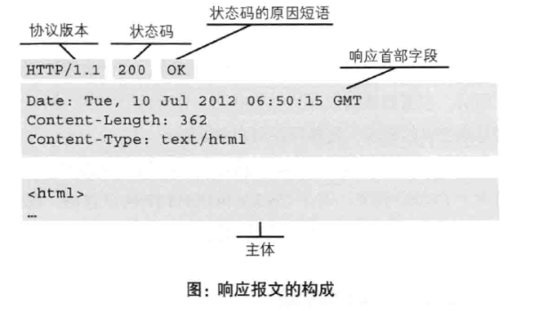

### 请求方法

1. GET 从服务端获取资源
2. POST 提交参数给服务端
3. PUT 向传输文件文件
4. DELETE 删除服务端中的对应URI 的资源
5. HEAD 与GET方法一样，只是不返回报文主体不问。
6. OPTIONS 查询针对请求URI 指定的资源支持的方法


## 事务

一个HTTP事务由一条（从客户端发往服务器的）请求命令和一个（从服务器发往客户端的）响应结果组成。

## HTTP连接的处理


### Connection首部

在客户端和服务器之间常常会存在多个中间体。Connection首部可以承载三类不同类型的标签：

- HTTP首部字段名，告诉负责转发的中间体在转发前把相应的header删除
- 任意标签值
- close。说明操作完成后需要关闭这条持久连接。

### 并行连接

通过多条TCP连接发起并发的HTTP请求。

缺点：

- 每个事务都会打开/关闭一条新的连接，会耗费时间和带宽
- 由于TCP慢启动特性的存在，每条新连接的性能都会有所降低
- 可打开的并行连接数量实际上是有限的

### 持久连接

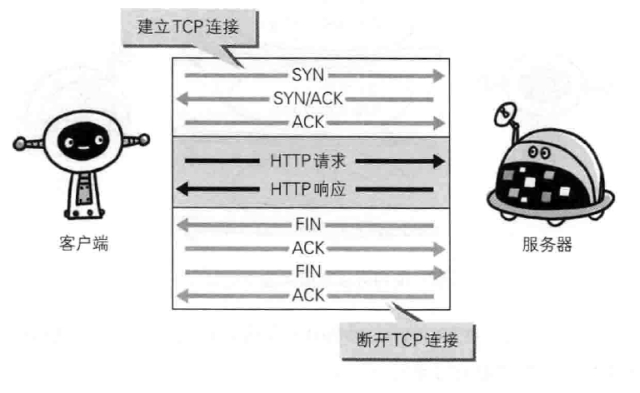

HTTP协议采用的是"请求-应答" 模式，是无状态无连接的协议。当使用普通模式时，每一个请求/应答都需要新建一个连接，完成之后需要断开连接。

持久连接特点是，只要任意一端没有明确提出断开连接，则保持TCP连接状态。

http 1.0中默认是关闭的，需要在http头加入"Connection: Keep-Alive"，才能启用Keep-Alive；http 1.1中默认启用Keep-Alive，如果加入"Connection: close "，才关闭。

http://a280606790.iteye.com/blog/1095085

## 发送多种数据的多部分对象集合

发送一份报文主体内可包含有多类型实体。

使用boundary字符串来划分多部分对象集合指明的各类实体。在boundary字符串指定的各个实体的起始行之前插入"--"标记。

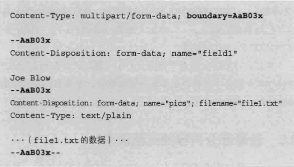

## 范围请求

指定范围发送的请求叫做范围请求（Range Request）。

在执行范围请求时，会用首部字段Range来指定资源的byte范围。

- 5001-10000字节

```
Range: bytes=5001-10000
```

- 从5001字节之后全部的

```
Range: bytes=5001-
```

- 从一开始到3000字节和5000-7000字节的多重范围

```
Range: bytes=-3000,5000-7000
```

针对范围请求，响应会返回状态吗为206 Partial Content的响应报文。对于多重范围，响应会在添加首部Content-Type: multipart/byteranges。

如果服务端无法响应范围请求，则返回状态码 200 OK和完整的实体内容。


## Http响应的状态码

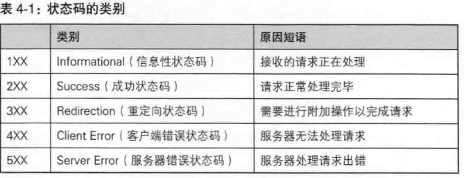

### 2XX 成功

1. 200 OK
2. 204 No Content 请求处理成功，但服务器没有资源可返回。

 ### 3XX 重定向

1. 300 Multiple Choice 客户端请求一个实际指向多个资源的URL时会返回这个状态码。
2. 301 Moved Permanently 资源的URI已更新，需要更新书签引用。
3. 302 Found 临时性重定向。
4. 303 See Other  告知客户端应该用另一个URL来获取资源。
5. 304 Not Modified 表示请求未满足访问的条件。304状态码返回时，不包含任何响应的主体部分。

### 4XX 客户端错误

1. 400 Bad Request 表示请求报文中存在语法错误。
2. 401 Unauthorized 表示发送的请求需要通过HTTP认证的认证信息。
3. 403 Forbidden 表明对请求资源的访问被服务器拒绝了。
4. 404 Not Found 服务器上没有请求的资源。

### 5XX 服务器错误

1. 500 Internal Server Error 表明服务器端在执行请求时发生了错误。
2. 503 Service Unavailable 表明服务器暂时处于超负载或正在停机维护。


## Web服务器

- 用单台虚拟主机实现多个域名

虚拟主机可以寄存多个不同主机名和域名的web网站，但http请求的IP地址确实相同的。因此在放松HTTP请求时，必须在Host首部内完整指订主机名或域名的URI。

- 代理

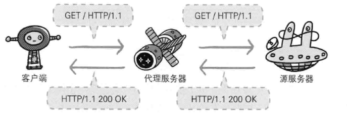

- 网关

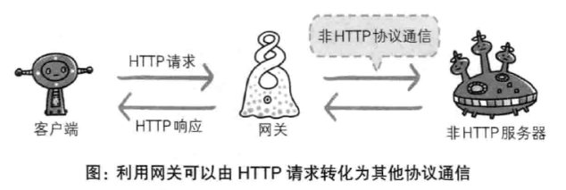

利用网关能提高通信的安全性，因为可以在客户端与网关之间的通信线路上加密以确保连接安全。

- 隧道

隧道的目的时确保客户端能与服务器进行安全的通信，客户端与服务端之间使用SSL等加密手段进行通信。


## HTTPS首部

### 分类

- 通用首部字段：请求报文和响应报文两方都会使用的首部。

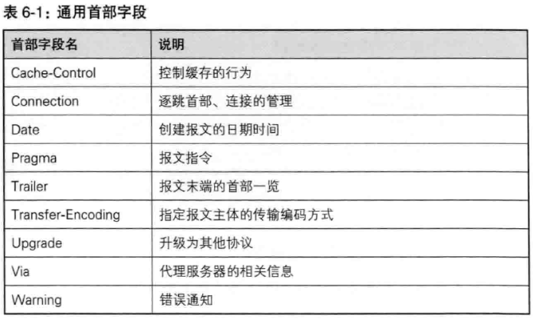

- 请求首部字段：请求报文包含的首部

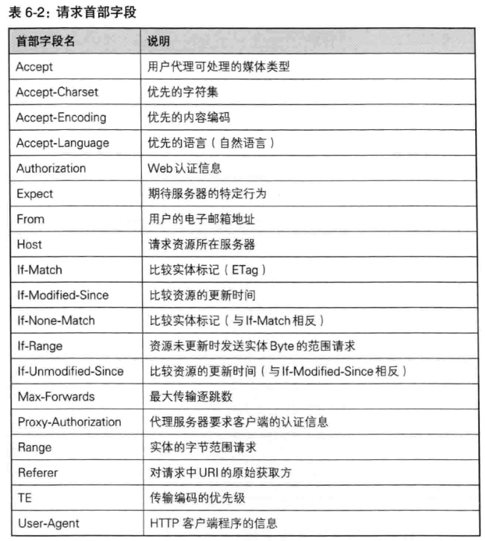

- 响应首部字段：响应报文包含的首部

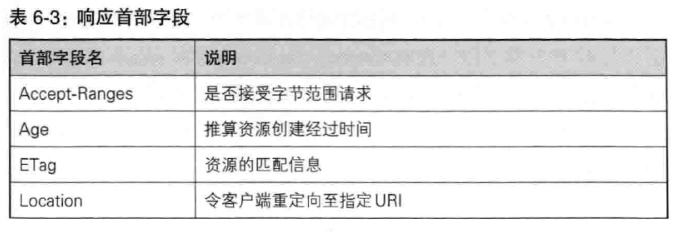

- 实体首部字段：针对报文的实体部分使用的首部


### Cache-Control

参考：https://developers.google.com/web/fundamentals/performance/optimizing-content-efficiency/http-caching?hl=zh-cn

http://www.uml.org.cn/site/201701042.asp

操作缓存的工作机制。多个指令之间通过","来分隔。

```java
Cache-Control: private, max-age=0, no-cache
```

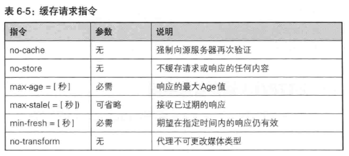

| 指令              | 参数   | 说明       |
| --------------- | ---- | -------- |
| only-if-cached  | 无    | 从缓存中获取资源 |
| cache-extension | -    | 新指令标记    |


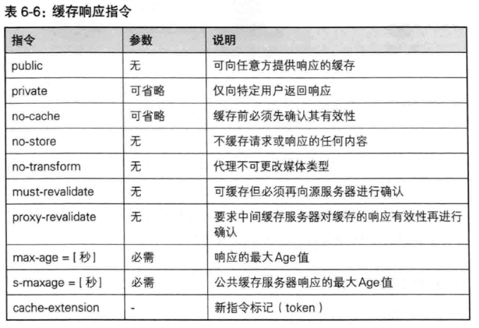

#### no-cache指令

```
Cache-Control: no-cache
```

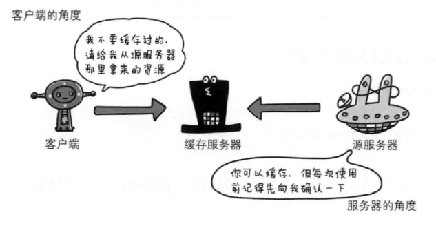

#### no-store指令

```
Cache-Control: no-store
```

规定缓存不能在本地存储请求或响应的任一部分。


#### max-age指令

```
Cache-Control: max-age=604800
```

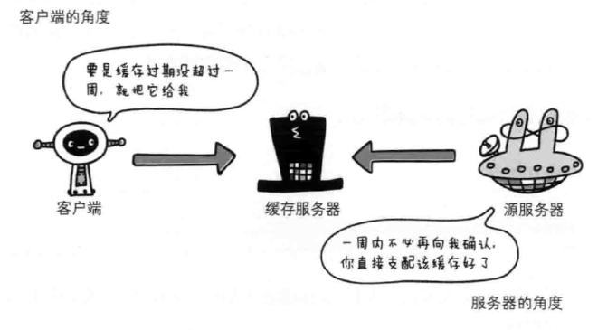

#### min-fresh指令

```
Cache-Control: min-fresh=60
```
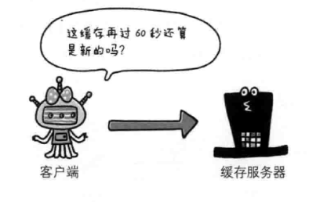

#### max-stale指令

即使过期了也照样接收。

#### only-if-cached指令

表示客户端仅在缓存服务器本地缓存目标资源的情况下才会要求其返回。


### Connection

HTTP/1.1之前的HTTP版本默认连接都是非持久连接。为此，向维持持续连接则需要指定Connection首部字段的值为Keep-Alive。


### Transfer-Encoding

规定了传输报文主体时采用的编码方式。


### Accept

通知服务器，用户能够处理的媒体类型以及媒体类型的相对优先级。

```
Accept: text/html,application/xhtml+xml,application/xml
```

### Authorization

用来告知服务器，用户代理的认证信息。


### Location

将响应接收方引导至某个与请求URI位置不同的资源。该字段会配合3XX的响应，提供重定向的URI。

### Expires

将资源失效的日期告知客户端。源服务器不希望缓存服务器对资源缓存时，最好将Expires设置为与Date相同的时间值。

### Cookie相关的首部

#### Set-Cookie

响应报文的首部，当服务器准备开始管理客户端状态时，会事先告知各种信息。

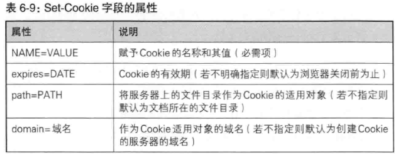

#### Cookie

请求报文的首部。

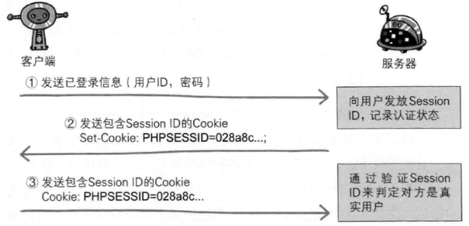

## Https

HTTP的缺点：

- 通信使用明文，内容可能会被窃取
- 不验证通信方身份，可能遭遇伪装
- 无法证明报文的完整性，有可能被篡改。

HTTP协议中没有加密机制，但可以通过和SSL或TLS的组合使用，加密HTTP的通信内容。

SSL不仅提供加密处理，还使用了一种被称为证书的手段。证书由值得信任的第三方机构颁发，用以证明服务器和客户端实际存在的。

**HTTP+加密+认证+完整性保护=HTTPS**

通常，HTTP直接和TCP通信。当使用SSL时，则演变成先和SSL通信，再由SSL和TCP通信。

HTTPS采用混合加密机制：

1. 使用非对称加密技术对密钥进行加密
2. 再确保密钥安全的前提下，使用对称加密的方式进行通信

如何校验服务器端的公钥是货真价实的呢？这时就需要数字证书认证机构了。

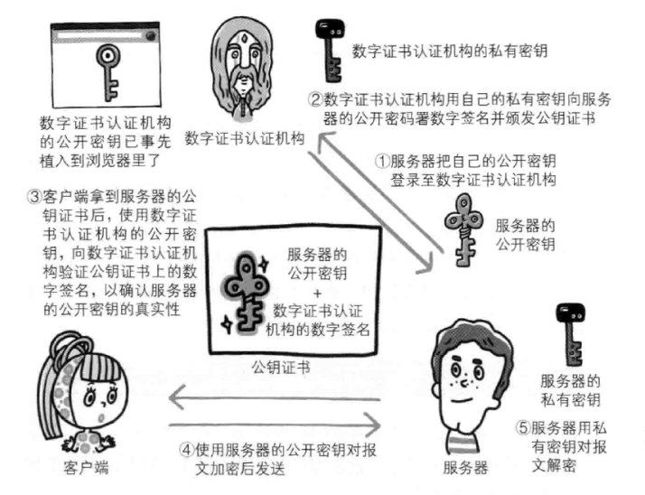

