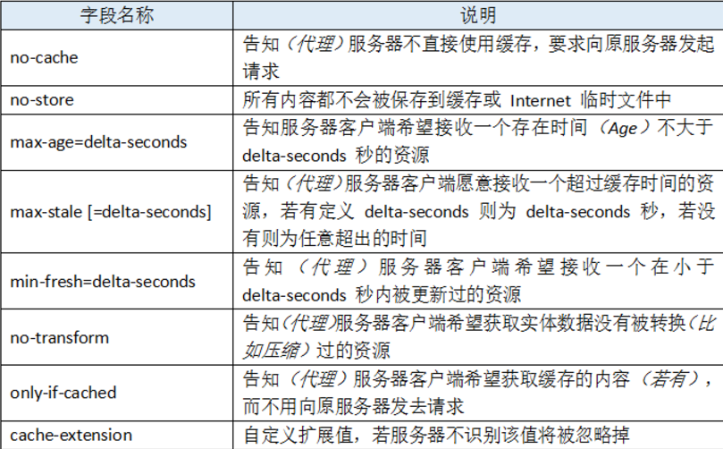
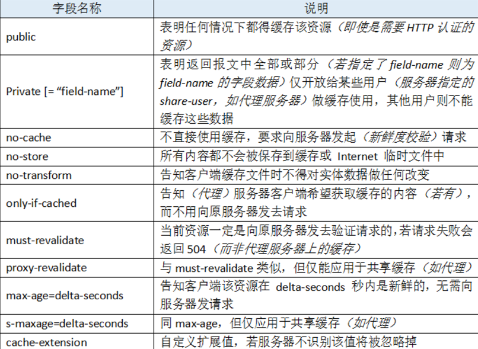
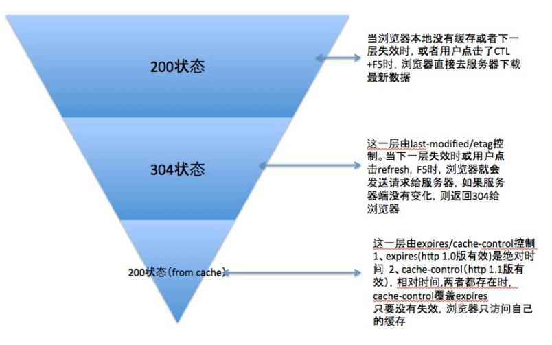

## 缓存的拓扑结构

### 私有缓存

私有缓存是个人缓存，一般是指浏览器中内建的缓存。

### 公有代理缓存

公有缓存是缓存代理服务器，接受来自多个用户的访问。

## 缓存处理步骤

对于浏览器端的缓存来说，这些规则是在HTTP报文头和HTML页面的META标签中定义的。他们分别从新鲜度和校验值两个维度来规定浏览器是否可以直接使用缓存中的副本，还是需要去源服务器获取更新的版本。

- **新鲜度**：缓存副本的有效期。
- **校验值**：服务器返回资源时有时在控制头中带上这个资源实体标签ETag，它可以用来作为浏览器再次请求过程的校验标识。如果发现校验标识不匹配，说明资源已经被修改或过期，浏览器需要重新获取资源内容。

对一条报文的基本缓存处理过程：

1. 接收：缓存从网络中读取抵达的请求报文
2. 解析：缓存对报文进行解析，提取出URL和各种首部
3. 查询：缓存查看是否有本地副本可用
4. 新鲜度检测：检查缓存是否足够新鲜
5. 创建响应
6. 发送
7. 日志

## 浏览器端的缓存规则

### 使用HTML META标签

```html
<META HTTP-EQUIV="Pragma" CONTENT="no-cache">
```

上面代码是告诉浏览器当前页面不被缓存，每次访问都需要去服务器拉取。这种方式只有部分浏览器可以支持，而且所有缓存代理服务器都不支持，因为代理不解析HTML内容本身。

### 使用HTTP Header

#### 1. Pragma

```http
Pragma: no-cache
```

这是服务器告知客户端不要对资源读缓存，每次都需要向服务器发一次请求才行。

这是http1.0定义的header，在http1.1被Cache-Control代替。

#### 2. Expires

```http
Expires: Fri, 11 Jun 2021 11:33:01 GMT
```

Pragma用来禁用缓存，那么Expires就是用来告诉浏览器资源缓存过期的时间，告诉浏览器在过期时间前浏览器可以直接从浏览器缓存取数据，而无需再次请求。

#### 3. Cache-Control

http1.1新增了 Cache-Control 来定义缓存过期时间。注意：若报文中同时出现了 Expires 和 Cache-Control，则以 Cache-Control 为准。
也就是说优先级从高到低分别是 **Pragma -> Cache-Control -> Expires** 。

作为请求首部时，cache-directive 的可选值有：



作为响应首部时，cache-directive 的可选值有：



**no-Store与no-Cache的区别**

no-Store要求接收方不要将响应保存下来，而on-Cache允许接收方可以把响应缓存下来，但这些缓存不能直接用，必须经过向服务器发送校验请求后才能使用。

#### 4. 缓存校验字段

客户端上某个资源保存的缓存时间过期了，但这时候其实服务器并没有更新过这个资源，那么直接告诉客户端直接使用缓存就好了。

就像这样一个场景：

```
C：小服，你几岁了？
S：小客，我18岁了。
=================================
C：小服 ，你几岁了？我猜你18岁了。
S：靠，你知道还问我？（304）
=================================
C：小服 ，你几岁了？我猜你18岁了。
S：小客 ，我19岁了。（200）
```

##### 1. Last-Modified/If-Modified-Since

Last-Modified/If-Modified-Since要配合Cache-Control使用。

服务器将资源传递给客户端时，会将资源最后更改的时间以“Last-Modified: GMT”的形式加在实体首部上一起返回给客户端。

```http
Last-Modified: Fri, 22 Jul 2016 01:47:00 GMT
```

客户端会为资源标记上该信息，下次再次请求时，会把该信息附带在请求报文中一并带给服务器去做检查。

```http
If-Modified-Since: Fri, 22 Jul 2016 01:47:00 GMT
```

若传递的时间值与服务器上该资源最终修改时间是一致的，则说明该资源没有被修改过，直接返回`304`状态码，**内容为空**，这样就节省了传输数据量 。如果两个时间不一致，则服务器会发回该资源并返回`200`状态码，和第一次请求时类似。

##### 2. ETag/If-None-Match

Last-Modified标注的最后修改只能精确到秒级，因此Http1.1还推出了 **ETag 实体首部**字段。Etag/If-None-Match也要配合Cache-Control使用。服务器会通过某种算法，给资源计算得出一个唯一标志符（比如md5标志），在把资源响应给客户端的时候，会在实体首部加上“ETag: 唯一标识符”一起返回给客户端。

```http
Etag: "5d8c72a5edda8d6a:3239"
```

客户端会保留该 ETag 字段，并在下一次请求时将其一并带过去给服务器。

```http
If-None-Match: "5d8c72a5edda8d6a:3239"
```

服务器只需要比较客户端传来的ETag跟自己服务器上该资源的ETag是否一致，就能很好地判断资源相对客户端而言是否被修改过了。


## 总结

浏览器第一次请求：


浏览器再次请求时：




## 参考与拓展

- [HTTP缓存控制小结](http://imweb.io/topic/5795dcb6fb312541492eda8c)
- [HTTP 缓存](https://developers.google.cn/web/fundamentals/performance/optimizing-content-efficiency/http-caching?hl=zh-cn#etag)
- [浅谈浏览器http的缓存机制](http://www.cnblogs.com/vajoy/p/5341664.html)
- [【Web缓存机制系列】1 – Web缓存的作用与类型](http://alloyteam.com/2012/03/web-cache-1-web-cache-overview/)
- [浅谈Web缓存](http://www.alloyteam.com/2016/03/discussion-on-web-caching/)