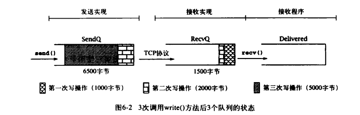

## 什么是Socket

Socket是对TCP/IP协议的封装，Socket本身并不是协议，而是一个调用接口(API)。Socket通常也称作”套接字”，用于描述IP地址和端口，是一个通信链的句柄。网络上的两个程序通过一个双向的通讯连接实现数据的交换，这个双向链路的一端称为一个Socket。

## 使用TCP


客户端

```java
Socket socket = new Socket("ip", 端口);

InputStream is = socket.getInputStream();
DataInputStream dis = new DataInputStream(is);

OutputStream os = socket.getOutputStream();
DataInputStream dos = new DataOutputStream(os);
```

服务器端

```java
ServerSocket serverSocket = new ServerSocket(端口);
Socket socket = serverSocket.accept();
//获取流的方式与客户端一样
```

读取输入流

```java
byte[] buffer = new byte[1024]; 
do{ 
    int count = is.read(buffer); 
    if(count <= 0){ break; }
    else{ 
    // 对buffer保存或者做些其他操作 
        } 
    }
while(true);


```

## 使用UDP

客户端和服务器端一样的

```java
DatagramSocket socket = new DatagramSocket(端口);
InetAddress serverAddress = InetAddress.getbyName("ip");
//发送
DatagramPackage packet = new DatagramPacket(buffer, length, host, port);
socket.send(packet);
//接收
byte[] buf = new byte[1024];
DatagramPacket packet = new DatagramPacket(buf, 1024);
Socket.receive(packet);
```

## 底层实现

一般来讲，我们可以认为TCP连接上发送的所有字节序列在某一瞬间被分成了3个FIFO队列：

1. SendQ：在发送端底层实现中缓存的字节，这些字节已经写入输出流，但还没在接收端成功接收。它占用大约37KB内存。
2. RecvQ：在接收端底层实现中缓存的字节，这些字节等待分配到接收程序——即从输入流中读取。它占用大约25KB内存。
3. Delivered：接收者从输入流已经读取到的字节。

当我们调用OutputStream的write（）方法时，将向SendQ追加字节。

TCP协议负责将字节按顺序从SendQ移动到RecvQ。

接收程序从Socket的InputStream读取数据时，字节就从RecvQ移动到Delivered中，而转移的块的大小依赖于RecvQ中的数据量和传递给read（）方法的缓冲区的大小。



参考：http://blog.csdn.net/ns_code/article/details/15813809