## OSI七层模型的作用

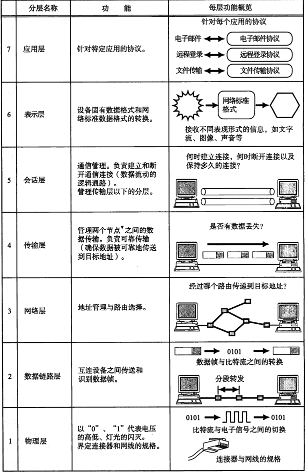

## 电路交换和分组交换

电路交换：计算机之间发送数据时，需要独占双方之间的通信线路。

分组交换：将计算机所要发送的数据分成若干个数据包，按照一定排列顺序后分别发送。这样就可以所有计算机一起收发数据。

发送端计算机将数据分组发送给路由器，路由器收到这些分组数据后，缓存到相应队列中，再转发给目标计算机。

## 网络的构成要素

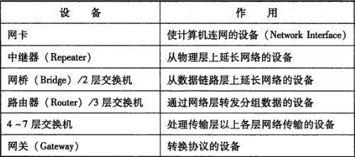

## TCP/IP 协议分层模型

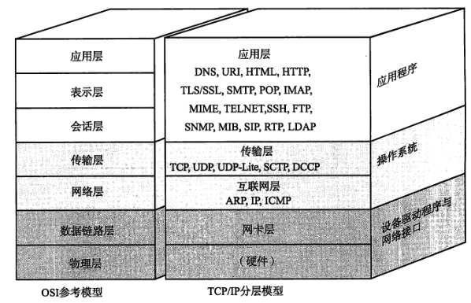

### 通信示例

数据包的结构：

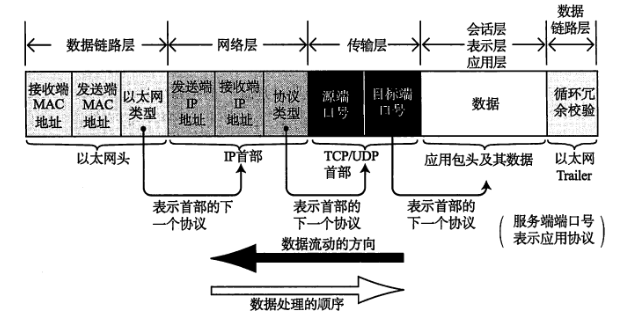

1. 应用程序对数据进行处理
2. TCP根据应用层(会话层)的指示，负责建立连接，发送数据以及断开连接。TCP层会在应用层数据的前端附加一个TCP首部。TCP首部中包含源端口号和目标端口号，序号（用以发送的包中哪部分是数据）以及校验和。
3. IP将TCP传过来的数据前端附上IP首部，包含接收端IP地址以及发送端IP地址，紧接着还有用来判断其后面数据是TCP还是UDP的信息。IP包生成后，参考路由控制表决定接受此IP包的路由器或主机。如果不知道接收端的MAC地址，可以利用ARP查找。然后就可以将MAC地址和IP地址交给以太网的驱动程序了。
4. 以太网驱动负责附上以太网首部并进行发送处理。以太网首部中包含接收端MAC地址，发送端MAC地址以及标志以太网类型的以太网数据的协议。

## IP协议

网络层的主要作用是实现终端节点之间的通信。

数据链路的作用就相当于某一段行程的机票或火车票；而IP的作用就相当于旅行的行程表。

所有主机都维护者一张路由控制表，记录IP数据在下一步应该发给哪个路由器。

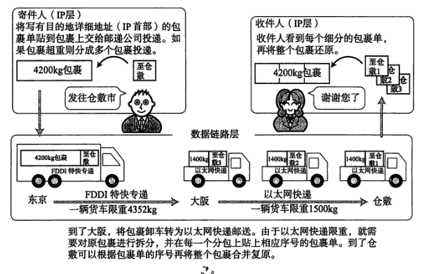

再网络上遇到比较大的报文无法一下子发送出去时，路由器往往会进行IP分片处理。经过分片之后的IP数据报在被重组的时候，只能由目标主机进行。路由器虽然做分片但不会进行重组。

### IP地址

每一台主机上的每一块网卡都设置有IP地址。IP地址(IPv4)由32位正整数表示，每8位位一组，分成4组，每组以"."隔开，再将每组数转换为十进制数。

IP地址由网络地址和主机地址两部分组成。IP包被转发到途中某个路由器时，正是利用目标IP地址的网络地址进行路由。通过网络地址可以判断时哪一个网段内的主机，同一网段的主机地址必须不一样。

#### IP地址的分类：

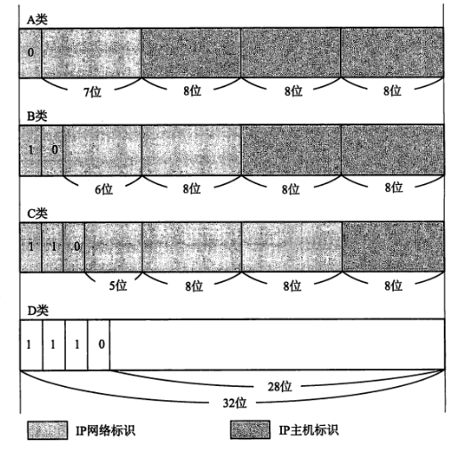

#### 子网掩码：

IP地址与子网掩码做&运算后可得到网络地址。

| IP地址类别 | 子网掩码          |
| ------ | ------------- |
| A      | 255.0.0.0     |
| B      | 255.255.0.0   |
| C      | 255.255.255.0 |

公有IP地址是整个互联网唯一的，但私有IP地址只需要局域网内保证唯一即可。

#### IPv6

IP地址长度为128位，每16位一组，每组用冒号分隔并用十六进制表示。

### 路由控制

路由控制表中记录着网络地址与下一步应该发送至路由器的地址。路由控制表的形成方式有静态路由控制和动态路由控制两种。前者是管理员手动设置，后者是路由器与其他路由器相互交换信息时自动刷新。

###  IP首部

IPv4：

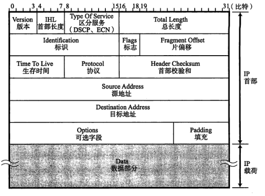

同一分片的标识值相同；标志表示包被分片的信息。片偏移标识被分片的每一个分段相对于原始数据的位置。

### ARP

ARP是一种解决地址问题的协议。以目标IP地址为线索，用来定位下一个应该接收数据分包的网络设备对应的MAC地址。

### ICMP

ICMP(Internet Control Message Protocol)主要功能包括：确认IP包是否成功送达目标地址，通知在发送过程中IP包被废弃的具体原因。ping 使用的是ICMP协议，它发送icmp回送请求消息给目的主机。ICMP协议规定：目的主机必须返回ICMP回送应答消息给源主机。如果源主机在一定时间内收到应答，则认为主机可达。

**ICMP的应用--Traceroute**

它可以追踪路由路径，它的原理是向目的主机发送ICMP报文，发送第一个报文时，设置TTL为0，TTL即Time to Live，是报文的生存时间，由于它是0，所以下一个路由器由到这个报文后，不会再继续转发了，会给源主机发送ICMP出错的报文，就可以知道第一个路由的IP地址，同理，设置TTL为1，就可以知道第二个路由的IP地址，依次类推。

### DHCP

DHCP(Dynamic Host Configuration Protocol) 是为了实现自动设置IP地址，统一管理IP地址的分配。DHCP属于应用层协议，并且使用的是UDP协议的应用层协议。

### NAT

NAT(Network Address Translator) 是用于在本地网络中使用私有地址，在连接互联网时转而使用全局IP地址的技术。

## TCP 与 UDP

从IP层来说，通信的两端是两个主机。IP协议虽然能把分组送到目的主机，但这个分组还停留在主机的网络层而没有交付中的应用进程。从运输层的角度，真正的通信端点是主机中的进程。

运输层有一个重要的功能：复用和分用。复用是指在发送方不同的应用进程都可以使用同一个运输层协议传送数据；分用是指接收方的运输层剥去报文首部分发给对应的应用进程。

IP数据报只检验首部是否出现差错而不检查数据部分，运输层会对收到的报文进行差错检测。

### UDP

UDP（用户数据报协议 User Datagram Protocol）利用IP提供面向无连接的通信服务。若传输过程出现丢包，UDP不负责重发，甚至出现包到达顺序乱掉时也没有纠正的功能。UDP只是在网络层增加了分用和复用功能以及差错检测的功能。

### TCP

TCP（传输控制协议 Transmission Control Protocol）通过校验和，序列号，确认应答，重发控制，连接管理，拥塞控制和窗口控制等机制实现可靠性传输。

#### 通过序列号提高应答可靠性

序列号是按顺序给发送数据的每一个字节都标上号码的标号。接收端查询接收数据TCP首部中的序列号和数据的长度，将自己下一步应该接收的序号作为确认应答(ACK)返回。

#### TCP重传机制

TCP要保证所有的数据包都可以到达，所以，必需要有重传机制。接收端给发送端的Ack确认只会确认最后一个连续的包。比如，发送端发了1,2,3,4,5一共五份数据，接收端收到了1，2，于是回ack 3，然后收到了4（注意此时3没收到）。这时服务器不能对4进行确认，否则发送端就会以为4之前的包都已经收到了。这时需要让发送端重传3。

##### 超时重传

如果等待确认应答到来超时，发送端会将数据进行重发。那么发送端有两种重传的策略：

- 仅仅重传TimeOut的包，也就是第三份数据
- 重传TimeOut后的所有数据，也就是第3，4，5这三份数据。

前者的优点是节约带宽；后者的优点是效率会快一些。

##### 快速重传

不以时间驱动，而是以数据驱动重传。如果，包没有连续到达，就ack最后那个可能被丢了的包，如果发送方连续收到3次相同的ack，就重传。快速重传解决的是发送端不需要等待超时才发送丢包，但仍然面临同样的选择，一是仅重传TimeOut的包，二是重传包含TimeOut包之后的所有包。

##### 停止等待ARQ协议

每发送完一个分组就停止发送，等待对方的确认。在收到确认后再发送下一个分组。需要做到：

-  超时重传
-  暂存已发送的分组
-  确认丢失和确认迟到

缺点：信道利用率低。

##### 连续ARQ协议

发送方每收到一个确认就把发送窗口向前滑动一个分组的位置。接收方一般都是采用累积确认的方式，接收方不必对收到的分组 逐个发送确认，而是在收到几个分组后，对按序到达的最后一个分组发送确认。

回退N重传(Go-Back-N)：

- 如果发送方发送了前5个分组，第三个分组丢失了。那么发送方只能把第三个分组之后的分组都重传一遍。

选择重传(Selective Repeat)：

- 发送点连续发送数据包但对每个数据包都设有个一个计时器。
- 当在一定时间内没有收到某个数据包的ACK时，发送点只重新发送那个没有ACK的数据包。

#### 连接管理

一个连接的建立与断开需要三次握手和四次挥手。

#### 滑动窗口协议

滑动窗口协议在在发送方和接收方之间各自维持一个滑动窗口，发送发是发送窗口，接收方是接收窗口，发送窗口的大小根据接收窗口来设置的。它允许发送方发送多个分组而不需等待确认。

对于发送窗口：

- 凡是已经发送过的数据，在未收到确认之前，都必须暂时保留，以便在超时重传时使用。
- 当发送方A发送的数据经过一段时间没有收到确认（由超时计时器控制），就要使用回退N步协议，回到最后接收到确认号的地方，重新发送这部分数据。
- 收到确认应答的情况下，将窗口滑动到确认应答中的序列号的位置。
- 发送窗口左边是已发送并收到确认的字节，窗口里面是已发送但未收到确认的字节，窗口右边是未发送的字节。

对于接受窗口：

- 对于不按序到达的数据先暂时存放在接受窗口中，等到字节流中所缺少的字节收到后，再按序交付上层应用进程。
- 接收方有累积确认和捎带确认功能。

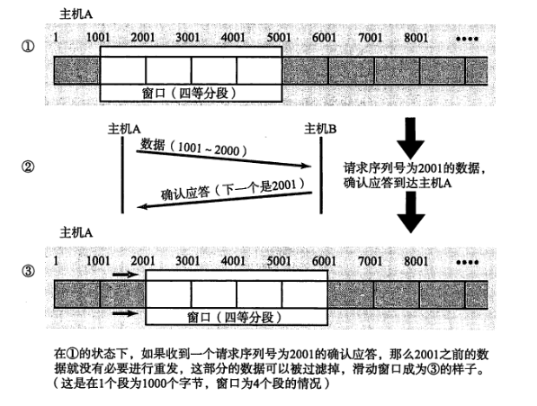

使用了窗口控制，某些确认应答即使丢失也无需重发，只要后续数据段能收到确认应答。在报文段丢失的情况下，同一个序列号的确认应答将会不断重复返回，而发送端主机如果连续3次收到同一个确认应答，就会将其所对应的数据进行重发。

#### 流量控制

**流量控制就是利用可变的滑动窗口，让发送方的发送速度不要太快，要让接收方来得及接受。**发送方的发送窗口不能超过接收方给出的接受窗口的数值。TCP的滑动窗口是以字节为单位的。

死锁：当B给A发送了零窗口报文后一段时间，又给A发送了一个非零窗口的报文。假如这个报文中途丢失，A一直等待B的零窗口报文，而B一直等待A发送数据。解决方法：TCP为每个连接设有一个持续计时器，只要TCP连接的一方收到对方的零窗口通知，就启动计时器。若计时器时间到就发送一个零窗口探测报文段，探测现在的窗口值。

Nagle算法：解决某些应用进程逐个进程送到TCP发送缓存中来，发送方先发送第一个字节，后面到达的额数据先缓存起来，之后再一起发送。

糊涂窗口综合症：接收方的某些应用进程逐个字节从TCP接受缓存中读取，每读取一个字节都向发送方传窗口更新报文段。

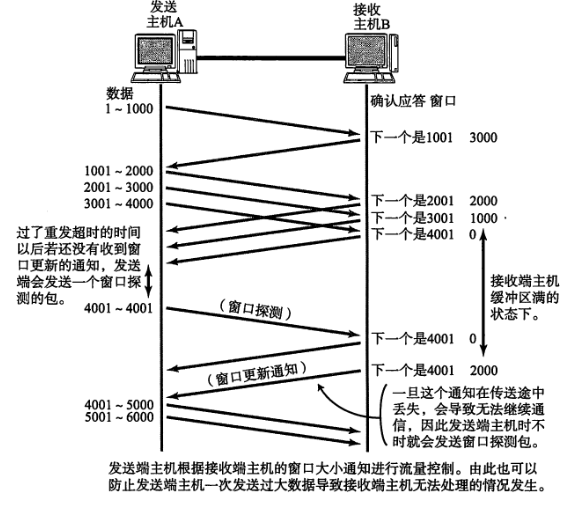

#### 拥塞控制

拥塞控制就是防止过多的数据注入到网络中，这样可以使网络中的路由器或链路不致过载。

控制方法：

- 慢启动

先设置拥塞窗口cwnd = 1，每经过一个传输轮次，拥塞窗口cwnd就加倍。

- 拥塞避免

为了防止拥塞窗口增长过大引起网络拥塞，还需设置一个慢启动门限ssthresh状态变量。

当cwnd<ssthresh时，使用慢启动算法。

当cwnd>=ssthresh时，改用拥塞避免算法。

让cwnd按线性规律缓慢增长。

- 快重传

要求接收方每接收到要给失序的报文段后就立即发出重复确认，让发送方及早知道有报文段没有到达对方。

当发送方收到三个重复的确认执行快重传算法。

- 快恢复

把cwnd值减半，然后执行拥塞避免算法，使拥塞窗口缓慢地线性增大。

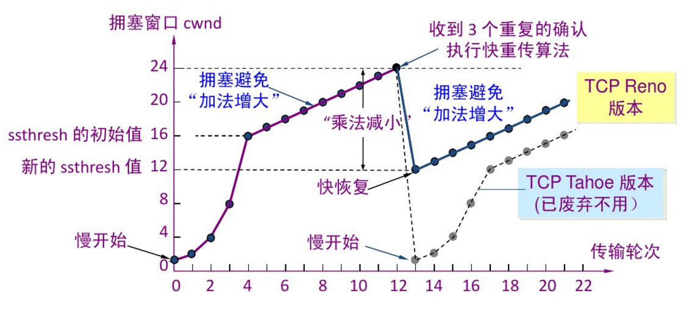

#### Nagle算法

Nagle算法的核心思想是：等数据积累多了再一起发出去，大概等待200ms，这样可以提高网络的吞吐率。目的是为了防止有效内容在TCP包中占比太低。

但是在现在光纤的时代，带宽和速度已经不是太大的问题了，如果每个请求都要延迟200ms，会造成实时性比较差。所以通常是要把Nagle算法禁掉，可以在创建套接字的时候设置TCP_NODELAY标志位。

**参考**

- [TCP 的那些事儿（上）](https://coolshell.cn/articles/11564.html)
- [TCP 的那些事儿（下）](https://coolshell.cn/articles/11609.html)

### 首部格式

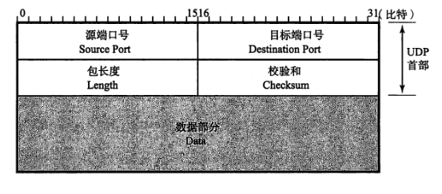

长度为UDP用户数据报长度，最小值为8。

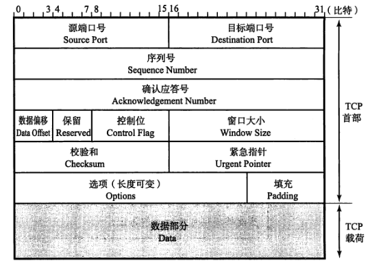

- 源端口和目的端口 各占2个字节。
- 序号：占4个字节，在一个TCP连接中传送的字节流中每一个字节都按序编号。
- 确认号：占4个字节，期望收到对方下一个报文段的第一个数据字节的序号。
- 数据偏移：占4位，TCP首部的长度。
- 窗口大小：以字节为单位

## 应用层协议

### 远程登录

- TELNET 利用TCP一条连接，向主机发送文字命令并在主机上执行。
- SSH 是加密的远程登录系统。TELNET中登录时无需输入密码就可以发送

### 文件传输

FTP使用两条TCP连接，一条用来控制，一条用来数据的传输。

### 电子邮件

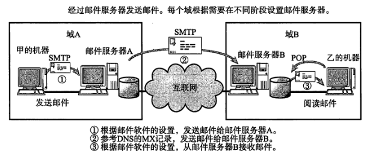

