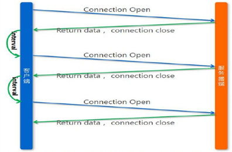
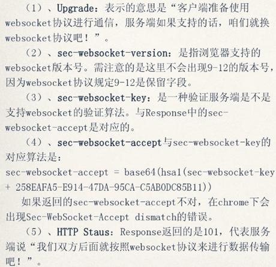

## What WebSocket

首先，Websocket是一个**持久化**的协议，相对于HTTP这种**非持久**的协议来说。
1) HTTP的生命周期通过Request来界定，也就是一个Request 一个Response，那么**在**HTTP1.0**中**，这次HTTP请求就结束了。
在HTTP1.1中进行了改进，使得有一个keep-alive，也就是说，在一个HTTP连接中，可以发送多个Request，接收多个Response。
但Http里面，request与response是一一对应的，而且先有Request才会有Response，这个response是**被动**的，不能主动发起。

WebSocket能实现服务端与客户端之间的全双工通信。WebSocket通信开始时需要借助HTTP来实现握手操作。


## Why WebSocket

在WebSocket之前，有两种方式来实现服务端向客户端推送数据。

- Ajax 轮询：以频繁请求方式来保持客户端和服务端的同步



- 长轮询：当服务端没有数据更新的时候，连接会保持一段时间周期知道数据或者状态改变或者过期，依次减少无效的客户端和服务端的交互。


Websocket只需要**一次HTTP握手，所以说整个通讯过程是建立在一次连接状态中**，也就避免了HTTP的非状态性，服务端会一直知道你的信息，直到你关闭请求。


## How WebSocket

- 客户端发起http请求，附加头信息为：“Upgrade Websocket”

```
GET /chat HTTP/1.1
Host: server.example.com
Upgrade: websocket
Connection: Upgrade
Sec-WebSocket-Key: x3JJHMbDL1EzLkh9GBhXDw==
Sec-WebSocket-Protocol: chat, superchat
Sec-WebSocket-Version: 13
Origin: http://example.com
```



- 服务端接收请求，建立连接

```
HTTP/1.1 101 Switching Protocols
Upgrade: websocket
Connection: Upgrade
Sec-WebSocket-Accept: HSmrc0sMlYUkAGmm5OPpG2HaGWk=
Sec-WebSocket-Protocol: chat
```

其实我们所用的程序是要经过两层代理的，即**HTTP协议在Nginx等服务器的解析下**，然后再传送给相应的**Handler（PHP等）**来处理。
简单地说，我们有一个非常快速的接**线员（Nginx）**，他负责把问题转交给相应的**客服（Handler）**。
本身**接线员基本上速度是足够的**，但是每次都卡在**客服（Handler）**了，老有**客服**处理速度太慢。，导致客服不够。
Websocket就解决了这样一个难题，建立后，可以直接跟接线员建立持**久连接**，有信息的时候客服想办法通知接线员，然后**接线员**在统一转交给客户。

因此，WebSocket协议需要Web服务器的支持。


## 参考

- https://www.zhihu.com/question/20215561
- https://zhuanlan.zhihu.com/p/23386938
- http://www.jianshu.com/p/bcefda55bce4#