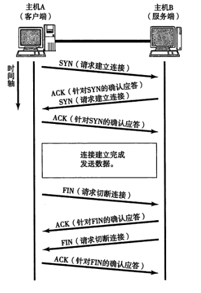
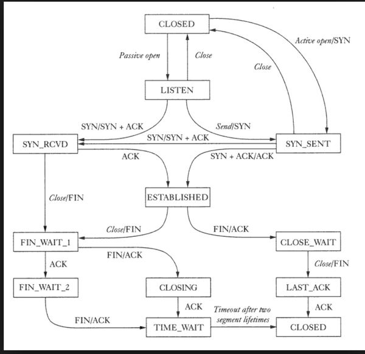

http://www.cnblogs.com/zyf-zhaoyafei/p/4716297.html

## TCP的三次握手和四次挥手

**三次握手过程**

第一次握手：客户端发送一个小的TCP分组(SYN=1,seq=x)到服务器，并进入SYN_SEND状态，等待服务器确认；
第二次握手：服务器收到一个小的TCP分组(SYN=1,ACK=1,seq=y,ack=x+1)，即SYN+ACK包，此时服务器进入SYN_RECV状态；
第三次握手：客户端收到服务器的SYN＋ACK包，向服务器发送一个小的TCP分组(ack=y+1,seq=x+1,ACK=1)，此包发送完毕，客户端和服务器进入ESTABLISHED状态，完成三次握手。
握手过程中传送的包里不包含数据，三次握手完毕后，客户端与服务器才正式开始传送数据。理想状态下，TCP连接一旦建立，在通信双方中的任何一方主动关闭连接之前，TCP 连接都将被一直保持下去。

**为什么要有三次握手？**

client发出的第一个连接请求报文段并没有丢失，而是在某个网络结点长时间的滞留了，以致延误到连接释放以后的某个时间才到达server。本来这是一个早已失效的报文段。但server收到此失效的连接请求报文段后，就误认为是client再次发出的一个新的连接请求。于是就向client发出确认报文段，同意建立连接。假设不采用“三次握手”，那么只要server发出确认，新的连接就建立了。由于现在client并没有发出建立连接的请求，因此不会理睬server的确认，也不会向server发送数据。但server却以为新的运输连接已经建立，并一直等待client发来数据。这样，server的很多资源就白白浪费掉了。

**四次挥手过程**

第一次挥手：主动关闭方发送一个FIN(FIN=1,seq=u)，用来关闭主动方到被动关闭方的数据传送，也就是主动关闭方告诉被动关闭方：我已经不 会再给你发数据了(当然，在fin包之前发送出去的数据，如果没有收到对应的ack确认报文，主动关闭方依然会重发这些数据)，但是，此时主动关闭方还可 以接受数据。
第二次挥手：被动关闭方收到FIN包后，给对方发送一个ACK包(ACK=1,seq=v,ack=u+1)。此时从A都B这个方向的连接就释放了，此时TCP处于半关闭状态。
第三次挥手：被动关闭方发送一个FIN包，用来关闭被动关闭方到主动关闭方的数据传送，也就是告诉主动关闭方，我的数据也发送完了，不会再给你发数据了。
第四次挥手：主动关闭方收到FIN后，发送一个ACK给被动关闭方，确认序号为收到序号+1。等待2MSL后关闭连接。

**为什么要四次挥手**

**FIN_WAIT_1**: 这个状态要好好解释一下，其实`FIN_WAIT_1`和`FIN_WAIT_2`状态的真正含义都是表示等待对方的FIN报文。而这两种状态的区别是：`FIN_WAIT_1`状态实际上是当SOCKET在ESTABLISHED状态时，它想主动关闭连接，向对方发送了FIN报文，此时该SOCKET即进入到`FIN_WAIT_1`状态。而当对方回应ACK报文后，则进入到`FIN_WAIT_2`状态，当然在实际的正常情况下，无论对方何种情况下，都应该马上回应ACK报文，所以`FIN_WAIT_1`状态一般是比较难见到的，而`FIN_WAIT_2`状态还有时常常可以用netstat看到。（主动方）
**FIN_WAIT_2**：上面已经详细解释了这种状态，实际上`FIN_WAIT_2`状态下的SOCKET，表示半连接，也即有一方要求close连接，但另外还告诉对方，我暂时还有点数据需要传送给你(ACK信息)，稍后再关闭连接。（主动方）
**CLOSE_WAIT**: **表示收到了对方的FIN报文，并发送出了ACK报文**，就等2MSL后即可回到CLOSED可用状态了。如果`FIN_WAIT_1`状态下，收到了对方同时带FIN标志和ACK标志的报文时，可以直接进入到`TIME_WAIT`状态，而无须经过`FIN_WAIT_2`状态。（主动方）
**CLOSING**（比较少见）: 这种状态比较特殊，实际情况中应该是很少见，属于一种比较罕见的例外状态。正常情况下，当你发送FIN报文后，按理来说是应该先收到（或同时收到）对方的 ACK报文，再收到对方的FIN报文。但是CLOSING状态表示你发送FIN报文后，并没有收到对方的ACK报文，反而却也收到了对方的FIN报文。什么情况下会出现此种情况呢？其实细想一下，也不难得出结论：那就是如果双方几乎在同时close一个SOCKET的话，那么就出现了双方同时发送FIN报文的情况，也即会出现CLOSING状态，表示双方都正在关闭SOCKET连接。
**TIME_WAIT**: 等待2MSL后关闭连接。原因有二：1. 为了保证A发送的最后一个ACK报文段能够到达B。2. 防止下一个新的连接中出现旧的连接请求报文段。

## Socket编程

Socket 是对 TCP/IP 协议族的一种封装，是应用层与TCP/IP协议族通信的中间软件抽象层。Socket 还可以认为是一种网络间不同计算机上的进程通信的一种方法，利用三元组（ip地址，协议，端口）就可以唯一标识网络中的进程，网络中的进程通信可以利用这个标志与其它进程进行交互。

## 电路交换和分组交换

电路交换的双方需要建立连接，并独享通信线路。

分组交换将用户通信的数据划分成多个更小的等长数据段，在每个数据段的前面加上必要的控制信息作为数据段的首部，每个带有首部的数据段就构成了一个分组。分组交换的本质就是存储转发，它将所接受的分组暂时存储下来，在目的方向路由上排队，当它可以发送信息时，再将信息发送到相应的路由上，完成转发。

https://www.nowcoder.com/discuss/1937?type=0&order=0&pos=30&page=3

## 常见的网络端口

运输层的端口号是16位的。

| 端口号  | 协议     | 含义                             |
| ---- | ------ | ------------------------------ |
| 21   | ftp    | 文件传输协议（FTP）端口；有时被文件服务协议（FSP）使用 |
| 22   | ssh    | 安全 Shell（SSH）服务                |
| 23   | telnet | Telnet 服务                      |
| 25   | smtp   | 简单邮件传输协议（SMTP）                 |
| 80   | http   | 用于万维网（WWW）服务的超文本传输协议（HTTP）     |
| 443  | https  | 安全超文本传输协议（HTTP）                |

http://tool.oschina.net/commons?type=7#famous_

## SSH中间人攻击

SSH之所以能够保证安全，原因在于它采用了公钥加密。

整个过程是这样的：（1）远程主机收到用户的登录请求，把自己的公钥发给用户。（2）用户使用这个公钥，将登录密码加密后，发送回来。（3）远程主机用自己的私钥，解密登录密码，如果密码正确，就同意用户登录。

这个过程本身是安全的，但是实施的时候存在一个风险：如果有人截获了登录请求，然后冒充远程主机，将伪造的公钥发给用户，那么用户很难辨别真伪。因为不像https协议，SSH协议的公钥是没有证书中心（CA）公证的，也就是说，都是自己签发的。

如果攻击者插在用户与远程主机之间（比如在公共的wifi区域），用伪造的公钥，获取用户的登录密码。再用这个密码登录远程主机，那么SSH的安全机制就荡然无存了。这种风险就是著名的["中间人攻击"](http://en.wikipedia.org/wiki/Man-in-the-middle_attack)（Man-in-the-middle attack）。

解决方法：口令登录（本机known_host文件存储可信主机的公钥），公钥登录。

所谓"公钥登录"，原理很简单，就是用户将自己的公钥储存在远程主机上。登录的时候，远程主机会向用户发送一段随机字符串，用户用自己的私钥加密后，再发回来。远程主机用事先储存的公钥进行解密，如果成功，就证明用户是可信的，直接允许登录shell，不再要求密码。

http://www.ruanyifeng.com/blog/2011/12/ssh_remote_login.html

## 反爬虫

- **通过Headers反爬虫**

过滤带有不正常的User-Agent的请求；

- **基于用户行为反爬虫**

通过用户的行为来检测网站的访问者是否是爬虫，例如同一IP短时间内多次访问同一页面，或者同一账户短时间内多次进行相同操作。 

后台对访问进行统计，对单个IP访问超过阈值，予以封锁。（无法封锁分布式爬虫）；

对单个userAgent访问超过阈值的予以封锁。

- **验证码限制爬虫**
- **用Cookie反爬虫**
- **动态页面的反爬虫**

把ajax请求的所有参数全部加密了。

参考：http://bigsec.com/bigsec-news/anan-16825-Antireptile-zonghe

## 断点续传原理

利用HTTP1.1协议中定义了断点续传相关的HTTP头 Range和Content-Range字段。

1. 客户端下载一个1024K的文件，已经下载了其中512K 
2. 网络中断，客户端请求续传，因此需要在HTTP头中申明本次需要续传的片段：`Range:bytes=512000-` 这个头通知服务端从文件的512K位置开始传输文件 
3. 服务端收到断点续传请求，从文件的512K位置开始传输，并且在HTTP头中增加： `Content-Range:bytes 512000-/1024000 ` 并且此时服务端返回的HTTP状态码应该是206，而不是200。

使用Last-Modified或ETag头来判断出续传文件时是否已经发生过改动。

## HTTP1.0 与 HTTP1.1 与HTTP2的区别

- 缓存
- 带宽优化
- 长连接

HTTP2：

1. HTTP2采用二进制分帧
2. 多路复用，**同个域名只需要占用一个 TCP 连接**，单个连接上可以并行交错的请求和响应，之间互不干扰。
3. 压缩报文头部。第一次请求发送了所有的头部字段，第二个请求则只需要发送差异数据并带上cookie，这样可以减少冗余数据，降低开销。
4. 服务端可以在发送页面HTML时主动推送其它资源，而不用等到浏览器解析到相应位置，发起请求再响应。

参考：[一文读懂 HTTP/2 特性](https://zhuanlan.zhihu.com/p/26559480?hmsr=toutiao.io&utm_medium=toutiao.io&utm_source=toutiao.io)

## UDP和TCP的区别

1. 传输单位的不同。UDP对应的是用户数据报，TCP对应的是TCP报文段，面向字节流。
2. UDP是面向无连接的传输协议，传输数据前不需要建立连接，对方在收到UDP报文后不需要给出任何确认。TCP是面向连接的，传输前需要建立连接，结束后需要释放连接，提供全双工通信。
3. TCP传输开销比UDP大，速度比UDP慢。
4. TCP有确认应答，流量控制，拥塞控制，超时重传，连接管理等机制保证传输的可靠性。
5. TCP不提供广播和多播服务。
6. UDP首部只有8个字节，TCP首部至少有20个字节。

## GET和POST的区别

1. GET与POST都有自己的语义，GET是从服务器中获取数据；POST是向服务器提交数据。
2. GET把参数包含在URL中，POST通过request body传递参数
3. GET比POST更不安全，因为参数直接暴露在URL上，所以不能用来传递敏感信息。
4. GET请求在URL中传送的参数是有长度限制的（限制url长度在2K个字节），而POST木有。

## 在浏览器输入URL后执行的全部过程

大概步骤：

1. 浏览器从URL中解析出服务器的主机名
2. 浏览器将服务器的主机名转换成服务器的IP地址
3. 浏览器将端口号从URL中解析出来
4. 浏览器建立一条与WEB服务器的TCP连接
5. 浏览器向服务器发送一条HTTP请求报文
6. 服务器向浏览器发送一条HTTP响应报文
7. 关闭连接，浏览器显示文档

- ### DNS：浏览器查找域名的IP地址

1. 首先浏览器会查看本地硬盘的hosts文件，看看其中有没有这个域名对应的规则，如果有则直接使用hosts文件里面的IP地址。
2. 如果本地的hosts文件没能找到对应的IP地址，浏览器会发出一个DNS请求给到本地DNS服务器。本地DNS服务器一般都是你的网络接入服务器商提供，比如中国电信，中国移动。
3. 本地DNS服务器会首先查询它的缓存，如果有此条记录则直接返回结果。如果没有则向根DNS服务器进行查询。
4. 根DNS服务器返回域服务器的地址给本地DNS服务器，让本地DNS服务器继续向域服务器继续查询。
5. 本地DNS服务器向域服务器发出请求，域服务器返回对应域名解析服务器的地址给本地DNS服务器
6. 本地DNS服务器向域名解析服务器发出请求，这时就能收到一个域名和IP地址对应关系了

- ### 应用层和运输层：浏览器向web服务器发送HTTP请求

拿到IP地址后，浏览器会以一个随机端口(1024,65535)向服务器WEB服务程序的80端口发起TCP的连接请求。经过三次握手TCP连接建立起来后，浏览器发起一个HTTP请求。一个HTTP请求一般由请求行，请求头和请求正文组成。

- ### 网络层

数据到达网络层，一看目的IP和本地IP不在同一个网段，那么ARP就不发了。直接把数据包转发给网关（一般是所连接的路由器）。路由器拿到数据包后，查看目的IP对照路由表，将数据包转发给上一级路由器。路由器通过复杂的路由算法，将数据包顺利转发到目的服务器。

- ### 关闭连接，浏览器显示HTML

参考：

- http://www.cnblogs.com/xianyulaodi/p/6547807.html#_labelTop
- https://mp.weixin.qq.com/s?__biz=MjM5ODczNTkwMA==&mid=2650107179&idx=1&sn=ed4ddd50db1a6bb9a922aaad097ff5f4&chksm=bec7f45889b07d4e8dbf5ddf37da01995c9e4602651bb95bdb879db222d56bdb4cbb89d649e2#rd

## 使用UDP模拟实现可靠性传输

可靠性传输需要实现如下功能：

1. 三次握手协商MSS(maximum segment size)和窗口大小
2. 一个计时器，判断超时
3. 快速重传
4. 接收方收到UDP报文后，发送回执报文给对方

## 路由器和交换机的区别

交换机是利用物理地址或者说MAC地址来确定转发数据的目的地址。而路由器则是利用不同网络的ID号(即IP地址)来确定数据转发的地址。

1. 路由器可以给你的局域网自动分配IP，虚拟拨号，就像一个交通警察，指挥着你的电脑该往哪走，你自己不用操心那么多了。交换机只是用来分配网络数据的。
2. 路由器在网络层，路由器根据IP地址寻址，路由器可以处理TCP/IP协议，交换机不可以。
3. 交换机在中继层，交换机根据MAC地址寻址。路由器可以把一个IP分配给很多个主机使用，这些主机对外只表现出一个IP。交换机可以把很多主机连起来，这些主机对外各有各的IP。

参考：[交换机和路由器的区别在哪里](http://www.cnblogs.com/Lynn-Zhang/articles/5754336.html)