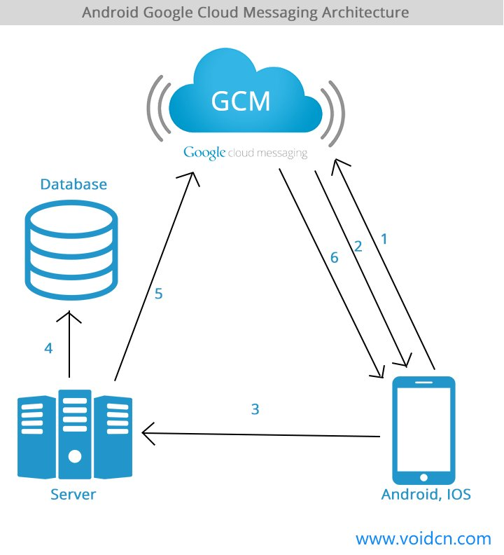

## 推送的实现方式

- 轮询（Pull）方式。

客户端定时轮询服务器，拉取消息。

短轮询：客户端发起请求，服务端立即响应；

长轮询：客户端发起请求，如果此时服务端没有消息就会hold住该连接，等有消息时才将响应返回给客户端。

缺点：不适合客户端比较多的场景；短轮询的实时性不好；

缺点：耗电，实时性低

- SMS（Push）方式

服务器在有新消息时给用户的手机号发一条特殊的短信，客户端通过拦截这条短信获取服务器推送的消息。

缺点：运营商不配合，安全性不高

- 长连接（Push）

应用程序与服务器保持一条长连接，服务器可以通过这条连接将消息推送到客户端。

**WebSocket**

浏览器发起一个http请求给服务端，请求切换为WebSocket协议，服务端响应后，确认使用WebSocket协议。之后数据就可以在tcp连接上双向发送数据了。

优点： WebSocket实时性强，因为协议是双工协议，所以，服务端可以随时给客户端下发数据，比起轮询，少了客户端发起请求，延时更小。
缺点： 对浏览器和服务器的要求较高，稳定性有待提高。

## TCP长连接

长连接是相对于短连接而言的。短连接是通讯双方有数据交互时就建立一个连接，数据发送完成后，则断开连接。长连接就是建立连接后，连接不主动断开，双方的数据都通过这条连接发送。

一般来说，只要双方都不主动关闭连接，TCP长连接就会一直存在。但网络的环境总是复杂变化着的，有不少因素会影响到TCP长连接的寿命。

### NAT超时

为了解决IPV4地址短缺的问题，引入NAT协议来解决公有IP和私有IP相互转换的问题。一般来说，我们的通信设备所连接的路由器自带有NAT协议的功能，内部维护一张NAT映射表，里面包含了内网地址和外网地址的映射。当一个客户端将数据包发给路由器，路由器先将数据包的源IP地址修改成外网IP地址再转发出去，最终到达web服务器。而web服务器给客户端的响应或推送消息到达路由器时，路由器查询NAT映射表，将数据包的目的IP地址用所对应的内网IP地址替换，然后转发给内网中对应的客户端。

参考youtube视频：[How Network Address Translation Works](https://www.youtube.com/watch?v=QBqPzHEDzvo)

然而，成也NAT映射表，败也NAT映射表。国内移动无线网络运营商在链路一段时间内没有数据通讯后，会淘汰NAT表中的对应映射项，映射关系没了，服务器自然也就无法通过原来的IP地址将消息推送给客户端，长连接也就中断了。

### DHCP租期

当DHCP租期过期了，会导致老的TCP连接不能正常收发数据。

参考youtube视频：[Automatic IP Address Assignment: How DHCP Works](https://www.youtube.com/watch?v=RUZohsAxPxQ)

### 网络状态变化

手机数据网络和WIFI网络切换，网络断开和重连等网络变化也会使长连接变为无效连接，重新建立Push长连接。

## 长连接的实现

###  GCM云端推送

在应用外的消息栏推送中，iOS可以使用苹果的APN服务，开发者只要注册后就可以通过APN服务推送自己app的通知消息。Android目前可以使用google类似APN的GCM服务（在国内因为某些不可抗力不能使用，可以使用华为，小米等厂商提供的推送服务），向终端推送通知。

### 使用第三方推送平台

推送平台：极光，信鸽，一推等等

### XMPP,MQTT即时通信协议

XMPP,MQTT都是工作在应用层的即时通信协议。

### 设计心跳包

其实，TCP长连接的维持并不需要心跳包。心跳包的真正作用是防止NAT映射表中长连接对应的地址映射被淘汰，从而达到延长TCP长连接寿命的目的。

心跳包的时间间隔需要根据网络NAT超时间隔来设计，而wifi和移动3/4G的NAT超时间隔都不一样。还需要兼顾耗电和消息推送实时性等方面的权衡。

参考：[Android微信智能心跳方案](https://mp.weixin.qq.com/s?__biz=MzAwNDY1ODY2OQ==&mid=207243549&idx=1&sn=4ebe4beb8123f1b5ab58810ac8bc5994)

## 参考&拓展

- [Android推送、智能心跳解决方案、手机休眠对心跳的影响](http://www.voidcn.com/blog/xx326664162/article/p-6004761.html)
- [Android微信智能心跳方案](https://mp.weixin.qq.com/s?__biz=MzAwNDY1ODY2OQ==&mid=207243549&idx=1&sn=4ebe4beb8123f1b5ab58810ac8bc5994)
- [Android推送技术研究](http://www.jianshu.com/p/584707554ed7#)

