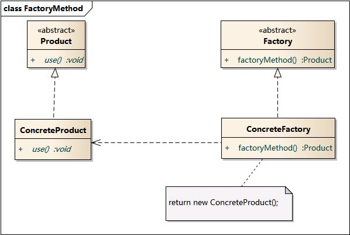

## [UML类图](https://design-patterns.readthedocs.io/zh_CN/latest/read_uml.html)


- 车的类图结构为<<abstract>>，表示车是一个抽象类；
- 它有两个继承类：小汽车和自行车；它们之间的关系为实现关系，使用带空心箭头的虚线表示；
- 小汽车为与SUV之间也是继承关系，它们之间的关系为泛化关系，使用带空心箭头的实线表示；
- 小汽车与发动机之间是组合关系，使用带实心箭头的实线表示；
- 学生与班级之间是聚合关系，使用带空心箭头的实线表示；
- 学生与身份证之间为关联关系，使用一根实线表示；
- 学生上学需要用到自行车，与自行车是一种依赖关系，使用带箭头的虚线表示；

总结：

1. 类的继承与接口的实现都是用箭头
2. 类的聚合和组合都是用菱形


## 静态工厂模式

又称为简单工厂模式，可以根据传入参数的不同，返回不同的实例。静态工厂模式定义一个类负责创建其他类的实例，被创建类的实例通常都具有共同的父类。


简单工厂模式最大的优点在于**实现对象的创建和对象的使用分离**，将对象的创建交给专门的工厂类负责。当你需要某个对象，只需要调用工厂类的方法并传入正确的参数就可以获得对象，而无需知道具体的创建细节。但是其最大的缺点在于工厂类不够灵活，增加新的具体产品需要修改工厂类的判断逻辑代码，而且产品较多时，工厂方法代码将会非常复杂。

场景：

1. PolicyManager.makeNewWindow
2. Volley.newRequestQueue
3. RxJava Observerable的创建

```java
public static <T> Observable<T> create(OnSubscribe<T> f) {
    return new Observable<T>(RxJavaHooks.onCreate(f));
}
```


## 工厂方法模式

工厂方法模式是静态工厂模式的一种抽象和推广。将工厂类的方法抽象成具体的接口，由各个子类工厂去实现并生产特定的类实例。

、


## 抽象工厂模式

一个工厂可以生产多种不同的产品。工厂方法模式针对的是一个产品等级结构，而抽象工厂模式则需要面对多个产品等级结构，一个工厂等级结构可以负责多个不同产品等级结构中的产品对象的创建 。


## [Builder模式](https://github.com/simple-android-framework-exchange/android_design_patterns_analysis/tree/master/builder/mr.simple)

角色：

- Product 产品类 : 产品的抽象类。
- Builder : 抽象类， 规范产品的组建，一般是由子类实现具体的组件过程。
- ConcreteBuilder : 具体的构建器.
- Director : 统一组装过程(可省略)。


场景：

1. AlertDialog的创建过程
2. OkHttpClient(CallFactory)，Retrofit的创建过程


## 单例模式

```java
public class Singleton {
    private volatile static Singleton uniqueInstance;
    public static Singleton getInstance() {
        if (uniqueInstance==null){
            synchronized (Singleton.class){
                if (uniqueInstance!=null)
                    uniqueInstance=new Singleton();
            }
        }
        return uniqueInstance;
    }
    private Singleton() {}
}
```


## 适配器模式


场景：

ListView的Adapter场景中，数据源就是Adaptee，Client就是ListView。


## 桥接模式

将抽象化部分(Abstraction)与实现部分(Implementation)分离，使它们可以独立变化。

- 抽象化：抽象化就是忽略一些信息，把不同的实体当作同样的实体对待。在面向对象中，将对象的共同性质抽取出来形成类的过程即为抽象化的过程。它持有Implementation的引用。
- 实现化：针对抽象化给出的具体实现，就是实现化，抽象化与实现化是一对互逆的概念，实现化产生的对象比抽象化更具体，是对抽象化事物的进一步具体化的产物。
- 脱耦：脱耦就是将抽象化和实现化之间的耦合解脱开，或者说是将它们之间的强关联改换成弱关联，将两个角色之间的继承关系改为关联关系。桥接模式中的所谓脱耦，就是指在一个软件系统的抽象化和实现化之间使用关联关系（组合或者聚合关系）而不是继承关系，从而使两者可以相对独立地变化，这就是桥接模式的用意。


场景：

1. ListView的ItemView的布局和创建被抽象出来，ItemView的创建被抽取到Adapter来实现，ItemView的布局被抽象成一个抽象类AbsListView。
2. JVM的跨平台特性
3. View与Drawable

## 装饰者模式

动态地增强一个对象。


场景：

1. Activity等类是ContextImpl的包装类。


## 代理模式

某个对象提供一个代理对象，并由代理对象控制对原对象的引用。


[静态代理和动态代理的区别](http://blog.csdn.net/giserstone/article/details/17199755)：

- 静态代理的代理类和委托类的关系在运行前就已经确定了
- 动态代理的代理类和委托类（或接口）的调用关系是运行时确定的

场景：

1. AMS与ActivityThread交互
2. AIDL


## 命令模式

将命令执行者与命令请求者的职责分离，将命令抽象成接口并可对应多种实现，命令的执行者就可以通过命令接口来对命令交互了。


场景：

1. Runnable与Executor
2. RxJava里面，Observable里的OnSubscribe对象。OnSubscribe是一个命令对象，当Observable的subscribe方法被调用时，OnSubscribe的call方法会被调用。


## 观察者模式

实在是用得太多了！


## 策略模式

定义一些独立的类来封装不同的算法，每一个类封装一个具体的算法，在这里，每一个封装算法的类我们都可以称之为策略(Strategy)，为了保证这些策略的一致性，一般会用一个抽象的策略类来做算法的定义，而具体每种算法则对应于一个具体策略类。


场景：

1. Android动画中的时间插值器和估值器。